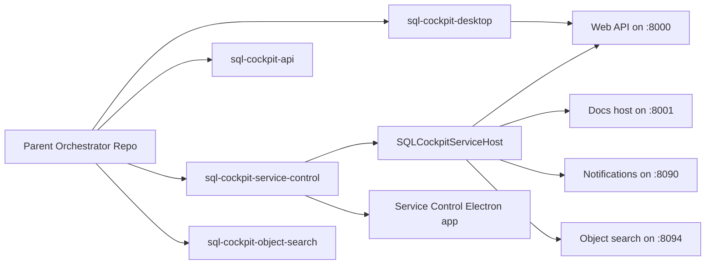

# Components

SQL Cockpit now runs as a split platform with a thin orchestrator and four owned component repositories.

## Component topology

## Ownership matrix

| Component | Owning repository | Runtime role | Default Windows endpoint |
| --- | --- | --- | --- |
| Desktop Electron app | `sql-cockpit-desktop` | User-facing desktop UI shell | uses API on `http://127.0.0.1:8000/` |
| API runtime (Node/Next host) | `sql-cockpit-api` | Main SQL Cockpit HTTP API and dashboard routes | `http://127.0.0.1:8000/` |
| Service host (SCM) | `sql-cockpit-service-control` | Windows service process manager and control plane | `http://127.0.0.1:8610/` |
| Service Control Electron app | `sql-cockpit-service-control` | Tray + operator UI for service/component control | talks to `:8610` |
| Object search sidecar | `sql-cockpit-object-search` | Lucene-backed object metadata indexing and query | `http://127.0.0.1:8094/` |
| Docs server | `sql-cockpit-service-control` (runtime orchestration) | Local docs hosting for operator help | `http://127.0.0.1:8001/` |
| Notifications server | `sql-cockpit-service-control` (runtime orchestration) | Realtime notification stream | `http://127.0.0.1:8090/` |

## Runtime settings contract

Storage location:

- `C:\ProgramData\SqlCockpit\sql-cockpit-service.settings.json`

Repository-root keys:

- `desktopRepoRoot`
- `apiRepoRoot`
- `serviceRepoRoot`
- `objectSearchRepoRoot`

These keys are expanded by the service host when resolving component `workingDirectory`, command paths, and script arguments. Missing or incorrect roots can prevent component launch even when binaries exist.

## Operator boundary rules

- Production owner: `SQLCockpitServiceHost` owns API and side services.
- Desktop UI is launched in user session (not as a service-owned UI process).
- Do not mix owners for the same endpoint in one profile (for example, two processes trying to own `:8000`).
- Service Control should be treated as the operational client to the service host, not the direct owner of API internals.
