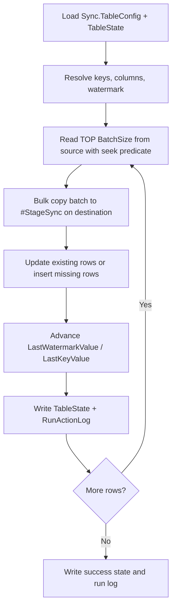
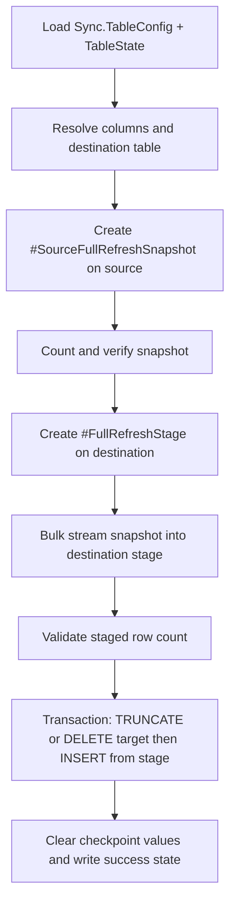

# Data Flow

## Incremental mode

## Full refresh mode

## Observed precedence rules

- CLI lookup choice: `-SyncId` wins if supplied; otherwise `-SyncName` is used.
- `SyncMode` defaults to `Incremental` when blank.
- Incremental mode switches to full refresh for that run if the destination table is empty.
- `ColumnsCsv` limits the candidate column set first, then `ExcludeColumnsCsv` removes from that set.
- Key columns and watermark columns must survive final column resolution or the run fails.

## Runtime read timing

- `Sync.TableConfig`: read once at startup.
- `Sync.TableState`: read once at startup, then updated during the run.
- No config reload loop exists.
- Mid-run config edits affect future runs, not the active process.
