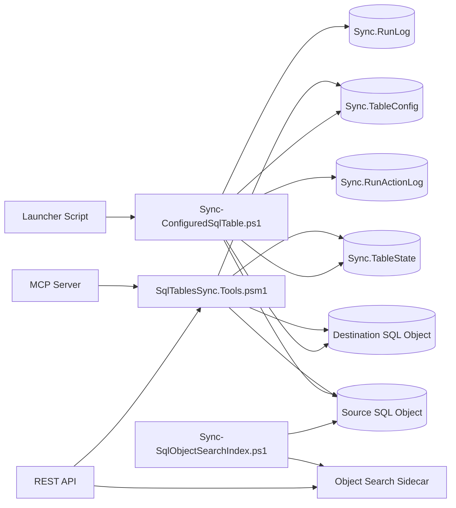

# Architecture Overview

The runtime architecture is intentionally simple:

1. A launcher script, the REST API, or the MCP server starts PowerShell logic in this repo.
2. The sync engine opens the config database and loads one `Sync.TableConfig` row plus any existing `Sync.TableState`.
3. The engine acquires an applock named `Sync:<SyncName>` to prevent overlapping runs for the same job.
4. The engine opens source and destination SQL connections.
5. It resolves mode, columns, keys, watermark behaviour, and destination table preparation.
6. It executes either incremental batches or a full-refresh snapshot-and-replace pipeline.
7. It updates `Sync.TableState`, `Sync.RunLog`, and `Sync.RunActionLog`.

## Architectural characteristics

- Control plane in database: runtime behaviour is mostly driven by `Sync.TableConfig`.
- Stateless process, stateful database: each process reads config once, but persists progress in `Sync.TableState`.
- SQL-centric execution: paging, validation, upsert, and replacement logic all happen through SQL statements emitted by PowerShell.
- No central scheduler in repo: job timing is external or manual; launchers only start processes.
- Local automation surfaces: the REST API and MCP server are convenience entry points over the same SQL metadata.
- Local search sidecar: database object search now adds a loopback Lucene.NET service fed by a PowerShell sync pipeline and fronted by the existing Node host.

## Confirmed runtime boundaries

- Config boundary: `-ConfigServer`, `-ConfigDatabase`, `-ConfigSchema` identify the control database.
- Source boundary: source server, database, schema, and table come from the config row.
- Destination boundary: destination server, database, schema, and table come from the config row.
- Process boundary: each launched PowerShell process handles one sync row at a time.

## Mermaid diagram

