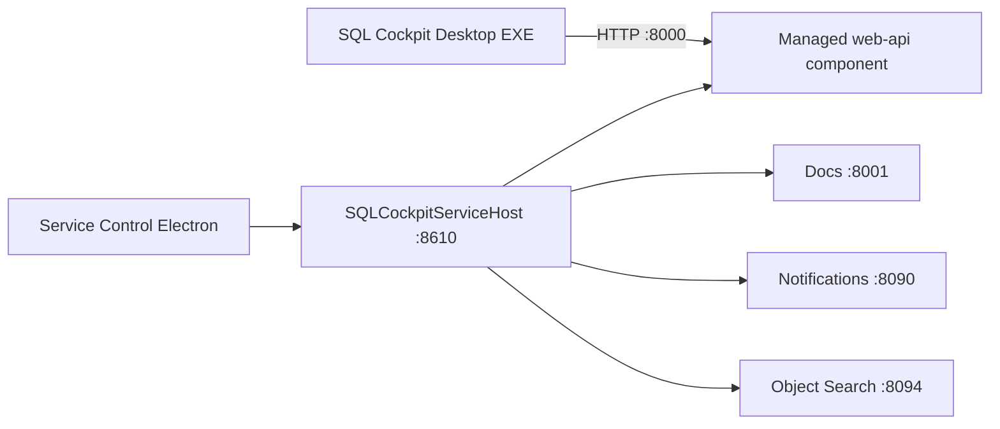

# API Repository Split (Desktop + Managed API)

This document defines how to run SQL Cockpit with:

- Desktop UI as a client-only Electron app
- Web API as a separately managed component under `SQLCockpitServiceHost`
- Optional separate API repository path

## Target topology



## New contract

1. Desktop does not own API lifecycle in prod client mode.
2. Service host owns API lifecycle.
3. Desktop launch uses:
   - `-ManageComponents false`
   - `-ExternalApiOnly true`
   - `-ServiceHostControlUrl http://127.0.0.1:8610/`
   - `-ListenPrefix http://127.0.0.1:8000/` (API target)

## Settings keys and placeholders

### `apiRepoRoot`

- storage location: `%ProgramData%\SqlCockpit\sql-cockpit-service.settings.json` (JSON root property)
- valid values: absolute path to folder containing `server.js`
- default: `<repoRoot>\sql-cockpit-api` when omitted
- code paths affected:
  - `service/windows/SqlCockpit.ServiceHost.Windows/Program.cs`
  - `{ApiRepoRoot}` token expansion in component command/args/working directory
- operational risk: wrong path causes `web-api` startup failure
- safe change procedure:
  1. set `apiRepoRoot`
  2. set `web-api.workingDirectory` to `{ApiRepoRoot}`
  3. restart `SQLCockpitServiceHost`
  4. verify `http://127.0.0.1:8000/health`

### `SQL_COCKPIT_EXTERNAL_API_ONLY`

- storage location:
  - process environment variable set by `Start-SqlCockpitDesktop.ps1` and `Start-SqlCockpitDesktopPackaged.ps1`
- valid values: `true` or `false`
- default:
  - `false` generally
  - auto-forced to `true` for prod client mode (`RuntimeProfile=prod`, `ManageComponents=false`, `ServiceHostControlUrl` set) unless explicitly overridden
- code paths affected:
  - `Start-SqlCockpitDesktop.ps1`
  - `Start-SqlCockpitDesktopPackaged.ps1`
  - `webapp/electron/main.js`
- operational risk:
  - `true` + API down -> desktop startup timeout on `/health`
  - `false` in prod -> embedded API collision risk
- safe change procedure:
  1. keep `true` in prod client mode
  2. ensure service-host `web-api` is healthy first
  3. launch desktop

## Split-repo implementation guidance

If you move API code to a separate repository:

1. keep `server.js` entrypoint in API repo root (or adjust `workingDirectory` and args accordingly)
2. set `apiRepoRoot` to the API repository checkout path
3. keep service settings `web-api` component as:
   - `command: node`
   - `workingDirectory: {ApiRepoRoot}`
   - `args` include `--listenPrefix http://127.0.0.1:8000/`
4. keep desktop component as client-only (`-ExternalApiOnly true`)

During transition, refresh the in-project API folder with:

```powershell
powershell -ExecutionPolicy Bypass -File ".\Sync-SqlCockpitApiRepo.ps1"
```

## Validation checklist

1. `Get-Service SQLCockpitServiceHost`
2. `Invoke-WebRequest http://127.0.0.1:8610/health`
3. `Invoke-WebRequest http://127.0.0.1:8000/health`
4. Launch desktop from Service Control
5. confirm no embedded API spawn logs from desktop bootstrap
