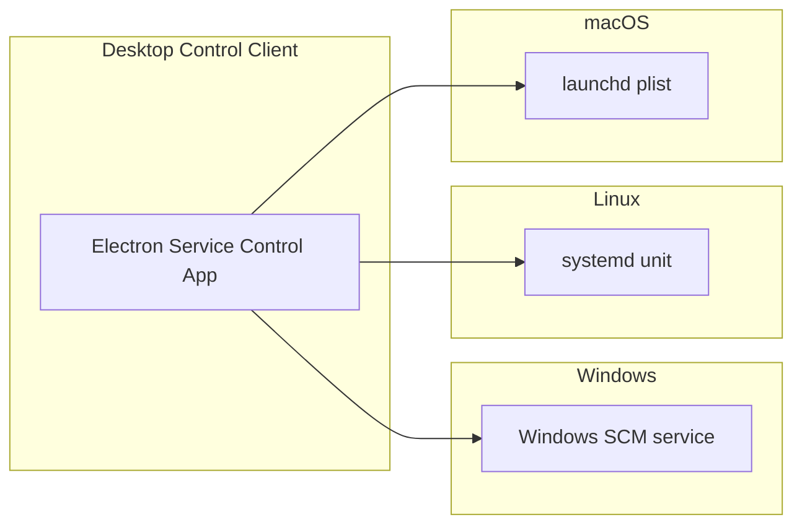

# Cross-Platform Service Strategy

This page documents how SQL Cockpit service management should evolve from the current Windows-first implementation to a consistent Windows, Linux, and macOS model.

## Current State (April 14, 2026)

| Capability | Windows | Linux | macOS |
| --- | --- | --- | --- |
| Service host control plane | Implemented (`SQLCockpitServiceHost`, SCM) | Not implemented | Not implemented |
| Service install/uninstall scripts | Implemented (PowerShell + `sc.exe`) | Not implemented | Not implemented |
| Logon/startup automation for control app | Implemented (Task Scheduler) | Not implemented | Not implemented |
| Separate service control UI | Implemented (Electron) | Electron app can run, but no OS-native service integration yet | Electron app can run, but no OS-native service integration yet |
| Dev vs prod ownership contract | Implemented and documented | Intended, not yet wired to OS service manager | Intended, not yet wired to OS service manager |

Confirmed today:

- the runtime ownership model (`dev` desktop-owned vs `prod` service-owned) is valid as a cross-platform contract
- the Electron service control app is a portable UI foundation

Uncertain conclusion (requires implementation validation):

- the existing Windows service host code can likely be refactored into a shared `net8.0` host with thin OS adapters, but this has not yet been prototyped end-to-end.

## Target Topology



The Electron UI should remain one product, while each operating system provides its own background service registration and lifecycle integration.

## Ownership Contract (Must Stay Consistent)

1. `dev` profile:
- desktop/embedded runtime manager owns component processes
- live-reload/watch is enabled
- no OS service-manager ownership for runtime components

2. `prod` profile:
- OS service manager owns web API and side services
- desktop/Electron acts as control client through host control API
- no embedded component ownership in desktop

Do not mix owners in any OS profile.

## OS-Specific Service Integration Plan

### Windows (already implemented)

- service manager: Windows SCM
- startup automation: Task Scheduler (`SQLCockpitServiceTrayAtLogon`)
- install scripts: `service/windows/Install-SqlCockpitWindowsService.ps1`, `service/windows/Install-SqlCockpitServiceTrayStartup.ps1`

### Linux (planned)

- service manager: `systemd`
- deliverables:
  - `service/linux/sql-cockpit-service.service` (unit template)
  - install script (`Install-SqlCockpitLinuxService.sh`)
  - uninstall script (`Uninstall-SqlCockpitLinuxService.sh`)
  - optional user-level autostart entry for Electron (`~/.config/autostart/*.desktop`)
- ops commands:
  - `systemctl enable --now sql-cockpit-service`
  - `systemctl status sql-cockpit-service`
  - `journalctl -u sql-cockpit-service -f`

### macOS (planned)

- service manager: `launchd`
- deliverables:
  - LaunchDaemon plist template for machine scope
  - install script (`Install-SqlCockpitMacService.sh`)
  - uninstall script (`Uninstall-SqlCockpitMacService.sh`)
  - optional LaunchAgent/autostart for Electron control app
- ops commands:
  - `launchctl bootstrap system /Library/LaunchDaemons/<plist>`
  - `launchctl print system/<label>`
  - `log stream --predicate 'process == "<process-name>"'`

## Repository Structure Recommendation

Use platform-specific service roots and keep shared runtime contracts central:

```text
service/
  windows/
  linux/
  macos/
  shared/
```

`service/shared/` should hold:

- host settings schema and defaults
- component contract definitions
- health/restart policy semantics

## Configuration Contract Requirements

All platforms should use equivalent settings semantics for:

- control API listen URL
- local-only request policy
- API key auth
- component list (`id`, `command`, `args`, `workingDirectory`, `healthUrl`)
- restart/health policy (`autoRestart`, thresholds, delays)

Safe change procedure:

1. change settings templates for one platform
2. validate control API behavior parity (`/health`, component list/actions)
3. update docs in the same task
4. rollout to next platform only after parity check passes

## Packaging and Updates

Current state:

- Electron auto-update is configured for GitHub releases (Windows packaging path already in use)

Planned parity:

- Windows: NSIS/portable (existing)
- Linux: AppImage/deb/rpm as chosen by release process
- macOS: dmg/zip signed builds (subject to Apple signing/notarization requirements)

Operational risk:

- updater behavior differs by OS signing and packaging requirements; release automation must include platform-specific validation before promoting builds.

## Phased Delivery Plan

1. Phase 1: Shared host abstraction
- create `service/shared` runtime contract and host abstraction interfaces
- keep Windows behavior unchanged

2. Phase 2: Linux service host + installer
- add `systemd` unit and scripts
- prove full `prod` profile ownership with control API parity

3. Phase 3: macOS service host + installer
- add `launchd` daemon scripts and plist
- prove control API parity and startup reliability

4. Phase 4: Cross-platform operator docs and runbooks
- add OS-specific runbooks and troubleshooting matrices
- add release checklist per OS for service host + Electron artifacts

## Definition Of Done (Cross-Platform Service Support)

Cross-platform service support is complete only when all of the following are true:

1. Windows/Linux/macOS all support `prod` profile with OS-native background service ownership.
2. Electron control app can manage all platform hosts through equivalent control API semantics.
3. `dev` profile behavior is identical in principle across OSes (desktop-owned runtime, watch workflows).
4. Operator docs include install, start, stop, health check, logs, and rollback procedures per OS.
