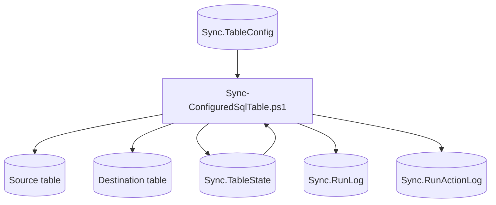

# Data Model And Runtime Contracts

SQL Cockpit stores runtime control, state, and evidence in SQL tables. These tables are part of the public operational interface of the system.

## Core Tables

| Table | Purpose | Write path |
| --- | --- | --- |
| `Sync.TableConfig` | One row per sync definition. Controls source, destination, mode, keys, filters, credentials, batching, and safety flags. | CLI, REST create/import endpoints, direct DBA edits. |
| `Sync.TableState` | Incremental checkpoint and state summary for a sync row. | Sync engine. |
| `Sync.RunLog` | Run-level telemetry and outcome. | Sync engine. |
| `Sync.RunActionLog` | Step/action-level telemetry and diagnostics. | Sync engine. |

The schema name defaults to `Sync`, but most launchers accept `-ConfigSchema`.

## Runtime Contract

The sync engine reads one config row at startup. A running process should not be assumed to pick up mid-run config edits.

## Config Change Requirements

For every new or changed config item, update docs with:

- storage location
- table and column
- valid values
- default or observed default
- runtime usage
- dependencies
- side effects
- safe live-change notes
- troubleshooting notes
- confidence level

The generated flag pages under `docs/configuration/flags/` are regenerated by `docs/scripts/generate_config_docs.ps1`.

## High-Risk Contract Areas

| Area | Why it matters |
| --- | --- |
| Mode resolution | `Incremental` and `FullRefresh` have very different destination effects. |
| Key columns | Upserts depend on correct uniqueness and stable values. |
| Watermarks | Checkpoint mistakes can skip or repeat source rows. |
| Source filters | A `SourceWhereClause` can silently alter the copied population. |
| Destination preparation | Auto-create, validation, full refresh, and primary-key creation affect destination schema and data. |
| SQL hooks | `PreSyncSql` and `PostSyncSql` execute operator-supplied SQL. |
| Batch controls | `BatchSize` and `MaxBatchesPerRun` affect lock time, log pressure, and recovery windows. |
| Credentials | SQL-auth values can be stored in config rows and browser local storage. |

## Confidence Levels

Use these labels in docs:

- Confirmed from code: visible in PowerShell, Node, or dashboard logic.
- Confirmed from schema usage: visible in SQL statements against known config/state/log tables.
- Inferred: plausible from names or surrounding usage but not fully proven in the repo.
- Uncertain: needs live database, operator, or environment confirmation.

## Compatibility Rule

Do not remove or rename a config column, route field, browser storage key, or generated flag page unless you have confirmed:

1. the sync engine no longer reads it
2. the REST bridge no longer maps it
3. the dashboard no longer sends it
4. existing operational docs and runbooks no longer rely on it
5. the live database has been migrated or compatibility has been preserved

