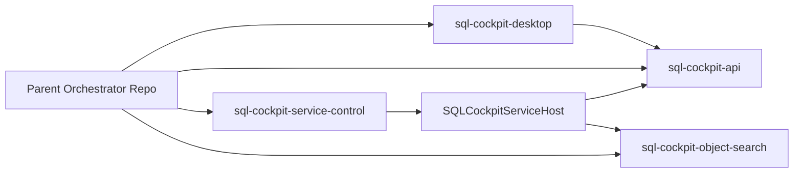

# Repository Cleanup And Multi-Repo Split

This guide is the implementation contract for the SQL Cockpit split into four repositories with a thin parent orchestrator.

## Target topology

## Ownership map

| Subsystem | Owning repo | Notes |
| --- | --- | --- |
| Desktop Electron UI | `sql-cockpit-desktop` | packaged desktop app + desktop release workflow |
| Managed API runtime | `sql-cockpit-api` | `server.js`, Next runtime, API contracts |
| Windows service control and suite | `sql-cockpit-service-control` | SCM host, tray/control app, installer scripts |
| Object search service | `sql-cockpit-object-search` | .NET Lucene service and settings |
| Cross-repo bootstrap/runbooks | parent orchestrator | manifest, bootstrap scripts, compatibility docs |

## Workspace manifest and scripts

Source of truth:

- `repos.manifest.json`

Automation:

- `scripts/orchestrator/Initialize-SqlCockpitWorkspace.ps1`
- `scripts/orchestrator/Export-SqlCockpitSplitRepos.ps1`
- `scripts/orchestrator/Set-SqlCockpitServiceSettingsRepoRoots.ps1`

## Required service settings keys

Storage location:

- `%ProgramData%\SqlCockpit\sql-cockpit-service.settings.json`

| Key | Valid value | Default behavior | Code paths affected | Operational risk | Safe change procedure |
| --- | --- | --- | --- | --- | --- |
| `desktopRepoRoot` | absolute path | `<repoRoot>\webapp` if omitted | service host token expansion + desktop launch plumbing | wrong path breaks desktop UI launch | set path to desktop repo root, restart service host, run desktop launch validation |
| `apiRepoRoot` | absolute path | `<repoRoot>\sql-cockpit-api` if omitted | service host token expansion for `web-api` | API component fails to start | set path to API repo containing `server.js`, restart host, check `:8000/health` |
| `serviceRepoRoot` | absolute path | `<repoRoot>\service` if omitted | service host token expansion + host log root | logs/scripts resolve incorrectly | set to service-control repo root, restart host, verify `Logs\ServiceHost` |
| `objectSearchRepoRoot` | absolute path | `<repoRoot>\object-search` if omitted | object-search component path resolution | object-search fails to start | set to object-search repo root, restart host, check `:8094/health` |

## Split execution runbook (fresh-start repos)

1. Freeze feature work and tag current parent repo.
2. Export local working trees for each repo:
   - `powershell -ExecutionPolicy Bypass -File ".\scripts\orchestrator\Export-SqlCockpitSplitRepos.ps1" -InitializeGit`
3. Create remote repos and push each exported tree.
4. Initialize local workspace from manifest:
   - `powershell -ExecutionPolicy Bypass -File ".\scripts\orchestrator\Initialize-SqlCockpitWorkspace.ps1" -CloneMissing -InstallDependencies`
5. Reconcile service settings roots:
   - run the initializer (calls root reconciliation automatically)
   - or run `Set-SqlCockpitServiceSettingsRepoRoots.ps1` directly
6. Restart `SQLCockpitServiceHost` and validate runtime endpoints.

## Compatibility matrix contract

Track compatibility in the parent docs before each release:

- `service-control version` -> minimum `api version`
- `service-control version` -> minimum `desktop version`
- `service-control version` -> minimum `object-search version`

If a release changes startup arguments, settings keys, or token expansion behavior, update this matrix in the same change set.
