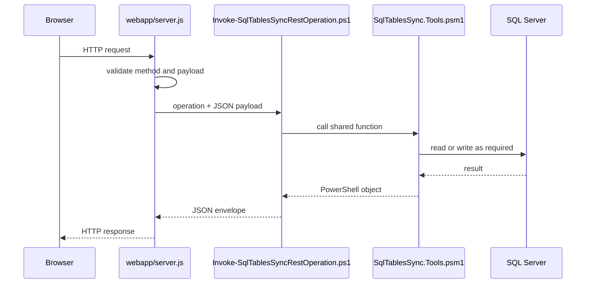

# REST And Dashboard Internals

The dashboard and local automation use the Node host in `webapp/server.js`. Most SQL-aware routes dispatch to `Invoke-SqlTablesSyncRestOperation.ps1`, which imports `SqlTablesSync.Tools.psm1`.

## Route Pipeline

## Operation Map

| HTTP route | PowerShell operation | Notes |
| --- | --- | --- |
| `GET /health` | `health` | Liveness and config target summary. |
| `GET /openapi.json` | `openapi` | Minimal OpenAPI document. |
| `GET /api/configs` | `getConfigs` | Reads config rows and state summary. |
| `GET /api/configs/template` | `getConfigTemplate` | Reads live schema metadata and defaults. |
| `POST /api/configs` | `createConfig` | Preview or insert one `Sync.TableConfig` row. |
| `POST /api/configs/import-csv` | `importConfigsFromCsv` | Preview or insert many rows. |
| `GET /api/configs/{syncId}` | `getConfigById` | Reads one config row. |
| `GET`/`POST /api/servers/explorer` | `getServerExplorer` | Live SQL catalog metadata. |
| `POST /api/servers/discover` | `discoverSqlServers` | SQL Server discovery from the API host. |
| `POST /api/databases/metadata` | `getDatabaseMetadata` | Full metadata for one database. |
| `POST /api/sql-agent/jobs` | `getSqlAgentInventory` | Reads `msdb` Agent metadata. |
| `POST /api/sql-agent/jobs/run` | `startSqlAgentJob` | Calls `msdb.dbo.sp_start_job`. |
| `POST /api/sql-estate/overview` | `getSqlEstateOverview` | Reads estate health and capacity metadata. |
| `POST /api/migrations/from-config` | `migrationFromConfig` | Generates migration SQL from a config row. |
| `POST /api/migrations/table-diff` | `migrationTableDiff` | Generates migration SQL from explicit endpoints. |
| `POST /api/tables/batch-size-recommendation` | `batchSizeRecommendation` | Profiles one table and returns advisory batch sizes. |

Object-search routes are handled by the Node host and local Lucene.NET sidecar rather than the config-operation dispatcher.

## Dashboard State

The dashboard now stores local accounts, sessions, and per-user preference blobs in `data/sql-cockpit/sql-cockpit-local.sqlite`.

Current per-user preference keys:

- `theme`
- `notificationPreferences`
- `connectionProfiles`
- `instanceProfiles`

Legacy browser-local storage keys are still read once during migration when the new local store is empty for that key.

## Error Reporting

The browser posts handled and unhandled dashboard errors to `POST /api/client-errors`. The Node host also writes server and process errors.

Local files:

- `.\Logs\WebApp\client-errors-YYYY-MM-DD.jsonl`
- `.\Logs\WebApp\server-errors-YYYY-MM-DD.jsonl`
- `.\Logs\WebApp\process-errors-YYYY-MM-DD.jsonl`

When changing route behaviour, preserve event IDs and useful JSON error bodies. Operators use them to connect UI failures with local logs.

## Route Change Checklist

1. Update `webapp/server.js`.
2. Update `Invoke-SqlTablesSyncRestOperation.ps1` if the route dispatches to PowerShell.
3. Add or update shared functions in `SqlTablesSync.Tools.psm1`.
4. Update the dashboard component or page using the route.
5. Update [REST API](../integrations/rest-api.md).
6. Update user docs if the workflow changes.
7. Run a REST trace with `Test-RestApiEndpoint.ps1` when PowerShell parity matters.
8. Run docs build checks.
