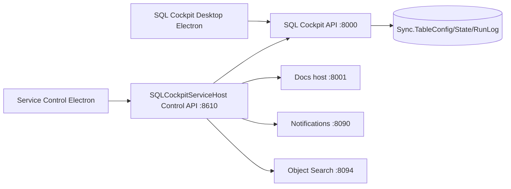

# System Map

SQL Cockpit is now a multi-repo platform coordinated by a thin orchestrator repository.

## Runtime map (Windows-first)

## Repository map

| Repository | Purpose | Main artifacts |
| --- | --- | --- |
| Parent orchestrator | Cross-repo bootstrap, machine reset, runbooks, compatibility docs | `repos.manifest.json`, `scripts/orchestrator/*`, docs |
| `sql-cockpit-desktop` | Desktop Electron app | desktop build scripts, desktop release workflow |
| `sql-cockpit-api` | Node/Next API runtime and SQL Cockpit HTTP endpoints | `server.js`, API route logic |
| `sql-cockpit-service-control` | Windows SCM host, service-control UI, suite installer logic | `SQLCockpitServiceHost`, service-control electron, installer scripts |
| `sql-cockpit-object-search` | Lucene-backed object-search service | `SqlObjectSearch.Service` |

## Settings roots and token expansion

Canonical settings file:

- `C:\ProgramData\SqlCockpit\sql-cockpit-service.settings.json`

Required repo-root keys used by runtime token expansion:

- `desktopRepoRoot`
- `apiRepoRoot`
- `serviceRepoRoot`
- `objectSearchRepoRoot`

Token examples:

- `{ApiRepoRoot}`
- `{DesktopRepoRoot}`
- `{ServiceRepoRoot}`
- `{ObjectSearchRepoRoot}`

If these roots are missing or stale, component startup can fail with path-resolution errors.

## High-impact developer touchpoints

| Change area | Update in docs |
| --- | --- |
| Service settings keys/tokens | `operations/windows-service-host.md`, `architecture/components.md`, this page |
| Component ownership or startup model | `developer/repository-cleanup-and-split.md`, `operations/component-compatibility-matrix.md` |
| Release process per repo | `operations/windows-service-control-release.md`, `operations/windows-desktop-app-release.md` |
| Bootstrap/reset scripts | `developer/local-development.md`, parent runbooks |
