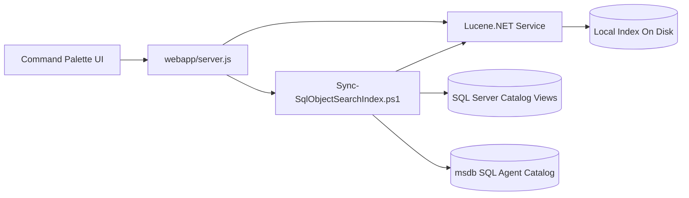

# Database Object Search

The database object search feature adds a local search sidecar to SQL Cockpit so operators can search SQL Server metadata and definitions without introducing external infrastructure.

## Recommended architecture

1. `Sync-SqlObjectSearchIndex.ps1` reads one or more configured SQL Server databases plus a stable `msdb` SQL Agent job source during instance-wide sync, normalizes metadata into a canonical document model, and pushes batches into the local Lucene.NET service.
2. `object-search/SqlObjectSearch.Service` hosts Lucene.NET on loopback and owns index persistence, document upsert and delete, ranking, and detail retrieval.
3. `webapp/server.js` remains the front-end-facing API gateway. It proxies search and detail reads to the Lucene.NET sidecar and runs PowerShell for refresh and rebuild operations.
4. `webapp/components/object-search-palette.js` provides the command-palette UI and object detail preview.

## Why this split

- PowerShell stays responsible for SQL Server extraction, credentials, and operational sync flow.
- Lucene.NET stays inside .NET where it is natural to host and maintain.
- Node remains the single browser-facing HTTP surface for the web app.
- The full stack stays local and self-contained.

## Mermaid data flow

## Storage and runtime notes

- settings file:
  `object-search/sql-object-search.settings.json`
- index persistence:
  `data/object-search/index`
- sync status:
  `data/object-search/sync-status.json`
- sync manifests:
  `data/object-search/manifests`
- sync log:
  `Logs/ObjectSearch/sync.log`

## Indexed document families

- database objects from `sys.objects`, `sys.schemas`, `sys.sql_modules`, and related catalog views
- child metadata for columns, parameters, references, indexes, and constraints
- SQL Server Agent jobs from `msdb.dbo.sysjobs` and related job step/schedule tables, stored as `Agent Job` documents under `databaseName = msdb`

## Confidence

- confirmed:
  Node is the browser-facing layer, PowerShell owns extraction, SQL Agent jobs are read from msdb during instance-wide sync, and the Lucene.NET service persists the local index on disk.
- inferred:
  parent-object `modify_date` is a practical incremental boundary for child objects such as columns, indexes, and constraints, but some edge-case DDL sequences may still justify an occasional full rebuild.
