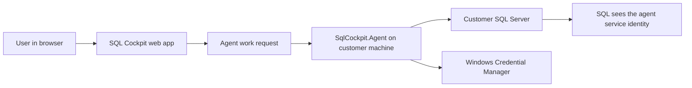
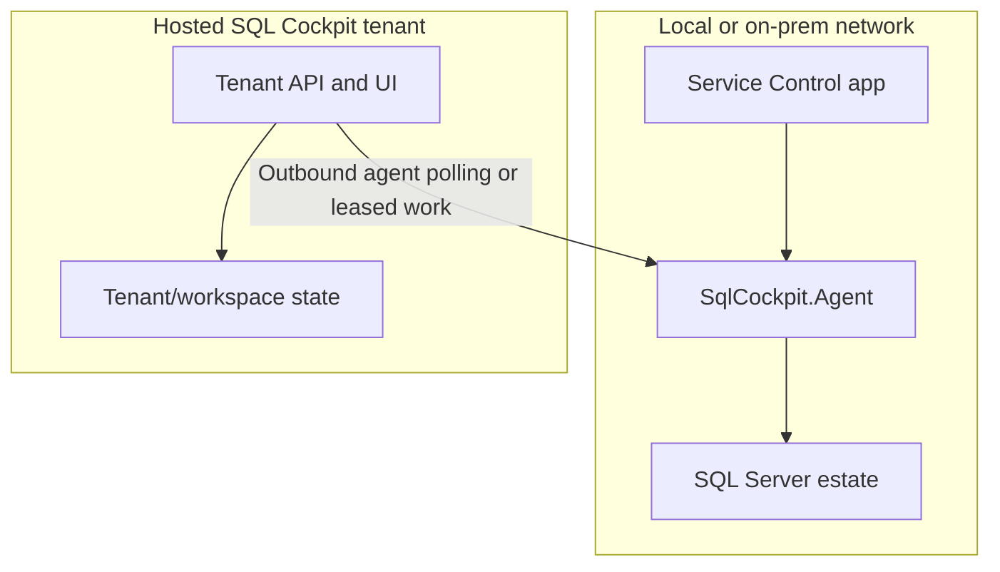
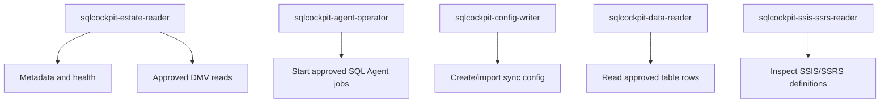

# How The SQL Cockpit Security Model Works Locally And From The Cloud

SQL Cockpit is designed around a simple security principle: the machine that can reach your SQL Servers should be the machine that performs SQL Server work.

That sounds obvious, but it changes the architecture in an important way. A cloud tenant should not need direct network access to a private SQL Server. It should not need inbound firewall rules into a customer network. It should not need SQL passwords copied into a hosted database. Instead, SQL Cockpit uses a paired local agent as the controlled entrypoint into the network where the databases live.

This post explains how that model works, why the local agent exists, what the cloud can and cannot do, and how to think about permissions in an enterprise environment.

<!-- more -->

## The Core Idea

SQL Cockpit has two very different responsibilities:

- The web application stores tenant state, workspace state, profiles, UI preferences, and work requests.
- The local `SqlCockpit.Agent` performs live database work from a machine inside the customer's network.

The agent is the only part that needs to connect to customer SQL Server instances.



This gives customers a practical control point. They decide where the agent runs, which servers that machine can reach, which Windows identity the service uses, and which SQL permissions that identity receives.

## Local Install Versus Cloud Tenant

In a local install, the web app, service control app, agent, and SQL Servers may all be on the same machine or same private network. It can feel like everything is local because the browser is hitting `127.0.0.1`, and the SQL Server may also be reachable from the same host.

In a cloud tenant, that assumption is gone. The cloud service cannot normally reach `daytona`, `nascar`, `sql01.internal`, or any other private SQL Server name. It also should not be granted a VPN-style path into the customer network by default.

The security model is therefore the same in both modes:



The difference is not who is allowed to query SQL Server. The difference is where the tenant UI and state live. Database access still happens through the agent.

## What The Cloud Stores

The cloud tenant stores the information needed to operate the product:

- tenant and workspace membership
- saved instance and connection profile metadata
- profile names, server names, database names, and auth mode
- task configuration and scheduling metadata
- audit records and feature state
- references to locally stored secrets

The cloud tenant should not store customer SQL passwords for agent-backed profiles. For SQL authentication, the password belongs on the agent host in Windows Credential Manager under the Windows identity running `SqlCockpit.Agent`.

That means a saved profile can say "this profile uses SQL auth as `app_reader`", while the actual password stays local to the customer's machine.

## What The Agent Stores

The agent host stores secrets that are needed locally:

- SQL-auth passwords in Windows Credential Manager
- pairing state for the tenant or local stack
- local service configuration

Those secrets are tied to the Windows service identity. If the agent service account changes, the new identity cannot automatically read Credential Manager entries written under the old identity. In that case SQL Cockpit may report:

```text
AGENT_PROFILE_SECRET_MISSING
```

The fix is intentional: re-save the SQL-auth password after changing the service account.

## Why Integrated Auth Uses The Agent Service Account

When an instance profile uses Windows Integrated authentication, SQL Server does not see the browser user. SQL Server sees the Windows identity running `SqlCockpit.Agent`.

For example:

```text
PEACOCKS\sqlcockpit-agent
PEACOCKS\gmsa-sqlcockpit$
PEACOCKS\MACHINE01$
```

This is one of the most important operational details in the whole model.

If a human can connect in SSMS as `PEACOCKS\administrator`, that does not prove the agent can connect. The agent may be running as a different service account, and SQL Server will evaluate permissions for that service account instead.

This is by design. It gives DBAs one clear integration identity to audit, grant, deny, rotate, and monitor.

## Why Not Run The Agent As A Domain Admin?

Running the agent as a domain administrator often makes development "just work". It also destroys the permission model.

An admin account usually has broad SQL and network access already, so it hides which permissions SQL Cockpit actually needs. It also increases blast radius: any mistake, bug, bad task configuration, or compromised credential now runs with admin-level reach.

For production, use a dedicated domain service account or gMSA. Treat it like any other enterprise integration identity.

Good examples:

```text
DOMAIN\sqlcockpit-agent
DOMAIN\gmsa-sqlcockpit$
```

Avoid:

```text
DOMAIN\administrator
DOMAIN\human.user
sysadmin by default
db_owner everywhere
db_datareader everywhere
```

## The Permission Model

SQL Cockpit does not need one giant permission grant. It needs a small set of capability tiers that customers can enable deliberately.

| Capability | Typical permissions | Risk |
| --- | --- | --- |
| Connect test | SQL login for the agent identity | Proves authentication only |
| Estate overview | `VIEW ANY DATABASE`, server DMV visibility | Exposes database names, size, state, and capacity signals |
| Per-database metadata | `VIEW DEFINITION` on approved databases | Exposes schema names, object names, columns, and definitions |
| Table and index metrics | `VIEW DATABASE STATE` on approved databases | Exposes size, row-count, and index usage metadata |
| SQL Agent inventory | `msdb` `SQLAgentReaderRole` | Exposes jobs, schedules, history, and step command text |
| SQL Agent job start | Separate operator profile with SQL Agent start permissions | Live operational action |
| SSIS/SSRS inspection | Explicit SSISDB/MSDB/ReportServer read grants | Package/report definitions can contain sensitive logic |
| Data-reading features | Narrow customer-approved `SELECT` grants | Can expose row data |
| Sync configuration writes | Separate config-writer profile | Changes operational sync behavior |

The recommended default is a read-only estate reader. Then add higher-risk capabilities only when the customer chooses to enable the feature.



This separation matters. Reading estate metadata is not the same risk as starting jobs, reading table data, or inspecting package XML.

## Network Control Belongs To The Customer

Because SQL work runs through the local agent, customers can control reachability with normal network controls:

- install the agent only in approved network zones
- allow outbound communication from the agent to SQL Cockpit
- restrict SQL Server firewall rules to the agent host
- use SQL Server allow-lists and named instances intentionally
- use `Agent:AllowedSqlServers` where a local allow-list is required

The cloud tenant does not need open inbound access to the customer network. The agent becomes the customer's explicit NAT-style entrypoint for database work.

## Local Service Control

The SQL Cockpit Service Control app manages the local components. For agent-backed deployments, it should make the agent visible as a managed component because the agent is the dependency that makes SQL-auth password storage and database checks work.

From an operational perspective, the user should be able to answer:

- Is `SqlCockpit.Agent` installed?
- Is it running?
- Which Windows identity runs it?
- Is it paired with the intended tenant or local stack?
- Can it reach the target SQL Servers?
- Are required local secrets present in Windows Credential Manager?

Those questions are local-machine questions. The service control app is the right place to surface them.

## Logging Without Creating A New Risk

Agent logs are useful because database checks can fail for network, identity, SQL permission, certificate, DNS, and secret-store reasons. But logs can also grow quickly and may contain operational detail.

The safer default is live streaming output without writing everything to disk. Persistent file logging should be an explicit user choice, ideally for a bounded troubleshooting window.

That keeps normal operation quiet while still giving administrators a way to see what the agent is doing.

## What This Means For Enterprise Customers

The model is enterprise-ready when customers can explain it in one sentence:

> SQL Cockpit's cloud tenant coordinates work, but customer database access is performed by a local agent running under a customer-controlled identity with customer-approved SQL permissions.

That sentence carries the core security guarantees:

- no cloud-stored SQL passwords for agent-backed profiles
- no default inbound access from cloud to private SQL Servers
- no hidden use of the browser user's Windows token
- auditable SQL access through the agent service account
- customer-controlled network path
- customer-controlled SQL permission grants
- separable read-only, operator, writer, and data-access capabilities

## Practical Rollout Pattern

Start narrow:

1. Install the agent on a machine that can reach one low-risk SQL Server.
2. Run the agent as a dedicated service account or gMSA.
3. Grant only connect permission first.
4. Add estate overview permissions.
5. Add per-database metadata permissions only for approved databases.
6. Add SQL Agent, SSIS, SSRS, data-reading, or write permissions only when those features are explicitly required.
7. Keep operator and writer actions on separate profiles where possible.

This keeps the first deployment understandable. It also prevents the common trap of granting broad admin access during rollout and then never unwinding it.

## Final Thought

SQL Cockpit's agent model is not just an implementation detail. It is the trust boundary.

The cloud gives users a consistent UI, shared state, scheduling, collaboration, and auditability. The local agent keeps database access inside the customer's network and under the customer's identity and permission model. That is the balance: cloud convenience without pretending the cloud should be inside every private SQL Server network.

For detailed grant examples, see [SQL Cockpit Agent Permissions And Risk Model](../../operations/sql-cockpit-agent-permissions.md).
