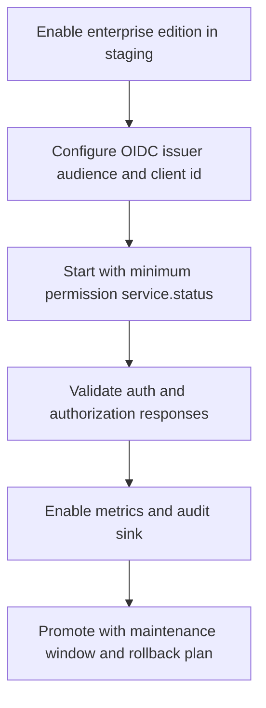

# Enterprise RBAC and Observability Rollout

This case study shows a controlled rollout from `standard` to `enterprise` mode with OIDC, RBAC permissions, audit output, and metrics.

## Scenario

- You need centralized sign-in and permission enforcement for runtime control actions.
- You want operational telemetry (`/metrics`, audit events, optional OTLP export) before production cutover.
- You need a sequence that reduces lockout and over-permissioning risk.

## Baseline target state

```dotenv
SQL_COCKPIT_EDITION=enterprise
SQL_COCKPIT_AUTH_MODE=oidc
SQL_COCKPIT_OIDC_ISSUER=https://idp.example.com
SQL_COCKPIT_OIDC_AUDIENCE=sql-cockpit-api
SQL_COCKPIT_OIDC_CLIENT_ID=sql-cockpit-desktop
SQL_COCKPIT_RBAC_PERMISSIONS=service.status
SQL_COCKPIT_METRICS_ENABLED=true
SQL_COCKPIT_AUDIT_LOG_SINK=stdout
SQL_COCKPIT_LOG_FORMAT=json
```

## Rollout flow



## Verification gates

1. `GET /api/auth/status` returns `edition=enterprise` and `authMode=oidc`.
2. Missing or invalid bearer token returns `401` on protected runtime endpoints.
3. Valid token without action permission returns `403`.
4. A user with `service.status` can read runtime status endpoints.
5. `/metrics` returns Prometheus-format output when metrics are enabled.
6. Audit events are present in the selected sink (`stdout` and/or OTLP collector).

## Risks and mitigations

| Risk | Why it happens | Mitigation |
| --- | --- | --- |
| Login lockout | OIDC mode enabled before issuer/audience/client values are correct. | Validate IdP discovery and test login in staging before production switch. |
| Over-permissioning | Broad permission entries such as `*` or `service.*`. | Start with least privilege and add actions only after approval. |
| Observability blind spots | OTLP or sink settings are incomplete or unreachable. | Keep `stdout` enabled during rollout and verify event ingestion before relying on OTLP only. |
| Misunderstood metrics bind behavior | `SQL_COCKPIT_METRICS_BIND` is informational in current code path. | Treat listener isolation as a network/host control concern until dedicated bind behavior exists. |

## Safe production change procedure

1. Apply the final environment settings during a planned window.
2. Restart the API process.
3. Re-run all verification gates with a known test user and token.
4. Expand permissions gradually (`service.start`, `service.stop`, `service.restart`) only when required.
5. Record evidence in the change ticket: auth status, metrics sample, and audit event proof.

## Related references

- [Enterprise Mode Settings](../user/enterprise-mode-settings.md)
- [Operational Safety](../user/operational-safety.md)
- [Troubleshooting](../operations/troubleshooting.md)
