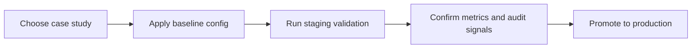

# Case Studies

This section captures real operational patterns for SQL Cockpit deployments. Each case study focuses on decisions, sequencing, validation checks, and risk controls that teams can reuse.

## How to use this section

1. Pick the scenario closest to your current rollout.
2. Copy the validation checklist into your change ticket.
3. Run the safe-change steps in a non-production environment first.
4. Promote to production only after each verification gate passes.

## Study map

- [Enterprise RBAC and Observability Rollout](enterprise-rbac-observability-rollout.md): enabling enterprise edition, external auth, permissions, audit, and metrics with controlled risk.
- [Object Search Full Sync at Scale](object-search-full-sync-at-scale.md): running and interpreting a large full-index sync, including performance and failure handling.

## Typical adoption path

