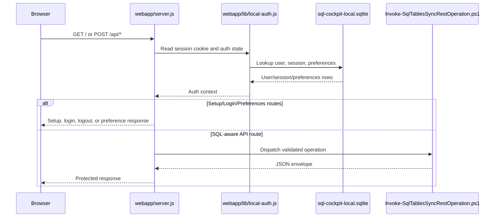

# Local Auth And User Storage

SQL Cockpit now has a packaged local authentication and user-preferences database for the web application.

## Purpose

This SQLite database gives the local Node host a workstation-scoped identity layer for:

- login
- session tracking
- password changes
- per-user preference storage
- migration of previously browser-only connection and instance profiles into the signed-in user context

## Storage Contract

- storage location:
  `data/sql-cockpit/sql-cockpit-local.sqlite`
- database engine:
  SQLite via `better-sqlite3`
- password hashing:
  `argon2id`
- session transport:
  `HttpOnly`, `SameSite=Strict` cookie named `sql_cockpit_session`
- confidence:
  confirmed for path, schema, cookie name, and password hashing; inferred that future packaging may want a Windows-specific secret-at-rest layer for saved SQL-auth profile passwords

## Current tables

| Table | Purpose | Notes |
| --- | --- | --- |
| `users` | Local SQL Cockpit accounts | Stores username, display name, role, password hash, and login timestamps. |
| `sessions` | Browser sessions | Stores hashed session tokens, expiry, user-agent, and remote address. |
| `user_preferences` | Per-user JSON settings | Stores theme, notification state, connection profiles, and instance profiles. |
| `login_attempts` | Sign-in throttling | Used for failed-attempt counting and temporary lockout. |

## Runtime Flow

Confirmed identity contract:

- `sessions.id` is the browser-session primary key used only for expiry, revocation, and touch updates.
- `sessions.user_id` joins to `users.id` and is the only valid owner key for `user_preferences` writes and password changes.
- confidence:
  confirmed from `webapp/lib/local-auth.js`

## Routes Added

User-facing pages:

- `/login`
- `/setup`
- `/preferences`

Auth and preference APIs:

- `GET /api/auth/status`
- `POST /api/auth/setup`
- `POST /api/auth/login`
- `POST /api/auth/logout`
- `GET /api/auth/session`
- `POST /api/auth/password`
- `GET /api/preferences`
- `PUT /api/preferences`
- `GET /api/integrations`
- `PUT /api/integrations/slack`
- `POST /api/integrations/slack/test`
- `PUT /api/integrations/pagerduty`
- `POST /api/integrations/pagerduty/test`
- `GET /api/admin/active-sessions`

## Security Controls

- password hashes use `argon2id`
- session tokens are random and only stored server-side as hashes
- cookies are `HttpOnly` and `SameSite=Strict`
- non-GET mutations require same-origin `Origin` or `Referer`
- failed sign-ins are rate-limited and temporarily locked out after repeated failures
- protected app pages redirect to `/login` or `/setup`
- protected API routes return `401` or `503` instead of exposing the dashboard state anonymously

## Defaults And Behaviour

- first user role default:
  `admin`
- session lifetime default:
  7 days with rolling touch
- failed sign-in lockout default:
  5 failed attempts in 15 minutes
- default preferences created at setup:
  `theme`, `notificationPreferences`, `integrationSettings`, `connectionProfiles`, `instanceProfiles`
- `notificationPreferences` defaults:
  `readById={}`, `archivedById={}`, `lastOpenedAt=""`, `browserNotificationsEnabled=false`, `teamSyncFailureNotificationsEnabled=true`, `syncFailureEmailEnabled=true`
- `integrationSettings` defaults:
  Slack disabled with no webhook; PagerDuty disabled with no routing key and Events API URL `https://events.pagerduty.com/v2/enqueue`
- sync-failure preference behavior:
  team notification recipients are filtered by `teamSyncFailureNotificationsEnabled`; creator email is filtered by `syncFailureEmailEnabled`
- job-event external delivery behavior:
  Task Manager checks each subscribed recipient's `integrationSettings` for Slack and PagerDuty before using global connector fallbacks

## Files To Touch When Maintaining This Area

- `webapp/lib/local-auth.js`
- `webapp/server.js`
- `webapp/components/dashboard-client.js`
- `webapp/components/dashboard-shell.js`
- `webapp/components/dashboard-data.js`
- `webapp/app/login/page.js`
- `webapp/app/setup/page.js`
- `webapp/app/preferences/page.js`

## Operational Risk

- medium:
  the local app database now stores workstation-local auth state and may also contain saved SQL-auth profile passwords through the preference store
- low:
  SQL Cockpit still keeps the SQL Server sync control plane in the original config database, so resetting the local auth DB does not alter `Sync.TableConfig` or runtime SQL state
- low:
  authenticated routes now distinguish session identity from user identity so `/api/preferences` and `/api/auth/password` operate on `users.id` instead of the transient `sessions.id`

## Safe Change Procedure

1. Back up `data/sql-cockpit/sql-cockpit-local.sqlite` before making incompatible schema changes.
2. Keep route guards in `webapp/server.js` and schema logic in `webapp/lib/local-auth.js` aligned.
3. Prefer live-server validation via the dev server `listenPrefix`.
4. Start the workspace and test:
   - first-run setup on a clean local DB
   - login on an existing local DB
   - logout
   - password change
   - preference persistence for theme and saved profiles
   - `GET /api/admin/active-sessions` as an admin user
   - authenticated preference reads and writes after login, confirming `GET /api/preferences` returns stored values instead of defaults only
5. Update both user and developer docs in the same task.

## Admin Active Sessions Endpoint

- endpoint:
  - `GET /api/admin/active-sessions`
- authentication / RBAC:
  - requires authenticated admin context and permission `admin.audit.view`
- request shape:
  - optional query parameter: `limit` (integer, defaults to `200`)
  - example:
    - `GET /api/admin/active-sessions?limit=50`
- response shape:
  - object with `activeSessions` array
  - session items include:
    - `id`
    - `session_user_id`
    - `username`
    - `display_name`
    - `role`
    - `provider`
    - `ip_address`
    - `user_agent`
    - `created_at`
    - `last_seen_at`
    - `expires_at`
    - `metadata` (parsed object from `sessions.metadata_json`)
- storage location:
  - `sessions` table (active session rows)
  - `users` table (identity info)
  - optional `auth_identities` table join for provider metadata
- valid values:
  - `limit` must be an integer; invalid values fall back to default
- defaults:
  - only unexpired and unrevoked sessions are returned
  - sorted by `last_seen_at DESC`
- code paths affected:
  - `sql-cockpit-api/lib/rbac-auth-store.js` (`listActiveSessions`)
  - `sql-cockpit-api/server.js` (`GET /api/admin/active-sessions`)
  - `sql-cockpit-api/components/dashboard-client.js` (Admin active sessions section loader/render)
  - `sql-cockpit-api/app/admin/active-sessions/page.js` (route wrapper)
- operational risk:
  - medium:
    returning session metadata is admin-only data; keep route permissioned and avoid exposing this in low-privilege roles
- safe test procedure:
  - login as admin and request `GET /api/admin/active-sessions?limit=10`
  - confirm endpoint returns current connected users
  - confirm `user`, `provider`, `remote address`, and `last seen` values are visible for live sessions
  - logout or revoke a session and confirm it disappears from this list

## Reset Procedure For Support

Use this only when the local account state is unrecoverable and the operator accepts losing workstation-local users, sessions, and preferences:

1. stop SQL Cockpit
2. back up `data/sql-cockpit/sql-cockpit-local.sqlite`
3. remove the SQLite file
4. restart the workspace
5. complete `/setup` again
