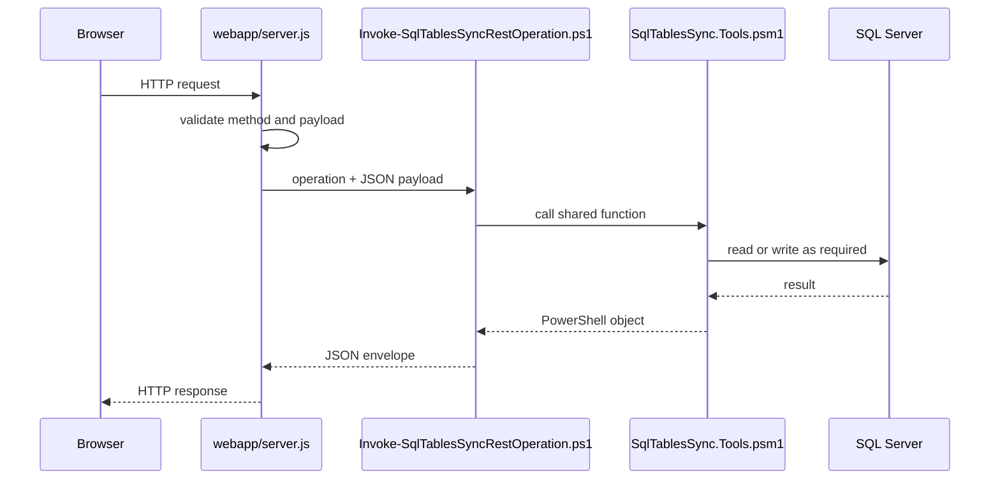
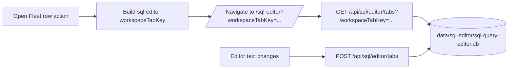

# REST And Dashboard Internals

The dashboard and local automation use the Node host in `webapp/server.js`. Most SQL-aware routes dispatch to `Invoke-SqlTablesSyncRestOperation.ps1`, which imports `SqlTablesSync.Tools.psm1`.

## Route Pipeline

## Operation Map

| HTTP route | PowerShell operation | Notes |
| --- | --- | --- |
| `GET /health` | `health` | Liveness and config target summary. |
| `GET /api-docs` | Node host | Built-in Swagger UI for same-origin authenticated API exploration. |
| `GET /swagger` | Node host | Redirects to `/api-docs`. |
| `GET /openapi.json` | `openapi` | OpenAPI document consumed by Swagger UI and local tooling. |
| `GET /api/configs` | `getConfigs` | Reads config rows and state summary. |
| `GET /api/configs/template` | `getConfigTemplate` | Reads live schema metadata and defaults. |
| `POST /api/configs` | `createConfig` | Preview or insert one `Sync.TableConfig` row. |
| `POST /api/configs/import-csv` | `importConfigsFromCsv` | Preview or insert many rows. |
| `GET /api/configs/{syncId}` | `getConfigById` | Reads one config row. |
| `POST /api/configs/{syncId}/run` | Task Manager `sql-table-sync-run` | Queues one `TaskRun`, then executes `Sync-ConfiguredSqlTable.ps1` for the selected row. |
| `POST /api/configs/run` | Task Manager `sql-table-sync-run` | Queues one row by `syncId` or `syncName` from the JSON body. |
| `GET`/`POST /api/servers/explorer` | `getServerExplorer` | Live SQL catalog metadata. |
| `POST /api/servers/discover` | `discoverSqlServers` | SQL Server discovery from the API host. |
| `POST /api/databases/metadata` | `getDatabaseMetadata` | Full metadata for one database. |
| `POST /api/sql-agent/jobs` | `getSqlAgentInventory` | Reads `msdb` Agent metadata. |
| `POST /api/sql-agent/jobs/run` | `startSqlAgentJob` | Calls `msdb.dbo.sp_start_job`. |
| `POST /api/sql-estate/overview` | `getSqlEstateOverview` | Reads estate health and capacity metadata. |
| `GET /api/sql/editor/tabs` | Node host route handler | Loads signed-in user SQL editor tab rows from local sqlite, filtered by optional `workspaceTabKey`. |
| `POST /api/sql/editor/tabs` | Node host route handler | Upserts signed-in user SQL editor tab rows; active tab scope is cleared only within same `workspaceTabKey`. |
| `DELETE /api/sql/editor/tabs/{id}` | Node host route handler | Deletes one SQL editor tab row by id. |
| `POST /api/migrations/from-config` | `migrationFromConfig` | Generates migration SQL from a config row. |
| `POST /api/migrations/table-diff` | `migrationTableDiff` | Generates migration SQL from explicit endpoints. |
| `POST /api/tables/batch-size-recommendation` | `batchSizeRecommendation` | Profiles one table and returns advisory batch sizes. |

Object-search routes are handled by the Node host and local Lucene.NET sidecar rather than the config-operation dispatcher.

## Swagger UI

`GET /api-docs` is served directly by `sql-cockpit-api/server.js` after the
normal SQL Cockpit authentication gate. It loads Swagger UI from the browser,
then fetches `GET /openapi.json` from the same origin. The request interceptor
uses `credentials = "include"` so the HTTP-only `sql_cockpit_session` cookie is
sent automatically by the browser.

Operational notes:

- Storage location: no database state. The HTML page is generated by
  `sql-cockpit-api/server.js`, and the OpenAPI catalog is generated by
  `scripts/runtime/SqlTablesSync.Tools.psm1`.
- Default behavior: `/openapi.json` is normalized to the incoming request origin
  before it is returned, avoiding wildcard listener URLs in Swagger requests.
- Risk: Swagger "try it out" calls are real API calls. Mutating endpoints keep
  their existing CSRF, RBAC, and validation checks, but they can still create
  sync rows, start SQL Agent jobs, change admin settings, kill monitored
  sessions, or control runtime components for an authorized user.
- Confidence: confirmed for route handling and cookie behavior; detailed
  request/response schemas remain intentionally broad because the server routes
  are hand-written rather than generated from typed OpenAPI annotations.

## Dashboard State

The dashboard now stores local accounts, sessions, and per-user preference blobs in `data/sql-cockpit/sql-cockpit-local.sqlite`.

Current per-user preference keys:

- `theme`
- `defaultPage`
- `notificationPreferences`
- `connectionProfiles`
- `instanceProfiles`
- `sql editor tab workspace state` is persisted in `data/sql-editor/sql-query-editor.db` (`sql_query_tabs` table), keyed by signed-in user and `workspaceTabKey`

`defaultPage` stores the route opened when the user visits `/`. The default is `/new-tab` (**Welcome Page**). Invalid or missing values fall back to `/new-tab`, and users change the value from the Account page profile settings.

Legacy browser-local storage keys are still read once during migration when the new local store is empty for that key.

## Error Reporting

The browser posts handled and unhandled dashboard errors to `POST /api/client-errors`. The Node host also writes server and process errors.

Local files:

- `.\Logs\WebApp\client-errors-YYYY-MM-DD.jsonl`
- `.\Logs\WebApp\server-errors-YYYY-MM-DD.jsonl`
- `.\Logs\WebApp\process-errors-YYYY-MM-DD.jsonl`

When changing route behaviour, preserve event IDs and useful JSON error bodies. Operators use them to connect UI failures with local logs.

## Route Change Checklist

1. Update `webapp/server.js`.
2. Update `Invoke-SqlTablesSyncRestOperation.ps1` if the route dispatches to PowerShell.
3. Add or update shared functions in `SqlTablesSync.Tools.psm1`.
4. Update the dashboard component or page using the route.
5. Update [REST API](../integrations/rest-api.md).
6. Update user docs if the workflow changes.
7. Run a REST trace with `Test-RestApiEndpoint.ps1` when PowerShell parity matters.
8. Run docs build checks.
