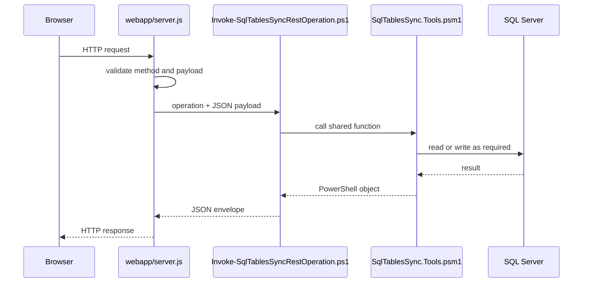
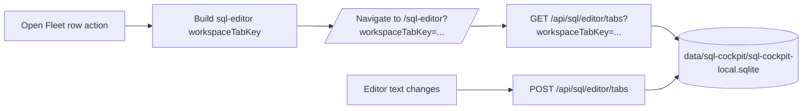
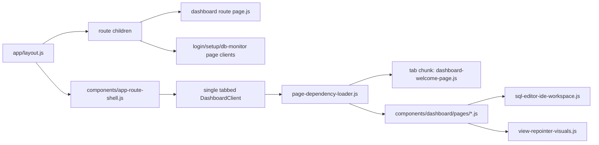

# REST And Dashboard Internals

The dashboard and local automation use the Node host in `webapp/server.js`. Most SQL-aware routes dispatch to `Invoke-SqlTablesSyncRestOperation.ps1`, which imports `SqlTablesSync.Tools.psm1`.

## Route Pipeline

## Operation Map

| HTTP route | PowerShell operation | Notes |
| --- | --- | --- |
| `GET /health` | `health` | Liveness and config target summary. |
| `GET /api-docs` | Node host | Built-in Swagger UI for same-origin authenticated API exploration. |
| `GET /swagger` | Node host | Redirects to `/api-docs`. |
| `GET /openapi.json` | `openapi` | OpenAPI document consumed by Swagger UI and local tooling. |
| `GET /api/configs` | `getConfigs` | Reads config rows and state summary. |
| `GET /api/configs/template` | `getConfigTemplate` | Reads live schema metadata and defaults. |
| `POST /api/configs` | `createConfig` | Preview or insert one `Sync.TableConfig` row. |
| `POST /api/configs/import-csv` | `importConfigsFromCsv` | Preview or insert many rows. |
| `GET /api/configs/{syncId}` | `getConfigById` | Reads one config row. |
| `POST /api/configs/{syncId}/run` | Task Manager `sql-table-sync-run` | Queues one `TaskRun`, then executes `Sync-ConfiguredSqlTable.ps1` for the selected row. |
| `POST /api/configs/run` | Task Manager `sql-table-sync-run` | Queues one row by `syncId` or `syncName` from the JSON body. |
| `GET`/`POST /api/servers/explorer` | `getServerExplorer` | Live SQL catalog metadata. |
| `POST /api/servers/discover` | `discoverSqlServers` | SQL Server discovery through the paired SQL Cockpit Agent host. |
| `POST /api/databases/metadata` | `getDatabaseMetadata` | Full metadata for one database. |
| `POST /api/sql-agent/jobs` | `getSqlAgentInventory` | Reads `msdb` Agent metadata. |
| `POST /api/sql-agent/jobs/run` | `startSqlAgentJob` | Calls `msdb.dbo.sp_start_job`. |
| `POST /api/sql-agent/jobs/stop` | `stopSqlAgentJob` | Calls `msdb.dbo.sp_stop_job`. |
| `POST /api/sql-estate/overview` | `getSqlEstateOverview` | Reads estate health and capacity metadata. |
| `GET /api/sql/editor/tabs` | Node host route handler | Loads signed-in user SQL editor tab rows from local sqlite, filtered by optional `workspaceTabKey`. |
| `POST /api/sql/editor/tabs` | Node host route handler | Upserts signed-in user SQL editor tab rows; active tab scope is cleared only within same `workspaceTabKey`. |
| `DELETE /api/sql/editor/tabs/{id}` | Node host route handler | Deletes one SQL editor tab row by id. |
| `POST /api/migrations/from-config` | `migrationFromConfig` | Generates migration SQL from a config row. |
| `POST /api/migrations/table-diff` | `migrationTableDiff` | Generates migration SQL from explicit endpoints. |
| `POST /api/tables/batch-size-recommendation` | `batchSizeRecommendation` | Profiles one table and returns advisory batch sizes. |

Object-search routes are handled by the Node host and local Lucene.NET sidecar rather than the config-operation dispatcher.

## Swagger UI

`GET /api-docs` is served directly by `sql-cockpit-api/server.js` after the
normal SQL Cockpit authentication gate. It loads Swagger UI from the browser,
then fetches `GET /openapi.json` from the same origin. The request interceptor
uses `credentials = "include"` so the HTTP-only `sql_cockpit_session` cookie is
sent automatically by the browser.

Operational notes:

- Storage location: no database state. The HTML page is generated by
  `sql-cockpit-api/server.js`, and the OpenAPI catalog is generated by
  `scripts/runtime/SqlTablesSync.Tools.psm1`.
- Default behavior: `/openapi.json` is normalized to the incoming request origin
  before it is returned, avoiding wildcard listener URLs in Swagger requests.
- Risk: Swagger "try it out" calls are real API calls. Mutating endpoints keep
  their existing CSRF, RBAC, and validation checks, but they can still create
  sync rows, start SQL Agent jobs, change admin settings, kill monitored
  sessions, or control runtime components for an authorized user.
- Confidence: confirmed for route handling and cookie behavior; detailed
  request/response schemas remain intentionally broad because the server routes
  are hand-written rather than generated from typed OpenAPI annotations.

## Dashboard State

The dashboard now stores local accounts, sessions, and per-user preference blobs in `data/sql-cockpit/sql-cockpit-local.sqlite`.

Current per-user preference keys:

- `theme`
- `defaultPage`
- `notificationPreferences`
- `connectionProfiles`
- `instanceProfiles`
- `sql editor tab workspace state` is persisted in `data/sql-cockpit/sql-cockpit-local.sqlite` (`sql_query_tabs` table), keyed by signed-in user and `workspaceTabKey`

`defaultPage` stores the route opened when the user visits `/`. The default is `/` (**Welcome Page**). Invalid or missing values fall back to `/`, legacy `/new-tab` values are normalized to `/`, and users change the value from the Account page profile settings.

Legacy browser-local storage keys are still read once during migration when the new local store is empty for that key.

## Dashboard Load Boundaries

Confirmed from `sql-cockpit-api`: the root layout hosts global providers, the route transition indicator, and `components/app-route-shell.js`. The layout wrapper mounts the single `DashboardClient` only for known dashboard routes; standalone pages such as `/login`, `/setup`, and `/db-monitor` render their own clients, and deleted or unknown routes such as `/new-tab` fall through to Next.js 404 handling. Dashboard-owned route files still import `components/dashboard-page.js`, but that file is only the dashboard route marker. Page-specific split points happen inside the tabbed dashboard layer through `components/dashboard/page-dependency-loader.js`, not by replacing dashboard routes with separate route clients.

Performance intent:

- standalone pages such as `/login`, `/setup`, and `/db-monitor` do not mount the dashboard client
- the Welcome Page widget grid is lazy-loaded from `components/dashboard/dashboard-welcome-page.js`; only its layout preference schema remains in `components/dashboard/dashboard-welcome-layout.js` for startup preference validation
- large dashboard page render bodies now live under `components/dashboard/pages/*.js` and load through `components/dashboard/page-dependency-loader.js` when a workspace tab is created or directly entered
- existing tab/page chunks include Welcome, SQL Editor, Query Analyser, Query Audit, Notification Center, Object Explorer, Sync Table, sharing boards, and Procedure Repointer viewers
- Procedure Repointer SQL viewers, SQL diff rendering, DOT graph rendering, and Object Explorer diagram helpers are owned by `components/dashboard/view-repointer-visuals.js`
- `components/dashboard/view-repointer-sql-utils.js` keeps the small source-line range helpers available to the main dashboard without importing the full Procedure Repointer visuals chunk
- shared dashboard SVG icons, inline loading text, workspace selection keys, task status tones, and document-title handling are kept in small modules under `components/dashboard/`
- graph-heavy dashboard chrome (`ObjectExplorerCanvas`, diagram controls, minimap, and status bar) is imported by the route-specific visuals module instead of being declared in the main dashboard client
- dashboard browser titles are derived from route metadata as `{Page Title} | SQL Cockpit`; `/login`, `/setup`, and `/db-monitor` also declare explicit standalone titles
- `components/dashboard-client.js` should remain the single tabbed dashboard app; future extractions should move whole tab/page bodies into feature modules while leaving shared shell, route metadata, workspace tabs, and cross-page state in the dashboard layer

Operational notes:

- storage location: no database storage and no config table changes
- code paths affected: `sql-cockpit-api/app/layout.js`, `sql-cockpit-api/app/page.js`, `sql-cockpit-api/components/app-route-shell.js`, `sql-cockpit-api/components/dashboard-page.js`, `sql-cockpit-api/components/dashboard-client.js`, `sql-cockpit-api/components/dashboard/page-dependency-loader.js`, `sql-cockpit-api/components/dashboard/pages/*.js`, `sql-cockpit-api/components/dashboard/dashboard-welcome-page.js`, `sql-cockpit-api/components/dashboard/view-repointer-visuals.js`, `sql-cockpit-api/components/dashboard/view-repointer-sql-utils.js`, and `sql-cockpit-api/components/dashboard/dashboard-document-title.js`
- operational risk: low for SQL safety because the change affects browser chunk loading only; medium for developer workflow if a route accidentally bypasses `DashboardPage`, because the dashboard shell would not mount for that route
- safe test procedure: with the dev lock listener, call `GET /health`, open `/login` and `/db-monitor` to confirm standalone pages render with specific titles, open `/` and several additional dashboard tabs, confirm `/new-tab` is no longer an app route, then confirm page chunks load as those tabs render; finally open every app `page.js` route in a real browser with an authenticated session and verify status, visible body text, console/page errors, redirects, and browser title
- page-weight reporting: run `npm run measure:pages -- --wait-ms 3000` from `sql-cockpit-api` while the dev lock listener is running. The script reads `.sql-cockpit-dev-lock.json`, creates a local admin session by default, visits every physical `app/**/page.js` route, omits SEO checks, and writes Markdown, CSV, JSON, and HTML reports under `.tmp/page-performance-reports`. Use `--route /,/sql-editor` for targeted runs, `--no-auth` for unauthenticated login/setup measurements, and `--include-metadata-routes` when validating route metadata entries.
- confidence: confirmed for the listed code paths; exact byte-size savings should be measured with browser DevTools or a future bundle analyzer pass

## Error Reporting

The browser posts handled and unhandled dashboard errors to `POST /api/client-errors`. The Node host also writes server and process errors.

Local files:

- `.\Logs\WebApp\client-errors-YYYY-MM-DD.jsonl`
- `.\Logs\WebApp\server-errors-YYYY-MM-DD.jsonl`
- `.\Logs\WebApp\process-errors-YYYY-MM-DD.jsonl`

When changing route behaviour, preserve event IDs and useful JSON error bodies. Operators use them to connect UI failures with local logs.

## Route Change Checklist

1. Update `webapp/server.js`.
2. Update `Invoke-SqlTablesSyncRestOperation.ps1` if the route dispatches to PowerShell.
3. Add or update shared functions in `SqlTablesSync.Tools.psm1`.
4. Update the dashboard component or page using the route.
5. Update [REST API](../integrations/rest-api.md).
6. Update user docs if the workflow changes.
7. Run a REST trace with `Test-RestApiEndpoint.ps1` when PowerShell parity matters.
8. Run docs build checks.
