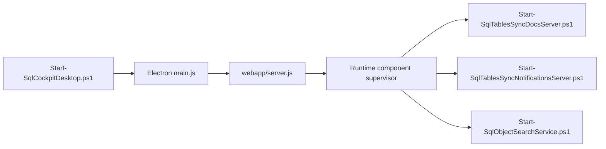

# Entry Points

## Primary runtime entry point

`Sync-ConfiguredSqlTable.ps1`

Important parameters:

- `-ConfigServer`
- `-ConfigDatabase`
- `-ConfigSchema`
- `-SyncId`
- `-SyncName`
- `-ConfigUsername`
- `-ConfigPassword`
- `-ConfigIntegratedSecurity`
- `-EncryptConnection`
- `-TrustServerCertificate`
- `-PrintSql`

## Operational entry points

- `New-SyncTableConfig.ps1`
- `Export-TableConfigDiagram.ps1`
- `Spawn-AptosJobs.ps1`
- `Spawn-AptosJobsMemorySafe.ps1`
- `Adhoc_RunJobs.ps1`
- `Spawn-SyncJobs.ps1`
- `Start-SqlTablesSyncRestApi.ps1`
- `scripts/runtime/Start-SqlTablesSyncMcpServer.ps1` (compatibility wrapper; launches `sql-cockpit-mcp-server`)
- `Start-SqlTablesSyncDocsServer.ps1`
- `Start-SqlTablesSyncWorkspace.ps1`
- `Start-SqlCockpitDesktop.ps1`

## Desktop runtime entry point

`Start-SqlCockpitDesktop.ps1` now launches Electron and passes runtime settings through environment variables.
The supporting services are supervised in-process by `webapp/server.js` instead of separate command windows.

## Windows SCM service entry point

The repository now includes a Windows-specific SCM host:

- project: `service/windows/SqlCockpit.ServiceHost.Windows/SqlCockpit.ServiceHost.Windows.csproj`
- executable: `SqlCockpit.ServiceHost.Windows.exe` (published output)
- install script: `service/windows/Install-SqlCockpitWindowsService.ps1`
- uninstall script: `service/windows/Uninstall-SqlCockpitWindowsService.ps1`

## Browser entry point

- `webapp/app/page.js` served by the Node host at `/` and `/app`
- current browser brand: `SQL Cockpit`

## Documentation entry points

- `Start-SqlTablesSyncDocsServer.ps1`
- `Start-SqlTablesSyncWorkspace.ps1`
- `docs/scripts/generate_config_docs.py`
- `docs/scripts/build_docs.ps1`
- `docs/scripts/check_docs.ps1`

## Shared library entry point

- `SqlTablesSync.Tools.psm1`

This module is the shared implementation for:

- sync-config reads
- live table schema inspection
- destination migration generation
- OpenAPI document generation

## Missing entry points

Not found in this repo:

- Windows Service Control Manager service definition
- scheduled task definition
- SQL Agent job definition

That likely means scheduling and broader orchestration still live outside this repository.

