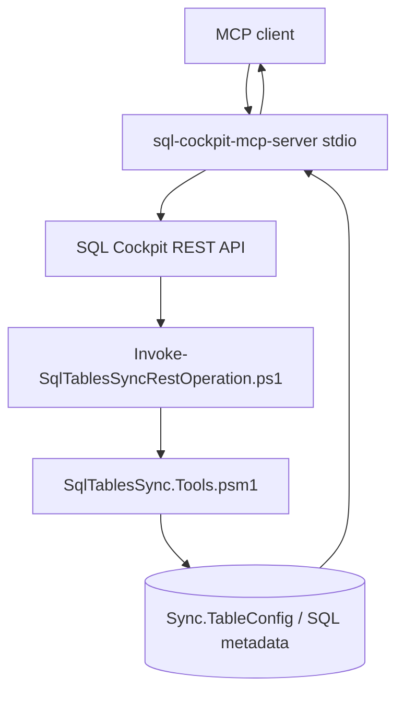

# MCP Server

`Start-SqlTablesSyncMcpServer.ps1` now acts as a compatibility launcher that starts the dedicated `sql-cockpit-mcp-server` submodule. The submodule hosts the MCP stdio server and calls SQL Cockpit REST API routes under the hood.

## Purpose

- Keep a stable MCP tool surface for AI clients.
- Route MCP calls through the same REST layer used by the SQL Cockpit UI.
- Avoid duplicated SQL logic in the MCP layer.

## Settings

- Storage location:
  - process parameters and environment variables only
  - no new `Sync.TableConfig` or `Sync.TableState` fields
- Transport:
  - MCP stdio (JSON-RPC framing)
  - REST HTTP calls from MCP server to SQL Cockpit API
- Defaults:
  - MCP launch wrapper path: `scripts/runtime/Start-SqlTablesSyncMcpServer.ps1`
  - REST base URL: `http://127.0.0.1:8080`
  - request timeout: `30000` ms
- Valid values:
  - `ApiBaseUrl`: valid SQL Cockpit API base URL
  - `ApiUsername` and `ApiPassword`: valid SQL Cockpit local auth credentials
  - `ApiSessionToken`: existing API session token if you do not want login-by-credential
  - `ApiTimeoutMs`: positive integer
  - `NodeExecutable`: executable on `PATH` or absolute path to Node.js
  - `InsecureTls`: switch for development-only TLS certificate bypass
- Code paths affected:
  - `scripts/runtime/Start-SqlTablesSyncMcpServer.ps1`
  - `sql-cockpit-mcp-server/src/server.js`
  - `sql-cockpit-mcp-server/src/api-client.js`
  - `sql-cockpit-mcp-server/src/tool-handlers.js`
  - `sql-cockpit-api/server.js` (consumed interface)
- Operational risk:
  - MCP callers can read live sync configuration and table metadata through REST
  - MCP migration tools can surface sensitive schema information
  - invalid credentials or expired sessions return auth failures
  - using `InsecureTls` outside local/trusted environments increases interception risk
- Safe change procedure:
  - run API and MCP on loopback first
  - verify MCP `tools/list`
  - run read-only tool checks (`list_sync_configs`, `get_table_schema`) on low-risk targets
  - then run migration/batch-advice tools on non-production targets
  - only expand automation scope after expected behavior is confirmed
- Confidence:
  - confirmed for wrapper behavior, REST-backed architecture, tool names, and launch examples below

## Exposed tools

| Tool | Purpose |
| --- | --- |
| `list_sync_configs` | List sync rows with latest state summary through REST. |
| `get_sync_config` | Get one row by `syncId` or `syncName`. |
| `get_table_schema` | Read table metadata for one SQL table through REST metadata routes. |
| `get_table_batch_size_recommendation` | Return advisory `BatchSize` guidance for one table. |
| `generate_table_migration` | Compare two supplied SQL tables and return migration SQL. |
| `generate_sync_migration` | Generate migration SQL from an existing sync config row. |

## Example launch

```powershell
powershell.exe -NoProfile -ExecutionPolicy Bypass -File .\scripts\runtime\Start-SqlTablesSyncMcpServer.ps1 `
  -ApiBaseUrl "http://127.0.0.1:8080" `
  -ApiUsername "operator" `
  -ApiPassword "replace-me"
```

Example MCP client configuration:

```json
{
  "mcpServers": {
    "sql-cockpit": {
      "command": "powershell.exe",
      "args": [
        "-NoProfile",
        "-ExecutionPolicy",
        "Bypass",
        "-File",
        "E:\\Scripts\\SQL Tables Sync\\scripts\\runtime\\Start-SqlTablesSyncMcpServer.ps1",
        "-ApiBaseUrl",
        "http://127.0.0.1:8080",
        "-ApiUsername",
        "operator",
        "-ApiPassword",
        "replace-me"
      ]
    }
  }
}
```

## Request flow



## MCP testing best practices

1. Start with contract tests against mocked REST responses so MCP tool schemas and error mapping are deterministic.
2. Run local integration tests against a non-production API instance.
3. Add a session test that covers login success, login failure, and expired session behavior.
4. Keep at least one read-only smoke test in CI: `initialize`, `tools/list`, `list_sync_configs`.
5. Validate migration and batch-size tools on low-risk tables before operational rollout.
6. Keep representative error fixtures (`400`, `401`, `500`) and assert MCP error surfaces are actionable.
