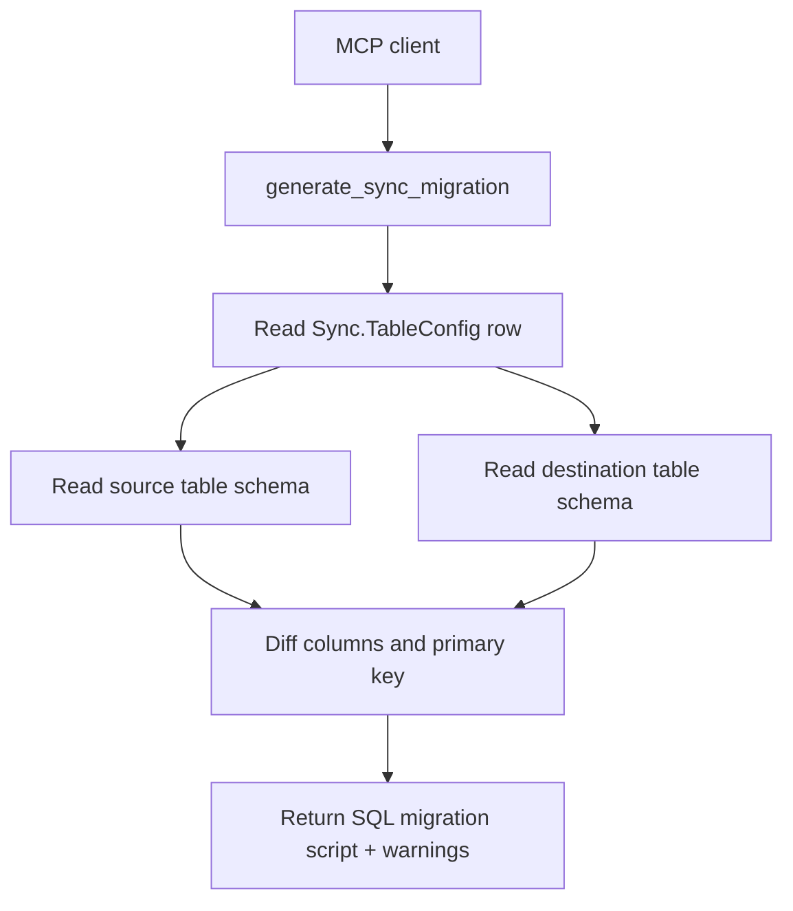
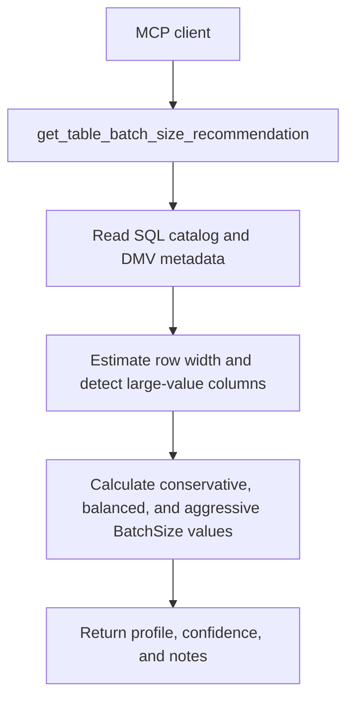

# MCP Server

`Start-SqlTablesSyncMcpServer.ps1` exposes this repository as a Model Context Protocol server over stdio so AI tools can query sync rows and generate SQL migrations directly.

## Purpose

- Give MCP-compatible clients a stable tool surface for this repo.
- Let agents create or review destination-table migrations from live SQL metadata.
- Let agents profile one SQL table and retrieve advisory `BatchSize` guidance from the same shared logic as the CLI wrapper.
- Keep MCP logic thin by delegating all schema inspection and diffing to `SqlTablesSync.Tools.psm1`.

## Settings

- Storage location: process parameters only. No new database config-table fields are added.
- Transport: stdio JSON-RPC with MCP framing.
- Code paths affected:
  - `Start-SqlTablesSyncMcpServer.ps1`
  - `SqlTablesSync.Tools.psm1`
- Operational risk:
  - callers can read live config rows
  - callers may receive credentials stored in `Sync.TableConfig`
  - schema reads hit live SQL Server instances
  - the batch-size tool reveals live table shape and storage details from the supplied SQL endpoint
- Safe change procedure:
  - point the server at a non-production config database first when validating a new client
  - test `list_sync_configs`
  - test `get_table_batch_size_recommendation` on a non-production or low-risk table
  - test `generate_sync_migration` on a low-risk table
  - only then allow broader AI automation to use it
- Confidence: confirmed for tool names and behavior below

## Exposed tools

| Tool | Purpose |
| --- | --- |
| `list_sync_configs` | List sync rows with latest status summary. |
| `get_sync_config` | Get one row plus checkpoint metadata by `syncId` or `syncName`. |
| `get_table_schema` | Read live schema metadata for any supplied SQL table. |
| `get_table_batch_size_recommendation` | Profile one SQL table and return advisory `BatchSize` guidance. |
| `generate_table_migration` | Compare two SQL tables and generate a destination migration script. |
| `generate_sync_migration` | Use `Sync.TableConfig` source and destination settings to generate a migration plan. |

## Example launch

```powershell
powershell.exe -NoProfile -ExecutionPolicy Bypass -File .\Start-SqlTablesSyncMcpServer.ps1 `
  -ConfigServer "NASCAR" `
  -ConfigDatabase "EPC_Imports_PCK" `
  -ConfigSchema "Sync" `
  -ConfigIntegratedSecurity `
  -TrustServerCertificate
```

Example MCP client configuration:

```json
{
  "mcpServers": {
    "sql-tables-sync": {
      "command": "powershell.exe",
      "args": [
        "-NoProfile",
        "-ExecutionPolicy",
        "Bypass",
        "-File",
        "C:\\Scripts\\SQL Tables Sync\\Start-SqlTablesSyncMcpServer.ps1",
        "-ConfigServer",
        "NASCAR",
        "-ConfigDatabase",
        "EPC_Imports_PCK",
        "-ConfigSchema",
        "Sync",
        "-ConfigIntegratedSecurity",
        "-TrustServerCertificate"
      ]
    }
  }
}
```

## Migration workflow



## Batch-size tool

Tool name: `get_table_batch_size_recommendation`

Input arguments:

```json
{
  "connection": {
    "server": "DAYTONA",
    "database": "Reporting_PEA",
    "integratedSecurity": true,
    "trustServerCertificate": true
  },
  "schema": "dbo",
  "table": "tbl_ReportingBaseData_001"
}
```

Returned fields:

- table endpoint metadata
- row count and column count
- primary key details
- non-clustered index count
- average row width and which data source produced it
- base and total storage footprint
- LOB detection
- balanced, conservative, and aggressive `BatchSize` guidance
- confidence and notes

Operational notes:

- The MCP tool does not change `Sync.TableConfig`.
- It does not start a sync run.
- It profiles a live SQL table and returns an advisory range only.
- The recommendation can still be wrong for a busy destination or an unstable source, so validate with a controlled run.

## Batch-size workflow


