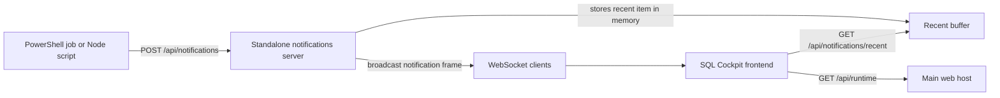

# Realtime Notifications

`Start-SqlTablesSyncNotificationsServer.ps1` launches a standalone local notification service for SQL Cockpit. Long-running PowerShell jobs, Node scripts, and other local tools can post custom events into this service, and the web frontend listens continuously over WebSocket so the header bell updates without a manual refresh.

## Purpose

- Provide one local event hook for long-running processes, runbooks, and operator tooling.
- Keep notification publishing separate from the main REST API so non-dashboard scripts can emit events without touching the config-write routes.
- Let PowerShell and Node callers use the same HTTP publish contract.
- Seed a future path for browser or desktop notification delivery without changing the producer contract again.

## Interface summary

- storage location for settings: process parameters only. No database config-table columns, flags, or runtime sync-engine settings are added by this feature.
- default bind address: `http://127.0.0.1:8090/`
- transport model:
  - publishers call `POST /api/notifications`
  - the dashboard loads recent items from `GET /api/notifications/recent`
  - the dashboard subscribes to `ws://127.0.0.1:8090/ws` or the `wss://` equivalent for continuous updates
  - when the operator enables browser alerts and grants site permission, newly arriving realtime events can also raise native browser notifications through a service-worker-backed browser notification path, with an in-page Notification API fallback
- retention model: in-memory ring buffer only, capped at 250 recent notifications; restarting the service clears that buffer
- code paths affected:
  - `Start-SqlTablesSyncNotificationsServer.ps1`
  - `Send-ProgressSqlCockpitNotificationDemo.ps1`
  - `Send-SqlCockpitNotification.ps1`
  - `Send-TestSqlCockpitNotifications.ps1`
  - `Start-SqlTablesSyncWorkspace.ps1`
  - `Start-SqlTablesSyncRestApi.ps1`
  - `webapp/notifications-server.js`
  - `webapp/server.js`
  - `webapp/scripts/send-notification.js`
  - `webapp/scripts/send-test-notifications.js`
  - `webapp/public/notifications-sw.js`
  - `webapp/components/dashboard-client.js`
  - `webapp/components/notifications-data.js`
  - `webapp/components/notifications-menu.js`
- operational risk:
  - low for SQL safety, because the service does not write to SQL Server or change sync config rows
  - medium for operator trust, because any local caller that can reach the listener can publish a message that looks operationally important
  - medium for data sensitivity, because notification payloads can contain process names, URLs, or other workflow context that appears in the browser UI
- safe change procedure:
  - keep the listener on loopback unless you have an explicit trust and auth model
  - start the service and verify `GET /health`
  - publish one harmless test notification
  - confirm the header bell updates in the dashboard without a refresh
  - if native browser alerts are wanted, open the bell menu, enable browser alerts, approve the browser permission prompt, then publish another harmless test notification while the tab is backgrounded
  - restart the service only after confirming operators do not need the in-memory recent history
- confidence: confirmed from code for the endpoints, payload shape, startup flow, and in-memory retention; inferred that broader network exposure would need an authentication design before it is safe

## Parameters

| Parameter | Valid values | Default | Notes |
| --- | --- | --- | --- |
| `ListenPrefix` | valid `http://` or `https://` absolute prefix understood by the Node host | `http://127.0.0.1:8090/` | Prefer loopback only. |
| `MaxRequestBodyBytes` | positive integer | `65536` | Rejects oversized JSON payloads. |
| `NodeExecutable` | Node.js executable name or path | `node` | Process-level launcher setting for the Node host. |
| `DevMode` | switch | off | Restarts the standalone Node service when `webapp/notifications-server.js` changes. |

## Endpoints

| Method | Path | Purpose |
| --- | --- | --- |
| `GET` | `/health` | Basic liveness plus connected-client and buffer counts. |
| `GET` | `/api/notifications/recent?limit=25` | Return recent notifications from the in-memory ring buffer. |
| `POST` | `/api/notifications` | Accept one custom notification and broadcast it to connected browser clients. |
| `GET` | `/ws` | WebSocket upgrade endpoint used by the SQL Cockpit frontend. |

## Notification payload

| Field | Valid values | Default | Runtime usage |
| --- | --- | --- | --- |
| `id` | any non-empty string | random GUID | Stable client-side identity for read and archive state. |
| `title` | non-empty string | none | Bell-menu headline. Required. |
| `message` | non-empty string | none | Bell-menu body text. Required. |
| `severity` | `info`, `success`, `warning`, `critical` | `info` | Controls badge tone and attention filtering. |
| `category` | any non-empty string | `general` | Lightweight source grouping for future filtering. |
| `actionLabel` | string | blank | Optional button text shown in the bell menu. |
| `actionHref` | app-relative or absolute URL string | blank | Optional navigation target for the notification action button. |
| `source` | any non-empty string | `external` | Human-readable producer label for future diagnostics. |
| `pinned` | `true` or `false` | `false` | Reserved by the current UI model for sticky-style items. |
| `dedupeKey` | any non-empty string | blank | When present, the server updates the existing notification with the same `dedupeKey` instead of creating a new item. |
| `createdAt` | ISO-8601 timestamp string | current UTC time | Ordering key for the bell menu. |
| `updatedAt` | ISO-8601 timestamp string | current UTC time | Refresh timestamp for deduped updates and client ordering. |
| `statusText` | string | blank | Short process-state label shown above the action buttons in the bell menu. |
| `progressPercent` | integer `0` to `100` | null | Optional progress bar value for long-running jobs. |
| `metadata` | JSON object | `{}` | Reserved for future browser or operator workflows. |

Safe live-change notes:

- `id` stability matters. If a producer changes the same operational event to a new `id`, the browser treats it as unread again.
- `dedupeKey` is the safer long-running-job contract. Reuse one `dedupeKey` for updates to the same job so the service upserts the existing bell item instead of spamming several near-duplicate items.
- `updatedAt` should move forward for each meaningful update. If the producer omits it, the standalone service stamps the current UTC time.
- `progressPercent` is clamped to `0` through `100`.
- `actionHref` should point to a safe local route or trusted URL only. The bell menu opens it directly when the operator clicks the action.
- `severity` only changes UI tone and filtering. It does not trigger any sync-engine behavior today.
- `metadata` is not rendered yet, so treat it as future-facing and keep it small.

## Browser alerts

- storage location: browser local storage key `sql-cockpit-notifications-state`, field `browserNotificationsEnabled`
- valid values:
  - `browserNotificationsEnabled`: `true` or `false`
  - browser permission state: browser-managed `default`, `granted`, or `denied`
- default:
  - `browserNotificationsEnabled` starts `false`
  - native alerts stay off until the operator enables them in the bell menu and the browser grants permission
- runtime usage:
  - only new realtime notifications received over the WebSocket feed are eligible
  - backlog items loaded from `/api/notifications/recent` do not produce native alerts
  - the dashboard first tries to deliver native alerts through the registered service worker so background or inactive tabs have a more reliable browser-managed notification path
  - if service worker delivery is unavailable, the dashboard falls back to the page-level Notification API
- operational risk:
  - medium for shared-workstation privacy, because native alerts can surface process names or messages outside the tab
  - low for runtime safety, because this changes only browser presentation behavior
- safe change procedure:
  - refresh the dashboard once after deployment so the browser can register the latest notification service worker
  - enable browser alerts from the bell menu
  - accept the browser permission prompt
  - send a low-risk test notification
  - verify the native alert appears and the click action returns to SQL Cockpit

## Examples

Start the standalone service:

```powershell
powershell.exe -NoProfile -ExecutionPolicy Bypass -File .\Start-SqlTablesSyncNotificationsServer.ps1 `
  -ListenPrefix "http://127.0.0.1:8090/"
```

Send a notification from PowerShell:

```powershell
powershell.exe -NoProfile -ExecutionPolicy Bypass -File .\Send-SqlCockpitNotification.ps1 `
  -Title "Nightly validation is running" `
  -Message "Post-cutover validation started on NASCAR and is streaming progress into SQL Cockpit." `
  -Severity "info" `
  -Category "job" `
  -ActionLabel "Open Fleet View" `
  -ActionHref "/fleet"
```

Send a notification from Node:

```text
node .\webapp\scripts\send-notification.js --title "Batch completed" --message "Orders backfill finished successfully." --severity success --category sync
```

Send a deduped progress update from PowerShell:

```powershell
powershell.exe -NoProfile -ExecutionPolicy Bypass -File .\Send-SqlCockpitNotification.ps1 `
  -Id "nightly-orders-refresh" `
  -DedupeKey "nightly-orders-refresh" `
  -Title "Nightly orders refresh" `
  -Message "The job is copying the main batch." `
  -Severity "warning" `
  -Category "job" `
  -StatusText "Copying rows" `
  -ProgressPercent 55
```

Send one test notification of each severity from PowerShell:

```powershell
powershell.exe -NoProfile -ExecutionPolicy Bypass -File .\Send-TestSqlCockpitNotifications.ps1 `
  -IncludeActionLinks
```

Send one test notification of each severity from Node:

```text
node .\webapp\scripts\send-test-notifications.js --includeActionLinks
```

Run a full progress-demo sequence that updates one bell item in place:

```powershell
powershell.exe -NoProfile -ExecutionPolicy Bypass -File .\Send-ProgressSqlCockpitNotificationDemo.ps1
```

## Runtime flow


