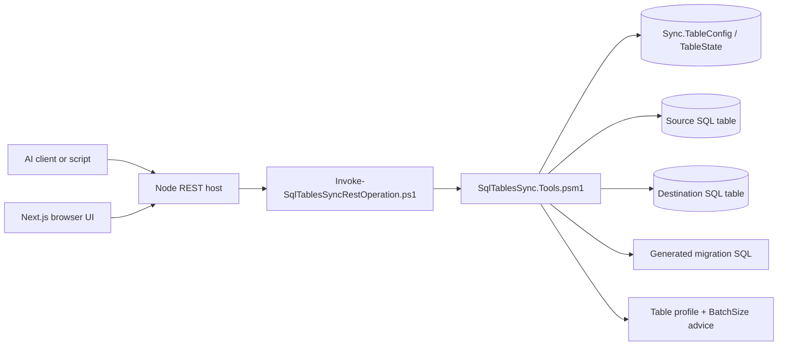

# REST API

`Start-SqlTablesSyncRestApi.ps1` now launches a Node-hosted HTTP interface for reading sync rows, creating new rows in `Sync.TableConfig`, bulk-importing rows from CSV, and generating SQL migration scripts from live SQL Server metadata.

## Purpose

- Let AI tools and other local automation inspect `Sync.TableConfig` safely without screen-scraping terminal output.
- Create one new `Sync.TableConfig` row through JSON with preview support.
- Preview or import multiple `Sync.TableConfig` rows from CSV.
- Generate migration plans for destination tables from either:
  - a live `Sync.TableConfig` row
  - two explicitly supplied SQL table endpoints
- Profile one live SQL table and return advisory `BatchSize` guidance.
- Browse live server objects by SQL Server name and database for the new Server Explorer surface.
- Search local Lucene-indexed SQL Server objects through a command-palette-oriented API fronted by the Node host.
- Load live server inventory for one selected SQL Server so the Connection Manager can validate reachability without requiring a database name.
- Reuse the same PowerShell metadata and diff logic that the MCP server uses.

## Interface summary

- Storage location for settings: process parameters only. No new database flags or config-table columns are introduced by this feature.
- Default bind address: `http://127.0.0.1:8080/`
- Local web-app error logs: `.\Logs\WebApp\client-errors-YYYY-MM-DD.jsonl`, `.\Logs\WebApp\server-errors-YYYY-MM-DD.jsonl`, and `.\Logs\WebApp\process-errors-YYYY-MM-DD.jsonl`
- Local REST trace files written by the probe script: `.\Logs\RestApiTrace\rest-api-trace-yyyyMMdd-HHmmss.json`
- Realtime notifications runtime-discovery route: `GET /api/runtime`
- Code paths affected:
  - `Start-SqlTablesSyncRestApi.ps1`
  - `Invoke-SqlTablesSyncRestOperation.ps1`
  - `Test-RestApiEndpoint.ps1`
  - `SqlTablesSync.Tools.psm1`
  - `Start-SqlTablesSyncWorkspace.ps1`
  - `webapp/server.js`
  - `webapp/notifications-server.js`
  - `webapp/app/error.js`
  - `webapp/package.json`
  - `webapp/app/layout.js`
  - `webapp/app/page.js`
  - `webapp/app/server-explorer/page.js`
  - `webapp/app/globals.css`
  - `webapp/lib/client-error-reporting.js`
  - `Get-ServerObjects.ps1`
  - `Get-TableBatchSizeRecommendation.ps1` as the CLI wrapper over the same shared analysis logic
  - `Sync-SqlObjectSearchIndex.ps1`
  - `Start-SqlObjectSearchService.ps1`
  - `object-search/SqlObjectSearch.Service/Program.cs`
  - `webapp/lib/object-search-service.js`
  - `webapp/components/object-search-palette.js`
- Operational risk:
  - the API can read sync config rows, including stored SQL-auth credentials already present in `Sync.TableConfig`
  - the create and CSV-import endpoints can insert new operational rows into `Sync.TableConfig`
  - CSV import is transactional only when `continueOnError = false`; if `continueOnError = true`, successful earlier rows remain inserted when a later row fails
  - the migration endpoints inspect live source and destination schemas
  - the batch-size endpoint inspects live table storage metadata and returns table shape details such as row count, primary key columns, and large-value-column presence
  - the server-explorer endpoint now issues live read-only SQL catalog queries against the requested server and database
  - the database-metadata endpoint now returns full live schema and table-column detail for one selected database, so copied payloads and logs can expose more structural metadata than the lighter server-explorer endpoint
- the object-search endpoints return indexed object names, definitions, columns, parameters, and dependency metadata from a local on-disk Lucene index
  - `POST /api/object-search/index/refresh` and `POST /api/object-search/index/rebuild` can now run either against configured sources or against an explicit Connection Manager saved profile supplied in the request body
  - browser and server exception logs can now capture request URLs, page URLs, user agents, stack traces, and any response body text surfaced through the UI, so operators should treat `.\Logs\WebApp\*.jsonl` as sensitive local troubleshooting data
  - keep the listener bound to loopback unless you have an explicit security design
- Safe change procedure:
  - start on `127.0.0.1`
  - validate `GET /health`
  - sign in and confirm `Connection Manager` contains a profile that matches the configured `ConfigServer` + `ConfigDatabase` pair when service-host runtime uses a non-interactive account
  - when a route fails or behaves differently than expected, run `Test-RestApiEndpoint.ps1` before changing code so you can compare the REST response with the direct PowerShell operation
  - validate `GET /api/configs/template`
  - run one `previewOnly = true` create request
  - for CSV, run a preview before the real import
  - test one non-production migration request
  - test one non-production batch-size request against a low-risk table
  - test one `POST /api/servers/explorer` request against a low-risk database and confirm the returned catalog shape matches the current UI expectations
  - test one `POST /api/databases/metadata` request against a low-risk database and confirm that the returned table and column metadata matches the current catalog
  - validate `GET /api/object-search/health`, run `POST /api/object-search/index/refresh`, then confirm `GET /api/object-search/search?q=<known object>` returns the expected object near the top
  - trigger one controlled browser-side failure, confirm a new line appears in `.\Logs\WebApp\client-errors-YYYY-MM-DD.jsonl`, and sanitize any credentials or business data before sharing the log externally
  - only widen the listener prefix after a security review
- Confidence: confirmed for script parameters, web app path, endpoints below, and the local JSONL error-log file locations; inferred that wider exposure would be high risk because credentials may be returned to callers and rows can now be inserted

## Parameters

| Parameter | Valid values | Default | Notes |
| --- | --- | --- | --- |
| `ConfigServer` | SQL Server name | none | Required. Config DB host for `Sync.TableConfig`. |
| `ConfigDatabase` | SQL database name | none | Required. Config DB name. |
| `ConfigSchema` | SQL schema name | `Sync` | Controls which config tables are queried. |
| `ConfigIntegratedSecurity` | switch | off | Uses Windows auth for the config DB connection. |
| `ConfigUsername` / `ConfigPassword` | SQL login credentials | none | Required when not using integrated security. |
| `EncryptConnection` | switch | off | Applies to config DB connection built by the API process. |
| `TrustServerCertificate` | switch | on | Applies to config DB connection built by the API process. |
| `ListenPrefix` | valid `http://` or `https://` absolute prefix understood by the Node host | `http://127.0.0.1:8080/` | Prefer loopback only. |
| `NotificationsListenPrefix` | blank or a valid `http://` or `https://` absolute prefix for the standalone notifications service | blank | Passed through so the dashboard can discover live notifications URLs at runtime through `GET /api/runtime`. |
| `MaxRequestBodyBytes` | positive integer | `262144` | Rejects oversized JSON bodies. |
| `NodeExecutable` | Node.js executable name or path | `node` | Process-level launcher setting for the Node host. |
| `DevMode` | switch | off | Forces Next.js development mode for dashboard hot reload and starts Node with `--watch-path=webapp/server.js` so the custom host auto-restarts during development without reacting to unrelated Next.js build output churn. |

Credential-resolution behavior for authenticated API requests:

- for operations that use the config DB (`/api/configs*`, migration/config helpers, SQL estate helpers), the server now checks the signed-in user's local SQLite `connectionProfiles` first
- when it finds a profile with matching `serverName` and `databaseName` for the configured `ConfigServer` and `ConfigDatabase`, it uses that profile's auth fields (`authMode`, `username`, `password`, `trustServerCertificate`, optional `encryptConnection`) for the PowerShell operation
- if no matching profile exists, it falls back to startup flags (`ConfigIntegratedSecurity`, `ConfigUsername`, `ConfigPassword`, and related switches)

## Endpoints

| Method | Path | Purpose |
| --- | --- | --- |
| `GET` | `/health` | Basic liveness plus config DB target summary. |
| `GET` | `/openapi.json` | Minimal OpenAPI document for local tooling. |
| `GET` | `/api/runtime` | Return runtime discovery details for the browser shell, including standalone notifications URLs when configured. |
| `GET` | `/` | Serves the built-in web UI. |
| `GET` | `/app` | Alias for the built-in web UI. |
| `GET` | `/api/configs` | List sync rows and latest state summary. Optional `enabledOnly=true|false`; when omitted or blank, no enabled-state filter is applied. |
| `POST` | `/api/configs` | Preview or create one sync row. |
| `GET` | `/api/configs/template` | Returns create defaults, supported pick-lists, and CSV headers from the live schema. |
| `POST` | `/api/client-errors` | Accepts same-origin browser error reports and appends them to the local `.\Logs\WebApp` JSONL files. |
| `POST` | `/api/configs/import-csv` | Preview or import multiple sync rows from CSV text. |
| `GET` | `/api/configs/{syncId}` | Return one sync row plus state columns. |
| `GET` | `/api/servers/explorer` | Return live server-object data for simple loopback queries using URL parameters. |
| `POST` | `/api/servers/explorer` | Return live server-object data from an explicit JSON connection payload. |
| `POST` | `/api/servers/discover` | Discover SQL Server instances visible on the current network. |
| `POST` | `/api/databases/metadata` | Return full live metadata for one selected database. |
| `POST` | `/api/sql-estate/overview` | Return capacity, health, database state, and SQL Agent summary for saved instance profiles. |
| `POST` | `/api/sql-agent/jobs` | Return SQL Server Agent jobs, steps, schedules, and runtime history for one instance profile. |
| `POST` | `/api/sql-agent/jobs/run` | Start one SQL Server Agent job on the selected instance. |
| `GET` | `/api/object-search/health` | Check whether the Lucene.NET sidecar is reachable. |
| `GET` | `/api/object-search/status` | Return Lucene index status plus the latest PowerShell sync status. |
| `GET` | `/api/object-search/search` | Search indexed database objects with optional filters. |
| `GET` | `/api/object-search/objects/{id}` | Return one indexed object document. |
| `POST` | `/api/object-search/index/refresh` | Run the incremental PowerShell object-search sync. |
| `POST` | `/api/object-search/index/rebuild` | Run the full PowerShell object-search rebuild. |
| `POST` | `/api/object-search/index/sync-connection` | Validate one Connection Manager saved profile payload, then run the incremental object-search sync with those explicit connection details. |
| `GET` | `/api/sql/lint/providers` | Report SQL lint providers available to the local API process (for example SQLFluff). |
| `POST` | `/api/sql/lint` | Lint SQL text using the selected provider (`sqlfluff`, `builtin`, or `auto`). |
| `POST` | `/api/migrations/from-config` | Generate destination migration from `Sync.TableConfig` by `syncId` or `syncName`. |
| `POST` | `/api/migrations/table-diff` | Generate migration by comparing two supplied SQL tables. |
| `POST` | `/api/tables/batch-size-recommendation` | Profile one supplied SQL table and return advisory `BatchSize` guidance. |

## Example

```powershell
powershell.exe -NoProfile -ExecutionPolicy Bypass -File .\Start-SqlTablesSyncRestApi.ps1 `
  -ConfigServer "NASCAR" `
  -ConfigDatabase "EPC_Imports_PCK" `
  -ConfigSchema "Sync" `
  -ConfigIntegratedSecurity `
  -TrustServerCertificate `
  -ListenPrefix "http://127.0.0.1:8080/"
```

```powershell
Invoke-RestMethod -Method Post -Uri "http://127.0.0.1:8080/api/migrations/from-config" `
  -ContentType "application/json" `
  -Body (@{
      syncName = "Aptos_style"
      includeAlterColumns = $true
      includePrimaryKey = $true
  } | ConvertTo-Json)
```

Open the web UI:

```text
http://127.0.0.1:8080/
```

Trace one route against direct PowerShell:

```powershell
$payload = @{
    serverName = "nascar"
    connection = @{
        server = "nascar"
        integratedSecurity = $true
        trustServerCertificate = $true
    }
} | ConvertTo-Json -Depth 5

powershell.exe -NoProfile -ExecutionPolicy Bypass -File .\Test-RestApiEndpoint.ps1 `
  -Operation "getServerExplorer" `
  -ApiBaseUrl "http://127.0.0.1:8080/" `
  -ConfigServer "NASCAR" `
  -ConfigDatabase "EPC_Imports_PCK" `
  -ConfigSchema "Sync" `
  -ConfigIntegratedSecurity `
  -TrustServerCertificate `
  -PayloadJson $payload `
  -WriteTraceFile `
  -IncludeLogTail
```

The built-in dashboard is now presented in a layout that closely mirrors the default TailAdmin home dashboard, then populated with SQL sync operator workflows.

Confirmed operator capabilities in the current dashboard:

- create one sync row with preview and commit actions
- create and manage reusable database connections through `Connection Manager` or the duplicate `Instance Manager`
- discover visible SQL Server instances from either connection-management page before filling the server field manually
- inspect SQL Server Agent jobs, steps, schedules, and runtime history through `Agent Manager`
- import CSV batches with template download and preview
- search and filter the current sync fleet by name, mode, enabled state, and last status
- inspect one full sync row by `SyncId`
- browse the live `Server Explorer` page by server and database and inspect database, schema, and featured-object cards from SQL Server catalog data
- manage reusable browser-stored connection profiles and optionally run a server-level connection check through the browser-based `Connection Manager` or duplicate `Instance Manager` workflow
- open two modal windows for applying a new browse target to the explorer without persisting a server registry
- generate migration SQL from an existing sync row through `POST /api/migrations/from-config`
- request advisory table batch sizing through `POST /api/tables/batch-size-recommendation`
- move through a responsive operator layout with:
  - the SQL Cockpit left sidebar, sticky top header, and browser-based SQL tooling workspace
  - home-dashboard KPI cards and white card surfaces
  - dedicated routes for overview, launchpad, connection manager, instance manager, agent manager, fleet, inspector, server explorer, schema studio, batch copilot, and bulk intake
  - a mobile card view for sync rows and a desktop grid view for the same data

Confirmed implementation note:

- the dashboard is now a Next.js app served by `webapp/server.js`
- PowerShell still executes the underlying sync-config, migration, and batch-analysis logic through `Invoke-SqlTablesSyncRestOperation.ps1`
- the HTTP route surface remains intentionally aligned with the earlier REST API paths
- confirmed: `GET /api/runtime` is additive and read-only; it only returns process-level runtime discovery data such as the configured standalone notifications listen prefix
- confirmed: the new `GET` and `POST /api/servers/explorer` routes are additive and use live read-only metadata queries only; no database config columns, flags, or runtime sync behaviors changed
- confirmed: the new `POST /api/servers/discover` route is additive and performs network instance discovery only; no database config columns, flags, or runtime sync behaviors changed
- confirmed: `POST /api/servers/discover` now tolerates SQL discovery rows that report `IsClustered` as loose boolean-like values such as `Yes`, `No`, `1`, or `0` instead of failing the whole scan with HTTP 500
- confirmed: the new `POST /api/databases/metadata` route is additive and uses live read-only metadata queries only; no database config columns, flags, or runtime sync behaviors changed
- confirmed: the new `POST /api/sql-estate/overview` route is additive and uses live read-only SQL Server instance, capacity, database-state, and Agent-summary metadata queries only; no database config columns, flags, or runtime sync behaviors changed
- confirmed: the new `POST /api/sql-agent/jobs` route is additive and uses read-only `msdb` SQL Agent metadata queries only; no database config columns, flags, or runtime sync behaviors changed
- confirmed: the new `POST /api/sql-agent/jobs/run` route is additive to SQL Cockpit config, but it is not read-only against the target SQL Server Agent; it calls `msdb.dbo.sp_start_job` and does not change SQL Cockpit database config columns, flags, or runtime sync behaviors
- confirmed: the new `POST /api/client-errors` route does not write to SQL tables or config state; it only appends local JSONL troubleshooting records under `.\Logs\WebApp`

## SQL estate overview endpoint

`POST /api/sql-estate/overview` reads estate-level health and capacity metadata for saved Instance Manager profiles.

Request body:

```json
{
  "instances": [
    {
      "profileId": "nascar",
      "profileName": "NASCAR",
      "serverName": "NASCAR",
      "integratedSecurity": true,
      "trustServerCertificate": true
    }
  ]
}
```

Interface notes:

- storage location: no SQL Cockpit database storage; the dashboard reads saved instance profiles from browser local storage key `sql-cockpit-instance-profiles`, sends them to the API, and stores the returned estate summary in browser memory only
- valid values: `instances` must contain 1 to 30 instance profiles; each profile must include a non-empty server and valid authentication fields
- default: unreachable instances are returned as critical rows instead of failing the whole response
- code paths affected: `SqlTablesSync.Tools.psm1`, `Invoke-SqlTablesSyncRestOperation.ps1`, `webapp/server.js`, `webapp/components/dashboard-client.js`, and `webapp/app/page.js`
- operational risk: read-only for SQL safety, medium for metadata exposure because instance capacity, database state, table names, approximate row counts, edition, version, local SQL Server address, port, authentication scheme, encryption state, and Agent counts can reveal operational detail
- safe change procedure: validate instance profiles in Instance Manager, test one low-risk instance first, confirm the returned server identity, then widen to more profiles

The `Instances[].Server` object includes engine identity and current-session network details such as `MachineName`, `ComputerNamePhysicalNetBios`, `ServiceName`, `AtAtServerName`, `ServerNameWithService`, `NetTransport`, `ConnectionLocalNetAddress`, `ConnectionLocalTcpPort`, `DmvLocalNetAddress`, `DmvLocalTcpPort`, `ClientNetAddress`, `ProtocolType`, `AuthScheme`, and `EncryptOption`. Each `Instances[].Databases.Items[]` row can include `TableCount` and `Tables[]` with lightweight user-table metadata. When `Tables[]` is empty, the Estate Overview UI can load table rows on demand by calling `POST /api/databases/metadata` for the selected saved instance profile and database.

## SQL Agent jobs endpoint

`POST /api/sql-agent/jobs` reads SQL Server Agent job inventory from the selected instance profile.

Request body:

```json
{
  "serverName": "NASCAR",
  "connection": {
    "server": "NASCAR",
    "database": "msdb",
    "integratedSecurity": true,
    "trustServerCertificate": true
  }
}
```

Response shape:

- `ServerName`, `DatabaseName`, and `RetrievedAtUtc`
- `Summary` with job, enabled, disabled, running, failed, and step counts
- `Jobs[]` with job status, schedule, last run, average runtime, failure count, and `Steps[]`

Operational notes:

- storage location: no SQL Cockpit persistence; data is read live from target `msdb`
- valid values: any reachable SQL Server instance profile; the route normalizes the database to `msdb`
- default: the dashboard calls this route only after the operator clicks `Refresh Jobs`
- code paths affected: `SqlTablesSync.Tools.psm1`, `Invoke-SqlTablesSyncRestOperation.ps1`, `webapp/server.js`, `webapp/components/dashboard-client.js`, and `webapp/app/agent-manager/page.js`
- operational risk: read-only for SQL safety, medium for metadata exposure because SQL Agent job and step details can reveal operational process names and command context
- safe change procedure: validate the profile in `Instance Manager`, refresh a low-risk instance first, confirm the source server in the summary, then filter before expanding jobs on sensitive instances

`POST /api/sql-agent/jobs/run` starts one SQL Agent job by `jobId` or `jobName` using `msdb.dbo.sp_start_job`.

Request body:

```json
{
  "serverName": "NASCAR",
  "jobId": "00000000-0000-0000-0000-000000000000",
  "jobName": "Nightly warehouse load",
  "connection": {
    "server": "NASCAR",
    "database": "msdb",
    "integratedSecurity": true,
    "trustServerCertificate": true
  }
}
```

Operational notes:

- storage location: no SQL Cockpit persistence; the route sends a live start request to SQL Server Agent
- valid values: a reachable saved instance profile plus a non-empty `jobId` or `jobName`
- default: the dashboard asks for browser confirmation before calling the route
- code paths affected: `SqlTablesSync.Tools.psm1`, `Invoke-SqlTablesSyncRestOperation.ps1`, `webapp/server.js`, and `webapp/components/dashboard-client.js`
- operational risk: medium, because the route starts live SQL Agent work; job steps may perform writes, file operations, notifications, or external process calls depending on the target job definition
- safe change procedure: verify the selected instance and job name, confirm the operational window, run only approved jobs, and inspect SQL Agent history after the request

## Web-app error logging

The SQL Cockpit web app now writes structured local troubleshooting records for browser and Node-host failures.

Interface notes:

- storage location:
  - browser-reported failures: `.\Logs\WebApp\client-errors-YYYY-MM-DD.jsonl`
  - request-handler failures returned by `webapp/server.js`: `.\Logs\WebApp\server-errors-YYYY-MM-DD.jsonl`
  - Node process `uncaughtException` and `unhandledRejection` events: `.\Logs\WebApp\process-errors-YYYY-MM-DD.jsonl`
- valid values:
  - one JSON document per line
  - `kind` values currently include `dashboard-error`, `window-error`, `unhandled-rejection`, `react-route-error`, `server-error`, `uncaught-exception`, and `unhandled-rejection`
  - `handled` is `true` for UI errors that were caught and shown in the dashboard, and `false` for unhandled browser exceptions
- defaults:
  - logging is enabled automatically for the local dashboard; there is no database flag or process switch to enable it
  - browser duplicate suppression keeps identical client errors from being written repeatedly within a short five-second window
- code paths affected:
  - `webapp/components/dashboard-client.js`
  - `webapp/app/error.js`
  - `webapp/lib/client-error-reporting.js`
  - `webapp/server.js`
- operational risk:
  - medium for data sensitivity, because logs can include stack traces, route URLs, user agents, and API error text returned to the browser
  - low for runtime safety, because the new path is append-only local file logging and does not alter SQL sync behavior
- safe change procedure:
  - keep the listener on loopback
  - reproduce the issue once
  - inspect the newest line in the relevant `.\Logs\WebApp` file
  - redact credentials, connection strings, and sensitive table names before sharing outside the trusted operator context
  - if log volume becomes noisy in development, restart after clearing only the specific local log file you intend to rotate
- troubleshooting notes:
  - if the dashboard shows an error message but does not crash, start with `client-errors-YYYY-MM-DD.jsonl`
  - if an API call returns HTTP 500 with an `eventId`, look for the same `eventId` in `server-errors-YYYY-MM-DD.jsonl`
  - confirmed: both unexpected Node-host exceptions and PowerShell operation envelopes with `statusCode >= 500` now receive a logged `eventId` before the response is returned to the browser
  - if the Node host exits unexpectedly, inspect `process-errors-YYYY-MM-DD.jsonl` first, then compare with the launcher stdout and stderr files under `.\Logs`
- confidence:
  - confirmed: file locations, endpoint path, and current event kinds
  - uncertain: future payload shape if additional dashboard pages start sending richer context

Create one row with preview:

```powershell
Invoke-RestMethod -Method Post -Uri "http://127.0.0.1:8080/api/configs" `
  -ContentType "application/json" `
  -Body (@{
      previewOnly = $true
      config = @{
          SyncName = "Aptos_style_preview"
          IsEnabled = $false
          SyncMode = "Incremental"
          SourceServer = "APTOSSQL01"
          SourceDatabase = "Remote_Reporting_PEA"
          SourceSchema = "dbo"
          SourceTable = "hierarchy_group"
          SourceAuthMode = "Integrated"
          DestinationServer = "DAYTONA"
          DestinationDatabase = "Reporting_PEA"
          DestinationSchema = "dbo"
          DestinationTable = "hierarchy_group"
          DestinationAuthMode = "Integrated"
          CommandTimeoutSeconds = 1800
          BatchSize = 5000
          RetryCount = 3
          RetryDelaySeconds = 10
          KeyColumnsCsv = "HierarchyGroupId"
          FullScanAllow = $true
          InsertOnly = $false
          AutoCreateDestinationTable = $false
          CreatePrimaryKeyOnAutoCreate = $false
          ValidateDestinationSchema = $true
      }
  } | ConvertTo-Json -Depth 8)
```

Bulk preview from CSV:

```powershell
$csvText = @"
SyncName,IsEnabled,SyncMode,SourceServer,SourceDatabase,SourceSchema,SourceTable,SourceAuthMode,DestinationServer,DestinationDatabase,DestinationSchema,DestinationTable,DestinationAuthMode,CommandTimeoutSeconds,BatchSize,RetryCount,RetryDelaySeconds,KeyColumnsCsv,FullScanAllow,InsertOnly,AutoCreateDestinationTable,CreatePrimaryKeyOnAutoCreate,ValidateDestinationSchema
Aptos_style_bulk_1,false,Incremental,APTOSSQL01,Remote_Reporting_PEA,dbo,hierarchy_group,Integrated,DAYTONA,Reporting_PEA,dbo,hierarchy_group,Integrated,1800,5000,3,10,HierarchyGroupId,true,false,false,false,true
"@

Invoke-RestMethod -Method Post -Uri "http://127.0.0.1:8080/api/configs/import-csv" `
  -ContentType "application/json" `
  -Body (@{
      previewOnly = $true
      continueOnError = $false
      csvText = $csvText
  } | ConvertTo-Json -Depth 4)
```

## Server Explorer endpoint

`GET /api/servers/explorer?...` and `POST /api/servers/explorer` return the live object graph used by the dashboard page and the standalone `Get-ServerObjects.ps1` script.

Interface notes:

- storage location: no database storage yet; the endpoint reads live SQL Server catalog metadata and returns it directly without persisting explorer state
- valid values:
  - `serverName`: any non-empty SQL Server name string
  - `databaseName`: any accessible database name on that server; repeat the query-string key to select multiple databases in `GET` requests
  - `databaseNames`: zero, one, or many accessible database names in `POST` requests; when omitted or empty, the endpoint returns the whole accessible server inventory
- defaults:
  - the endpoint rejects a blank or missing `serverName`
  - the `POST` endpoint rejects SQL-auth requests where `connection.integratedSecurity` is `false` and `connection.username` is blank
  - the dashboard Server Explorer page loads from saved Instance Manager profiles instead of a free-text server picker
  - when the dashboard only has a selected instance profile, it loads the available database list first and leaves the multi-select empty until the operator narrows the browse scope
- code paths affected:
  - `SqlTablesSync.Tools.psm1`
  - `Invoke-SqlTablesSyncRestOperation.ps1`
  - `webapp/server.js`
  - `webapp/components/dashboard-client.js`
  - `webapp/app/server-explorer/page.js`
  - `Get-ServerObjects.ps1`
- operational risk:
  - medium, because the endpoint now exposes live database names, schema inventory, and recently modified objects from the requested SQL Server
  - low for write safety, because the implementation uses read-only catalog queries only and does not persist a server registry
- safe change procedure:
  - save and test a low-risk Instance Manager profile first so the available-database list matches operator expectations
  - narrow to one or more low-risk databases before sharing screenshots or copied payloads outside the trusted operations context
  - keep the API listener on loopback unless you have explicitly reviewed metadata exposure expectations
  - keep saved instance profiles current because Server Explorer now uses their server, auth, and certificate settings
- confidence:
  - confirmed: current endpoint paths, required payload shape, and read-only metadata-query implementation
  - confirmed: the Node route now validates the incoming JSON payload before calling PowerShell and returns HTTP `400` with an `errors` object for missing `serverName` or incomplete SQL-auth credentials
  - confirmed: the response now includes `AvailableDatabases` alongside the filtered `Databases` collection so the dashboard can keep the selector populated after a filtered browse
  - confirmed: schema entries now include grouped object lists for tables, views, procedures, and functions so the graph view can expand each schema without extra round trips
  - confirmed: the current environment hit an SSPI-integrated-auth error when validating against `NASCAR`, so operator validation should use the same auth path you normally use for live SQL access

Example:

```powershell
Invoke-RestMethod -Method Post -Uri "http://127.0.0.1:8080/api/servers/explorer" `
  -ContentType "application/json" `
  -Body (@{
      connection = @{
          server = "NASCAR"
          integratedSecurity = $true
          trustServerCertificate = $true
      }
  } | ConvertTo-Json -Depth 5)
```

Troubleshooting:

- if `POST /api/servers/explorer` returns HTTP `400` with `{"error":"Connection validation failed."}`, correct the named fields under `errors` before retrying; current server-side checks cover `serverName` and SQL-auth `username`
- if `POST /api/servers/explorer` returns `{"error":"Argument types do not match"}`, restart the local API after updating to the version that flattens PowerShell `DataRow` values into local scalars before building the explorer response object
- confirmed: this failure came from PowerShell object construction inside `Get-StsServerObjectExplorer`, not from the REST payload shape itself
- safe recovery procedure:
  restart `Start-SqlTablesSyncRestApi.ps1` or `Start-SqlTablesSyncWorkspace.ps1`, then rerun the example request above against a low-risk server and optionally narrow to one known-accessible database in your environment
- if the REST response and direct PowerShell response differ, run `Test-RestApiEndpoint.ps1` with the same payload and the real config DB connection values used by the API host, then compare `Comparison.StatusCodesMatch`, `Comparison.BodyHashesMatch`, the returned `eventId`, and the optional `ServerErrorLogTail`

## Database metadata endpoint

`POST /api/databases/metadata` returns the full live metadata shape used by `Connection Manager`.

Interface notes:

- storage location: none. The endpoint reads one live database and returns the metadata directly without persisting server, database, or table selections.
- valid values:
  - `serverName`: any non-empty SQL Server name string
  - `databaseName`: one accessible database name on that server
  - `connection.integratedSecurity`, `connection.trustServerCertificate`, `connection.username`, and `connection.password`: same connection semantics as the other SQL-reading endpoints
- defaults:
  - the endpoint rejects a blank or missing `databaseName`
  - the `POST` endpoint also rejects a blank or missing `serverName`
  - the `POST` endpoint rejects SQL-auth requests where `connection.integratedSecurity` is `false` and `connection.username` is blank
  - the browser workflow treats each saved item as a single reusable connection and only loads metadata after the operator explicitly clicks the load button
  - the browser workflow uses the metadata response only for connection validation and summary display on the page
- code paths affected:
  - `SqlTablesSync.Tools.psm1`
  - `Invoke-SqlTablesSyncRestOperation.ps1`
  - `webapp/server.js`
  - `webapp/components/dashboard-client.js`
  - `webapp/app/connection-manager/page.js`
  - `webapp/app/instance-manager/page.js`
  - `webapp/app/sync-studio/page.js` as a legacy redirect to `/connection-manager`
- operational risk:
  - medium, because the response includes live schema names, table names, column names, type details, primary keys, row counts, and recent object metadata for the selected database
  - low for write safety, because the implementation is read-only and uses the existing create endpoint for any later insert
- safe change procedure:
  - test against a low-risk source database first
  - confirm the loaded schema and column inventory matches the current catalog before using it to build a sync row
  - keep new rows disabled until you have previewed the final create payload
  - avoid sharing raw metadata payloads outside the trusted operator context unless you have redacted business-sensitive names
- confidence:
  - confirmed: endpoint path, request shape, and read-only implementation
  - confirmed: the Node route now validates the incoming JSON payload before calling PowerShell and returns HTTP `400` with an `errors` object for missing `serverName`, missing `databaseName`, or incomplete SQL-auth credentials
  - inferred: very large databases may produce large payloads and slower UI refreshes because the endpoint intentionally loads full table-column metadata

Example:

```powershell
Invoke-RestMethod -Method Post -Uri "http://127.0.0.1:8080/api/databases/metadata" `
  -ContentType "application/json" `
  -Body (@{
      serverName = "APTOSSQL01"
      databaseName = "Remote_Reporting_PEA"
      connection = @{
          server = "APTOSSQL01"
          database = "Remote_Reporting_PEA"
          integratedSecurity = $true
          trustServerCertificate = $true
      }
  } | ConvertTo-Json -Depth 5)
```

## Create/import payload notes

- Storage location: rows are inserted into `Sync.TableConfig`. No new flags or columns are introduced.
- Valid values:
  - `SyncMode`: `Incremental` or `FullRefresh`
  - `SourceAuthMode` and `DestinationAuthMode`: `Integrated` or `SQL`
  - `WatermarkType`: `bigint`, `int`, `datetime`, `datetime2`, `uniqueidentifier`, `nvarchar`, `varchar`, `nchar`, `char`, `decimal`, `numeric`, `money`, `smallmoney`, `smallint`, `tinyint`
- Defaults returned by `GET /api/configs/template`:
  - `IsEnabled = false`
  - `SyncMode = Incremental`
  - `CommandTimeoutSeconds = 1800`
  - `BatchSize = 5000`
  - `RetryCount = 3`
  - `RetryDelaySeconds = 10`
  - `FullScanAllow = true`
  - `InsertOnly = false`
  - `AutoCreateDestinationTable = false`
  - `CreatePrimaryKeyOnAutoCreate = false`
  - `ValidateDestinationSchema = true`
- Code paths affected:
  - `SqlTablesSync.Tools.psm1`
  - `Start-SqlTablesSyncRestApi.ps1`
  - `Invoke-SqlTablesSyncRestOperation.ps1`
  - `webapp/server.js`
  - `webapp/app/page.js`
- Operational risk:
  - bad rows can alter runtime behavior immediately if `IsEnabled = true`
  - SQL-auth passwords are accepted by the write endpoints and stored in the same config table as the CLI
  - `continueOnError = true` allows partial success during bulk import
- Safe change procedure:
  - preview first
  - keep `IsEnabled = false` for new rows
  - import with `continueOnError = false` unless you explicitly want partial success
  - review inserted rows before the first controlled run
- Confidence:
  - confirmed: endpoint shapes, defaults, validation rules, and CSV-header behavior
  - inferred: operators will usually want `continueOnError = false` because partial bulk success can complicate rollback

## Batch-size endpoint

`POST /api/tables/batch-size-recommendation` mirrors the shared logic behind `Get-TableBatchSizeRecommendation.ps1`.

Request body:

```json
{
  "connection": {
    "server": "DAYTONA",
    "database": "Reporting_PEA",
    "integratedSecurity": true,
    "trustServerCertificate": true
  },
  "schema": "dbo",
  "table": "tbl_ReportingBaseData_001"
}
```

Supported connection fields:

| Field | Required | Meaning |
| --- | --- | --- |
| `server` | yes | SQL Server host or instance name. |
| `database` | yes | Database containing the table to profile. |
| `integratedSecurity` | no | `true` for Windows auth. Defaults to `false`. |
| `authMode` | no | Optional compatibility field. `Integrated` implies Windows auth if the shared module reads it downstream. |
| `username` | no | SQL login username when not using integrated security. |
| `password` | no | SQL login password when not using integrated security. |
| `encryptConnection` | no | Whether to request SQL encryption. Defaults to `false`. |
| `trustServerCertificate` | no | Whether to trust the server certificate. Defaults to `true`. |

Example call:

```powershell
Invoke-RestMethod -Method Post -Uri "http://127.0.0.1:8080/api/tables/batch-size-recommendation" `
  -ContentType "application/json" `
  -Body (@{
      connection = @{
          server = "DAYTONA"
          database = "Reporting_PEA"
          integratedSecurity = $true
          trustServerCertificate = $true
      }
      schema = "dbo"
      table = "tbl_ReportingBaseData_001"
  } | ConvertTo-Json -Depth 5)
```

Response shape:

| Field | Meaning |
| --- | --- |
| `Server`, `Database`, `Schema`, `Table` | Table endpoint that was profiled. |
| `RowCount` | Approximate base-table row count from SQL Server DMVs. |
| `ColumnCount` | Number of columns returned by catalog inspection. |
| `PrimaryKeyName`, `PrimaryKeyColumns` | Detected primary key metadata. |
| `NonClusteredIndexCount` | Count of non-clustered indexes seen during profiling. |
| `AverageRowBytes` | Advisory average row width used for recommendation logic. |
| `AverageRowBytesSource` | Which measurement source won: physical stats, allocation stats, or schema estimate. |
| `BaseUsedBytes`, `BaseReservedBytes` | Base-table storage footprint. |
| `TotalUsedBytes`, `TotalReservedBytes` | Storage footprint including indexes. |
| `HasLargeValueColumns`, `LargeValueColumns` | Whether LOB-style columns were detected. |
| `RecommendedBatchSize` | Balanced advisory `BatchSize`. |
| `ConservativeBatchSize`, `AggressiveBatchSize` | Lower and upper advisory range. |
| `EstimatedBatchBytes` | Approximate payload size of the balanced batch. |
| `RecommendationConfidence` | `medium` or `low` depending on how much the logic had to infer. |
| `RecommendationNotes` | Operator-facing caveats and tuning notes. |

Interpretation notes:

- This is advisory, not a guarantee of best throughput.
- The endpoint cannot see destination log pressure, concurrent workload, or network conditions.
- Validate any `BatchSize` change with one controlled run before raising it further.

## Flow




