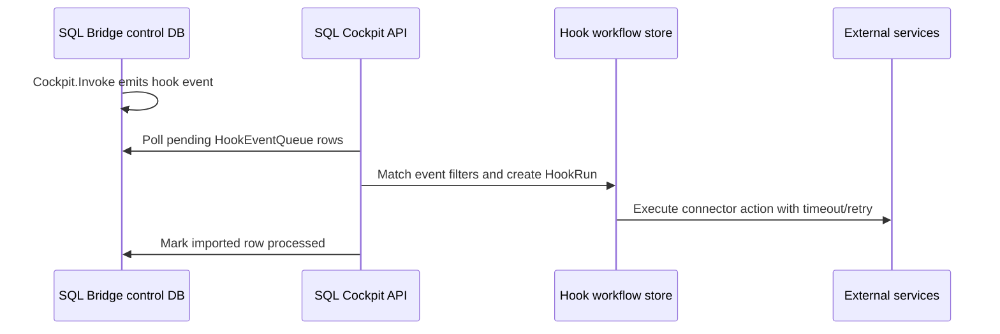

# SQL Bridge Hooks

SQL Bridge hooks provide async low-code workflows for SQL Bridge events. SQL Server writes events to `Cockpit.HookEventQueue`; the SQL Cockpit API imports pending events, evaluates enabled workflows, and records redacted app-side hook runs.

## Runtime Flow

## Storage

| Surface | Location | Notes |
| --- | --- | --- |
| SQL event outbox | SQL Bridge control database, `Cockpit.HookEventQueue` | Durable event queue for SQL-originated events. |
| SQL delivery audit | SQL Bridge control database, `Cockpit.HookDeliveryLog` | SQL-visible delivery/run summary table. |
| Workflow definitions | local SQLite `data/sql-cockpit/sql-cockpit-local.sqlite` | `HookWorkflow`, `HookWorkflowVersion`, `HookRun`, `HookRunStep`. |
| Connectors | local SQLite `HookConnector` | Supports user and workspace scopes. Secrets are write-only. |
| Poll interval | `SQL_COCKPIT_HOOK_SCHEDULER_POLL_MS` | Defaults to 15000 ms and is clamped to 5-300 seconds. |

## Connector Delivery

Each hook step runs from the SQL Cockpit API process. `timeoutSeconds` defaults to 30 seconds and `retryCount` controls retry attempts. Run history stores redacted response details.

| Connector | Required fields | Result |
| --- | --- | --- |
| `slack`, `teams` | `secret.webhookUrl` or `config.webhookUrl` | Sends webhook text. |
| `discord` | `secret.webhookUrl` or `config.webhookUrl` | Sends webhook content. |
| `webhook`, `http` | `config.url` or `secret.webhookUrl`; optional method, headers, body | Sends a JSON event payload. HTTPS is required except localhost. |
| `email` | SendGrid `secret.apiKey`, `config.to`, `config.from`, or a generic `config.url` provider | Sends a plain-text alert. |
| `jira` | `config.baseUrl`, `config.projectKey`, `secret.email`, `secret.apiToken` | Creates a Jira issue. |
| `servicenow` | `config.baseUrl`, plus bearer token or username/password | Creates a ServiceNow incident. |
| `github` | `config.owner`, `config.repo`, `secret.token` | Creates a GitHub issue. |
| `pagerduty` | `secret.routingKey` | Sends an Events API v2 alert. |

Message templates can reference event payload fields with `{{field.path}}`.

## REST Routes

Routes are exposed in `GET /openapi.json` and `/api-docs` under SQL Bridge:

- `GET/POST /api/sql-bridge/hooks`
- `PUT/POST/DELETE /api/sql-bridge/hooks/{id}`
- `POST /api/sql-bridge/hooks/{id}/test`
- `POST /api/sql-bridge/hooks/{id}/enable`
- `POST /api/sql-bridge/hooks/{id}/disable`
- `GET /api/sql-bridge/hooks/{id}/runs`
- `GET /api/sql-bridge/hooks/runs`
- `GET /api/sql-bridge/hooks/runs/{id}`
- `GET /api/sql-bridge/hooks/events`
- `POST /api/sql-bridge/hooks/trigger`
- `GET/POST /api/sql-bridge/hooks/connectors`
- `PUT/POST/DELETE /api/sql-bridge/hooks/connectors/{id}`

## Permissions

- `sqlBridge.hooks.view`
- `sqlBridge.hooks.edit`
- `sqlBridge.hooks.trigger`
- `sqlBridge.hooks.connectors.manage`
- `sqlBridge.hooks.runs.view`

## Safe Test Procedure

Create a disabled connector and disabled workflow from `/sql-bridge/hooks`, run the workflow **Test** action, inspect recent hook runs, then enable only after the external target has been verified in a non-production channel or project.

Operational risk: medium to high depending on the connector. Slack/Teams/webhooks can disclose operational context, and PagerDuty/ServiceNow/Jira/GitHub actions can create noisy or production-visible records. Outbound calls originate from the SQL Cockpit API host, so network allow-lists and proxy rules must permit the chosen service endpoints.
