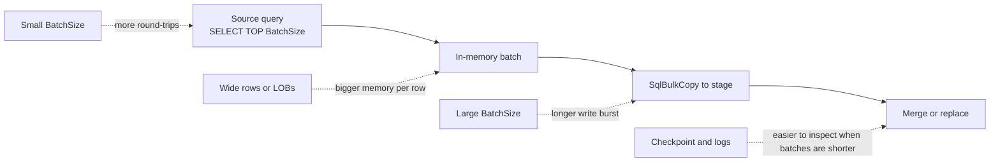
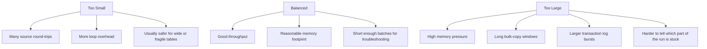

# Batch Size Caveats

Use this page when you need to explain why `BatchSize` is not just a performance knob.

In this repo, `BatchSize` affects both:

- source reads through `SELECT TOP (BatchSize)`
- destination writes through `SqlBulkCopy.BatchSize`

That means one number changes:

- how many rows are held in memory in each batch
- how long one batch can run before the next checkpoint decision
- how much write pressure one bulk-copy burst puts on the destination
- how much pain one bad batch can cause before the run moves on

## Visual explainer

The important trade-off is:

- smaller batches reduce blast radius per batch but increase overhead
- larger batches reduce loop overhead but increase memory, log, and latency risk

## Three operating zones

## What changes the safe range

`BatchSize` is sensitive to more than row count.

### 1. Row width

Narrow rows can often tolerate larger batches.

Wide rows:

- use more memory per row in the in-process batch
- increase copy time per batch
- can make a reasonable-looking row count behave like a huge payload

Practical effect:

- `BatchSize=20000` may be fine for a narrow fact-like table
- the same value may be risky for a wide reporting table

### 2. Large-value columns

Columns like `varchar(max)`, `nvarchar(max)`, `varbinary(max)`, `xml`, `text`, `ntext`, and `image` deserve extra caution.

Why:

- one unusually large row can distort the whole batch
- memory spikes become less predictable
- bulk-copy time becomes more bursty

Practical effect:

- if LOB-style columns exist, start near the conservative end of the recommended range

### 3. Destination write path

Even when source reads are fast, the destination may become the limiting factor.

Watch for:

- transaction log growth
- long bulk-copy waits
- tempdb pressure
- downstream merge or replace work taking much longer after a large batch lands

Practical effect:

- a source-friendly `BatchSize` may still be too large for the destination

### 4. Sync mode

`Incremental` and `FullRefresh` do not stress the system in exactly the same way.

Incremental caveats:

- smaller batches can make checkpoint movement and troubleshooting easier
- very large batches can make one incremental cycle feel stalled

Full refresh caveats:

- larger batches may still be acceptable for narrow snapshot data
- but wide rows or LOBs can make stage loading and replacement steps much more painful

### 5. Filters and column selection

The actual payload depends on more than the base table.

Review:

- `SourceWhereClause`
- `ColumnsCsv`
- `ExcludeColumnsCsv`

Practical effect:

- one sync row may safely use a larger `BatchSize` than another sync row pointing at the same base table because the selected columns or filter shape are different

## Symptom guide

| Symptom | Possible meaning | Common response |
| --- | --- | --- |
| Many very short batches and long total runtime | `BatchSize` may be too small | Increase gradually if memory and destination pressure are healthy. |
| Long pauses on one batch | `BatchSize` may be too large for row width or destination write speed | Lower `BatchSize` and retest. |
| Memory spikes in the PowerShell process | Rows may be wide or contain LOBs | Lower `BatchSize`; inspect row width and selected columns. |
| Destination log growth or heavy write bursts | Bulk-copy chunks may be too large | Lower `BatchSize` or reduce concurrency elsewhere. |
| Hard-to-read logs with very infrequent progress | One batch is doing too much work | Lower `BatchSize` so each loop completes faster. |
| Current batch size looks smaller than guidance but the run is stable | Environment may be intentionally conservative | Keep it if protection matters more than raw throughput. |

## Safe tuning pattern

1. Profile the source table with `Get-TableBatchSizeRecommendation.ps1` or the API/MCP equivalents.
2. Treat the recommended value as a starting point, not a rule.
3. If the table is wide or has large-value columns, start near the conservative value.
4. Change only `BatchSize`.
5. Run one controlled test.
6. Review runtime duration, memory pressure, row counts, and destination write behavior.
7. Increase gradually only if the run is healthy.

## What this guidance can and cannot know

Confirmed:

- `BatchSize` is used by both source reads and bulk copy in this repo
- table metadata can reveal row width signals, key structure, storage footprint, and large-value columns

Inferred:

- the tooling cannot see every real production bottleneck ahead of time
- network latency, concurrent workload, destination log contention, and unusual row-size skew can still invalidate a seemingly good recommendation

Operational risk:

- low risk from reading the guidance itself
- high risk if operators raise `BatchSize` aggressively on production tables without a controlled validation run
