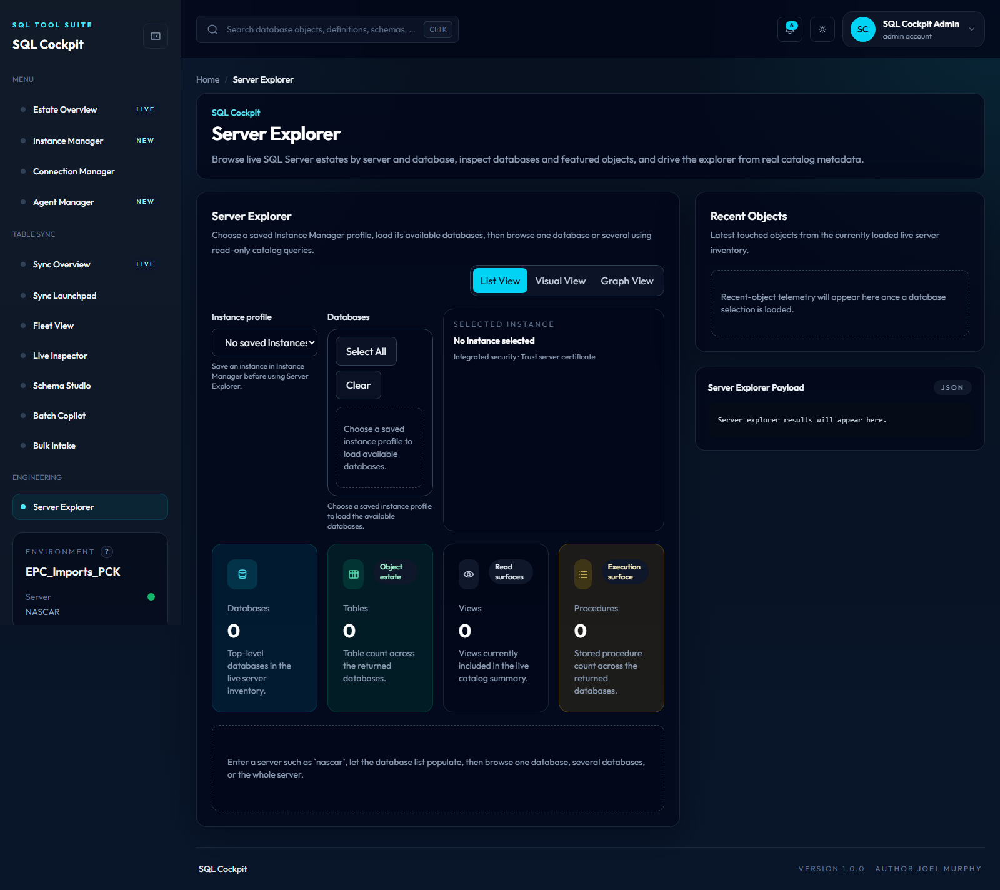

# Common Tasks

## Run one sync manually

```powershell
powershell.exe -NoProfile -ExecutionPolicy Bypass -File .\Sync-ConfiguredSqlTable.ps1 `
  -ConfigServer "NASCAR" `
  -ConfigDatabase "EPC_Imports_PCK" `
  -ConfigSchema "Sync" `
  -SyncName "Aptos_style" `
  -ConfigIntegratedSecurity `
  -TrustServerCertificate
```

## Regenerate documentation

```powershell
cd docs
python scripts/generate_config_docs.py
mkdocs build --strict
```

## Start the docs server

```powershell
powershell.exe -NoProfile -ExecutionPolicy Bypass -File .\Start-SqlTablesSyncDocsServer.ps1 `
  -ListenPrefix "http://127.0.0.1:8000/"
```

Open:

```text
http://127.0.0.1:8000/
```

Operational notes:

- confirmed: if MkDocs is available, the script uses `mkdocs serve`, so edits under `docs/` reload in the browser.
- confirmed: if MkDocs is unavailable, the script serves the generated `site/` folder over HTTP so Material search still works.
- confirmed: no database config tables or runtime sync flags are read or changed by this script.
- operational risk: low, because it only exposes local documentation files. Keep the listener on loopback unless you explicitly want other machines to reach the docs.

## Start the docs server and API workspace

```powershell
powershell.exe -NoProfile -ExecutionPolicy Bypass -File .\Start-SqlTablesSyncWorkspace.ps1 `
  -ConfigServer "NASCAR" `
  -ConfigDatabase "EPC_Imports_PCK" `
  -ConfigSchema "Sync" `
  -ConfigIntegratedSecurity `
  -TrustServerCertificate `
  -DocsListenPrefix "http://127.0.0.1:8000/" `
  -ApiListenPrefix "http://127.0.0.1:8080/"
```

This starts:

- the docs site at `http://127.0.0.1:8000/`
- the REST API at `http://127.0.0.1:8080/health`
- the built-in SQL Cockpit web app at `http://127.0.0.1:8080/`

Operational notes:

- storage location for settings: launcher parameters only. No new database config table columns or runtime flags are introduced.
- confirmed: the dashboard is served by a Node process launched through `Start-SqlTablesSyncRestApi.ps1`, not by a PowerShell `HttpListener`.
- confirmed: all `Docs*` switches are optional; the workspace launcher can start with only the required config-database arguments plus defaults for docs hosting.
- confirmed: the launcher writes one stdout log and one stderr log per child process under `.\Logs`.
- confirmed: the workspace launcher now polls the docs URL, `GET /health`, and the dashboard root until they respond or the child process exits, instead of relying on one fixed post-start delay.
- confirmed: the readiness polling now treats a successful HTTP response as the source of truth and no longer fails early just because the wrapper process changes state during dev-mode startup handoff.
- confirmed: when the Node or docs child process exits early, the launcher writes the tail of the child stdout or stderr log into the console summary so startup failures are visible without opening the log files first.
- confirmed: when you keep the default loopback ports and Windows has reserved one of them, the launcher now moves to the next available port automatically and prints the final URLs it chose.
- confirmed: if you explicitly pass `-ApiListenPrefix` or `-DocsListenPrefix`, the launcher treats that as operator intent and fails fast instead of silently changing the requested port.
- operational risk: medium if you point the API at the wrong config database, because the web app and write endpoints can create rows in `Sync.TableConfig`.
- safe change procedure: start on loopback, wait for the readiness summary to report success, note any auto-selected replacement ports, validate the docs URL, validate `GET /health`, open the web app, and keep new rows disabled until you have reviewed them.

## Start the local REST API

```powershell
Push-Location .\webapp
npm install
Pop-Location

powershell.exe -NoProfile -ExecutionPolicy Bypass -File .\Start-SqlTablesSyncRestApi.ps1 `
  -ConfigServer "NASCAR" `
  -ConfigDatabase "EPC_Imports_PCK" `
  -ConfigSchema "Sync" `
  -ConfigIntegratedSecurity `
  -TrustServerCertificate `
  -ListenPrefix "http://127.0.0.1:8080/"
```

Then validate:

```powershell
Invoke-RestMethod -Uri "http://127.0.0.1:8080/health"
```

Open the built-in dashboard:

```text
http://127.0.0.1:8080/
```

Use it when you want to:

- create one sync row with a preview step
- create and manage reusable server-level instance profiles through `Instance Manager`
- create and manage reusable database connections through `Connection Manager`
- discover visible SQL Server instances from the same connection-management page when you do not already know the host name
- download a CSV template from the live schema
- preview a bulk CSV import before inserting rows
- review the current sync list after inserts
- filter the fleet by mode, enabled state, and last status
- inspect one sync row in full detail
- browse a live SQL Server inventory by server and database through `Server Explorer`
- define server connections, save them for reuse in the browser, and run a connection check from a selected connection when needed
- shape and review the add-server modal workflow that applies a browse target without persisting a registry
- generate migration SQL from an existing sync row
- run advisory table batch analysis from the same browser surface
- operate from the SQL Cockpit workspace, which keeps the sidebar, KPI cards, inspector, and fleet selection usable on desktop and mobile-sized windows

## Start the dashboard in development watch mode

Use this when you want CSS and JavaScript changes to auto-reload and the custom Node host to auto-restart in development without rerunning the PowerShell launcher.

From the web app folder:

```powershell
cd .\webapp
npm run dev -- --configServer "NASCAR" --configDatabase "EPC_Imports_PCK" --configSchema "Sync" --configIntegratedSecurity --trustServerCertificate
```

Or through the repository launcher:

```powershell
powershell.exe -NoProfile -ExecutionPolicy Bypass -File .\Start-SqlTablesSyncRestApi.ps1 `
  -ConfigServer "NASCAR" `
  -ConfigDatabase "EPC_Imports_PCK" `
  -ConfigSchema "Sync" `
  -ConfigIntegratedSecurity `
  -TrustServerCertificate `
  -DevMode
```

Workspace launcher equivalent:

```powershell
powershell.exe -NoProfile -ExecutionPolicy Bypass -File .\Start-SqlTablesSyncWorkspace.ps1 `
  -ConfigServer "NASCAR" `
  -ConfigDatabase "EPC_Imports_PCK" `
  -ConfigSchema "Sync" `
  -ConfigIntegratedSecurity `
  -TrustServerCertificate `
  -DevMode
```

Development mode notes:

- confirmed: `-DevMode` forces the Node host into Next.js development mode even when `.next/BUILD_ID` exists.
- confirmed: starting `Start-SqlTablesSyncRestApi.ps1` or `Start-SqlTablesSyncWorkspace.ps1` without `-DevMode` now prints a warning when `webapp/.next/BUILD_ID` exists, because frontend CSS and JavaScript edits will not auto-appear in the browser in that mode.
- confirmed: CSS and JavaScript edits in `webapp/` will hot-reload through the existing dashboard server process.
- confirmed: `Start-SqlTablesSyncRestApi.ps1 -DevMode` now launches Node with `--watch-path` scoped to `webapp/server.js`, so custom-host edits restart the API process without letting unrelated Next.js dev file churn repeatedly restart the listener.
- confirmed: REST API routes still run through `Invoke-SqlTablesSyncRestOperation.ps1`; only the Next.js rendering mode changes.
- confirmed: PowerShell-side files such as `Invoke-SqlTablesSyncRestOperation.ps1` and `SqlTablesSync.Tools.psm1` are loaded per request, so route-handler behavior changes there normally do not need a Node restart.
- confirmed: `Start-SqlTablesSyncWorkspace.ps1` keeps the child docs/API PowerShell windows visible in development while their stdout and stderr continue to be redirected into `.\Logs`.
- future implementation note: keep those child windows visible in development so operators can identify and close the docs/API processes intentionally. For production-mode hosting, prefer a non-interactive model that hides child windows entirely and runs the API/docs under a service manager, scheduled task, IIS, or another background host.
- confirmed: `Start-SqlTablesSyncRestApi.ps1 -DevMode` now writes a lock file at `webapp/.sql-cockpit-dev-lock.json` while the dev server is active and removes it when the process exits cleanly.
- confirmed: `npm run build` now clears stale `.next` output before `next build`, but no longer uses the previous dev-lock guard or the `SQL_COCKPIT_ALLOW_BUILD_WITH_DEV_SERVER` override path.
- safe change procedure: still stop active `npm run dev` sessions before production builds to avoid confusion about which runtime instance you are validating.
- operational risk: development mode is slower than production mode and should not be your default for normal operator use.

Call the batch-size endpoint:

```powershell
Invoke-RestMethod -Method Post -Uri "http://127.0.0.1:8080/api/tables/batch-size-recommendation" `
  -ContentType "application/json" `
  -Body (@{
      connection = @{
          server = "DAYTONA"
          database = "Reporting_PEA"
          integratedSecurity = $true
          trustServerCertificate = $true
      }
      schema = "dbo"
      table = "tbl_ReportingBaseData_001"
  } | ConvertTo-Json -Depth 5)
```

## Browse live server objects by server and one or more databases

```powershell
powershell.exe -NoProfile -ExecutionPolicy Bypass -File .\Get-ServerObjects.ps1 `
  -ServerName "nascar" `
  -IntegratedSecurity `
  -TrustServerCertificate `
  -AsJson
```

Or through the REST API:

```powershell
Invoke-RestMethod -Method Post -Uri "http://127.0.0.1:8080/api/servers/explorer" `
  -ContentType "application/json" `
  -Body (@{
      connection = @{
          server = "nascar"
          integratedSecurity = $true
          trustServerCertificate = $true
      }
  } | ConvertTo-Json -Depth 5)
```

Operational notes:

- storage location: none yet. Both the script and endpoint return live SQL Server catalog metadata and do not persist explorer state.
- valid values:
  - any non-empty `ServerName` or `serverName`
  - one accessible database name
  - multiple accessible database names through repeated `databaseName` query keys or the `databaseNames` JSON array
- defaults:
  - the script and endpoint require a server
  - the dashboard Server Explorer page loads from saved Instance Manager profiles
  - the first saved instance profile is selected when Server Explorer opens without a route target
  - choosing an instance profile refreshes the available database checkbox list using that profile's authentication and certificate settings
  - changing the checkbox selection is what triggers the live explorer query
  - the dashboard page opens Server Explorer in `list` view by default and lets the operator switch to `visual` or `graph` views without changing the underlying target
- code paths affected: `Get-ServerObjects.ps1`, `SqlTablesSync.Tools.psm1`, `Invoke-SqlTablesSyncRestOperation.ps1`, `webapp/server.js`, `webapp/app/server-explorer/page.js`, and `webapp/components/dashboard-client.js`.
- operational risk: medium, because live database names, schema counts, and recent object metadata are now exposed through the local API. The implementation is still read-only.
- safe change procedure: validate the response against a low-risk server first, confirm the database picker populates with the expected online databases, then browse one or more low-risk databases while keeping the API on loopback.

## Trace one REST API endpoint against direct PowerShell

Use this when you need to decide whether a failure is in the Node host, the HTTP route surface, or the underlying PowerShell operation.

```powershell
$payload = @{
    serverName = "nascar"
    connection = @{
        server = "nascar"
        integratedSecurity = $true
        trustServerCertificate = $true
    }
} | ConvertTo-Json -Depth 5

powershell.exe -NoProfile -ExecutionPolicy Bypass -File .\Test-RestApiEndpoint.ps1 `
  -Operation "getServerExplorer" `
  -ApiBaseUrl "http://127.0.0.1:8080/" `
  -ConfigServer "NASCAR" `
  -ConfigDatabase "EPC_Imports_PCK" `
  -ConfigSchema "Sync" `
  -ConfigIntegratedSecurity `
  -TrustServerCertificate `
  -PayloadJson $payload `
  -WriteTraceFile `
  -IncludeLogTail
```

Operational notes:

- storage location: the script does not write to SQL. When `-WriteTraceFile` is used it writes one JSON file under `.\Logs\RestApiTrace\rest-api-trace-yyyyMMdd-HHmmss.json`.
- valid values:
  - `Operation`: `health`, `openapi`, `getConfigs`, `getConfigTemplate`, `createConfig`, `importConfigsFromCsv`, `getConfigById`, `getServerExplorer`, `migrationFromConfig`, `migrationTableDiff`, or `batchSizeRecommendation`
  - `PayloadJson` or `PayloadPath`: valid JSON for the selected operation
  - `Route`: optional explicit route override when the default route mapping is not enough
- defaults:
  - `ApiBaseUrl`: `http://127.0.0.1:8080/`
  - `Operation`: `health`
  - `ConfigSchema`: `Sync`
  - `TrustServerCertificate`: on
- code paths affected: `Test-RestApiEndpoint.ps1`, `Invoke-SqlTablesSyncRestOperation.ps1`, `webapp/server.js`, and `.\Logs\WebApp\server-errors-YYYY-MM-DD.jsonl` when the traced API call returns a server-side error
- operational risk:
  - medium for data sensitivity, because the trace output can include API response bodies, local `eventId` values, and a tail of the local server-error log
  - low for runtime safety, because the script only calls the already-existing API route and direct operation; it does not add new runtime behavior
- safe change procedure:
  - keep the listener on loopback
- start with a low-risk operation such as `health` or `getServerExplorer` against a low-risk server in your environment
  - use the real config DB connection values for the direct PowerShell comparison, otherwise the REST and direct results may differ for environmental reasons instead of code reasons
  - redact credentials, connection strings, and business-sensitive object names before sharing trace files outside the trusted support context

## Start the MCP server

```powershell
powershell.exe -NoProfile -ExecutionPolicy Bypass -File .\scripts\runtime\Start-SqlTablesSyncMcpServer.ps1 `
  -ApiBaseUrl "http://127.0.0.1:8080" `
  -ApiUsername "operator" `
  -ApiPassword "replace-me"
```

Use this from an MCP-compatible client when you want AI tooling to inspect config rows and generate migrations.

The MCP server also exposes `get_table_batch_size_recommendation` for table-level `BatchSize` analysis.

## Export a live TableConfig diagram

```powershell
powershell.exe -NoProfile -ExecutionPolicy Bypass -File .\Export-TableConfigDiagram.ps1 `
  -ConfigServer "NASCAR" `
  -ConfigDatabase "EPC_Imports_PCK" `
  -ConfigSchema "Sync" `
  -ConfigIntegratedSecurity `
  -TrustServerCertificate
```

This reads `Sync.TableConfig`, writes a DOT file, and renders a Graphviz diagram when `dot` is available.

## Find sync rows by server or table name

```powershell
powershell.exe -NoProfile -ExecutionPolicy Bypass -File .\Find-TableSyncConfig.ps1 `
  -ConfigServer "NASCAR" `
  -ConfigDatabase "EPC_Imports_PCK" `
  -ConfigSchema "Sync" `
  -ConfigIntegratedSecurity `
  -TrustServerCertificate `
  -MatchOn Source `
  -ServerPattern "APTOS*" `
  -TablePattern "hierarchy_group"
```

Add `-IncludeBatchRecommendation` when you also want the script to inspect the live source table and compare the current `BatchSize` with an advisory range.

## Profile one table and estimate a BatchSize

```powershell
powershell.exe -NoProfile -ExecutionPolicy Bypass -File .\Get-TableBatchSizeRecommendation.ps1 `
  -Server "APTOSSQL01" `
  -Database "Remote_Reporting_PEA" `
  -Schema "dbo" `
  -Table "hierarchy_group" `
  -IntegratedSecurity `
  -TrustServerCertificate
```

This reads table metadata only and returns row-count, storage, row-width, and advisory `BatchSize` guidance.

For the operator trade-offs behind those numbers, see [Batch Size Caveats](batch-size-caveats.md).

## Summarize local run logs

```powershell
powershell.exe -NoProfile -ExecutionPolicy Bypass -File .\Analyze-RunLogs.ps1 `
  -FailedOnly `
  -Latest 20
```

This reads local `.log` files under `.\Logs` and summarizes status, duration, row counts, and the primary failure message.

## Review the latest runtime state

Check:

- the `Sync.TableConfig` row
- the matching `Sync.TableState` row
- the latest `Sync.RunLog` row
- recent `Sync.RunActionLog` rows for that `SyncId`

## Create new sync rows from the web app

Recommended operator flow:

1. Start the REST API on loopback.
2. Open `http://127.0.0.1:8080/`.
3. Use `Instance Manager` for server-level instance profiles, `Connection Manager` for database-level connection profiles under those instances, or `Sync Launchpad` for direct form entry.
4. In either manager, optionally run `Discover SQL Servers` to find visible instances on the network, then save a low-risk profile and run `Test Connection` to confirm it reaches the expected SQL Server and exposes the expected inventory.
5. Use `Agent Manager` when you need a read-only SQL Server Agent overview for a saved instance profile.
6. Use `Preview single row` or `Preview` for CSV first.
7. If needed, inspect an existing row before creating a related one.
8. Keep new rows disabled unless you are ready for a controlled first run.
9. Refresh the fleet view and verify the new rows.
10. Optionally generate migration SQL or batch-size advice before scheduling the first live run.

Dashboard navigation notes:

- `Estate Overview` is now the home page and loads saved Instance Manager profiles through `POST /api/sql-estate/overview` to summarize SQL Server capacity, health, database state, SQL Agent risk, and current-session network identity.
- `Sync Overview` is the table-sync landing page under the dedicated `Table Sync` navigation section. It mirrors the previous sync-oriented overview so operators can enter the sync tool without starting from the broader SQL estate home.
- the shell now presents SQL Cockpit as a browser-based SQL tooling suite with a left navigation rail, sticky top header, search bar, and white metric cards.
- the web app now includes a persistent theme toggle in the top header. It stores the operator preference in browser local storage under `sql-cockpit-theme`.
- the header notification bell now merges dashboard-derived notifications with a live standalone notifications service, while still storing read or archived state in browser local storage.
- `Ctrl+K` now opens a mocked command palette that groups quick links, syncs, tables, and servers from the current in-memory dashboard data. This is a UI-only search layer for now and is intended to be replaced by a backend search API later.
- `Server Explorer` now lets you browse live server-object metadata from saved Instance Manager profiles, then narrow the browse scope by database.
- `Instance Manager` and `Connection Manager` now use separate browser-local vaults. Instance Manager stores server-level instance profiles first; Connection Manager stores database-level connection profiles under those instances.
- `Agent Manager` now lets you choose a saved instance profile, query live SQL Server Agent metadata from `msdb`, sort the jobs table, filter by status or enabled state, and expand jobs to review step-level runtime context.
- `Sync Overview`, `Sync Launchpad`, `Fleet View`, `Live Inspector`, `Schema Studio`, `Batch Copilot`, and `Bulk Intake` now live together under the `Table Sync` navigation section.
- `Server Explorer` stays in the `Engineering` section.
- `Fleet View` still shows stacked sync cards on smaller viewports and a full table on wider viewports.
- `Live Inspector` can be opened directly with a selected `syncId` from Fleet View or Overview attention items.

Operational notes:

- The `SQL Cockpit` web app writes to `Sync.TableConfig` through the local REST API.
- theme setting:
  storage location: browser local storage key `sql-cockpit-theme`
  valid values: `dark`, `light`
  default: `dark` when there is no stored preference
  code paths affected: `webapp/components/dashboard-client.js`, `webapp/components/dashboard-shell.js`, `webapp/app/globals.css`, and shared UI primitives under `webapp/components/`
  operational risk: low, because the preference is client-side only and does not affect API requests, sync execution, or database configuration
  safe change procedure: use the header toggle to switch theme, then refresh the page to confirm the preference persists for that browser profile
- command palette:
  storage location: browser memory only for the current page session
  valid values: query text entered by the operator; no persisted setting yet
  default: closed, with an empty query until `Ctrl+K` or the header search trigger opens it
  code paths affected: `webapp/components/dashboard-client.js` and `webapp/components/dashboard-shell.js`
  operational risk: low, because the current implementation only filters already-loaded client data and route links; it does not change database state or call a new backend API
  safe change procedure: open the palette with `Ctrl+K`, verify that sync, table, and server results match the currently loaded fleet data, then use the selected result to route into Fleet or Inspector views
- notifications center:
  storage location: browser local storage key `sql-cockpit-notifications-state`
  valid values: JSON object with `readById`, `archivedById`, `lastOpenedAt`, and `browserNotificationsEnabled`; items can come from dashboard-derived mock state and from the standalone notifications service over HTTP plus WebSocket, and native browser alerts can be toggled on for newly arriving realtime events when the browser grants permission
  default: bell menu is closed on page load; notifications start unread unless the browser already has saved state for the matching notification id; archived items stay hidden in that browser profile until storage is cleared or the ids change; `browserNotificationsEnabled` starts `false`; if the standalone service is offline the bell still falls back to the dashboard-derived items
  code paths affected: `webapp/components/dashboard-client.js`, `webapp/components/dashboard-shell.js`, `webapp/components/notifications-data.js`, `webapp/components/notifications-menu.js`, `webapp/server.js`, `webapp/notifications-server.js`, `Start-SqlTablesSyncNotificationsServer.ps1`, `Send-SqlCockpitNotification.ps1`, `Send-TestSqlCockpitNotifications.ps1`, `webapp/scripts/send-notification.js`, and `webapp/scripts/send-test-notifications.js`
  operational risk: low for SQL safety because the feature does not touch SQL tables or sync execution; medium for operator trust because any local caller that can reach the loopback listener can publish an item that appears in the bell menu; medium for local privacy because enabled browser alerts can surface message text outside the active tab
  safe change procedure: start the workspace or the standalone notifications server, verify `GET /health` on the notifications listener, send one harmless test notification from PowerShell, confirm the bell unread badge increments without a page refresh, test `Mark all read`, test one archive action, refresh the page, and confirm the browser preserves the chosen read or archived state for the same notification ids; if native alerts are needed, enable them from the bell menu, approve the browser permission prompt, background the tab, and then send another low-risk test notification
- standalone notifications service:
  storage location: process parameters plus an in-memory recent-notification buffer inside the Node service; no SQL or config-table storage is used
  valid values: `ListenPrefix` as an absolute HTTP or HTTPS prefix, `MaxRequestBodyBytes` as a positive integer, and notification payload fields `id`, `dedupeKey`, `title`, `message`, `severity`, `category`, `actionLabel`, `actionHref`, `source`, `pinned`, `createdAt`, `updatedAt`, `statusText`, `progressPercent`, and `metadata`
  default: `Start-SqlTablesSyncWorkspace.ps1` starts the service automatically on `http://127.0.0.1:8090/` unless that port is unavailable, in which case the workspace launcher probes a nearby free port and passes the resolved value to both the service and dashboard runtime discovery route
  code paths affected: `Start-SqlTablesSyncWorkspace.ps1`, `Start-SqlTablesSyncRestApi.ps1`, `Start-SqlTablesSyncNotificationsServer.ps1`, `Send-SqlCockpitNotification.ps1`, `Send-ProgressSqlCockpitNotificationDemo.ps1`, `webapp/notifications-server.js`, `webapp/server.js`, `webapp/scripts/send-notification.js`, `webapp/components/notifications-data.js`, and `webapp/components/notifications-menu.js`
  operational risk: medium, because the service trusts any local caller that can reach the listener and keeps only an in-memory buffer, so a restart clears the recent history and an exposed listener would allow spoofed operator messages
  safe change procedure: keep the listener on loopback, verify the resolved notifications URL in the workspace startup log, send a low-risk test item first, prefer a stable `dedupeKey` for long-running job updates, verify that repeated progress updates replace one bell item instead of creating many, avoid sensitive payload text, and do not widen exposure beyond the local machine until an authentication design exists
- server explorer:
  storage location: saved instance profiles come from browser local storage key `sql-cockpit-instance-profiles`; live response objects are read from SQL Server system catalog views on demand
  valid values: any saved Instance Manager profile plus zero, one, or many accessible database names; view mode is `list`, `visual`, or `graph`
  default: dashboard selects the first saved instance profile when Server Explorer opens without a route target; selecting a profile loads the available database list using the profile's auth and certificate settings; changing the database selection triggers the live explorer query; Server Explorer opens in `list` view
  code paths affected: `Get-ServerObjects.ps1`, `SqlTablesSync.Tools.psm1`, `Invoke-SqlTablesSyncRestOperation.ps1`, `webapp/server.js`, `webapp/app/server-explorer/page.js`, and `webapp/components/dashboard-client.js`
  operational risk: medium, because the current implementation returns live metadata about database names, schema shape, and recently modified objects; it remains read-only and does not persist registration changes
  safe change procedure: save and test a low-risk instance profile first, confirm the selector shows the expected profile and online databases, then browse one or more low-risk databases and verify the featured-object cards render as expected before widening the target scope
- connection manager:
  storage location: browser local storage key `sql-cockpit-database-connection-profiles` for saved database connection profiles; live response objects are read on demand through `POST /api/servers/explorer`; discovery results live in browser memory for the current page session
  valid values: any non-empty server and database name that the current auth mode can reach; auth mode per saved connection is `Integrated` or `SQL`; saving a profile also requires a non-empty connection name; SQL-auth drafts require a non-empty `username`; `password` remains optional and, when present, is still stored in browser local storage with the saved profile
  default: the connection form starts blank; the inline validation state stays clear until the operator attempts to save or test an incomplete draft; blocked save attempts now raise a toast explaining that the highlighted fields need attention; successful saves now raise a toast only after the browser local-storage write completes; the network discovery scan runs only after the operator clicks `Discover SQL Servers`; the server check runs only after the operator clicks `Test Connection`, and that test now raises a success toast with the visible database count or an error toast with the failure message; when the operator clicks `Edit` on a saved profile or `Use Server` on a discovered server, the page navigates smoothly to the named `#connection-draft-panel` target, applies the selected values into the editor, and briefly highlights the panel so the landing point is obvious; saved profiles persist only in the current browser profile on the current machine, and the page now waits for the first browser-storage read before writing profile changes back so a reload does not clear saved connections
  code paths affected: `SqlTablesSync.Tools.psm1`, `Invoke-SqlTablesSyncRestOperation.ps1`, `webapp/server.js`, `webapp/components/dashboard-client.js`, `webapp/app/connection-manager/page.js`, `webapp/app/instance-manager/page.js`, and `webapp/app/sync-studio/page.js`
  operational risk: medium to high, because saved profiles now live in browser local storage and SQL-auth credentials can be stored there if the operator chooses to save them; the server check exposes live server inventory detail for the selected SQL Server; the discovery scan is broader because it asks SQL Browser-visible hosts on the network to identify themselves; the new inline validation lowers operator error risk for incomplete drafts and the Node API now rejects incomplete test payloads before the request reaches PowerShell, but neither change reduces the sensitivity of stored credentials; low for write safety because the connection-management workflow itself remains read-only
  safe change procedure: save low-risk connections first, prefer integrated auth where possible, avoid storing SQL passwords unless the local browser profile is trusted, keep connection names unique enough that operators can tell production and non-production profiles apart, use `Edit` or `Use Server` to repopulate the draft panel before editing or testing it, run the discovery scan only on trusted networks, and run the server check only against low-risk SQL Servers when validating a new connection
- instance manager:
  storage location: browser local storage key `sql-cockpit-instance-profiles` for saved instance profiles; legacy shared key `sql-cockpit-connection-profiles` is treated as a one-time compatibility source when the instance vault is empty
  valid values: any non-empty server name that the current auth mode can reach; auth mode per saved instance is `Integrated` or `SQL`; saving a profile also requires a non-empty instance name; SQL-auth drafts require a non-empty `username`; `password` remains optional and, when present, is stored in browser local storage with the saved profile
  default: the instance form starts blank; profiles persist only in the current browser profile on the current machine; Agent Manager selects the first saved instance profile when available
  code paths affected: `webapp/components/dashboard-client.js`, `webapp/app/instance-manager/page.js`, `webapp/app/agent-manager/page.js`, `webapp/server.js`, `Invoke-SqlTablesSyncRestOperation.ps1`, and `SqlTablesSync.Tools.psm1`
  operational risk: medium to high for credential handling because SQL-auth credentials can be stored in browser local storage; medium for metadata exposure because Agent Manager and object-search sync use these profiles to read server-wide metadata
  safe change procedure: validate the instance profile before using Agent Manager, prefer integrated auth, avoid storing SQL passwords on shared machines, and keep database-level profiles in Connection Manager instead of using instance profiles as source or destination database records
- SQL Agent Manager:
  storage location: selected instance profile comes from browser local storage key `sql-cockpit-instance-profiles`; live job data is read on demand from the target instance `msdb` and is not persisted by SQL Cockpit
  valid values: any saved instance profile with a reachable server; auth mode is inherited from the saved profile as `Integrated` or `SQL`; table filters include free text, enabled state, and job status
  default: selects the first saved profile when available; no Agent inventory is loaded until the operator clicks `Refresh Jobs`; sort starts by job name ascending
  code paths affected: `SqlTablesSync.Tools.psm1`, `Invoke-SqlTablesSyncRestOperation.ps1`, `webapp/server.js`, `webapp/components/dashboard-client.js`, `webapp/app/agent-manager/page.js`, and `docs/operations/sql-agent-manager.md`
  operational risk: low for write safety because it is read-only; medium for metadata exposure because job names, schedules, messages, and step context can reveal operational details; medium for credential handling when the selected saved profile contains SQL-auth credentials in browser local storage
  safe change procedure: validate the saved profile in `Instance Manager`, prefer integrated auth, refresh a low-risk instance first, verify the source server and job count, then filter before expanding job steps on sensitive instances
- Estate Overview:
  storage location: selected instance profiles come from browser local storage key `sql-cockpit-instance-profiles`; live estate data is read on demand from target SQL Server `master` and `msdb` metadata and is not persisted by SQL Cockpit
  valid values: 1 to 30 saved instance profiles with reachable server names; auth mode is inherited from each saved profile as `Integrated` or `SQL`
  default: the home page auto-refreshes once when saved instance profiles are available; failed instance reads return critical rows instead of failing the entire response
  code paths affected: `SqlTablesSync.Tools.psm1`, `Invoke-SqlTablesSyncRestOperation.ps1`, `webapp/server.js`, `webapp/components/dashboard-client.js`, `webapp/app/page.js`, and `docs/operations/estate-overview.md`
  operational risk: low for write safety because it is read-only; medium for metadata exposure because capacity, database state, edition, version, and Agent counts can reveal estate details
  safe change procedure: validate instances in `Instance Manager`, refresh one low-risk instance first, verify reported server identity and capacity, then add broader estate profiles
- confirmed: this rebrand changes product naming only. No database config-table columns, runtime flags, valid values, defaults, or code paths for sync execution changed.
- confirmed: the inline connection-draft validation is browser-only. No database config-table columns, runtime flags, REST payload shapes, or sync-engine code paths changed.
- confirmed: backend validation now also rejects incomplete `POST /api/servers/explorer` and `POST /api/databases/metadata` request bodies before PowerShell runs. Saved-profile naming rules remain browser-only because connection profiles are still stored only in browser local storage.
- confirmed: saved Connection Manager profiles now live in the database-connection vault, while Instance Manager profiles live in the instance vault used by Agent Manager.
- confirmed: Connection Manager now shows toast feedback for save validation failures, successful browser-local-storage writes after the save completes, and both successful and failed `Test Connection` attempts.
- confirmed: Instance Manager now opens a centered Object Search Sync progress modal when `Sync Server To Search` starts, keeps progress and streamed logs out of the draft panel, scopes streamed log lines to the current operation id, shows elapsed time plus separate progress cards for overall server-wide progress and current-database progress, auto-scrolls the streamed log to the newest line, and minimizes an active sync into a floating progress control that also shows elapsed time.
- confirmed: Object Search Sync completion and failure now create local bell notifications and native browser notifications when browser notification permission and the bell menu browser-alert setting allow them.
- confirmed: full Object Search Sync runs now write a durable spool/checkpoint after document build, resume upload/delete offsets on rerun, upsert new documents before deleting stale ids, split failed `400 Bad Request` upload batches into smaller batches, and log single-document failures with document identity for recovery.
- operational risk: low to medium, because the connection-management UI changes are presentation-only, but the object-search sync engine now changes full-sync ordering to preserve old searchable content until new uploads succeed; failed uploads can leave old stale entries visible rather than emptying the index scope.
- No new config-table columns or flags are introduced by this workflow.
- Bulk import is transactional when `Continue on error` is off.
- Bulk import can leave partial success behind when `Continue on error` is on.
- The dashboard also calls the existing migration and batch-analysis endpoints, so double-check the selected sync or manual table target before running advisory tools.
- The dashboard now requires the installed `webapp/node_modules` runtime, because Node hosts both the UI and the REST routes.
- The workspace launcher now starts a third local process for realtime notifications and prints its URL plus log files alongside the docs and REST API processes.

## Pause a sync

Set `Sync.TableConfig.IsEnabled = 0`.

Notes:

- Safe for future runs.
- Does not stop an already-running process.

## Resume a sync

Set `Sync.TableConfig.IsEnabled = 1` and run one controlled test execution.

## Reseed incremental state

Only do this deliberately. Typical actions are:

- set `LastWatermarkValue`
- set `LastKeyValue`
- or clear them both

Always capture the previous values first and understand the effect of `FullScanAllow`.

## Server Explorer Screenshot

<!-- AUTO_SCREENSHOT:server-explorer:START -->


*Use Server Explorer when you want to browse a live server and narrow the scope by one or more databases.*
<!-- AUTO_SCREENSHOT:server-explorer:END -->

