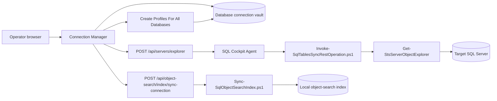

# Connection Manager

Connection Manager is the SQL Cockpit page for creating, testing, editing, deleting, and reusing database-level connection profiles.

Use it after defining the SQL Server in Instance Manager when you want to inherit server-level credentials. A database connection can also carry its own explicit SQL authentication details when that database login is different from the instance profile.

Connection Manager stores profile metadata in the active SQL Cockpit workspace profile store. It does not write connection profiles into the `Sync.TableConfig` table, and it does not store plaintext SQL passwords in profile metadata.

## What It Does

Connection Manager can:

- save named SQL Server database connection profiles
- bulk create one database connection profile per visible database on a selected instance profile
- test a connection against a live SQL Server instance
- show visible database, table, view, and procedure counts
- edit or delete saved profiles
- manage saved database connection profiles from a compact table
- keep database-level connection profiles separate from instance-level profiles

## How It Works



The browser reads and writes saved profile metadata from the workspace profile store. When you test a connection, the dashboard sends either a saved profile id or the current connection draft to the API route `POST /api/servers/explorer`. The API leases the metadata probe to the paired SQL Cockpit Agent, and the agent invokes PowerShell inside the customer network. SQL-auth passwords are written through the Agent profile-secret path and resolved from the agent-side credential store. Integrated-auth tests run as the `SqlCockpit.Agent` Windows service identity; see [SQL Cockpit Agent Identity And Windows Authentication](sql-cockpit-agent-identity.md).

A SQL-auth connection profile is usable only after the Agent has successfully stored its password and the profile metadata contains a `secretRef`. When creating or editing a SQL-auth profile, SQL Cockpit blocks saves that have no existing Agent secret and no newly entered password. Leaving `Password` blank on an existing SQL-auth profile keeps the current stored secret; if the profile shows no stored password, enter the password again.

When a SQL password is entered in the web dashboard, SQL Cockpit tests the exact draft connection through the paired Agent before it saves the profile or writes the Agent secret. A failed login, unreachable server, or unavailable database blocks the save. SQL Cockpit Service Control provides the same lane-aware feedback in `View -> Connections` and `View -> Remote Connections`: `Test Credentials` calls the selected lane Agent local-control pipe, so the check uses the same Agent identity and customer-network reachability as SQL Bridge.

For older SQL Server instances, set `Encryption` to `Disabled / older SQL Server compatibility`. `Trust server certificate` only affects certificate validation after encryption is attempted; it does not prevent older servers from failing during SSL/login negotiation. The saved profile value is `encryptConnection: false`, and SQL Bridge carries that value into the Agent/PowerShell bridge connection.

SQL Bridge access is a separate per-profile policy. Service Control `View -> Connections` shows the selected lane's profile source of truth: environment, workspace, profile user, bridge config path, and profile store path. A saved connection must have `sqlBridgeEnabled: true` before `Cockpit.FetchRemote` or `Cockpit.FetchRemoteIncremental` can use it. The `sqlBridgePrincipals` list contains exact SQL login or database user names allowed to use that profile from T-SQL; use `*` only for an intentional all-bridge-users exception.

SQL connection compatibility options are stored inside the profile JSON as `encryptConnection` and `trustServerCertificate`. `encryptConnection: false` is the compatibility default for older SQL Server estates; set it to `true` only when the target SQL Server requires encrypted connections. Operational risk is medium: enabling encryption can break older SQL Server instances that cannot complete the newer TLS/login handshake, while disabling encryption may be unacceptable in environments that require encrypted SQL traffic. Change one non-production profile first, use Service Control `Test Credentials`, then run a small SQL Bridge call before using the profile for large transfers.

The Agent resolver checks SQL Bridge profile policy before reading any Agent-side profile secret. A caller with `EXECUTE` on `Cockpit.FetchRemote` cannot use an arbitrary `@SourceProfileId` unless the selected profile allows that SQL caller. Prefer `@SourceProfileId` over `@SourceProfileName` in stored jobs because ids are stable and names can become ambiguous in team workspaces.

The dashboard Agent Required flow is fail-closed for live database workflows. All signed-in users can call the reduced `GET /api/saas/agents/status` endpoint. It reports only effective Agent availability and does not expose agent ids, invite codes, tokens, capabilities, or management metadata. If Agent status is `none`, `offline`, or unavailable, live SQL Cockpit pages redirect to `/agent-required`; only an `online` Agent with a fresh heartbeat is treated as usable. The stale heartbeat threshold defaults to five minutes and can be changed with `SQL_COCKPIT_AGENT_STATUS_STALE_MS`.

Server-wide object-search indexing belongs to Instance Manager because it operates against an instance profile rather than one database connection.

## Prerequisites

Before using Connection Manager:

1. Start SQL Cockpit.
2. Open `Instance Manager`.
3. Save and test the SQL Server instance that owns the database.
4. Confirm the local API process is running.
5. Confirm the SQL Cockpit Agent service is running and paired.
6. Confirm the SQL Server instance is reachable from the agent host.
7. Prefer integrated security only when the agent service identity is the Windows account that should access SQL Server.
8. Use SQL authentication only when it is approved for the environment.

The selected login needs enough metadata visibility to read databases and catalog objects. SQL Server may hide objects from accounts without permission.

## Open The Page

1. Start the workspace from PowerShell.

    ```powershell
    powershell.exe -NoProfile -ExecutionPolicy Bypass -File .\Start-SqlTablesSyncWorkspace.ps1 `
      -ConfigServer "YOUR_SQL_SERVER" `
      -ConfigDatabase "YOUR_CONFIG_DATABASE" `
      -ConfigSchema "Sync" `
      -ConfigIntegratedSecurity `
      -TrustServerCertificate
    ```

2. Open the SQL Cockpit dashboard URL printed by the launcher.
3. Select `Connection Manager` from the left navigation.

The left navigation expands `Connection Manager` into separate compact routes:

- `Connection Manager` opens `/connection-manager` and renders the saved profile table.
- `New Connection` opens `/connection-manager/new` and renders the draft, database refresh, bulk-create, and test controls.
- `Edit Connection` opens `/connection-manager/edit?profileId=<id>` from a saved row and renders the selected profile in the edit draft.
- `Share Connections` opens `/connection-manager/share` and renders the workspace sharing board.

Each route renders only the content needed for that workflow. The split routes reuse the same Connection Manager state, workspace profile store, validation, confirmation, and API calls.

Connection Manager also renders the same hierarchy as a compact inline page menu above the content. This keeps `Saved Connections`, `New Connection`, and `Share Connections` visible in focus mode, where the expanded left-navigation children are intentionally hidden.

## Save A Connection

1. Enter a connection name.
2. Select the owning instance profile, or enter the server and authentication details directly.
3. Wait for the database list to load, click `Refresh Databases`, or type the database name directly.
4. Confirm the database name.
5. Click `Save Connection`.

For SQL authentication, saving runs an Agent-routed credential test before the profile becomes trusted. Use `Test Connection` in the web dashboard, or `Test Credentials` in SQL Cockpit Service Control, when you want to validate credentials without saving.

If an older SQL Server target fails with an SSL provider/login-handshake error, set `Encryption` to `Disabled / older SQL Server compatibility`, leave `Trust server certificate` enabled, and test again.

If the profile will be used from SQL Bridge, open the same lane in Service Control, enable SQL Bridge access, and add the exact SQL login or database user that will run the bridge stored procedure. The web dashboard preserves these policy fields when editing a profile, but Service Control is the operator UI for changing them.

Saved profiles stay in the Connection Manager vault. They do not appear in Instance Manager or SQL Agent Manager.

## Bulk Create Connections

Use `Create Profiles For All Databases` when you want to seed Connection Manager profiles for every database visible to the selected Instance Manager profile.

The bulk action:

- uses the selected instance profile for server, authentication, and certificate settings
- uses the current visible database list, loading it first when needed
- creates one Connection Manager profile per visible database
- skips any existing profile with the same inherited server and database name
- stores the created profiles in the active workspace profile store

Profile names are generated as `<instance profile name> / <database name>`. Review the generated list after creation and delete profiles for databases that should not be reused by operators.

## Test A Connection

Click `Test Connection` to call `POST /api/servers/explorer`.

A successful test shows:

- server name returned by SQL Server
- number of visible databases
- number of visible tables
- number of visible views
- number of visible procedures

Use this check before relying on the profile in source or destination database workflows.

## Manage Saved Profiles

Saved database connection profiles appear in a compact table so larger workspaces use less vertical space. The table shows the profile name, inherited server, selected database, authentication mode, and profile actions.

Use:

| Action | Use |
| --- | --- |
| Edit | Opens `/connection-manager/edit?profileId=<id>` and loads the saved profile back into the editor. |
| Delete | Removes the profile from browser local storage. |

Deleting a profile removes it from the Connection Manager vault in the current workspace. Instance Manager profiles are unaffected.

Instance Manager keeps the larger profile card layout because those records include server-wide search sync controls and live sync status.

## Fields

| Field | Valid values | Default |
| --- | --- | --- |
| Connection name | Any non-empty label meaningful to operators | Blank |
| Instance profile | Optional saved Instance Manager profile visible in the current workspace | Blank |
| Server | SQL Server name, named instance, or host accepted by the Agent host | Blank |
| Authentication | `Integrated` or `SQL` | `Integrated` |
| Username | SQL login when authentication is `SQL` | Blank |
| Password | SQL password, written through the Agent credential store | Blank |
| Database | SQL Server database name | Blank |

When an Instance profile is selected, Connection Manager copies its server and credential settings into the draft. Operators can still change the database connection to use explicit SQL credentials when that database needs a different login.

## Operational Interface

- storage location:
  - saved profiles: browser local storage key `sql-cockpit-database-connection-profiles`
  - instance profiles: not stored here; Instance Manager uses `sql-cockpit-instance-profiles`
  - live metadata test results: browser memory only
- valid values:
  - instance profile: any saved Instance Manager profile visible in the current workspace
  - inherited server: any SQL Server name accepted by the local SQL client provider on the selected instance profile
  - database: any database name accepted by the target SQL Server
- defaults:
  - no instance profile is selected in a blank draft
  - authentication and TLS settings inherit from the selected instance profile
  - saved profile table defaults to empty in a new browser profile
- code paths affected:
  - `webapp/components/dashboard-client.js`
  - `webapp/app/connection-manager/page.js`
  - `webapp/app/connection-manager/new/page.js`
  - `webapp/app/connection-manager/share/page.js`
  - `webapp/server.js`
  - `Invoke-SqlTablesSyncRestOperation.ps1`
  - `SqlTablesSync.Tools.psm1`
- operational risk:
  - SQL authentication passwords may be stored in the selected Instance Manager profile when that instance uses SQL auth
  - metadata checks can reveal database and object names to anyone with browser access
  - bulk creation can quickly make many database names visible in the active workspace profile list
  - table layout is a presentation-only change; it does not change who can read, edit, share, or delete profiles
- safe change procedure:
  1. Save and test the owning instance in Instance Manager first.
  2. Use `Refresh Databases` and confirm the database list is expected.
  3. Test one low-risk profile before using it in downstream workflows.
  4. Prefer a least-privilege login with metadata visibility appropriate for the task.
  5. Avoid saving SQL-auth instance passwords on shared workstations.
  6. After bulk creation, delete profiles for databases that should not be reused.
  7. Delete stale profiles after a migration, role change, or credential rotation.
  8. Restart SQL Cockpit after API or PowerShell route changes.

## Troubleshooting

### Test Connection Fails

Check:

1. The selected instance profile points at the correct server.
2. The SQL Cockpit Agent host can reach the SQL Server network endpoint.
3. Integrated security is running under the expected Windows account.
4. SQL-auth credentials are current.
5. `Trust server certificate` matches your TLS policy.
6. The browser network response for `POST /api/servers/explorer`.

### Saved Profiles Are Missing

Saved profiles are browser-local. They do not follow you to another browser, another Windows profile, or another machine.

Check whether browser data was cleared, a private browsing window is being used, or the page was opened under a different host name or port.

### SQL Agent Manager Has No Instances

Open Instance Manager and save an instance profile. SQL Agent Manager reads `sql-cockpit-instance-profiles`, not the Connection Manager vault.

## Screenshot

<!-- AUTO_SCREENSHOT:connection-manager:START -->


*Connection Manager stores reusable database-level connection profiles and validates them against live SQL Server metadata.*
<!-- AUTO_SCREENSHOT:connection-manager:END -->
