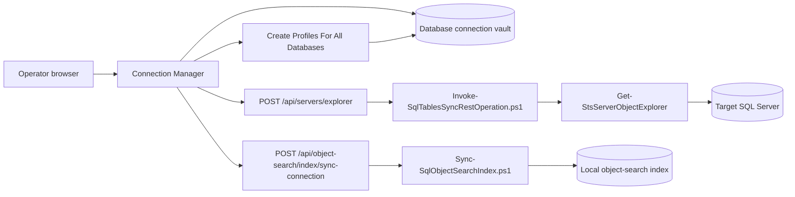
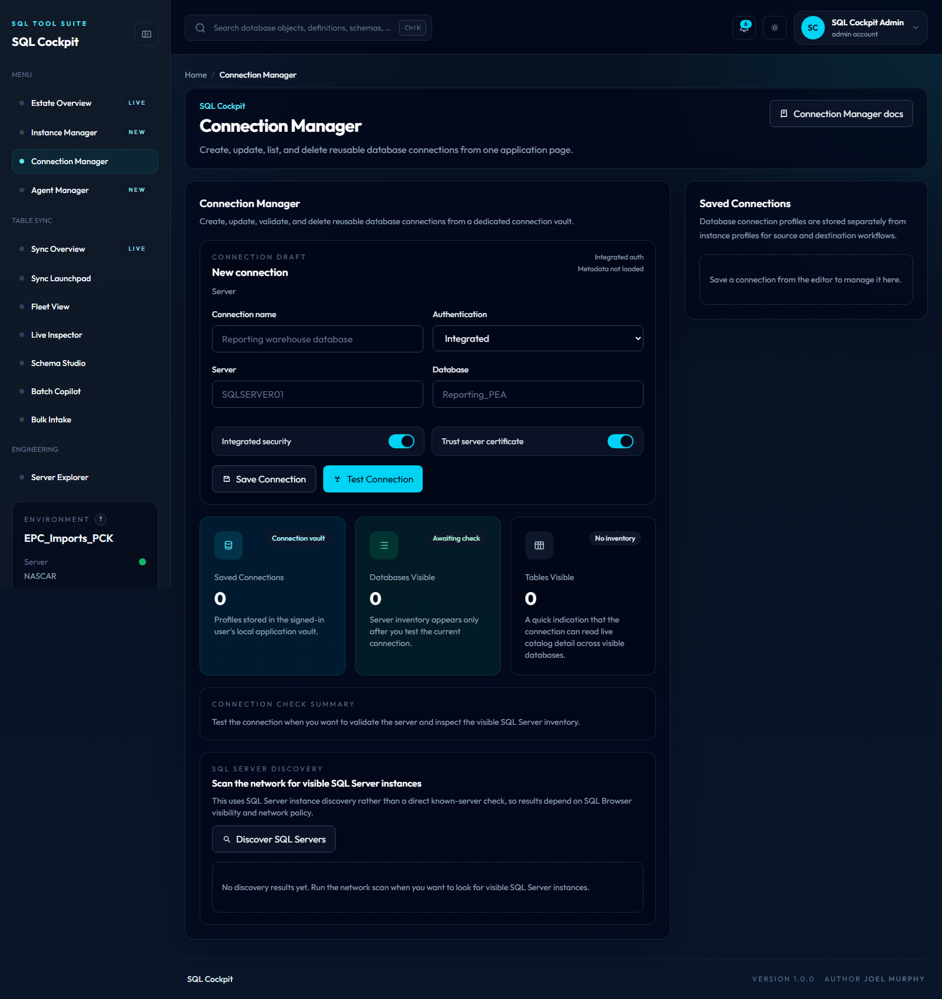

# Connection Manager

Connection Manager is the SQL Cockpit page for creating, testing, editing, deleting, and reusing database-level connection profiles.

Use it after defining the SQL Server in Instance Manager. A database connection belongs to an instance, so the normal workflow is: save the instance first, then add one or more database connections for that instance.

Connection Manager stores profiles in a dedicated browser-local connection vault. It does not write connection profiles into the `Sync.TableConfig` table, it does not share its vault with Instance Manager, and it is not a central encrypted credential vault.

## What It Does

Connection Manager can:

- save named SQL Server database connection profiles
- bulk create one database connection profile per visible database on a selected instance profile
- test a connection against a live SQL Server instance
- show visible database, table, view, and procedure counts
- edit or delete saved profiles
- manage saved database connection profiles from a compact table
- keep database-level connection profiles separate from instance-level profiles

## How It Works



The browser reads and writes saved profiles from local storage key `sql-cockpit-database-connection-profiles`. When you test a connection, the dashboard sends the selected profile to the local API route `POST /api/servers/explorer`. The Node API invokes PowerShell, and PowerShell queries SQL Server catalog metadata.

Server-wide object-search indexing belongs to Instance Manager because it operates against an instance profile rather than one database connection.

## Prerequisites

Before using Connection Manager:

1. Start SQL Cockpit.
2. Open `Instance Manager`.
3. Save and test the SQL Server instance that owns the database.
4. Confirm the local API process is running.
5. Confirm the SQL Server instance is reachable from the API host.
6. Prefer integrated security when the workspace process runs as the same Windows account that should access SQL Server.
7. Use SQL authentication only when it is approved for the environment.

The selected login needs enough metadata visibility to read databases and catalog objects. SQL Server may hide objects from accounts without permission.

## Open The Page

1. Start the workspace from PowerShell.

    ```powershell
    powershell.exe -NoProfile -ExecutionPolicy Bypass -File .\Start-SqlTablesSyncWorkspace.ps1 `
      -ConfigServer "YOUR_SQL_SERVER" `
      -ConfigDatabase "YOUR_CONFIG_DATABASE" `
      -ConfigSchema "Sync" `
      -ConfigIntegratedSecurity `
      -TrustServerCertificate
    ```

2. Open the SQL Cockpit dashboard URL printed by the launcher.
3. Select `Connection Manager` from the left navigation.

## Save A Connection

1. Enter a connection name.
2. Select the owning instance profile.
3. Wait for the database list to load, or click `Refresh Databases`.
4. Select the database name.
5. Click `Save Connection`.

Saved profiles stay in the Connection Manager vault. They do not appear in Instance Manager or SQL Agent Manager.

## Bulk Create Connections

Use `Create Profiles For All Databases` when you want to seed Connection Manager profiles for every database visible to the selected Instance Manager profile.

The bulk action:

- uses the selected instance profile for server, authentication, and certificate settings
- uses the current visible database list, loading it first when needed
- creates one Connection Manager profile per visible database
- skips any existing profile with the same inherited server and database name
- stores the created profiles in the active workspace profile store

Profile names are generated as `<instance profile name> / <database name>`. Review the generated list after creation and delete profiles for databases that should not be reused by operators.

## Test A Connection

Click `Test Connection` to call `POST /api/servers/explorer`.

A successful test shows:

- server name returned by SQL Server
- number of visible databases
- number of visible tables
- number of visible views
- number of visible procedures

Use this check before relying on the profile in source or destination database workflows.

## Manage Saved Profiles

Saved database connection profiles appear in a compact table so larger workspaces use less vertical space. The table shows the profile name, inherited server, selected database, authentication mode, and profile actions.

Use:

| Action | Use |
| --- | --- |
| Edit | Loads the saved profile back into the editor. |
| Delete | Removes the profile from browser local storage. |

Deleting a profile removes it from the Connection Manager vault in the current browser. Instance Manager profiles are unaffected.

Instance Manager keeps the larger profile card layout because those records include server-wide search sync controls and live sync status.

## Fields

| Field | Valid values | Default |
| --- | --- | --- |
| Connection name | Any non-empty label meaningful to operators | Blank |
| Instance profile | Any saved Instance Manager profile visible in the current workspace | Blank |
| Database | SQL Server database name | Blank |

Connection Manager no longer shows a separate server, authentication, integrated-security, or trust-certificate field. Those values are inherited from the selected Instance Manager profile.

## Operational Interface

- storage location:
  - saved profiles: browser local storage key `sql-cockpit-database-connection-profiles`
  - instance profiles: not stored here; Instance Manager uses `sql-cockpit-instance-profiles`
  - live metadata test results: browser memory only
- valid values:
  - instance profile: any saved Instance Manager profile visible in the current workspace
  - inherited server: any SQL Server name accepted by the local SQL client provider on the selected instance profile
  - database: any database name accepted by the target SQL Server
- defaults:
  - no instance profile is selected in a blank draft
  - authentication and TLS settings inherit from the selected instance profile
  - saved profile table defaults to empty in a new browser profile
- code paths affected:
  - `webapp/components/dashboard-client.js`
  - `webapp/app/connection-manager/page.js`
  - `webapp/server.js`
  - `Invoke-SqlTablesSyncRestOperation.ps1`
  - `SqlTablesSync.Tools.psm1`
- operational risk:
  - SQL authentication passwords may be stored in the selected Instance Manager profile when that instance uses SQL auth
  - metadata checks can reveal database and object names to anyone with browser access
  - bulk creation can quickly make many database names visible in the active workspace profile list
  - table layout is a presentation-only change; it does not change who can read, edit, share, or delete profiles
- safe change procedure:
  1. Save and test the owning instance in Instance Manager first.
  2. Use `Refresh Databases` and confirm the database list is expected.
  3. Test one low-risk profile before using it in downstream workflows.
  4. Prefer a least-privilege login with metadata visibility appropriate for the task.
  5. Avoid saving SQL-auth instance passwords on shared workstations.
  6. After bulk creation, delete profiles for databases that should not be reused.
  7. Delete stale profiles after a migration, role change, or credential rotation.
  8. Restart SQL Cockpit after API or PowerShell route changes.

## Troubleshooting

### Test Connection Fails

Check:

1. The selected instance profile points at the correct server.
2. The API host can reach the SQL Server network endpoint.
3. Integrated security is running under the expected Windows account.
4. SQL-auth credentials are current.
5. `Trust server certificate` matches your TLS policy.
6. The browser network response for `POST /api/servers/explorer`.

### Saved Profiles Are Missing

Saved profiles are browser-local. They do not follow you to another browser, another Windows profile, or another machine.

Check whether browser data was cleared, a private browsing window is being used, or the page was opened under a different host name or port.

### SQL Agent Manager Has No Instances

Open Instance Manager and save an instance profile. SQL Agent Manager reads `sql-cockpit-instance-profiles`, not the Connection Manager vault.

## Screenshot

<!-- AUTO_SCREENSHOT:connection-manager:START -->


*Connection Manager stores reusable database-level connection profiles and validates them against live SQL Server metadata.*
<!-- AUTO_SCREENSHOT:connection-manager:END -->
