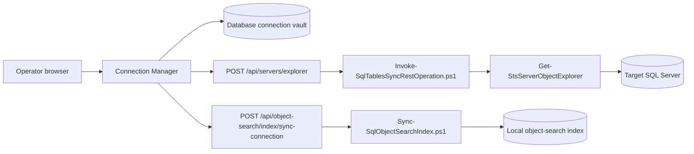

# Connection Manager

Connection Manager is the SQL Cockpit page for creating, testing, editing, deleting, and reusing database-level connection profiles.

Use it after defining the SQL Server in Instance Manager. A database connection belongs to an instance, so the normal workflow is: save the instance first, then add one or more database connections for that instance.

Connection Manager stores profiles in a dedicated browser-local connection vault. It does not write connection profiles into the `Sync.TableConfig` table, it does not share its vault with Instance Manager, and it is not a central encrypted credential vault.

## What It Does

Connection Manager can:

- save named SQL Server database connection profiles
- test a connection against a live SQL Server instance
- show visible database, table, view, and procedure counts
- discover SQL Server instances visible to the API host
- edit or delete saved profiles
- keep database-level connection profiles separate from instance-level profiles

## How It Works



The browser reads and writes saved profiles from local storage key `sql-cockpit-database-connection-profiles`. When you test a connection, the dashboard sends the selected profile to the local API route `POST /api/servers/explorer`. The Node API invokes PowerShell, and PowerShell queries SQL Server catalog metadata.

Discovery uses `POST /api/servers/discover`. Results depend on SQL Browser visibility, network policy, firewall rules, and the account running the SQL Cockpit API.

Server-wide object-search indexing belongs to Instance Manager because it operates against an instance profile rather than one database connection.

## Prerequisites

Before using Connection Manager:

1. Start SQL Cockpit.
2. Open `Instance Manager`.
3. Save and test the SQL Server instance that owns the database.
4. Confirm the local API process is running.
5. Confirm the SQL Server instance is reachable from the API host.
6. Prefer integrated security when the workspace process runs as the same Windows account that should access SQL Server.
7. Use SQL authentication only when it is approved for the environment.

The selected login needs enough metadata visibility to read databases and catalog objects. SQL Server may hide objects from accounts without permission.

## Open The Page

1. Start the workspace from PowerShell.

    ```powershell
    powershell.exe -NoProfile -ExecutionPolicy Bypass -File .\Start-SqlTablesSyncWorkspace.ps1 `
      -ConfigServer "NASCAR" `
      -ConfigDatabase "EPC_Imports_PCK" `
      -ConfigSchema "Sync" `
      -ConfigIntegratedSecurity `
      -TrustServerCertificate
    ```

2. Open the SQL Cockpit dashboard URL printed by the launcher.
3. Select `Connection Manager` from the left navigation.

## Save A Connection

1. Enter a connection name.
2. Choose the authentication mode.
3. Enter the SQL Server name or instance name.
4. Enter the database name.
5. For SQL authentication, enter the user name and password.
6. Set `Trust server certificate` only when that matches your environment policy.
7. Click `Save Connection`.

Saved profiles stay in the Connection Manager vault. They do not appear in Instance Manager or SQL Agent Manager.

## Test A Connection

Click `Test Connection` to call `POST /api/servers/explorer`.

A successful test shows:

- server name returned by SQL Server
- number of visible databases
- number of visible tables
- number of visible views
- number of visible procedures

Use this check before relying on the profile in source or destination database workflows.

## Manage Saved Profiles

Saved profiles appear in the profile list.

Use:

| Action | Use |
| --- | --- |
| Edit | Loads the saved profile back into the editor. |
| Delete | Removes the profile from browser local storage. |

Deleting a profile removes it from the Connection Manager vault in the current browser. Instance Manager profiles are unaffected.

## Discover SQL Servers

Click `Discover SQL Servers` to ask the API host to scan for visible SQL Server instances.

Discovery is a convenience feature, not an inventory source of truth. It can miss servers when:

- SQL Browser is disabled
- UDP discovery is blocked
- firewalls block discovery traffic
- named instances are hidden
- the SQL Cockpit API host is on a restricted network segment

## Fields

| Field | Valid values | Default |
| --- | --- | --- |
| Connection name | Any non-empty label meaningful to operators | Blank |
| Authentication | `Integrated` or `SQL` | `Integrated` |
| Server | SQL Server host, alias, or `host\instance` | Blank |
| Database | SQL Server database name | Blank |
| User name | SQL login name when authentication is `SQL` | Blank |
| Password | SQL login password when authentication is `SQL` | Blank |
| Integrated security | Boolean stored on the profile | `true` when using integrated auth |
| Trust server certificate | Boolean stored on the profile | `true` in the current dashboard defaults |

## Operational Interface

- storage location:
  - saved profiles: browser local storage key `sql-cockpit-database-connection-profiles`
  - instance profiles: not stored here; Instance Manager uses `sql-cockpit-instance-profiles`
  - discovery results: browser memory only
  - live metadata test results: browser memory only
- valid values:
  - auth mode: `Integrated` or `SQL`
  - trust server certificate: `true` or `false`
  - server: any SQL Server name accepted by the local SQL client provider
  - database: any database name accepted by the target SQL Server
- defaults:
  - integrated security is preferred by the UI
  - trust server certificate defaults to enabled in the current UI
  - saved profile list defaults to empty in a new browser profile
- code paths affected:
  - `webapp/components/dashboard-client.js`
  - `webapp/app/connection-manager/page.js`
  - `webapp/server.js`
  - `Invoke-SqlTablesSyncRestOperation.ps1`
  - `SqlTablesSync.Tools.psm1`
- operational risk:
  - SQL authentication passwords are stored in browser local storage when saved
  - metadata checks can reveal database and object names to anyone with browser access
  - discovery can trigger network monitoring alerts in restricted environments
- safe change procedure:
  1. Test the profile before using it in downstream workflows.
  2. Prefer a least-privilege login with metadata visibility appropriate for the task.
  3. Avoid saving SQL-auth passwords on shared workstations.
  4. Delete stale profiles after a migration, role change, or credential rotation.
  5. Restart SQL Cockpit after API or PowerShell route changes.

## Troubleshooting

### Test Connection Fails

Check:

1. The server name is correct.
2. The API host can reach the SQL Server network endpoint.
3. Integrated security is running under the expected Windows account.
4. SQL-auth credentials are current.
5. `Trust server certificate` matches your TLS policy.
6. The browser network response for `POST /api/servers/explorer`.

### Saved Profiles Are Missing

Saved profiles are browser-local. They do not follow you to another browser, another Windows profile, or another machine.

Check whether browser data was cleared, a private browsing window is being used, or the page was opened under a different host name or port.

### SQL Agent Manager Has No Instances

Open Instance Manager and save an instance profile. SQL Agent Manager reads `sql-cockpit-instance-profiles`, not the Connection Manager vault.

### Discovery Finds Nothing

Try a manual server name. Discovery depends on network broadcast and SQL Browser visibility; a failed discovery scan does not prove the SQL Server is unreachable.

## Screenshot

<!-- AUTO_SCREENSHOT:connection-manager:START -->


*Connection Manager stores reusable database-level connection profiles and validates them against live SQL Server metadata.*
<!-- AUTO_SCREENSHOT:connection-manager:END -->
