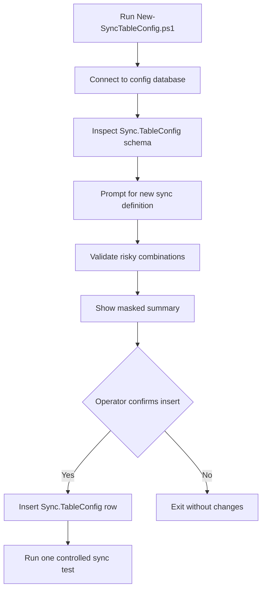

# Create Sync Jobs With The CLI

Use `New-SyncTableConfig.ps1` when you need to add a new `Sync.TableConfig` row without hand-writing an `INSERT`.

The CLI is interactive, validates the same high-risk combinations enforced by `Sync-ConfiguredSqlTable.ps1`, and stops if the live `Sync.TableConfig` table contains extra required columns that the CLI does not know how to populate.

## What the CLI changes

- Storage location: `Sync.TableConfig`
- Rows affected: one new sync definition row
- Default write behavior: the script inserts only into `Sync.TableConfig`
- Related code paths affected:
  - `New-SyncTableConfig.ps1`
  - `Sync-ConfiguredSqlTable.ps1`
  - launcher scripts that later call `Sync-ConfiguredSqlTable.ps1` with the new `SyncName`
- Important operational note: `Sync.TableState` is not inserted by this CLI. The runtime still creates that row lazily on first execution.



## Run the CLI

From the repo root:

```powershell
powershell -NoProfile -ExecutionPolicy Bypass -File .\New-SyncTableConfig.ps1
```

You can pre-fill the config-database connection if you already know it:

```powershell
powershell -NoProfile -ExecutionPolicy Bypass -File .\New-SyncTableConfig.ps1 `
  -ConfigServer "NASCAR" `
  -ConfigDatabase "EPC_Imports_PCK" `
  -ConfigSchema "Sync" `
  -ConfigIntegratedSecurity `
  -TrustServerCertificate
```

Use preview mode if you want to walk the prompts and review the summary without inserting:

```powershell
powershell -NoProfile -ExecutionPolicy Bypass -File .\New-SyncTableConfig.ps1 -PreviewOnly
```

## Prompt guidance

### Identity and naming

- `SyncId`
  - The CLI inspects the live table first.
  - If `SyncId` is an identity column, SQL Server assigns it.
  - If `SyncId` is not an identity column, the CLI suggests `MAX(SyncId) + 1`.
- `SyncName`
  - Must be unique for safe operation.
  - The CLI checks for existing rows and will not insert duplicates.

### Runtime settings the CLI validates

- `SyncMode`
  - Valid values: `Incremental`, `FullRefresh`
  - CLI default: `Incremental`
  - Runtime effect: controls whether the engine uses key/watermark paging or snapshot/replace behavior.
- `KeyColumnsCsv`
  - Required for `Incremental`
  - The current runtime supports exactly one key column in incremental mode.
- `WatermarkColumn` and `WatermarkType`
  - Must both be supplied or both be blank.
  - Supported `WatermarkType` values confirmed from code:
    - `bigint`
    - `int`
    - `datetime`
    - `datetime2`
    - `uniqueidentifier`
    - `nvarchar`
    - `varchar`
    - `nchar`
    - `char`
    - `decimal`
    - `numeric`
    - `money`
    - `smallmoney`
    - `smallint`
    - `tinyint`
- `InsertOnly`
  - Valid values: `0`, `1`
  - Blocked by the CLI when `SyncMode = FullRefresh`
- `MaxBatchesPerRun`
  - Valid values: positive integer or `NULL`
  - Blocked by the CLI when `SyncMode = FullRefresh`

### Auth fields

- `SourceAuthMode` and `DestinationAuthMode`
  - Valid values: `Integrated`, `SQL`
  - If `SQL` is chosen, the matching username and password become required.
  - If `Integrated` is chosen, the CLI stores the username and password as `NULL`.

## Safe procedure for creating a new sync

1. Run the CLI and create the row with `IsEnabled = 0` unless you already have a tightly controlled cutover plan.
2. Review the new `Sync.TableConfig` row in SQL before any launcher references it.
3. Confirm source and destination connectivity with the chosen auth modes.
4. Decide whether the first run should be `Incremental` or `FullRefresh`.
5. If you use `Incremental`, confirm that `KeyColumnsCsv` has exactly one stable key column and that watermark settings match the source change pattern.
6. Keep `PreSyncSql` and `PostSyncSql` blank unless a reviewed operational need exists.
7. Add the new `SyncName` to the appropriate launcher only after the row is reviewed.
8. Run one manual execution of `Sync-ConfiguredSqlTable.ps1`.
9. Review `Sync.RunLog`, `Sync.RunActionLog`, destination row counts, and the newly created `Sync.TableState` row.

## Operational risk notes

- High risk:
  - wrong source or destination server/database values
  - `SyncMode = FullRefresh` against a production destination
  - `SourceWhereClause` that silently filters required rows
  - unreviewed `PreSyncSql` or `PostSyncSql`
  - `AutoCreateDestinationTable = 1` in the wrong environment
- Medium risk:
  - retry/timeout values that hide transient failures or stretch run time unexpectedly
  - `IsEnabled = 1` before a launcher and rollback plan are ready
- Safe change procedure:
  - create the row disabled
  - validate one manual run
  - review logs and state
  - only then enable the row and add it to scheduler or launcher flow

## What is confirmed vs uncertain

- Confirmed from code:
  - the CLI inserts only into `Sync.TableConfig`
  - `Sync-ConfiguredSqlTable.ps1` creates `Sync.TableState` lazily
  - the runtime accepts only `Incremental` and `FullRefresh`
  - incremental mode requires exactly one key column
  - watermark column and type must be supplied together
  - `InsertOnly` and `MaxBatchesPerRun` are unsafe with `FullRefresh`
- Uncertain from this repo alone:
  - database-level defaults, triggers, or custom constraints outside the columns visible to this repository
  - environment-specific approval rules for when a new job may be enabled
