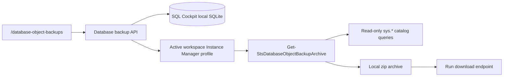

# Database Object Backups

Database Object Backups is a dashboard page at `/database-object-backups` for creating pre-change SQL Server object backup archives. It is intended for operators who want a reviewable restore/reference package before bulk changing views, procedures, functions, tables, triggers, synonyms, sequences, or user-defined types.

This is not a SQL Server `.bak` backup and it does not export table data. It creates a local `.zip` archive of scripted schema/object definitions plus manifest evidence.

## Workflow

1. Open `/database-object-backups`.
2. Select a saved Instance Manager profile.
3. Use the database picker to select exact databases, or leave it cleared for all online user databases visible to the selected login.
4. Use the schema picker to select exact schemas after choosing one or more databases, or leave it cleared for all schemas.
5. Enter optional object-name filters when the backup must target exact objects.
6. Choose object types: schemas, tables, views, procedures, functions, triggers, synonyms, sequences, and user-defined types.
7. Choose scripting options for constraints, indexes, triggers, permissions, extended properties, `CREATE OR ALTER`, and `DROP IF EXISTS`.
8. Save the profile for repeatable use, or run a one-off manual extract.
9. Use **Preview** to count matching objects without writing archive files.
10. Use **Manual Extract** to create the local zip and record a run row. While the archive is being generated, SQL Cockpit shows a bottom-right **Backup running** card with elapsed time.
11. Download succeeded runs from **Recent Runs** while the archive file remains on disk.

The database and schema selectors use live read-only metadata from the selected Instance Manager profile. The **All** action clears a selector rather than writing every value into the profile, preserving the default "all current and future matching items" behavior.

The running card is driven by the persisted `DatabaseObjectBackupRun` row. SQL Cockpit publishes best-effort realtime notification events when a run starts or completes, and the dashboard also polls the run list as a fallback so a reload can still rediscover in-progress backups.

## API Surface

| Route | Auth/RBAC | Request shape | Response shape | Risk | Safe test |
| --- | --- | --- | --- | --- | --- |
| `GET /api/database-object-backups/profiles` | signed-in user with `databaseBackups.view` | none | `profiles[]` and default object types/options | Medium: shows configured backup intent for the active workspace. | Call as an authorized test user and confirm only active-workspace profiles appear. |
| `POST /api/database-object-backups/profiles` | `databaseBackups.manage` | profile JSON with `name`, `instanceProfileId`, filters, object types, scripting options | saved `profile` | Medium: profile can later expose sensitive definitions through an extract. | Create a profile against non-production and list it. |
| `PUT /api/database-object-backups/profiles/{id}` | `databaseBackups.manage` | same as create | updated `profile` | Medium. | Update one option and confirm updated timestamp changes. |
| `DELETE /api/database-object-backups/profiles/{id}` | `databaseBackups.manage` | none | `{ ok: true }` | Low: deletes local config only; archives remain. | Delete a test profile and confirm runs remain listed. |
| `POST /api/database-object-backups/preview` | `databaseBackups.create` | `{ "profileId": "..." }` or inline profile-shaped selection | object counts, matching items, warnings/errors, manifest preview | Medium: runs read-only catalog queries and may reveal object names. | Preview a small non-production database. |
| `POST /api/database-object-backups/extract` | `databaseBackups.create` | `{ "profileId": "..." }` or inline profile-shaped selection | archive metadata plus `run` | High: writes local archive containing object definitions and permissions. | Extract from non-production, inspect warning/error counts, download and review zip. |
| `GET /api/database-object-backups/runs` | `databaseBackups.view` | optional `limit` | recent `runs[]`; if the backing state table is unavailable, HTTP 200 with `runs: []`, `featureUnavailable: true`, and `warning` | Medium: archive filenames and counts may reveal operational context. A degraded response can hide the widget until state-provider health is fixed, but create/extract actions still fail explicitly. | Confirm only active-workspace runs appear; temporarily misconfigure a non-production state provider and confirm dashboard polling does not emit repeated 500s. |
| `GET /api/database-object-backups/runs/{id}/download` | `databaseBackups.view` | none | `application/zip` stream | High: archive can contain sensitive SQL definitions and permissions. | Download only a succeeded non-production run; confirm cross-workspace IDs return 404/403. |

The API resolves `instanceProfileId` server-side from the signed-in user's active workspace. Clients cannot supply a workspace key. Passwords from saved profiles are passed only to the local PowerShell process and are not stored in backup run rows or manifests.

Hosted Azure SQL state uses bounded key columns for the workspace indexes behind profiles and runs. On startup, SQL Cockpit repairs older `DatabaseObjectBackupProfile` and `DatabaseObjectBackupRun` tables that were created with index-invalid wide key columns by trimming `workspace_key` to 260 characters and timestamp keys to 40 characters before creating the workspace indexes.

## Local Storage

| Item | Storage location | Valid values | Default | Code paths affected | Operational risk | Safe change procedure | Confidence |
| --- | --- | --- | --- | --- | --- | --- | --- |
| `DatabaseObjectBackupProfile.workspace_key` | `data/sql-cockpit/sql-cockpit-local.sqlite` | active workspace key | current active workspace | `sql-cockpit-api/lib/database-object-backup-store.js`, `server.js` profile routes | Medium: controls profile visibility. | Switch workspace, list profiles, confirm isolation. | confirmed |
| `DatabaseObjectBackupProfile.object_types_json` | same table | `schemas`, `tables`, `views`, `procedures`, `functions`, `triggers`, `synonyms`, `sequences`, `types` | all supported types | dashboard page, preview/extract API, PowerShell exporter | Medium: determines what definitions are captured. | Preview after changes before extracting. | confirmed |
| `DatabaseObjectBackupProfile.scripting_options_json` | same table | booleans for `includeConstraints`, `includeIndexes`, `includeTriggers`, `includePermissions`, `includeExtendedProperties`, `useCreateOrAlter`, `includeDropIfExists` | constraints/indexes/triggers/permissions/extended properties/CREATE OR ALTER on; DROP IF EXISTS off | dashboard page and `Get-StsDatabaseObjectBackupArchive` | High when permissions are included because the archive may expose role/user names and grants. | Use non-production first; disable sensitive sections if sharing archive outside trusted operators. | confirmed |
| `DatabaseObjectBackupRun.archive_path` | `DatabaseObjectBackupRun` in local SQLite | absolute path under `data/sql-cockpit/object-backups/<workspace>/<run-id>/` | generated during extract | run list and download endpoint | High: points to sensitive zip on disk. | Let SQL Cockpit create paths; do not manually edit. | confirmed |
| Archive files | `data/sql-cockpit/object-backups/<workspace-key>/<run-id>/` | `.zip` containing `manifest.json`, `summary.md`, `restore.sql`, `objects/.../*.sql`, `errors.json` | created by manual extract | PowerShell exporter, download endpoint | High: contains database object definitions and permissions. | Store on trusted disk, delete stale archives according to local retention policy. | confirmed |

## Archive Contents

- `manifest.json`: run id, workspace, selected instance/profile, selected filters, scripting options, object counts, warnings, and errors.
- `summary.md`: short operator-readable summary.
- `restore.sql`: best-effort aggregate script ordered by schema/type/table/module group.
- `objects/<database>/<schema>/<type>/<object>.sql`: one script per exported object.
- `errors.json`: non-fatal object/database scripting failures.

Encrypted modules, inaccessible definitions, and catalog scripting failures are recorded as warnings/errors so the archive can still be useful for the objects SQL Cockpit could read.

## Operational Risk

The feature is read-only against target SQL Server, but it can create catalog load on large estates and can produce archives containing sensitive schema design, stored procedure logic, grants, user/role names, linked object names, and extended properties. Treat archives as sensitive operational artifacts.

## Verification

When `sql-cockpit-api/.sql-cockpit-dev-lock.json` exists, read `listenPrefix` and use the running server:

1. `GET /health`.
2. Open `/database-object-backups`.
3. Save a test profile for a non-production Instance Manager profile.
4. Preview a small database and confirm the object count is expected.
5. Run **Manual Extract** and confirm a succeeded run appears.
6. Download the archive and verify `manifest.json`, `summary.md`, `restore.sql`, `objects/`, and `errors.json` are present.
7. Open `/api-docs` and confirm the Database Backups endpoints appear.

No production build is required for this verification path.
