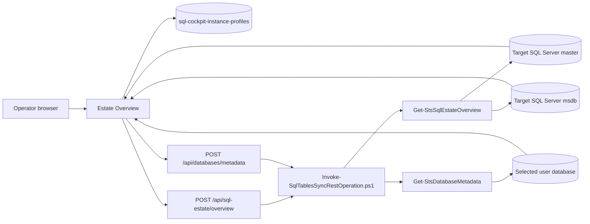
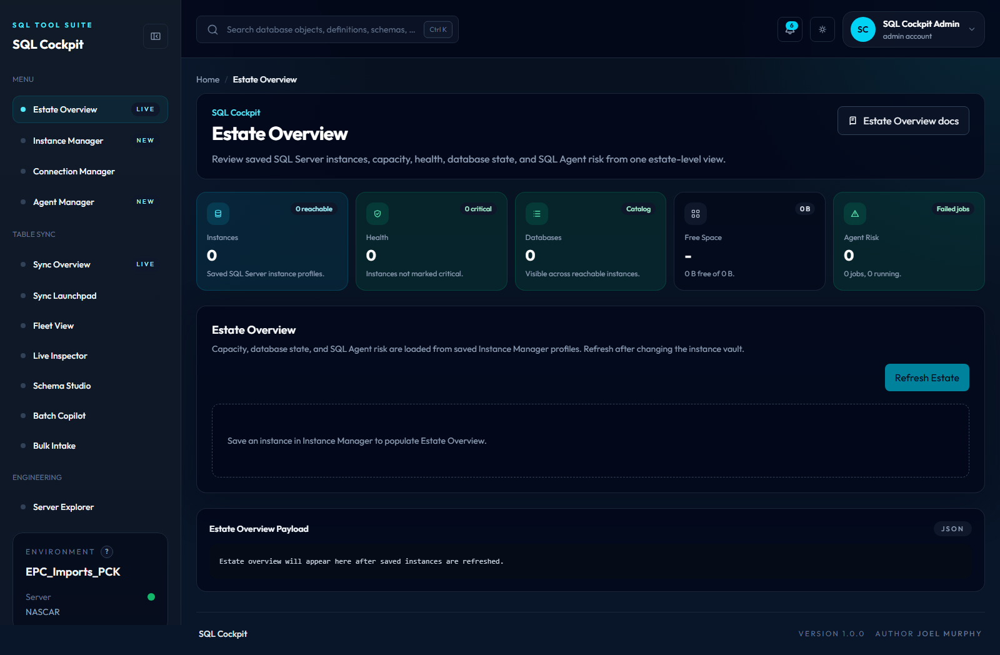

# Estate Overview

Estate Overview is the SQL Cockpit home page for reviewing saved SQL Server instances from Instance Manager.

Use it when you need a quick read on SQL estate capacity, free space, database state, instance reachability, and SQL Agent risk before opening deeper tools.

Estate Overview is read-only. It does not create, edit, delete, start, stop, or schedule anything on SQL Server.

## What It Shows

Estate Overview shows:

- saved instance count from Instance Manager
- reachable and critical instance counts
- total visible databases
- database file allocation across saved instances
- reported volume capacity and free space when SQL Server exposes volume stats
- SQL Agent job count, failed job count, and running job count
- per-instance health score and status
- SQL Server release label such as `SQL Server 2019`, plus edition, engine version, CPU count, and memory reported by the engine
- machine, physical owner, service name, and reported `@@SERVERNAME` identity
- current connection transport, local SQL Server address, local TCP port, authentication scheme, and encryption state
- an `Actions` menu for exporting the current Estate Overview table rows as `CSV`, `JSON`, or `HTML`
- a per-instance `Retry volume detail` action in the `Volume free` column when volume metadata is unavailable or returns `0 B free of 0 B`

The page is intentionally instance-first. Define instances in Instance Manager before adding database connections in Connection Manager.

Each instance row has an ellipsis action menu beside the instance name. Use it to open Agent Manager with that instance already selected, expand or hide an inline database list, open Server Explorer for the server, or copy the instance and server names. Expanded database rows also have an ellipsis menu. Use it to expand or hide the lightweight table list for that database or copy the database name. If the estate refresh did not already include table rows, the table action loads that one database through the existing database metadata endpoint. The nested table list can be sorted by clicking the schema, table, row-count, created, or modified headers. Each table row has its own ellipsis menu with:
- `Open in command palette`, which opens the command palette and pre-fills search with the selected `schema.table`.
- `Migrate to another database`, which opens `Sync Launchpad`, pre-fills the selected source server, database, schema, and table, then shows a confirmation modal that checks for a matching server profile from Instance Manager.

## How It Works



The browser reads saved instance profiles from local storage key `sql-cockpit-instance-profiles`. The dashboard sends those profiles to `POST /api/sql-estate/overview`. The Node API invokes PowerShell, and PowerShell connects to each target instance.

Each instance is evaluated independently. If one instance fails to connect, the response still returns the other instances and marks the failed instance as `Critical`.

## Focused Review

If the surrounding shell feels noisy during estate review, use the sidebar control near the `SQL Cockpit` brand to enter `Focus mode`.

In the current UI this:

- removes the page intro, breadcrumb trail, KPI cards, payload box, and footer
- keeps the refresh action and main instance table visible
- automatically scrolls the instance inventory table into view when focus mode is enabled on this page

## Data Sources

Estate Overview reads:

- `SERVERPROPERTY(...)`
- `@@SERVERNAME`
- `@@SERVICENAME`
- `sys.dm_exec_connections` for the current SQL Cockpit session
- `sys.dm_os_sys_info`
- `sys.databases`
- `sys.master_files`
- per-database `sys.tables`, `sys.schemas`, and `sys.partitions`
- `sys.dm_os_volume_stats`
- `msdb.dbo.sysjobs`
- `msdb.dbo.sysjobactivity`
- `msdb.dbo.sysjobhistory`

Volume free-space data can be unavailable if SQL Server permissions or environment policy block `sys.dm_os_volume_stats`, or when older SQL Server builds do not expose that object. Estate Overview now retries with a legacy-safe fallback that combines `master.dbo.xp_fixeddrives` with `sys.master_files` so older servers can still return per-drive free-space bytes. On legacy fallback responses, total volume size and free-percent can remain unavailable, so the UI labels this as `free (total unavailable)` instead of forcing a misleading percentage.

Table-list data is intentionally deferred. The main estate refresh returns fast instance and database summaries, plus a per-database table count when SQL Server can provide it cheaply. Full table lists are loaded only when the operator uses the database-level `List Tables` action, which calls `POST /api/databases/metadata` for that selected database and shows any returned error inline instead of silently reporting an empty list. This keeps Estate Overview responsive on older SQL Server versions and larger estates.

Network identity data is read from the same SQL session used by SQL Cockpit. `ConnectionLocalNetAddress` and `DmvLocalNetAddress` normally identify the local SQL Server address for the active connection. They can be blank for non-TCP transports, local/shared-memory connections, listener routing, or environments where SQL Server does not expose the address.

Older SQL Server versions expose different `sys.dm_os_sys_info` columns. Estate Overview checks for newer columns such as `sqlserver_start_time` and `physical_memory_kb` before reading them. When those columns are not available, the response leaves the SQL Server start time or memory value blank instead of marking the instance as failed.

Estate Overview also tolerates older or partial aggregate shapes when building the summary totals. If an older instance, edition difference, or sparse metadata response does not expose a numeric value that newer builds would usually contribute to a `Sum`, the dashboard now treats that contribution as `0` instead of failing the estate refresh with a `The property 'Sum' cannot be found on this object` error. The same defensive handling is used by the shared metadata endpoints that power inline database and table drill-ins from the dashboard.

The table inventory query also quotes legacy-sensitive identifiers such as `[RowCount]` so older SQL Server versions do not fail parsing metadata queries that succeed on newer engines.

## API Route

The dashboard calls:

```http
POST /api/sql-estate/overview
```

For targeted retry of one instance volume lookup, the dashboard also calls:

```http
POST /api/sql-estate/instance-volume
```

Example request body:

```json
{
  "instances": [
    {
      "profileId": "nascar",
      "profileName": "NASCAR",
      "serverName": "NASCAR",
      "integratedSecurity": true,
      "trustServerCertificate": true
    }
  ]
}
```

Example response shape:

```json
{
  "RetrievedAtUtc": "2026-04-09T14:44:45.7262495Z",
  "Summary": {
    "InstanceCount": 1,
    "ReachableCount": 1,
    "CriticalCount": 0,
    "DatabaseCount": 12,
    "TotalDatabaseBytes": 123456789,
    "TotalVolumeBytes": 987654321,
    "AvailableVolumeBytes": 456789123,
    "AgentJobCount": 42,
    "FailedAgentJobCount": 1,
    "RunningAgentJobCount": 0
  },
  "Instances": [
    {
      "Server": {
        "MachineName": "SQLHOST01",
        "ComputerNamePhysicalNetBios": "SQLNODE01",
        "ServiceName": "MSSQLSERVER",
        "AtAtServerName": "SQLHOST01",
        "ServerNameWithService": "SQLHOST01",
        "NetTransport": "TCP",
        "ConnectionLocalTcpPort": 1433,
        "ConnectionLocalNetAddress": "10.10.10.25",
        "DmvLocalTcpPort": 1433,
        "DmvLocalNetAddress": "10.10.10.25",
        "ClientNetAddress": "10.10.10.44",
        "ProtocolType": "TSQL",
        "AuthScheme": "KERBEROS",
        "EncryptOption": "TRUE"
      }
    }
  ]
}
```

## Health Score

The health score is an operator-facing heuristic, not a SQL Server diagnosis.

The score starts at `100` and subtracts for:

- databases not online
- read-only databases
- failed SQL Agent jobs
- low reported volume free space
- unavailable Agent metadata

Current statuses:

| Status | Meaning |
| --- | --- |
| Healthy | Score is 85 or higher. |
| Warning | Score is 60 to 84. |
| Critical | Score is below 60, or the instance cannot be reached. |

Treat the score as a triage guide. Use SQL Server tooling, Agent Manager, and server monitoring before making operational decisions.

## Operational Interface

- storage location:
  - saved instance profiles: browser local storage key `sql-cockpit-instance-profiles`
  - live estate response: browser memory only after refresh
  - SQL sources: selected instances, primarily `master` and `msdb`
- valid values:
  - instances array: 1 to 30 saved instance profiles
  - auth mode: `Integrated` or `SQL`
  - trust server certificate: `true` or `false`
- defaults:
  - Estate Overview auto-refreshes when the home page opens and at least one instance profile exists
  - no data is shown until an instance profile exists
  - failed instances are returned as critical rows instead of failing the whole request
  - full per-table inventory is loaded on demand, not during the main estate refresh
- code paths affected:
  - `webapp/components/dashboard-client.js`
  - `webapp/server.js`
  - `Invoke-SqlTablesSyncRestOperation.ps1`
  - `SqlTablesSync.Tools.psm1`
  - `Test-RestApiEndpoint.ps1`
- operational risk:
  - medium for metadata exposure because instance names, database names, table names, approximate row counts, edition, capacity, Agent job counts, local SQL Server addresses, ports, authentication scheme, and encryption state are visible
  - medium for credential handling when saved instance profiles contain SQL-auth credentials in browser local storage
  - low for write safety because the route is read-only
- safe change procedure:
  1. Save and test one low-risk instance in Instance Manager.
  2. Open Estate Overview and confirm the reported server name.
  3. Add additional instances in small batches.
  4. Treat low free-space and failed Agent job counts as triage signals, then verify with SQL Server operational tooling.
  5. Avoid sharing screenshots or payloads outside trusted support channels.

## Troubleshooting

### No Instances Appear

Open Instance Manager and save an instance profile. Estate Overview reads `sql-cockpit-instance-profiles`.

### Instance Is Critical

Check the row error text. Common causes include login failure, SSPI/Kerberos errors, TLS/certificate settings, DNS or network failure, and missing SQL Server permissions.

### Free Space Is Blank

The SQL login may not be able to read `sys.dm_os_volume_stats`, or the SQL Server environment may not expose volume details. Database file allocation and Agent summaries can still be useful.

### IP Address Or Port Is Blank

Confirm the connection is using TCP. Local shared-memory, named pipes, listener routing, and some locked-down environments can return blank local address or port values even when the instance is reachable.

### SQL Agent Counts Are Blank

The login may not have permission to read `msdb` Agent metadata, or SQL Server Agent metadata may not exist on that instance edition.

### Older Instance Returns Partial Data

Older SQL Server builds can omit newer DMV columns, treat some identifiers more strictly, or return thinner metadata than modern versions. Estate Overview is designed to keep the instance row visible and fall back to `0` or blank values where needed. If one server still fails while newer servers succeed, compare the instance version, edition, and login permissions first.

## Screenshot

<!-- AUTO_SCREENSHOT:dashboard-home:START -->


*Estate Overview is the SQL Cockpit home page and summarizes saved SQL Server instances, health, capacity, and SQL Agent risk.*
<!-- AUTO_SCREENSHOT:dashboard-home:END -->
