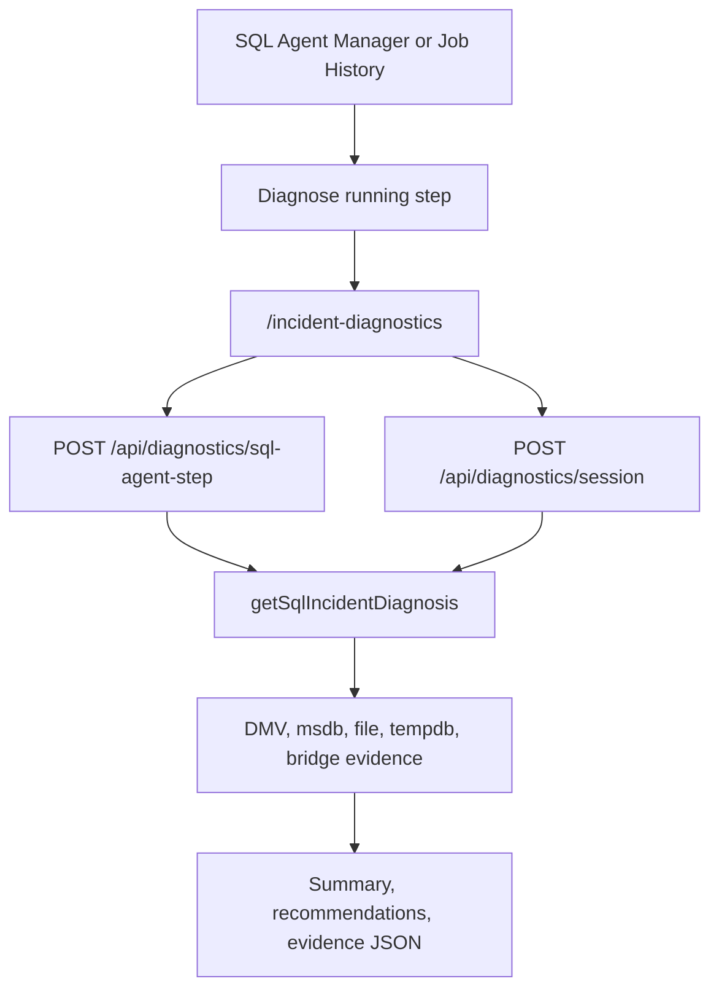

# Incident Diagnostics

Incident Diagnostics is the `/incident-diagnostics` SQL Cockpit workflow for read-only investigation of running SQL Agent steps and live SQL Server sessions.

It correlates Agent activity, active requests, waits, blockers, tempdb, database file capacity, SQL Bridge invocation history, and query-shape risks into a plain-English diagnosis with evidence and safe next checks.

The page also has a `Find` action next to `Session ID`. Use it to list active request sessions on the selected instance and choose the SPID directly from the UI.

## What It Answers
- Is the step blocked?
- Is the request still making CPU, read, or write progress?
- Is it waiting on parallelism, IO, log writes, or memory grants?
- Is tempdb or file capacity pressure visible?
- Does SQL Bridge appear in recent invocation history?
- Does the active SQL text contain known expensive patterns such as `SELECT DISTINCT`, `SELECT INTO #... ORDER BY`, or `CAST(column AS date)` predicates?

## Finding A Session ID
Click `Find` beside `Session ID`.

SQL Cockpit calls `POST /api/diagnostics/session-candidates`, reads active SQL Server requests, and shows session id, database, command, wait, blocker, elapsed time, login, host, program, SQL Agent marker, and a SQL preview.

Click `Use <session_id>` to populate the Session ID field and switch to Live session mode.

## Safety Model
- Read-only diagnosis only.
- No user SQL text is executed.
- No sessions are killed.
- No SQL Agent jobs are stopped.
- No indexes or schema objects are created.
- `resampleSeconds` waits up to 30 seconds to compare CPU, reads, and writes movement.

## API
### `POST /api/diagnostics/sql-agent-step`
Request:

| Field | Required | Description |
| --- | --- | --- |
| `instanceProfileId` | yes | Saved Instance Manager profile id. |
| `jobId` | conditional | Job id, unless `jobName` or `sessionId` is supplied. |
| `jobName` | conditional | Job name, unless `jobId` or `sessionId` is supplied. |
| `sessionId` | no | Explicit session override. |
| `resampleSeconds` | no | 0-30 seconds. |

### `POST /api/diagnostics/session`
Request:

| Field | Required | Description |
| --- | --- | --- |
| `instanceProfileId` | yes | Saved Instance Manager profile id. |
| `sessionId` | yes | Positive SQL Server session id. |
| `resampleSeconds` | no | 0-30 seconds. |

### `POST /api/diagnostics/session-candidates`
Request:

| Field | Required | Description |
| --- | --- | --- |
| `instanceProfileId` | yes | Saved Instance Manager profile id. |
| `maxSessions` | no | Number of active request sessions to return. Server clamps to 1-200. |

The diagnosis routes return `Summary`, `CurrentStep`, `ActiveSession`, `Resample`, `Waits`, `Blocking`, `Tempdb`, `CapacitySignals`, `BridgeCorrelation`, `QuerySignals`, `Recommendations`, and `Evidence`.

The session-candidates route returns `Summary` and `Sessions[]` with candidate SPIDs and context.

Authentication and RBAC match SQL Agent Manager profile visibility. Operators can diagnose only instance profiles visible in their active workspace.

## Classifications
| Classification | Meaning |
| --- | --- |
| `Blocked` | Active request has a blocker. |
| `ParallelismStall` | Parallel waits or high parallel worker use. |
| `IoPressure` | Storage/log/async IO wait. |
| `MemoryGrant` | Waiting on `RESOURCE_SEMAPHORE`. |
| `CpuOnlyProgress` | CPU moved during resample while reads/writes did not. |
| `LongRunningQuery` | Active request without a stronger signal. |
| `FilePressure` | File volume free space is low. |
| `NoActiveRequest` | No matching live request was found. |

## Operational Risk
- Diagnosis payloads can include SQL text, login names, host names, database file paths, and bridge invocation identifiers.
- Medium confidence means a likely pattern, not proof.
- DMV permissions such as `VIEW SERVER STATE` may be required.
- Dangerous actions remain separate and should be explicitly confirmed elsewhere.

## Safe Test Procedure
1. Open SQL Agent Manager and confirm the target Instance Manager profile is visible.
2. Open `/incident-diagnostics`.
3. Select the same profile.
4. Enter a known running job id/name or a harmless live session id.
5. If the session id is not known, click `Find` and choose a matching active session.
6. Run with no resample first.
7. Confirm the diagnosis and recommendations render.
8. Use `Copy diagnosis` or `Export JSON` only for trusted incident channels.
