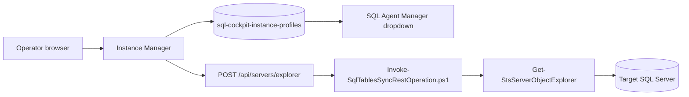
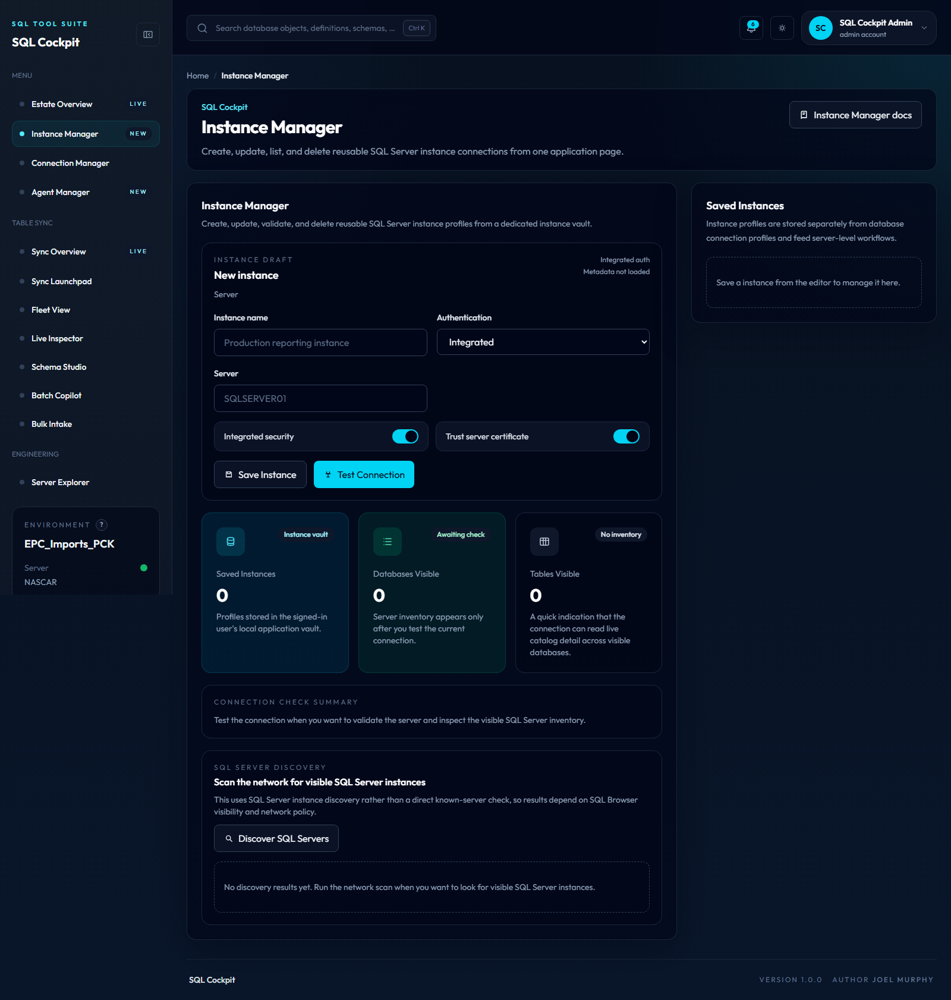

# Instance Manager

Instance Manager is the SQL Cockpit page for maintaining reusable SQL Server instance profiles.

It has a dedicated browser-local instance vault. Use it when you want a profile that can be selected by Server Explorer, SQL Agent Manager, object search, or other dashboard pages that operate against a whole SQL Server instance.

Instance Manager is separate from Connection Manager. Profiles created, edited, or deleted here do not change database-level connection profiles.

## What It Does

Instance Manager can:

- create reusable SQL Server instance profiles
- test that an instance is reachable
- list profiles available to Server Explorer and SQL Agent Manager
- update or remove saved profiles
- discover SQL Server instances visible to the API host
- sync a saved instance into the local object-search index

Use Connection Manager when you are thinking about source and destination database connections. Use Instance Manager when you are thinking about server-level tools and instance-wide workflows.

## How It Works



Instance Manager reads and writes browser local storage key `sql-cockpit-instance-profiles`. SQL Agent Manager reads that same instance vault.

When an operator tests an instance, the dashboard calls `POST /api/servers/explorer`. The API invokes PowerShell, and PowerShell reads SQL Server metadata to confirm the connection and summarize visible catalog objects.

Older dashboard builds used `sql-cockpit-connection-profiles` as a shared storage key. Current builds treat that as a legacy source for instance profiles only when the dedicated instance vault has not been created yet.

## Prerequisites

Before using Instance Manager:

1. Start SQL Cockpit.
2. Confirm the local API process is running.
3. Confirm the target SQL Server is reachable from the API host.
4. Confirm the selected login has the required SQL Server permissions.
5. Decide whether integrated security or SQL authentication is appropriate.

For SQL Agent Manager, the selected login also needs enough `msdb` access to read SQL Server Agent metadata.

## Open The Page

1. Start the workspace from PowerShell.

    ```powershell
    powershell.exe -NoProfile -ExecutionPolicy Bypass -File .\Start-SqlTablesSyncWorkspace.ps1 `
      -ConfigServer "NASCAR" `
      -ConfigDatabase "EPC_Imports_PCK" `
      -ConfigSchema "Sync" `
      -ConfigIntegratedSecurity `
      -TrustServerCertificate
    ```

2. Open the SQL Cockpit dashboard URL printed by the launcher.
3. Select `Instance Manager` from the left navigation.

## Create An Instance Profile

1. Enter a profile name that identifies the SQL Server instance.
2. Enter the server name, DNS alias, or named instance.
3. Choose integrated security or SQL authentication.
4. Enter SQL login credentials only when using SQL authentication.
5. Choose whether to trust the server certificate.
6. Save the profile.
7. Test the profile before using it in Agent Manager.

While a test is running, the `Test Connection` button shows a loading spinner and is disabled until the API response returns. This prevents repeated clicks from sending duplicate metadata requests to the local API.

## Use With SQL Agent Manager

SQL Agent Manager reads profiles from the same browser registry. After you save an instance profile:

1. Open `SQL Agent Manager`.
2. Choose the profile from the instance dropdown.
3. The page calls `POST /api/sql-agent/jobs` and reads Agent metadata from the selected instance `msdb` database.

If the dropdown is empty, return to Instance Manager and save a profile in the same browser session.

## Use With Server Explorer

Server Explorer also reads saved profiles from the instance vault. After you save an instance profile:

1. Open `Server Explorer`.
2. Choose the profile from the instance dropdown.
3. The page uses the profile's server, authentication mode, SQL credentials when present, encryption setting, and certificate setting to load visible databases.
4. Choose one or more databases to browse catalog metadata.

## Use With Object Search

Use `Sync Server To Search` when you want the local object-search index to know about objects on the saved instance.

This is useful before using dashboard search to find databases, schemas, tables, views, and procedures by name.

Only sync instances that are approved for local searchable metadata storage.

## Fields

| Field | Valid values | Default |
| --- | --- | --- |
| Profile name | Any non-empty label meaningful to operators | Blank |
| Server | SQL Server host, alias, or `host\instance` | Blank |
| Authentication | `Integrated` or `SQL` | `Integrated` |
| User name | SQL login name when authentication is `SQL` | Blank |
| Password | SQL login password when authentication is `SQL` | Blank |
| Integrated security | Boolean stored on the profile | `true` when using integrated auth |
| Trust server certificate | Boolean stored on the profile | `true` in the current dashboard defaults |

## Operational Interface

- storage location:
  - saved profiles: browser local storage key `sql-cockpit-instance-profiles`
  - legacy import source: `sql-cockpit-connection-profiles` when the instance vault is empty
  - database connection profiles: not stored here; Connection Manager uses `sql-cockpit-database-connection-profiles`
  - tested instance metadata: browser memory only
  - SQL Agent inventory: not stored by Instance Manager
- valid values:
  - auth mode: `Integrated` or `SQL`
  - trust server certificate: `true` or `false`
  - server: any SQL Server name accepted by the local SQL client provider
- defaults:
  - saved profile list defaults to empty in a new browser profile
  - integrated security is the expected default operating mode
  - trust server certificate defaults to enabled in the current UI
  - connection testing allows one in-flight request from the draft panel at a time
- code paths affected:
  - `webapp/components/dashboard-client.js`
  - `webapp/app/instance-manager/page.js`
  - `webapp/server.js`
  - `Invoke-SqlTablesSyncRestOperation.ps1`
  - `SqlTablesSync.Tools.psm1`
- operational risk:
  - SQL-auth credentials are stored in browser local storage when saved
  - deleting a profile removes it from all pages that use the instance vault
  - changing a profile can affect Agent Manager, object search sync, and any workflow using that saved instance
  - changing a profile does not affect Connection Manager database profiles
  - server metadata may expose operational information such as database and object names
- safe change procedure:
  1. Confirm which pages depend on the profile before editing or deleting it.
  2. Prefer integrated security for operator workstations.
  3. Test the profile after every server, auth, or certificate change.
  4. Reopen SQL Agent Manager after changing the profile list.
  5. Remove stale profiles after credentials rotate or server aliases change.

## Troubleshooting

### Profile Does Not Appear In Agent Manager

Check that the profile was saved in the same browser and under the same dashboard host and port. Browser local storage is scoped by origin.

### Test Connection Fails

Check:

1. Server name and instance name.
2. DNS resolution from the API host.
3. Firewall access to SQL Server.
4. Integrated-security account context.
5. SQL-auth credentials.
6. TLS and certificate settings.

### Profile Changes Affect SQL Agent Manager

This is expected. SQL Agent Manager reads the same `sql-cockpit-instance-profiles` instance vault.

### Profile Changes Do Not Affect Connection Manager

This is expected. Connection Manager uses the separate `sql-cockpit-database-connection-profiles` vault.

### Agent Manager Returns Permission Errors

The instance profile may connect successfully but still lack `msdb` permissions needed for SQL Server Agent metadata. Test with an account that can read SQL Agent job history and job metadata.

### Stored Password Should Be Removed

Edit the profile to use integrated security, or delete the profile. Because storage is browser-local, also clear site data if the workstation should no longer retain the credential.

## Screenshot

<!-- AUTO_SCREENSHOT:instance-manager:START -->


*Instance Manager stores and tests reusable SQL Server instance profiles for server-level workflows.*
<!-- AUTO_SCREENSHOT:instance-manager:END -->
