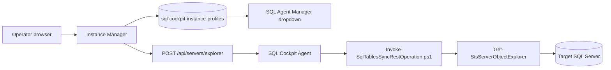
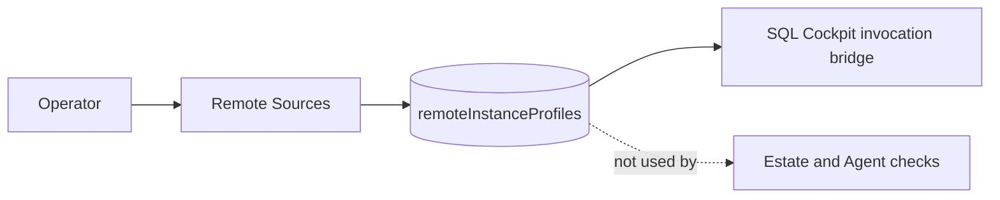

# Instance Manager

Instance Manager is the SQL Cockpit page for maintaining reusable SQL Server instance profiles.

It has a dedicated browser-local instance vault. Use it when you want a profile that can be selected by Server Explorer, SQL Agent Manager, object search, or other dashboard pages that operate against a whole SQL Server instance.

Instance Manager is separate from Connection Manager. Profiles created, edited, or deleted here do not change database-level connection profiles.

Connection tests for saved profiles and unsaved edit drafts run through the paired SQL Cockpit Agent. They do not connect directly from the web/API process, so Integrated authentication is evaluated using the Windows identity running `SqlCockpit.Agent`.

## What It Does

Instance Manager can:

- create reusable SQL Server instance profiles
- test that an instance is reachable
- list profiles available to Server Explorer and SQL Agent Manager
- update or remove saved profiles
- discover SQL Server instances visible to the SQL Cockpit Agent host
- sync a saved instance into the local object-search index

Use Connection Manager when you are thinking about source and destination database connections. Use Instance Manager when you are thinking about server-level tools and instance-wide workflows.

## How It Works



Instance Manager reads and writes browser local storage key `sql-cockpit-instance-profiles`. SQL Agent Manager reads that same instance vault.

When an operator tests an instance, the dashboard calls `POST /api/servers/explorer`. On the edit screen, `Test Connection` sends an `instanceProfileDraft` built from the current form values, so unsaved server, authentication, certificate, username, and password edits are tested before the operator clicks `Update Instance`. Saved-profile tests use the paired SQL Cockpit Agent and stored agent-side secret references; draft tests use the immediate metadata probe payload so the typed password is available only for that test.

For SQL authentication, the agent resolves the saved `secretRef` from Windows Credential Manager. For integrated security, SQL Server sees the Windows identity running `SqlCockpit.Agent`, not the browser, Next.js dev process, or service-control UI process. See [SQL Cockpit Agent Identity And Windows Authentication](sql-cockpit-agent-identity.md).

Older dashboard builds used `sql-cockpit-connection-profiles` as a shared storage key. Current builds treat that as a legacy source for instance profiles only when the dedicated instance vault has not been created yet.

The Instance Manager summary cards use a three-column row on standard dashboard desktop widths, then collapse to two columns and one column on narrower screens.

## Excluding Instances From Estate Overview

Each normal Instance Manager profile has an `Exclude from Estate Overview` toggle in the new/edit draft. Use it when onboarding or troubleshooting an estate one instance at a time. The profile remains saved and can still be tested from Instance Manager or selected by other instance-based tools, but Estate Overview does not create a pending row or call the SQL Cockpit Agent for that profile while the toggle is enabled.

- Storage location: workspace profile payloads under `instanceProfiles[*].excludeFromEstateOverview`.
- Valid values: `true` excludes the profile from Estate Overview; `false` includes it.
- Default: `false` for new and existing profiles.
- Code paths affected: `sql-cockpit-api/lib/rbac-auth-store.js`, `sql-cockpit-api/lib/rbac-auth-store-azure-sql.js`, `sql-cockpit-api/server.js`, `sql-cockpit-api/components/dashboard-client.js`, `sql-cockpit-api/components/dashboard/pages/connection-manager-page.js`, and `sql-cockpit-api/components/dashboard/pages/overview-page.js`.
- Operational risk: low to medium. Excluded instances disappear from Estate Overview counts and capacity/risk totals, so the dashboard can under-report the estate if the setting is left on after testing.
- Safe change procedure: open `/instance-manager/edit?profileId=<id>`, enable or disable `Exclude from Estate Overview`, save the instance, then open Estate Overview and refresh. The saved instances table shows `Included` or `Excluded` in the `Estate` column.

## Prerequisites

Before using Instance Manager:

1. Start SQL Cockpit.
2. Confirm the local API process is running.
3. Confirm the SQL Cockpit Agent service is running and paired.
4. Confirm the target SQL Server is reachable from the agent host.
5. Confirm the selected SQL login or agent service identity has the required SQL Server permissions.
6. Decide whether integrated security or SQL authentication is appropriate.

For SQL Agent Manager, the selected login also needs enough `msdb` access to read SQL Server Agent metadata.

## Open The Page

1. Start the workspace from PowerShell.

    ```powershell
    powershell.exe -NoProfile -ExecutionPolicy Bypass -File .\Start-SqlTablesSyncWorkspace.ps1 `
      -ConfigServer "YOUR_SQL_SERVER" `
      -ConfigDatabase "YOUR_CONFIG_DATABASE" `
      -ConfigSchema "Sync" `
      -ConfigIntegratedSecurity `
      -TrustServerCertificate
    ```

2. Open the SQL Cockpit dashboard URL printed by the launcher.
3. Select `Instance Manager` from the left navigation.

The left navigation expands `Instance Manager` into separate compact routes:

- `Instance Manager` opens `/instance-manager` and renders the saved profile list.
- `New Instance` opens `/instance-manager/new` and renders the draft panel for creating or updating an instance profile.
- `Edit Instance` opens `/instance-manager/edit?profileId=<id>` and renders the focused edit workflow for one saved instance profile.
- `Remote Sources` opens `/remote-sources` and renders linked-server-style SQL Server source profiles that are separate from normal Instance Manager checks.
- `New Remote Source` opens `/remote-sources/new` and creates or updates a read-only-by-default remote source profile.
- `Share Remote Sources` opens `/remote-sources/share` and copies only remote source profiles to another workspace.
- `Share Instances` opens `/instance-manager/share` and renders the workspace sharing board.

Each route renders only the content needed for that workflow. The routes reuse the same Instance Manager state, workspace profile store, validation, confirmation, and API calls; they do not change RBAC, alter local storage keys, or move profiles between vaults.

Instance Manager also renders the same hierarchy as a compact inline page menu above the content. Saved profile lists include the matching `New` action in the panel header and empty state, so operators can create the first instance, connection, or remote source without relying on expanded sidebar children.

## Remote Sources

Remote source profiles are saved SQL Server endpoints for linked-server-style source checks and SQL Cockpit invocation bridge reads. They are intentionally separate from normal `instanceProfiles`.

Use a remote source when a SQL Server should be available as a remote data source but should not appear in Instance Manager health checks, Estate Overview, SQL Agent Manager, or object-search sync.

Remote source profiles:

- are stored in workspace profile payloads as `remoteInstanceProfiles`
- default `readOnly` to `true`
- keep the same auth fields as instance profiles
- can be shared separately from normal instance profiles
- can be resolved by the SQL bridge with `kind: "remote"`



Operational interface:

- storage location: workspace profile JSON under `remoteInstanceProfiles`
- valid values: `profileName`, `serverName`, `authMode`, `username`, `password`, `trustServerCertificate`, `encryptConnection`, and `readOnly`
- default: `readOnly = true`
- code paths affected: `sql-cockpit-api/lib/rbac-auth-store.js`, `sql-cockpit-api/server.js`, `sql-cockpit-api/components/dashboard-client.js`, `sql-cockpit-api/components/dashboard/pages/connection-manager-page.js`, `sql-cockpit-api/app/remote-sources/*/page.js`, and the SQL bridge saved-profile resolver
- operational risk: medium to high for credential handling; low for write safety while `readOnly` remains enabled
- safe change procedure: save a low-risk remote source, confirm it appears only under `/remote-sources`, test it after saving, verify it is not listed in Estate Overview or Agent Manager, then reference it from bridge JSON with `kind: "remote"`
- Test Connection behavior: `/remote-sources/new` calls `POST /api/servers/explorer` with `allowEmptyDatabaseInventory = true`. Saved instance and remote-source profiles are tested through the paired SQL Cockpit Agent so the result matches Estate Overview and hosted/cloud execution. Unsaved or edited remote-source drafts are tested with a `remoteInstanceDraft` object containing the current server/auth/certificate/read-only fields; draft testing is used only for the immediate read-only metadata probe, so operators can validate a new remote source before saving it.
- Test Connection outcomes: authentication, network, certificate, and SQL errors still show as failed connections. If SQL Server accepts the connection but the login cannot list any online user databases, the endpoint returns success with `InventoryStatus = NoListableDatabases` and the dashboard shows a warning that the connection worked but no databases are visible.

## Create An Instance Profile

1. Enter a profile name that identifies the SQL Server instance.
2. Enter the server name, DNS alias, or named instance.
3. Choose integrated security or SQL authentication.
4. Enter SQL login credentials only when using SQL authentication.
5. Choose whether to trust the server certificate.
6. Save the profile.
7. Test the profile before using it in Agent Manager.

While a test is running, the `Test Connection` button shows a loading spinner and is disabled until the API response returns. This prevents repeated clicks from sending duplicate metadata requests to the local API.

When editing an existing instance, `Test Connection` tests the values currently shown in the input boxes, not the last saved profile values. `Update Instance` also shows a spinner and is disabled while the profile save and any SQL-auth password handoff are running, so repeated clicks do not queue duplicate saves.

## Use With SQL Agent Manager

SQL Agent Manager reads profiles from the same browser registry. After you save an instance profile:

1. Open `SQL Agent Manager`.
2. Choose the profile from the instance dropdown.
3. The page calls `POST /api/sql-agent/jobs` and reads Agent metadata from the selected instance `msdb` database.

If the dropdown is empty, return to Instance Manager and save a profile in the same browser session.

## Use With Server Explorer

Server Explorer also reads saved profiles from the instance vault. After you save an instance profile:

1. Open `Server Explorer`.
2. Choose the profile from the instance dropdown.
3. The page uses the profile's server, authentication mode, SQL credentials when present, encryption setting, and certificate setting to load visible databases.
4. Choose one or more databases to browse catalog metadata.

## Use With Object Search

Use `Sync Server To Search` when you want the local object-search index to know about objects on the saved instance.

This is useful before using dashboard search to find databases, schemas, tables, views, and procedures by name.

Only sync instances that are approved for local searchable metadata storage.

## Fields

| Field | Valid values | Default |
| --- | --- | --- |
| Profile name | Any non-empty label meaningful to operators | Blank |
| Server | SQL Server host, alias, or `host\instance` | Blank |
| Authentication | `Integrated` or `SQL` | `Integrated` |
| User name | SQL login name when authentication is `SQL` | Blank |
| Password | SQL login password when authentication is `SQL` | Blank |
| Integrated security | Boolean stored on the profile | `true` when using integrated auth |
| Trust server certificate | Boolean stored on the profile | `true` in the current dashboard defaults |

## Operational Interface

- storage location:
  - saved profiles: browser local storage key `sql-cockpit-instance-profiles`
  - legacy import source: `sql-cockpit-connection-profiles` when the instance vault is empty
  - database connection profiles: not stored here; Connection Manager uses `sql-cockpit-database-connection-profiles`
  - tested instance metadata: browser memory only
  - SQL Agent inventory: not stored by Instance Manager
- valid values:
  - auth mode: `Integrated` or `SQL`
  - trust server certificate: `true` or `false`
  - server: any SQL Server name accepted by the local SQL client provider
- defaults:
  - saved profile list defaults to empty in a new browser profile
  - integrated security is the expected default operating mode
  - trust server certificate defaults to enabled in the current UI
  - connection testing allows one in-flight request from the draft panel at a time
- code paths affected:
  - `webapp/components/dashboard-client.js`
  - `webapp/app/instance-manager/page.js`
  - `webapp/app/instance-manager/new/page.js`
  - `webapp/app/instance-manager/share/page.js`
  - `webapp/server.js`
  - `Invoke-SqlTablesSyncRestOperation.ps1`
  - `SqlTablesSync.Tools.psm1`
- operational risk:
  - SQL-auth passwords are stored in the agent-side credential store when saved; profile metadata keeps only password state and secret reference data
  - deleting a profile removes it from all pages that use the instance vault
  - changing a profile can affect Agent Manager, object search sync, and any workflow using that saved instance
  - changing a profile does not affect Connection Manager database profiles
  - server metadata may expose operational information such as database and object names
- safe change procedure:
  1. Confirm which pages depend on the profile before editing or deleting it.
  2. Prefer integrated security for operator workstations.
  3. Test the profile after every server, auth, or certificate change.
  4. Reopen SQL Agent Manager after changing the profile list.
  5. Remove stale profiles after credentials rotate or server aliases change.

## Troubleshooting

### Profile Does Not Appear In Agent Manager

Check that the profile was saved in the same browser and under the same dashboard host and port. Browser local storage is scoped by origin.

### Test Connection Fails

Check:

1. Server name and instance name.
2. DNS resolution from the SQL Cockpit Agent host.
3. Firewall access from the agent host to SQL Server.
4. Integrated-security account context for the agent service identity.
5. SQL-auth credentials.
6. TLS and certificate settings.

### Profile Changes Affect SQL Agent Manager

This is expected. SQL Agent Manager reads the same `sql-cockpit-instance-profiles` instance vault.

### Profile Changes Do Not Affect Connection Manager

This is expected. Connection Manager uses the separate `sql-cockpit-database-connection-profiles` vault.

### Agent Manager Returns Permission Errors

The instance profile may connect successfully but still lack `msdb` permissions needed for SQL Server Agent metadata. Test with an account that can read SQL Agent job history and job metadata.

### Stored Password Should Be Removed

Edit the profile to use integrated security, or delete the profile. Because storage is browser-local, also clear site data if the workstation should no longer retain the credential.

## Screenshot

<!-- AUTO_SCREENSHOT:instance-manager:START -->


*Instance Manager stores and tests reusable SQL Server instance profiles for server-level workflows.*
<!-- AUTO_SCREENSHOT:instance-manager:END -->
