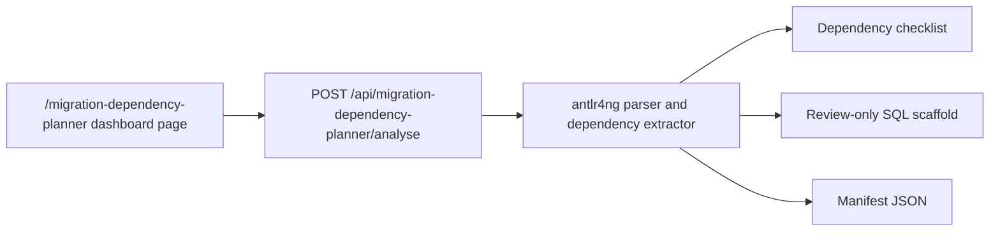

# Migration Dependency Planner

Migration Dependency Planner is available at `/migration-dependency-planner` under Development & Engineering. It accepts pasted T-SQL and builds a static migration checklist for databases, schemas, and likely object dependencies that need to be reviewed before moving code to a new server.

The first version is intentionally paste-only. It does not connect to SQL Server, does not execute SQL, does not read saved profiles, and does not persist results.



## API Surface

- `POST /api/migration-dependency-planner/analyse`

All calls require an authenticated SQL Cockpit browser session. The endpoint is same-origin and session-scoped.

## Request Shape

```json
{
  "sqlText": "SELECT * FROM dbo.Orders;",
  "defaultDatabase": "Sales",
  "defaultSchema": "dbo",
  "options": {}
}
```

`defaultDatabase` and `defaultSchema` are optional. They are used only when pasted SQL omits part of an object name.

## Response Shape

```json
{
  "ok": true,
  "summary": {
    "objectCount": 3,
    "databaseCount": 1,
    "schemaCount": 2,
    "warningCount": 1,
    "highConfidenceCount": 2,
    "byKind": {
      "tableOrView": 2,
      "procedure": 1
    }
  },
  "dependencies": [],
  "warnings": [],
  "generatedSql": {
    "setupScript": "-- review-only scaffold",
    "manifestJson": "{ }"
  }
}
```

Validation errors return `ok: false` with `error.message`, `error.type`, and `error.details`.

## Extraction Rules

The analyser uses the generated `MigrationDependencySql` ANTLR grammar with the `antlr4ng` runtime, then interprets the parse/token stream for migration-specific object references. Comments are ignored by the grammar and string literals are tokenised so dynamic SQL can be warned without being treated as physical object references.

It recognises:

- `USE` database context.
- `CREATE` and `ALTER` for views, procedures, functions, triggers, and synonyms.
- `FROM`, `JOIN`, `APPLY`, `INTO`, `UPDATE`, `DELETE FROM`, and `MERGE INTO` object references.
- `EXEC` procedure calls.
- Multipart function-like calls.
- Two-part, three-part, and four-part names.

Static confidence is reported as `high`, `medium`, or `low`. Dynamic SQL, temporary objects, variables, inferred schema/database context, synonyms, and linked-server references are surfaced as warnings.

## Generated SQL

The generated SQL is a migration planning scaffold, not a complete deployment script. It includes:

- `CREATE DATABASE` guards for detected databases.
- `CREATE SCHEMA` guards for detected schemas.
- ordered comments for each object that must be scripted from the source environment.
- source line/column, relation, confidence, and review warnings.

Replace each TODO object section with source definitions from an approved source system before using the script for migration.

## Operational Risk

The endpoint is low-risk because it analyses text only. It can still expose sensitive names in the browser response, downloaded SQL, or copied manifest. Treat outputs as operational artifacts and avoid sharing them outside the approved migration team.

No database config tables, flags, or provider-backed state are added by this feature.

## Safe Test Procedure

1. Open `/migration-dependency-planner`.
2. Paste `USE Sales; SELECT * FROM dbo.Orders; EXEC dbo.RefreshOrders;`.
3. Click **Analyse SQL**.
4. Confirm the checklist shows `Sales.dbo.Orders` and `Sales.dbo.RefreshOrders`.
5. Confirm the setup script has `CREATE DATABASE`, `CREATE SCHEMA`, and TODO object sections.
6. Paste a dynamic SQL string and confirm the warning list calls it out as unresolved.

## Known Limitations

- Pasted SQL cannot recover full object definitions by itself.
- Dynamic SQL and variable object names require manual review.
- Object type is inferred from SQL shape unless the statement defines the object directly.
- Future database/object selection must resolve definitions through the SQL Cockpit Agent or object-search cache, not direct API-side SQL connections.
