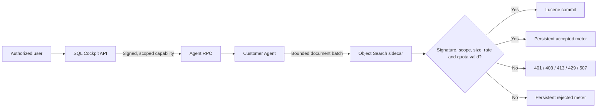

# Object Search ingest guardrails and metering

Object Search treats Agent uploads as hostile input. Hosted/shared deployments use a short-lived server-issued HMAC capability scoped to one operation, workspace, SQL Server, optional database, and expiry. The Agent cannot mint a capability or raise a server-owned quota.

The signing key and `X-Sql-Object-Search-Key` administrative key are server secrets. Never place them in a customer Agent configuration. A co-located Agent that can read server secrets is within the server trust boundary; isolate it with separate service identities/ACLs or separate hosts.

## Hard controls

`POST /documents/batch` validates the entire batch before mutating Lucene. It uses constant-time HMAC verification, enforces workspace/server/database scope on upserts and deletes, rejects duplicate IDs, caps request/batch/document size, and applies per-minute, per-operation, UTC-day ingest, workspace document/storage, and Kestrel connection limits. Meters survive restart in an atomically replaced JSON ledger.

Unexpected server errors are logged server-side and the response is sanitized.
If the persistent ledger cannot be written, ingest fails closed with `503 USAGE_METER_UNAVAILABLE`; the service will not continue accepting unmetered work.

## Settings

All values are under `service` in the object-search settings file.

| Setting | Default | Safe operation |
| --- | ---: | --- |
| `requireWriteCapability` | `true` hosted; `false` only in explicit local examples | Never disable on a shared/hosted service. |
| `writeTokenSigningKey` | none; minimum 32 characters | Store in the server secret manager and configure the same value for API and sidecar. Never expose to an Agent. |
| `writeTokenSigningKeyPath` | none | Preferred server-local secret-file path. Test/Prod lane publishing creates and preserves a 48-byte random key outside the artifact and restricts it to SYSTEM/local Administrators. |
| `writeTokenLifetimeSeconds` | 3600; API accepts 60-3600 | Keep close to the longest supported sync. |
| `usageLedgerPath` | `./data/object-search/usage-ledger.json` | Must be writable; corrupt/unreadable existing state fails startup closed. |
| `maxRequestBytes` | 33,554,432 | Keep at/above a valid serialized batch. |
| `maxDocumentsPerBatch` | 500 | Keep at/above sync `batchSize` (200 by default). |
| `maxDeleteIdsPerBatch` | 2,000 | Lower after observing production deletes. |
| `maxDocumentBytes` | 2,097,152 | Inspect rejected large definitions before raising. |
| `maxWorkspaceDocuments` | 1,000,000 | Tenant cost boundary. |
| `maxWorkspaceStoredBytes` | 5 GiB | Estimated stored payload; also enforce a physical volume quota. |
| `maxWorkspaceDailyIngestBytes` | 10 GiB UTC/day | Counts updates even when net storage is unchanged. |
| `maxOperationRequests` | 20,000 | Bounds valid-token replay/work. |
| `maxOperationDocuments` | 2,000,000 | Bounds valid-token replay/work. |
| `maxOperationIngestBytes` | 5 GiB | Bounds valid-token replay/work. |
| `maxWorkspaceRequestsPerMinute` | 240 | Includes rejected scoped requests. |
| `maxUnauthorizedRequestsPerMinute` | 120 | Defense-in-depth; add a lower proxy limit too. |
| `maxConcurrentConnections` | 128 | Coordinate with proxy and memory capacity. |

Environment overrides are available for `SQL_COCKPIT_OBJECT_SEARCH_REQUIRE_WRITE_CAPABILITY`, `SQL_COCKPIT_OBJECT_SEARCH_WRITE_TOKEN_SIGNING_KEY`, `SQL_COCKPIT_OBJECT_SEARCH_USAGE_LEDGER_PATH`, plus the existing listen URL, index root, and API key variables.
`SQL_COCKPIT_OBJECT_SEARCH_WRITE_TOKEN_SIGNING_KEY_PATH` selects the external secret file. If the Service Host uses a custom identity, grant it read access without granting the customer Agent identity access.

## Administrative usage API

`GET /api/admin/settings/cache/lucene/usage` requires an authenticated same-origin session and `admin.settings.edit`. It returns limits, current estimated workspace storage, accepted/rejected UTC-day counters, recent operation meters, and aggregate unauthorized attempts. It never returns secrets/capabilities.

## Test and rollout

1. Put a random 32+ character signing key in the Test secret store for both API and sidecar.
2. Set `requireWriteCapability=true`; restart sidecar, API, then Agent.
3. Run an incremental sync and inspect the admin usage API.
4. Run the repository integration test to prove forged, cross-workspace, and oversized batches fail without index mutation and that meters survive restart.
5. Add reverse-proxy rate/body limits, actual disk/volume quotas, and cloud budget alerts before production.

Rollback to the prior artifact/settings if needed. Disabling capabilities is only an acceptable loopback development rollback.

## Residual risk

A compromised Agent can consume the allowance of its currently valid scoped operation. The quotas bound, rather than eliminate, that loss. Physical Lucene segment/merge overhead is not represented exactly by estimated stored bytes. The ledger/index are single-writer and must not be shared by active-active sidecars without a transactional shared meter provider.
