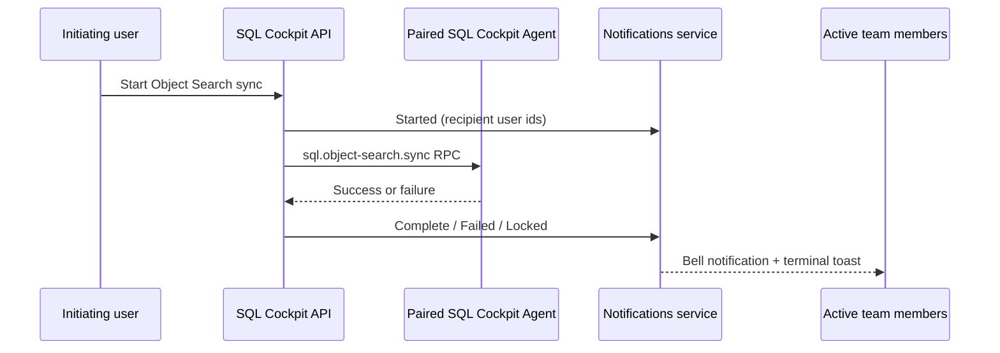

# Database Object Search Operations

## Upstream attribution

`sql-cockpit-object-search` is based on Apache Lucene.NET. Credit and thanks go to the Apache Software Foundation and Lucene.NET project contributors for the upstream search library and origin project.

- Upstream project: `https://lucenenet.apache.org/`
- Upstream source: `https://github.com/apache/lucenenet`
- License: Apache License, Version 2.0
- Local notice file: `sql-cockpit-object-search/NOTICE`

No endorsement by the Apache Software Foundation or the Lucene.NET project is implied.

## Local-only cache model

The API `GET /health` response is generated in-process and does not start PowerShell or contact a SQL Server. This keeps the Service Host liveness probe responsive while a long Object Search Agent operation is running. The response retains the existing `status`, `listenPrefix`, and `configDatabase` fields. Detailed Object Search readiness remains available from authenticated `GET /api/object-search/health` and sync progress from `GET /api/object-search/status`.

After a sync is accepted, the dashboard retains its optimistic running state if the first status poll still contains a different operation's terminal result. Polling continues until the Agent writes the accepted operation id, preventing an earlier success or failure from suppressing the current operation's terminal toast.

Completed progress is operation-scoped: the modal uses the run's `totalSources`, `uploadedDocumentCount`, and `deletedDocumentCount`. Historical manifests remain available for per-instance “last sync” summaries but do not inflate the completed run totals.


- deploy code plus sidecar runtime only; do not publish Lucene index files, spool checkpoints, manifests, or sync logs
- keep source definitions and credentials in `sql-cockpit-object-search/sql-object-search.settings.local.json` only
- settings resolution defaults to local override first, then safe tracked defaults (`settings.json` / `settings.template.json`)

## Daily flow

1. Copy `sql-cockpit-object-search/sql-object-search.settings.local.json.example` to `sql-cockpit-object-search/sql-object-search.settings.local.json` and add your source list locally.
2. Start SQL Cockpit through `Start-SqlTablesSyncWorkspace.ps1` or start the Lucene.NET sidecar manually with `Start-SqlObjectSearchService.ps1` and then start `Start-SqlTablesSyncRestApi.ps1`.
3. First run on a new machine: run `POST /api/object-search/index/rebuild` or `.\Sync-SqlObjectSearchIndex.ps1 -Mode Full`.
4. Ongoing runs: run `POST /api/object-search/index/refresh` or `.\Sync-SqlObjectSearchIndex.ps1 -Mode Incremental`.
5. Open SQL Cockpit and press `Ctrl+K` (`Cmd+K` on macOS).
6. Confirm the command-palette object-type filters show distinct icons for tables, views, procedures, functions, triggers, columns, indexes, constraints, synonyms, and SQL Server Agent jobs.
7. With an empty search, confirm `Recent Objects` contains recently modified indexed objects from Lucene.NET, with up to five entries for each indexed object type when that type has enough cached objects.
8. Submit text from the header search toolbar and confirm the palette skips `GET /api/object-search/recent`, then searches the object-search cache with that keyword.
9. Use an **Open in command palette** action from Estate Overview or a visual object graph and confirm the palette query includes `instance:<server>` for the selected source while the object-type filter remains **All**.
10. Drag the divider between search results and detail preview on desktop widths, then double-click it to reset the split to 50/50.
11. With an empty text query, select an object filter or instance/database scope and confirm indexed results load for those criteria.
12. Change the **Instance** selector while a table search is active and confirm result rows are limited to that selected instance.
13. Select an indexed object and use the detail dropdown action `Open in SQL Editor` to verify definition hand-off into the editor workflow.
14. Start an object-search sync and confirm the dashboard refreshes object-search status from the notifications WebSocket; the fallback status refresh should be no more frequent than roughly once per minute unless the sync progress modal is open. Confirm the streamed sync log uses the larger modal space, auto-scrolls by default, preserves the current scroll position when **Auto-scroll** is unchecked, and appends new lines without replacing the whole panel.
15. Open `/` and confirm Welcome Page status-backed widgets call `GET /api/object-search/status?compact=1`; use full `GET /api/object-search/status` for manifest or sync-diagnostic work.

## Team lifecycle notifications

Object Search sync publishes one authoritative lifecycle notification at the API/Agent boundary for `Started`, `Complete`, `Failed`, or `Locked`. Personal-workspace notifications target the initiating user. Team-workspace notifications resolve every active team member and place those user ids in `metadata.recipientUserIds`. Terminal notifications also raise a deduplicated in-app toast for each signed-in recipient with an open dashboard session.



Publishing is best effort and does not change the sync result. Recent lifecycle records are in memory and are cleared when the notifications service restarts. Failure messages are operational text returned by the Agent; Agent errors must not contain passwords, tokens, or full connection strings.

The HTTPS lane proxy gives `POST /api/object-search/index/*` requests 31 minutes, slightly longer than the Agent's 30-minute Object Search RPC deadline. Other HTTP requests retain the two-minute proxy timeout. This prevents the initiating browser from receiving a false `502` while a healthy full sync is still running. Every new operation also clears the status file's `lastError` before progress begins, so a previous failed server cannot contaminate the next run's status.

The start endpoints return `202 Accepted` immediately with `{ "status": "accepted", "operationId": "..." }`; they do not wait for SQL extraction or indexing to finish. The API continues the Agent RPC in the background, while Instance Manager follows the persisted status and realtime notification stream. Treat the terminal `Complete`, `Failed`, or `Locked` notification for that operation id as the authoritative result.

## Sync Log Streaming

`GET /api/object-search/sync-log` is read-only and authenticated. Use `operationId=<id>` to scope to one sync operation, `limit` for the maximum returned line count, and `after=<nextCursor>` to continue from a previous response. The API reads bounded chunks from `Logs/ObjectSearch/sync.log`; it does not load the whole file into memory for each dashboard poll.

Response fields include `lines`, `nextCursor`, `fileSize`, `bytesRead`, `truncated`, `hasMore`, and `reset`. When `reset` is true, replace the visible buffer because the log file was rotated or the cursor became stale. Operational risk is low; the main tradeoff is that very old operation lines may no longer be visible if they fall outside the bounded tail window.

If `dotnet` is installed outside `PATH`, pass the explicit executable path:

```powershell
powershell.exe -NoProfile -ExecutionPolicy Bypass -File .\Start-SqlTablesSyncWorkspace.ps1 `
  -ConfigServer "YOURSERVER" `
  -ConfigDatabase "YOURCONFIGDB" `
  -ConfigIntegratedSecurity `
  -DotNetExecutable "C:\custom\dotnet\dotnet.exe"
```

If `dotnet` is not installed yet:

1. Download it from the official Microsoft page:
   `https://dotnet.microsoft.com/en-us/download/dotnet`
2. Install the `.NET 8 SDK` on the machine used to build or publish the bundled sidecar.
3. Run `dotnet --info` in a new PowerShell session to confirm the install succeeded.
4. Run `.\Publish-SqlObjectSearchService.ps1` to produce the bundled `SqlObjectSearch.Service.exe`.

Important note:

- the SDK is required on the build machine because `Publish-SqlObjectSearchService.ps1` runs `dotnet publish`
- end-user machines do not need a separate .NET install once you ship the bundled `SqlObjectSearch.Service.exe`

## Full rebuild

Use a full rebuild when:

- a source database was added or removed
- a manifest file was deleted or corrupted
- search results appear stale after large schema churn
- you changed schema include or exclude filters

Command:

```powershell
powershell.exe -NoProfile -ExecutionPolicy Bypass -File .\Sync-SqlObjectSearchIndex.ps1 -Mode Full
```

## Clear local index and start again

Use this when you intentionally want to discard the local Lucene.NET index, resumable spool checkpoints, and stale-document manifests.

Common reasons:

- a branch switch or sidecar build mismatch left old payloads in the durable spool
- `/documents/batch` keeps replaying a bad checkpoint payload
- the local Lucene index is suspected to be corrupt
- you want a completely fresh object-search baseline

Important:

- stop the workspace or the object-search sidecar first, otherwise Lucene.NET will keep `index\write.lock` open and Windows will block deletion
- deleting `spool` means the next sync cannot resume the current long-running operation and must rebuild metadata from SQL Server
- deleting `manifests` removes the previous baseline used for stale-document comparison

Stop the sidecar process on the default object-search port:

```powershell
Get-NetTCPConnection -LocalPort 8094 -ErrorAction SilentlyContinue |
    Select-Object -ExpandProperty OwningProcess -Unique |
    ForEach-Object {
        Write-Host "Stopping object-search service PID $_"
        Stop-Process -Id $_ -Force
    }
```

If deletion still reports `write.lock`, check for a stale `dotnet` or bundled sidecar process and stop only the one that belongs to this workspace:

```powershell
Get-Process dotnet, SqlObjectSearch.Service -ErrorAction SilentlyContinue
```

Clear the object-search state:

```powershell
$ErrorActionPreference = 'Stop'

$root = Resolve-Path 'C:\Scripts\SQL Tables Sync\sql-cockpit-object-search\data\object-search'

foreach ($name in @('index', 'spool', 'manifests')) {
    $path = Join-Path $root $name

    if (Test-Path -LiteralPath $path) {
        Write-Host "Removing $path"
        Remove-Item -LiteralPath $path -Recurse -Force
    }
}

New-Item -ItemType Directory -Force -Path `
    (Join-Path $root 'index'), `
    (Join-Path $root 'spool'), `
    (Join-Path $root 'manifests') | Out-Null

Write-Host 'Object-search index, spool, and manifests cleared.'
```

Restart the workspace, then run `Sync Schema To Search` or a full sync again.

## Scheduled object sync jobs

Task Manager can run object-search cache rebuilds with the `InternalCommand`
value `object-sync`. The command uses a saved Instance Manager
`instanceProfileId`; `databaseName` is optional and narrows the run to one
database. When `databaseName` is empty, the sync covers all visible databases on
the instance and includes SQL Agent job metadata.
The task also stores `workspaceKey` and `sourceServer`. If the saved profile id
is later recreated, the worker may resolve the same source server inside that
stored workspace key, but it does not cross into another personal or team
workspace. The default object-sync task seeder discovers source servers from
current workspace profiles instead of embedding fixed profile ids.

Concurrency is source-aware. Each task uses `ForbidOverlap` so the same job
cannot run twice at once, and the sync script takes a workspace/source/database
lock before writing cache data. Separate instance jobs in the same workspace may
run at the same time, while a duplicate sync for the same workspace/source is
rejected or skipped as already running.

Hanging run visibility is explicit. `GET /api/tasks` and `GET /api/tasks/{id}`
include `runtimeHealth` for object-sync tasks whose latest task state is still
`Running`; the Task Manager UI shows stale heartbeat evidence as **Possibly
hung** instead of a normal running badge. `Object Sync Watchdog` marks orphaned
object-sync `TaskRun` rows as `TimedOut` with
`OBJECT_SYNC_STALE_HEARTBEAT`, releases stale Task Manager locks, and then
resumes from the safest checkpoint when recovery evidence exists. Each watchdog
pass also repairs its own older orphaned `Running` rows with
`OBJECT_SYNC_WATCHDOG_STALE_RUN` when the recorded SQL Cockpit agent process is
no longer alive, so stale recovery notifications do not linger after API
restarts.
The Task Manager child page `/task-manager/events` shows the realtime task-run
event stream separately from task definitions, including lifecycle frames and
redacted task output frames, so operators can watch recovery and hanging-task
signals without expanding individual task rows. The page also backfills recent
persisted runs from `GET /api/task-runs?limit=100`, so opening it after a run
started still shows timeline rows before new socket frames arrive.
Manual object-sync task runs are dispatched to a detached Task Manager worker
and return immediately with the queued `TaskRun`; the worker keeps the
PowerShell sync process attached until completion, publishes realtime events,
and uses the temporary connection handoff file so SQL passwords are not placed
in PowerShell command-line arguments.
Object-sync app notifications use
`/task-manager/object-sync-progress?taskId=<task-id>&taskRunId=<run-id>` as
their **Open** action, with `operationId=<object-search-operation-id>` included
when the notification has it. The focused page uses the same authorized
Task Manager detail/log endpoints, but labels the route as Object Sync Progress
and loads the selected run's source-count summary plus object-search sync log
ahead of the generic task definition table.
`GET /api/object-search/status` also returns `activeTaskSyncs`, a
workspace-authorized list of visible running Task Manager object-sync runs. The
dashboard uses that list to keep minimized running-sync controls visible even
though the sidecar's global status file can only describe the latest heartbeat.
The browser keeps polling while `activeTaskSyncs`, `sync.isRunning`, or
workspace locks are present, and the bottom-right control stack is constrained
to the viewport with internal scrolling so several task/lock rows remain
recoverable. The Welcome Page also loads the object-search status feed when it
opens, so a second browser window opened after the start notification can still
discover the running task and render the minimized control. Task Manager
object-sync runs use a deterministic object-search operation id derived from
the TaskRun id, and the dashboard can recover an existing live operation id from
matching workspace/source locks. Use `activeTaskSyncs[].operationId` or the
matching `sync.activeLocks` operation id for task-specific logs because
`sync.operationId` can describe another overlapping sync's latest heartbeat.

Operational contract:

- Storage location: `TaskDefinition`, `TaskSchedule`, and
  `TaskAction.action_config_json` in the local SQL Cockpit SQLite database.
- Valid values: `instanceProfileId`, optional `sourceServer`, optional
  `databaseName`, and `mode` (`Full` or `Incremental`; default `Full`).
- Defaults during stabilization: manual/run-on-demand jobs, `ForbidOverlap`, no
  retries. Enable a `FixedInterval` schedule only after the rebuild path is
  stable for the target instance.
- Failure behavior: failed or timed-out object-sync jobs are disabled so they do
  not retry unattended. The task keeps its stored schedule type and interval so
  an operator can re-enable the same cadence after fixing the profile or sidecar
  issue. A same-source lock conflict is treated as `Skipped`, not `Failed`, so
  concurrent rebuild batches do not disable unrelated jobs. The watchdog checks
  fresh per-source recovery records before broad stale marking, which protects
  unrelated parallel object-sync task runs when the single global status file is
  overwritten by another source.
- Operational risk: medium to high on large or sensitive instances because the
  sync reads broad catalog metadata and can expose object names, definitions,
  columns, indexes, constraints, dependencies, and SQL Agent job details to
  users who can search the active workspace cache.

## Differential incremental sync

Incremental object-search syncs use a per-source manifest to avoid rewriting
unchanged Lucene documents. The sync still asks SQL Server for objects touched
since the last successful source sync and still reads the current source
manifest so deleted objects can be removed. Before upload, each candidate
document is converted to a stable JSON shape and hashed with SHA-256. The hash
is compared with the previous manifest entry for the same document id.

Only documents with a new or changed hash are written to the durable upload
spool and sent to the Lucene sidecar. Unchanged documents stay in Lucene and
their previous hash is carried forward into the next manifest. Deleted document
ids are still calculated from the previous full manifest versus the current
manifest and are removed by id.

Manifest storage:

- Location: `settings.sync.manifestDirectory`, one JSON file per
  workspace/source/database.
- `documentIds`: all currently live document ids for count verification and
  stale deletion detection.
- `documentHashes`: SHA-256 hash map keyed by document id for differential
  upload decisions.
- Durable spool checkpoint fields: `candidateDocumentCount`,
  `changedDocumentCount`, `newDocumentCount`, `updatedDocumentCount`,
  `unchangedDocumentCount`,
  `candidateObjectTypeCounts`, `changedObjectTypeCounts`, `manifestIds`, and
  `manifestHashes`.

Run summary fields:

- `candidateDocumentCount`: documents built from metadata touched since the
  previous successful source sync, or all built documents during a full sync.
- `newDocumentCount`: uploaded documents whose id was not present in the prior
  manifest hash map.
- `updatedDocumentCount`: uploaded documents whose id existed in the prior
  manifest hash map but whose stable document hash changed.
- `changedDocumentCount`: total candidate documents uploaded to Lucene
  (`newDocumentCount + updatedDocumentCount` when prior hashes are available).
- `unchangedDocumentCount`: candidate documents skipped because the indexed
  document hash matched the prior manifest.
- `deletedDocumentCount`: stale manifest ids deleted from Lucene.
- `manifestDocumentCount`: expected live Lucene documents for the source after
  upload and deletion complete.
- `candidateObjectTypeCounts` and `changedObjectTypeCounts`: object-type
  breakdowns for the candidate set and uploaded changed set.

Operational behavior:

- First sync for a source, missing `lastSuccessfulSyncUtc`, missing manifest, or
  `-Mode Full` behaves as a full source upload.
- Incremental runs without previous hashes upload all built candidates once and
  write hashes for subsequent runs. In that compatibility case the run can
  report uploaded candidates as changed because the previous hash baseline was
  unavailable.
- Resume uses the durable spool and checkpoint hashes; if an old checkpoint has
  no hashes, the completed manifest is rebuilt from spooled documents and the
  prior manifest where possible.
- Resume is source-local. A new operation does not skip a completed database
  merely because an older manifest/status row exists. The manifest is a catalog
  baseline, not proof that its documents still exist in Lucene; every source is
  therefore revalidated after an admin cache clear.
- Lucene count verification still compares the live source count with
  `manifestDocumentCount`, so skipping unchanged uploads does not hide missing
  or stale documents.

Operational risk: medium. The hash comparison reduces write load, but it relies
on the manifest remaining intact. If the manifest is deleted or corrupted, run a
full rebuild to re-establish the baseline.

Safe test:

1. Run a full sync for a non-production workspace/source and confirm the
   manifest contains `documentIds` and `documentHashes`.
2. Run an incremental sync without schema changes and confirm the log reports
   changed documents near zero, unchanged candidate documents where SQL metadata
   was touched, and a matching Lucene count.
3. Alter one object definition, run incremental sync, and confirm only that
   object's document family is uploaded while unchanged candidates are skipped.
4. Drop one test object, run incremental sync, and confirm
   `deletedDocumentCount` increases and Lucene count verification passes.

## SQL Server Agent jobs

Instance-wide sync through `POST /api/object-search/index/sync-connection` adds a stable `msdb` source for SQL Server Agent jobs. This keeps job documents server-scoped instead of duplicating them under each user database.

The sync reads:

- `msdb.dbo.sysjobs`
- `msdb.dbo.sysjobsteps`
- `msdb.dbo.sysjobschedules`
- `msdb.dbo.sysschedules`
- `msdb.dbo.syscategories`

Each job becomes one Lucene document with:

- `objectType = Agent Job`
- `databaseName = msdb`
- `schemaName = SQL Agent`
- qualified name `[SQL Agent].[job name]`
- job description, schedules, step names, subsystems, step database names, and step command text in searchable fields
- `modifiedDate` from `msdb.dbo.sysjobs.date_modified`

Safe test:

1. Run `Sync Server To Search` for a non-production instance profile.
2. Open the command palette and select the `Agent Jobs` filter.
3. Search for a known SQL Agent job.
4. Compare the result with SQL Agent Manager for the same instance.
5. Optionally call `/api/object-search/search?q=<job-name>&objectType=Agent+Job` and confirm only active-workspace results are returned.

Operational risk:

- users with command-palette search access can see indexed SQL Agent job names, descriptions, schedules, step names, and step command text
- if msdb job metadata cannot be read, the sync logs a warning and continues with database object indexing

## Guardrails for commits

- local pre-commit guard:
  `git config core.hooksPath .githooks`
- manual guard check:
  `powershell.exe -NoProfile -ExecutionPolicy Bypass -File .\scripts\runtime\Test-ObjectSearchLocalOnlyArtifacts.ps1`
- CI guard check:
  `.github/workflows/ci-cd.yml` job `Guard Object-Search Local Cache Artifacts`

## Case study: full sync for one database

This case study uses a real Object Search Sync modal log from a full sync of `firebird/SOURCE_DATABASE`.

The run produced this high-level outcome:

| Metric | Value | Meaning |
| --- | ---: | --- |
| Base objects | 8,783 | Parent SQL Server objects such as tables, views, procedures, functions, triggers, and synonyms. |
| Columns | 86,592 | Column metadata read for tables and views. |
| Parameters | 5,185 | Procedure and function parameter metadata. |
| Dependency rows | 19,831 | Object-reference relationships used to enrich search and dependency discovery. |
| Indexes | 322 | Index metadata that can be searched directly and attached to parent table context. |
| Constraints | 7,328 | Constraint metadata such as primary keys, foreign keys, unique constraints, checks, and defaults where available. |
| Searchable documents | 103,025 | Final documents prepared for Lucene.NET. This is larger than the base object count because child metadata can become searchable entries too. |

Example log:

```text
[2026-04-09T09:52:54.9262197Z] [1ed4d126-d352-42af-b212-d5d31253ffed] Started object-search sync in Full mode.
[2026-04-09T09:52:55.4517171Z] [1ed4d126-d352-42af-b212-d5d31253ffed] Syncing [firebird/SOURCE_DATABASE] in Full mode.
[2026-04-09T09:52:55.6426179Z] [1ed4d126-d352-42af-b212-d5d31253ffed] Reading base objects from [firebird/SOURCE_DATABASE].
[2026-04-09T09:52:56.3879908Z] [1ed4d126-d352-42af-b212-d5d31253ffed] Read 8783 base objects from [firebird/SOURCE_DATABASE].
[2026-04-09T09:52:56.3981532Z] [1ed4d126-d352-42af-b212-d5d31253ffed] Reading columns from [firebird/SOURCE_DATABASE].
[2026-04-09T09:52:58.7150229Z] [1ed4d126-d352-42af-b212-d5d31253ffed] Read 86592 columns from [firebird/SOURCE_DATABASE].
[2026-04-09T09:52:58.7277332Z] [1ed4d126-d352-42af-b212-d5d31253ffed] Reading parameters from [firebird/SOURCE_DATABASE].
[2026-04-09T09:52:59.3423113Z] [1ed4d126-d352-42af-b212-d5d31253ffed] Read 5185 parameters from [firebird/SOURCE_DATABASE].
[2026-04-09T09:52:59.3601190Z] [1ed4d126-d352-42af-b212-d5d31253ffed] Reading referenced objects from [firebird/SOURCE_DATABASE].
[2026-04-09T09:52:59.8313186Z] [1ed4d126-d352-42af-b212-d5d31253ffed] Read 19831 dependency rows from [firebird/SOURCE_DATABASE].
[2026-04-09T09:52:59.8775983Z] [1ed4d126-d352-42af-b212-d5d31253ffed] Reading indexes from [firebird/SOURCE_DATABASE].
[2026-04-09T09:52:59.9747634Z] [1ed4d126-d352-42af-b212-d5d31253ffed] Read 322 indexes from [firebird/SOURCE_DATABASE].
[2026-04-09T09:52:59.9823912Z] [1ed4d126-d352-42af-b212-d5d31253ffed] Reading constraints from [firebird/SOURCE_DATABASE].
[2026-04-09T09:53:00.3102853Z] [1ed4d126-d352-42af-b212-d5d31253ffed] Read 7328 constraints from [firebird/SOURCE_DATABASE].
[2026-04-09T09:53:00.3265604Z] [1ed4d126-d352-42af-b212-d5d31253ffed] Building documents for [firebird/SOURCE_DATABASE].
[2026-04-09T09:54:09.4853292Z] [1ed4d126-d352-42af-b212-d5d31253ffed] Built 103025 searchable documents for [firebird/SOURCE_DATABASE].
```

How to read each step:

| Log stage | What it does | Outcome |
| --- | --- | --- |
| `Started object-search sync in Full mode` | Starts a new operation and assigns the operation id shown in square brackets. | The modal can scope status and streamed logs to this one run. |
| `Syncing [server/database] in Full mode` | Selects the current database and declares the effective mode. | In full mode, existing documents for that database scope are replaced before the new documents are uploaded. |
| `Reading base objects` | Reads parent SQL Server object metadata from catalog views such as `sys.objects`, `sys.schemas`, `sys.sql_modules`, `sys.tables`, `sys.views`, and `sys.synonyms`. | Produces the parent object list that anchors search results. |
| `Reading columns` | Reads column and type metadata for tables and views. | Produces searchable `Column` records and enriches table/view documents. |
| `Reading parameters` | Reads stored procedure and function parameter metadata. | Produces parameter text for procedure/function search and signatures. |
| `Reading referenced objects` | Reads dependency rows, such as one procedure referencing a table or view. | Adds dependency context to object documents. |
| `Reading indexes` | Reads index metadata for table-like objects. | Produces searchable `Index` records and enriches parent table context. |
| `Reading constraints` | Reads constraint metadata where SQL Server exposes it. | Produces searchable `Constraint` records and enriches parent table context. |
| `Building documents` | Converts raw catalog rows into the canonical object-search document model. | Creates stable document ids, qualified names, searchable text, tags, child-object documents, and metadata arrays for Lucene.NET. |
| `Building document lookup tables` | Groups columns, parameters, and dependency rows by parent object id before parent documents are created. | Parent object documents can include their column lists, parameter lists, and referenced objects without repeatedly scanning all rows. |
| `Building parent object documents` | Creates documents for tables, views, procedures, functions, triggers, and synonyms. | The command palette can find parent SQL objects by name, schema, definition, tags, and related metadata. |
| `Building column documents` | Creates one searchable document per column. Large databases emit periodic count updates during this loop. | The command palette can search columns independently from their parent tables/views. |
| `Building index documents` | Creates one searchable document per index. | The command palette can search index names and index definitions. |
| `Building constraint documents` | Creates one searchable document per constraint. Large databases emit periodic count updates during this loop. | The command palette can search primary keys, foreign keys, check/default constraints, and related table context. |
| `Built n searchable documents` | Finishes the in-memory document-building phase for this database. | The next phases can replace existing scope documents, upload batches to Lucene.NET, calculate stale deletes, and write the manifest. |
| `Collecting n built document ids` | Full syncs derive the fresh manifest from the just-built document set instead of re-querying SQL Server. Large document sets emit periodic count updates. | The manifest can be written for future incremental syncs, and the modal stays active while ids are collected. |
| `Uploading documents n-m of total` | Sends one batch of built documents to the Lucene.NET sidecar. Failed `400 Bad Request` batches are split into smaller batches to isolate oversized or malformed payloads. | The local Lucene index receives searchable metadata for the command palette without first emptying the old scope. |
| `Deleting stale documents n-m of total` | Removes ids that existed in the previous manifest but are not in the current manifest. This runs after upload succeeds. | Old dropped or renamed objects are removed without risking an empty index if the first upload fails. |
| `Writing manifest file` | Persists the current document id list under the object-search manifest directory. | Future incremental syncs can compare this manifest with the current catalog shape and delete stale results. |

Performance interpretation:

| Observation | Interpretation |
| --- | --- |
| Catalog reads finished in seconds. | SQL Server metadata extraction was not the bottleneck in this sample. |
| `Building documents` took about 69 seconds. | The expensive step was PowerShell-side normalization and document construction over large arrays. |
| Final document count was 103,025. | The command palette can search much more than parent objects; child metadata is searchable too. |

Robustness note:

- full syncs upsert new documents before stale deletes, so an upload failure should leave the previous searchable index content in place for that database
- after documents are built, the sync writes `documents.json` and `checkpoint.json` under `sync.spoolDirectory`; rerunning the same source/mode can reload that spool and continue from the saved `uploadedThrough` or `deletedThrough` offsets
- resumed `documents.json` files are expanded back into individual documents before upload batching; a resume log should show the original document count, not `Loaded 1 spooled documents`, for a large database
- completed source syncs remove their spool directory after the manifest file is written
- a later operation reprocesses completed sources instead of trusting their old status row; only the currently incomplete source can resume from its durable spool checkpoint
- if a spool is no longer wanted, stop the sync and delete the matching source directory under `sql-cockpit-object-search/data/object-search/spool`; the next run will rebuild from SQL Server
- upload batches are adaptively split on `400 Bad Request`; if the failing unit is a single document, the sync log records the document id, object type, qualified name, and parent before the run fails
- a failed stale-delete or manifest-write step can still fail the run, but this happens after the fresh documents have been uploaded

## Manifest phase

During a sync you may see a log line like:

```text
Reading current manifest ids for [firebird/SOURCE_DATABASE].
```

This is normal. At that point the sync is reading the current SQL Server catalog shape and building the list of search document ids that should exist for that database.

Optimization note:

- full syncs use the ids from the documents they just built as the current manifest, so they avoid a second full catalog scan after document construction
- incremental syncs still read current manifest ids from SQL Server because they need a full current object-id view to detect dropped or renamed objects that would not appear in a modify-date filtered extraction
- incremental manifest reads are split into object, column, index, and constraint phases; if a database appears to pause in this part of the modal, the streamed log should show which category is currently being read

The manifest list is used for stale-document cleanup:

- the previous manifest file records what was indexed on the last successful run
- the current manifest list records what exists in SQL Server now
- ids that existed previously but no longer exist now can be deleted from the Lucene.NET index
- this prevents the command palette from returning dropped or renamed objects

This matters most for child metadata such as columns, indexes, constraints, and parameters. SQL Server exposes modification dates for many parent objects, but it does not provide a single reliable tombstone stream for every deleted child object. Manifest comparison is the local, self-contained way the search index keeps itself tidy without requiring external infrastructure.

## Safe change procedure

1. Keep both the Node host and Lucene.NET service on loopback.
2. Validate `GET /api/object-search/health`.
3. Run one incremental refresh against a low-risk source.
4. Validate `GET /api/object-search/status`.
5. Validate `GET /api/object-search/status?compact=1` returns the same workspace, document count, and source/database names without manifest paths.
6. Search for one known object by exact name and one by definition text.
7. Check `GET /api/object-search/recent?limit=8` or reopen the command palette to confirm the recent-object list is coming from the refreshed index.
8. Only then expand the configured source list or run a full rebuild.

## Operational risks

- local disk now contains searchable object definitions and dependency metadata
- incremental sync uses parent-object `modify_date` as the practical change watermark for child records
- the command palette recent-object list is sorted from stored `modifiedDate`; objects without a parseable value appear after dated objects
- if the Lucene.NET sidecar is down, the command palette falls back to quick links only
- the Lucene.NET sidecar depends on a local `dotnet` runtime; if it is missing from `PATH`, the workspace health output will show the startup failure and all sync calls will fail until the runtime is installed
- compact object-search status is read-only and lowers dashboard payload size, but callers that need manifest paths, complete source manifests, or deep sync diagnostics should keep using full `GET /api/object-search/status`

## Confidence

- confirmed:
  the refresh and rebuild flows are local-only and PowerShell-driven
- uncertain:
  some child-object delete detection still depends on manifest comparison rather than SQL-native tombstones, so rare catalog edge cases should be handled with a full rebuild
