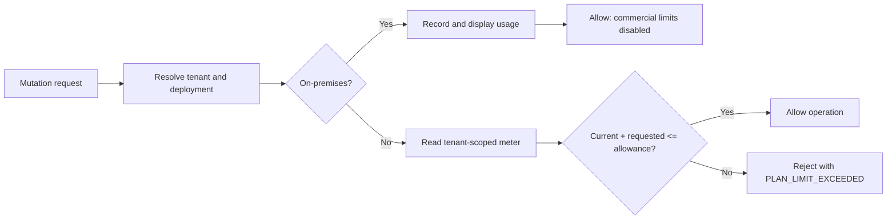
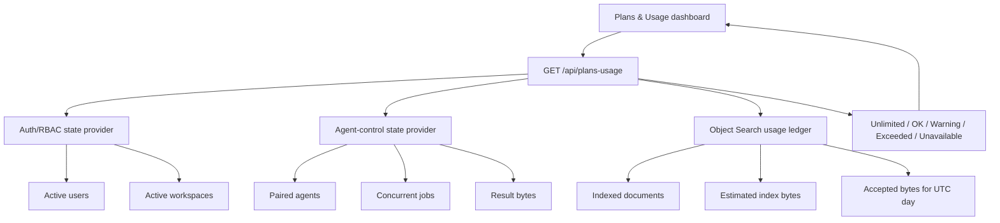

+# Plans and usage

The **Account > Plans & Usage** page shows the effective deployment plan and current tenant-scoped consumption. It is an entitlement and metering surface, not an invoice. Commercial prices are deliberately not defined yet; cloud plan allowances are marked **draft** until the pricing model is approved.

## Deployment policy

| Deployment | Effective plan | Enforcement |
| --- | --- | --- |
| On-premises, including Dev and Test lanes | `on-prem-unlimited` | Usage is measured for visibility. Commercial limits are disabled even if a cloud plan key is accidentally supplied. Operational safety limits, such as request-size and Object Search workspace guardrails, still apply. |
| Hosted tenant/cloud | `trial`, `starter`, `pro`, or `enterprise` | Configured user, workspace, agent, concurrent-job, and agent-result-storage allowances are enforced server-side. Object Search retains independent workspace and operation quotas as defence in depth. |

A limit value of `0` means unlimited. That convention is used consistently by plan evaluation and mutation guards.

## Meter architecture

Each source is measured independently. If one source fails, the API returns `health: partial` and marks its metrics `unavailable`; it does not replace missing data with zero. This prevents a meter outage from creating a false impression of spare capacity.

The API reads authentication/workspace state through the configured auth state provider. Local/on-premises installs continue to use SQLite. Hosted tenant mode uses Azure SQL through the existing provider-backed store and remains tenant-scoped by construction.

## Current metrics

| Metric | Window | Cloud enforcement point |
| --- | --- | --- |
| Active users | Current | Admin user creation |
| Active workspaces | Current | Personal workspace and admin team creation |
| Paired agents | Current | Agent invite creation and registration |
| Active agent jobs | Concurrent | Agent job creation |
| Agent result storage | Current retained bytes | Result chunk upload |
| Object Search documents | Current | Reported by plan service; hard workspace quota remains in Object Search |
| Object Search storage | Current estimated bytes | Reported by plan service; hard workspace quota remains in Object Search |
| Object Search ingest | Current UTC day | Reported by plan service; daily workspace quota remains in Object Search |

Object Search plan totals and Object Search operational quotas are intentionally separate. Hosted provisioning must set the sidecar workspace quotas equal to or below the commercial tenant allowance. The sidecar evaluates the projected write atomically and therefore remains the authoritative last-line storage/ingest guard.

## API

### `GET /api/plans-usage`

- Authentication: same-origin signed-in session.
- RBAC: any authenticated tenant user may view the tenant plan and aggregate usage. The response contains counts and byte totals, not user records, API keys, capability tokens, or billing payment data.
- Request body: none.
- Response: tenant identity, effective plan, commercial status, aggregate metrics, meter health, unavailable-source details, and catalog labels.
- Operational risk: low for data mutation, medium for availability. Calling the endpoint queries three meters. The collectors run concurrently and return partial results if a source is unavailable.
- Safe test: sign in to a non-production tenant, call the endpoint, compare user/workspace counts to the admin pages, compare Object Search totals to the protected Lucene usage endpoint, then stop one non-critical meter and confirm the response is partial rather than zero.

The legacy `GET /api/saas/plan` endpoint remains available to users with `saas.agents.view`. New dashboard integrations should use `GET /api/plans-usage`.

## Configuration reference

| Setting | Storage location | Valid values | Default | Code paths affected | Operational risk | Safe change procedure |
| --- | --- | --- | --- | --- | --- | --- |
| `SQL_COCKPIT_PLAN_KEY` / `SQL_COCKPIT_SUBSCRIPTION_PLAN` | Tenant runtime environment, normally emitted by the cloud control plane | `trial`, `starter`, `pro`, `enterprise` | `starter` in hosted mode; ignored on-premises | Plan catalog selection, agent limits, dashboard | High: a wrong plan can reject valid work or permit excess use | Change one non-production tenant, restart, call both plan APIs, exercise a bounded mutation, then roll forward |
| `SQL_COCKPIT_PLAN_DISPLAY_NAME` | Tenant runtime environment | Non-empty display text | Catalog name | Dashboard/API display only | Low: misleading label | Change in Test and verify page/API |
| `SQL_COCKPIT_USAGE_WARNING_PERCENT` | Tenant runtime environment | Integer 1-100 | `80` | Metric status and dashboard warning state | Low: too low creates noise; too high gives little warning | Adjust in Test and use a small temporary allowance to verify warning state |
| `SQL_COCKPIT_BILLING_ENABLED` | Tenant runtime environment | Boolean | `false` | Commercial status metadata only; no payment collection exists | High if interpreted as proof that invoicing exists | Keep false until a billing provider, reconciliation, and finance approval are implemented |
| `SQL_COCKPIT_LIMIT_MAX_USERS` | Tenant runtime environment | Integer, `0` unlimited | Plan default | User creation | High | Test create at limit and one over limit; confirm existing users remain usable |
| `SQL_COCKPIT_LIMIT_MAX_WORKSPACES` | Tenant runtime environment | Integer, `0` unlimited | Plan default | Personal workspace and team creation | High | Test both creation routes at and over limit |
| `SQL_COCKPIT_LIMIT_MAX_AGENTS` | Tenant runtime environment | Integer, `0` unlimited | Plan default | Agent invites and registration | High | Create/revoke a Test invite and confirm revocation frees capacity |
| `SQL_COCKPIT_LIMIT_MAX_ACTIVE_JOBS` | Tenant runtime environment | Integer, `0` unlimited | Plan default | Agent job queue | High | Queue bounded Test jobs, verify the over-limit request is rejected, then cancel jobs |
| `SQL_COCKPIT_LIMIT_RESULT_STORAGE_MB` | Tenant runtime environment | Integer MB, `0` unlimited | Plan default | Agent result upload and usage page | High: affects storage cost and job completion | Upload small Test chunks, verify aggregate bytes and over-limit rejection |
| `SQL_COCKPIT_LIMIT_OBJECT_SEARCH_DOCUMENTS` | Tenant runtime environment | Integer, `0` unlimited | Plan default | Plan evaluation/dashboard | High if not aligned with sidecar quotas | Apply with Object Search `maxWorkspaceDocuments` at or below the commercial allowance; run a bounded Test sync |
| `SQL_COCKPIT_LIMIT_OBJECT_SEARCH_STORAGE_MB` | Tenant runtime environment | Integer MB, `0` unlimited | Plan default | Plan evaluation/dashboard | High: storage-cost ceiling | Align the Object Search byte quota and underlying volume quota, then run a bounded Test sync |
| `SQL_COCKPIT_LIMIT_OBJECT_SEARCH_DAILY_INGEST_MB` | Tenant runtime environment | Integer MB per UTC day, `0` unlimited | Plan default | Plan evaluation/dashboard | High: compute and write-volume ceiling | Align Object Search daily ingest quota, verify UTC-day counters, then test a controlled rejection |

Environment values remain the control-plane authority. They are not editable from the tenant dashboard, preventing a tenant administrator from granting their own commercial entitlements.

## Pricing model guidance

The current draft catalog is suitable for technical validation, not publication. Before prices are attached:

1. Collect 30-60 days of real usage distributions for indexed documents, ingest bytes, active agents, and retained result bytes.
2. Separate cost drivers from value metrics. Storage and ingest protect cloud cost; users, agents, and retention are easier customer-facing entitlements.
3. Keep at least one soft warning before hard enforcement and provide an operator override through the control plane, with expiry and audit evidence.
4. Model p50, p90, and worst-case tenant gross margin before setting published allowances.
5. Add billing-period event counters and reconciliation before enabling `SQL_COCKPIT_BILLING_ENABLED`.

## Rollback

Restore the previous API artifact and restart the Test lane. On-premises lanes will remain unlimited. For a hosted tenant experiencing a false rejection, the control plane can temporarily set the affected numeric limit to `0` and restart that tenant revision; record the exception and expiry outside the tenant dashboard. Do not disable Object Search operational guardrails as a commercial rollback.

