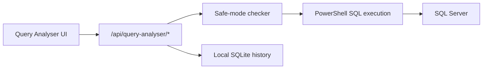

# Query Analyser

Query Analyser is the `/query-analyser` SQL Cockpit tool for inspecting SQL Server query safety, plans, diagnostics, suggestions, history, and benchmark runs.

It uses the existing Node API and `scripts/query-analyser` PowerShell scripts. It does not introduce a separate backend.



## Endpoints

- `POST /api/query-analyser/execute`
- `POST /api/query-analyser/estimate-plan`
- `POST /api/query-analyser/actual-plan`
- `POST /api/query-analyser/analyse`
- `GET /api/query-analyser/history`
- `POST /api/query-analyser/benchmark`

All endpoints require authentication. Unsafe execution is admin-only.

## Defaults

- Safe/read-only mode: enabled
- Full query text storage: disabled
- Plan XML storage: disabled
- Query timeout: request-controlled, clamped by API
- Max returned rows: request-controlled, clamped by API

## Stored History

History is stored in local SQLite at `data/sql-cockpit/sql-cockpit-local.sqlite`.

The `query_analysis_history` table stores query hash, fingerprint, server, database, connection id, timings, read/write counters, row count, status, warning count, suggestion count, optional plan XML, analysis JSON, and user id.

## Safety

Safe mode allows `SELECT`, `WITH ... SELECT`, read-only `DECLARE` usage, and diagnostic `SET STATISTICS` or `SET SHOWPLAN_XML` statements. It blocks write, DDL, command execution, backup/restore, `DBCC`, `xp_cmdshell`, and `sp_configure` statements.

## Safe Test

Run this against a non-production database:

```sql
SELECT TOP (10) *
FROM sys.objects
ORDER BY create_date DESC;
```

Then verify estimated plan, analysis, history, and a blocked destructive statement such as `DROP TABLE dbo.Test;`.
