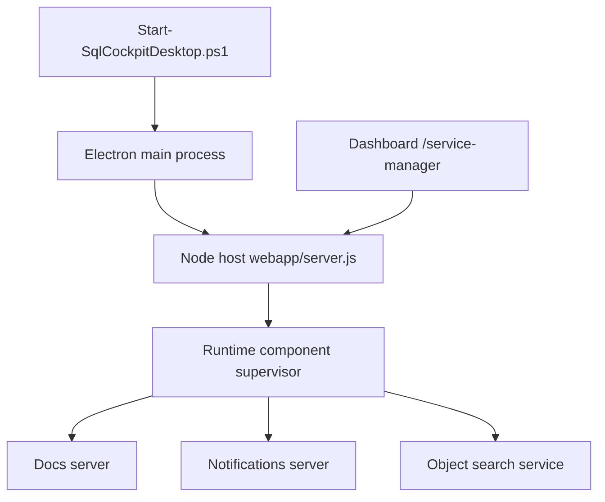

# Desktop Service Manager

The SQL Cockpit desktop runtime now runs a background component supervisor inside the Node host (`webapp/server.js`).
This supervisor keeps the local supporting services online without launching separate command windows.

For operator onboarding focused on GUI usage, use [User Guide: Desktop Service Manager](../user/desktop-service-manager.md).

For full Windows SCM training and operations guidance, use [Windows SCM Service Host](windows-service-host.md).

## Managed components

- `Docs server` (`Start-SqlTablesSyncDocsServer.ps1`)
- `Notifications server` (`Start-SqlTablesSyncNotificationsServer.ps1`)
- `Object search service` (`Start-SqlObjectSearchService.ps1`)

The dashboard page is available at `/service-manager`.
In the left rail navigation, it now appears under the dedicated `Settings` section.

## Runtime profile and ownership matrix

Use one ownership model at a time.

| Profile | Supported launcher | Ownership model | Required contract |
| --- | --- | --- | --- |
| `dev` | `Start-SqlCockpitDesktop.Dev.ps1` | Desktop embedded manager owns docs/notifications/object-search | `ManageComponents=true`, no `ServiceHostControlUrl` |
| `prod` | `Start-SqlCockpitDesktop.ProdClient.ps1` | SCM host owns web-api + side services; desktop is a client | `ManageComponents=false`, `ServiceHostControlUrl` required |

Guardrails are enforced at startup. Mixed ownership combinations fail fast.

## Runtime flow

## Supervisor settings

The following settings were added as desktop operational controls.

| Setting | Storage location | Valid values | Default | Code paths affected | Operational risk | Safe change procedure |
| --- | --- | --- | --- | --- | --- | --- |
| `SQL_COCKPIT_MANAGE_COMPONENTS` | Process environment set by `Start-SqlCockpitDesktop.ps1` | `true` or `false` | `true` | `Start-SqlCockpitDesktop.ps1`, `webapp/electron/main.js`, `webapp/server.js` | `false` disables service control and auto management. | Keep `true` unless you intentionally run external services yourself. |
| `SQL_COCKPIT_EXTERNAL_API_ONLY` | Process environment set by desktop launch scripts | `true` or `false` | `false` (auto-forced to `true` for `prod` client mode when not explicitly set) | `Start-SqlCockpitDesktop.ps1`, `Start-SqlCockpitDesktopPackaged.ps1`, `webapp/electron/main.js` | `true` with no running API causes startup timeout waiting for `/health`; `false` in prod can accidentally start an embedded API and collide with SCM ownership. | In prod client mode, keep `true`; verify `web-api` managed component is healthy before launching desktop UI. |
| `SQL_COCKPIT_COMPONENT_AUTO_START` | Process environment | `true` or `false` | `true` | `webapp/electron/main.js`, `webapp/server.js` | `false` can leave dependencies offline after app launch. | If disabled, start each component from `/service-manager` immediately after startup. |
| `SQL_COCKPIT_COMPONENT_AUTO_RESTART` | Process environment | `true` or `false` | `true` | `webapp/electron/main.js`, `webapp/server.js` | `false` means crashed components stay down. | Keep `true` in normal operations; only disable while debugging repeated crashes. |
| `SQL_COCKPIT_COMPONENT_HEALTH_POLL_SECONDS` | Process environment | Integer >= 1 | `5` | `webapp/electron/main.js`, `webapp/server.js` | Very low values increase local resource usage. | Use `5-15` seconds unless rapid restart detection is required. |
| `SQL_COCKPIT_COMPONENT_HEALTH_FAILURE_THRESHOLD` | Process environment | Integer >= 1 | `3` | `webapp/electron/main.js`, `webapp/server.js` | Too low can cause restart flapping for transient blips. | Start at `3`; only lower after confirming stable health endpoints. |
| `SQL_COCKPIT_COMPONENT_RESTART_DELAY_SECONDS` | Process environment | Integer >= 1 | `3` | `webapp/electron/main.js`, `webapp/server.js` | Too short can cause tight restart loops. | Keep at `3+` seconds and monitor logs when tuning. |
| `SQL_COCKPIT_RUNTIME_PROFILE` | Process environment | `dev` or `prod` | derived from launcher mode | `Start-SqlCockpitDesktop.ps1`, `webapp/electron/main.js`, `webapp/server.js` | Wrong value can enforce the wrong ownership model and block startup. | Use the wrapper scripts so profile and ownership are set consistently. |
| `SQL_COCKPIT_DOCS_LISTEN_PREFIX` | Process environment | HTTP URL prefix | `http://127.0.0.1:8000/` | `Start-SqlCockpitDesktop.ps1`, `webapp/electron/main.js`, `webapp/server.js`, `Start-SqlTablesSyncDocsServer.ps1` | Wrong value can make docs unavailable. | Use localhost prefixes and verify port availability before launch. |
| `SQL_COCKPIT_NOTIFICATIONS_LISTEN_PREFIX` | Process environment | HTTP URL prefix | `http://127.0.0.1:8090/` | Existing runtime + supervisor paths | Wrong value breaks live notifications feed. | Keep `127.0.0.1` and verify `/health` on that port. |
| `SQL_COCKPIT_NOTIFICATIONS_NODE_EXECUTABLE` | Process environment | Executable name/path | `node` | `Start-SqlCockpitDesktop.ps1`, `webapp/electron/main.js`, `webapp/server.js`, notifications server script | Invalid executable prevents notifications service startup. | Change only when Node is in a non-standard location. |
| `SQL_COCKPIT_NOTIFICATIONS_MAX_REQUEST_BODY_BYTES` | Process environment | Integer >= 1024 | `65536` | Notifications service launch args | Too low can reject valid notification payloads; too high can permit large payloads. | Increase in small increments and monitor notification publish errors. |
| `SQL_COCKPIT_OBJECT_SEARCH_SETTINGS_PATH` | Process environment | Valid file path | `object-search/sql-object-search.settings.json` | Existing runtime + supervisor object search paths | Wrong path prevents object search startup. | Validate the file exists before launch. |
| `SQL_COCKPIT_OBJECT_SEARCH_DOTNET_EXECUTABLE` | Process environment | Executable name/path | empty (use script defaults) | Object search launch path | Invalid path prevents fallback `dotnet run`. | Set only when the default `dotnet` command is unavailable. |
| `SQL_COCKPIT_SERVICE_HOST_CONTROL_URL` | Process environment | HTTP URL to SCM service host API (for example `http://127.0.0.1:8610`) | empty (use embedded manager) | `Start-SqlCockpitDesktop.ps1`, `webapp/electron/main.js`, `webapp/server.js` | Wrong URL disables runtime controls in the GUI and can break start/stop actions. | Validate `/health` and `/api/runtime/components` on the service host before setting this value. |
| `SQL_COCKPIT_SERVICE_HOST_API_KEY` | Process environment | Arbitrary shared secret string | empty | `Start-SqlCockpitDesktop.ps1`, `webapp/electron/main.js`, `webapp/server.js` | Key mismatch blocks control operations (`401`). | Set the same value in the service settings (`apiKey`) and desktop env, then test `GET /api/runtime/components`. |

## Service Manager page actions

- `Refresh` (refresh icon): Reloads supervisor state.
- `Start all` (play icon): Starts docs, notifications, and object search.
- `Restart all` (restart icon): Stops then starts all managed services.
- `Stop all` (stop icon): Stops all managed services.
- Per-service `Start`, `Restart`, `Stop` (matching icons): Controls a single component.

## Operational checklist

1. Open `/service-manager`.
2. Confirm each component is `Running`.
3. Confirm health is `healthy` for all components.
4. If one service is unhealthy, run `Restart` on that service first.
5. If repeated unhealthy status continues, inspect the component log path shown in the service row.
