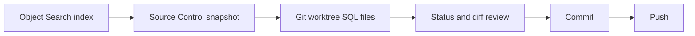

# Source Control

SQL Cockpit Source Control snapshots indexed SQL definitions into a Git working tree so operators can review changes, commit them, and push them through the normal repository flow.

The feature is available from `/source-control`.

## Workflow

Important: the snapshot source is the active workspace Object Search index. Source Control does not query live SQL Server and does not deploy SQL back to a database. Run or verify Object Search sync before relying on a snapshot for review evidence.

## RBAC

| Permission | Allows |
| --- | --- |
| `sourceControl.view` | Read settings, status, diff, and history. |
| `sourceControl.configure` | Save the Git repository path and default object types. |
| `sourceControl.snapshot` | Write SQL definition files into the configured Git worktree. |
| `sourceControl.commit` | Stage and commit repository changes. |
| `sourceControl.push` | Run `git push` using the host Git configuration. |

Local administrators receive these permissions through the built-in admin role. Non-admin users need explicit role grants.

## Settings

| Setting | Storage location | Valid values | Default | Code paths affected | Operational risk | Safe change procedure |
| --- | --- | --- | --- | --- | --- | --- |
| `sourceControlSettings.repoPath` | SQLite `user_preferences.preference_key = sourceControlSettings` | Existing local Git worktree path. If `initializeRepository` is true when saving settings, an existing directory can be initialized with `git init`. | Empty string | `sql-cockpit-api/server.js`, `sql-cockpit-api/lib/source-control-store.js`, `/source-control` | Medium. Later snapshot, commit, and push operations run inside this path. A wrong path can commit unrelated files. | Start with a disposable repository, save the path, confirm `/api/source-control/status` returns the expected branch, then snapshot a narrow filter. |
| `sourceControlSettings.defaultObjectTypes` | SQLite `user_preferences.preference_key = sourceControlSettings` | Array containing any of `View`, `Procedure`, `Function`, `Trigger`, and `Agent Job`. | All supported types | `sql-cockpit-api/server.js`, `/source-control` | Low to medium. Broad selection can write many SQL files and expose sensitive definitions. | Begin with one object type and a specific database/schema filter, review Git diff, then expand. |

## Generated Files

Snapshots write stable repository-relative files under:

- `servers/<server>/<database>/schemas/<schema>/views/<object>.sql`
- `servers/<server>/<database>/schemas/<schema>/procedures/<object>.sql`
- `servers/<server>/<database>/schemas/<schema>/functions/<object>.sql`
- `servers/<server>/<database>/schemas/<schema>/triggers/<object>.sql`
- `servers/<server>/<database>/sql-agent/jobs/<job>.sql`
- `metadata/source-control-manifest.json`

Generated SQL files include a short header identifying the Object Search source. The manifest records snapshot timing, selected filters, object count, and written paths.

## API Surface

| Endpoint | Permission | Request shape | Response shape |
| --- | --- | --- | --- |
| `GET /api/source-control/settings` | `sourceControl.view` | None | `{ settings, versionableObjectTypes, status, statusError }` |
| `PUT /api/source-control/settings` and `POST /api/source-control/settings` | `sourceControl.configure` | `{ repoPath, defaultObjectTypes, initializeRepository }` | `{ settings, status }` |
| `GET /api/source-control/status` | `sourceControl.view` | None | `{ status: { repoPath, branch, remotes, status, changedCount, clean } }` |
| `GET /api/source-control/diff?path=` | `sourceControl.view` | Optional repository-relative `path` query string | `{ repoPath, path, diff }` |
| `GET /api/source-control/history?path=&limit=` | `sourceControl.view` | Optional repository-relative `path` and integer `limit` query strings | `{ repoPath, path, history }` |
| `POST /api/source-control/snapshot` | `sourceControl.snapshot` | `{ q, sourceServer, server, database, schema, objectTypes, maxObjects }` | `{ snapshot, writtenCount, objects, warnings }` |
| `POST /api/source-control/commit` | `sourceControl.commit` | `{ message, paths }` | `{ repoPath, commit, output }` |
| `POST /api/source-control/push` | `sourceControl.push` | None | `{ repoPath, output }` |

## Operational Risks

- SQL definitions may contain proprietary logic, credentials embedded in scripts, linked server names, or operational comments. Treat the Git remote as sensitive.
- Snapshot writes can overwrite generated files in the configured worktree.
- Commit defaults to all current repository changes when `paths` is omitted. Keep the Source Control repository dedicated to SQL snapshots.
- Push uses the Git credentials and remote configuration available to the SQL Cockpit host process.
- Object Search cache freshness controls snapshot freshness. The feature is confirmed to read the index, not live SQL Server.

## Safe Test Procedure

1. Create a disposable local Git repository.
2. Open `/source-control`.
3. Save the repository path with one object type selected.
4. Run Object Search sync for a non-production workspace or confirm the cache already contains the intended objects.
5. Snapshot with a narrow `sourceServer`, `database`, `schema`, and low `maxObjects`.
6. Review Source Control status and diff.
7. Commit with a test message.
8. Push only to a disposable remote first.
9. Confirm `/api/source-control/history` shows the expected commit before expanding filters or granting push permission.
