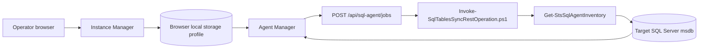
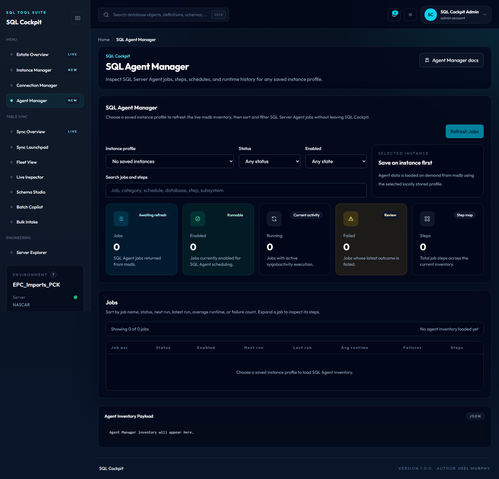

# SQL Agent Manager

SQL Agent Manager is a read-only SQL Cockpit page for reviewing SQL Server Agent jobs on saved SQL Server instances.

Use it when you need the kind of overview normally gathered from SQL Server Management Studio Agent nodes: job list, enabled state, running state, next run, latest outcome, runtime history, schedules, and job steps.

The page can start a selected SQL Agent job when an operator confirms `Run Job Now` from the job action menu. It does not stop, enable, disable, edit, or delete SQL Agent jobs.

## What It Shows

SQL Agent Manager shows:

- total SQL Agent jobs on the selected instance
- enabled and disabled job counts
- currently running jobs
- jobs whose latest recorded outcome failed
- total job steps
- job category and schedule names
- latest job status, latest run time, next run time, average runtime, failure count, and step count
- expandable step detail, including step name, subsystem, database name, last step status, average step runtime, and command context

Report Server subscription jobs are excluded from the Agent Manager inventory. These are typically GUID-named jobs created by SQL Server Reporting Services and identified by the `Report Server` job category or Report Server ownership text in the job description.

The data is useful for:

- checking whether a server has unexpected failed jobs
- comparing job volume across instances
- reviewing scheduled work before a migration or maintenance window
- finding long-running or frequently failing jobs
- inspecting what databases and commands a job touches before changing sync or reporting workflows

## How It Works



The browser stores reusable instance profiles created in `Instance Manager` under local storage key `sql-cockpit-instance-profiles`. When you open `Agent Manager`, SQL Cockpit uses the selected profile to call the local API route `POST /api/sql-agent/jobs`. The Node route invokes PowerShell, and PowerShell queries `msdb`.

The returned data stays in browser memory for the current page session. SQL Cockpit does not persist a separate Agent inventory.

## Prerequisites

Before using Agent Manager:

1. Start SQL Cockpit.
2. Open `Instance Manager`.
3. Save an instance profile for the SQL Server you want to inspect.
4. Prefer `Integrated` authentication where possible.
5. Use `Test Connection` in `Instance Manager` if you need to validate the profile before opening Agent Manager.

The selected login needs enough read access to SQL Server Agent metadata in `msdb`. If permissions are insufficient, the refresh will fail or return incomplete data depending on SQL Server security configuration.

## Open The Page

1. Start the workspace from PowerShell.

    ```powershell
    powershell.exe -NoProfile -ExecutionPolicy Bypass -File .\Start-SqlTablesSyncWorkspace.ps1 `
      -ConfigServer "YOUR_SQL_SERVER" `
      -ConfigDatabase "YOUR_CONFIG_DATABASE" `
      -ConfigSchema "Sync" `
      -ConfigIntegratedSecurity `
      -TrustServerCertificate
    ```

2. Open the SQL Cockpit dashboard URL printed by the launcher.
3. Select `Agent Manager` from the left navigation.
4. Choose an instance profile from the dropdown.
5. The page loads the selected instance. Use `Refresh Jobs` to reload the current `msdb` state.

## Focus Mode

When dashboard `Focus mode` is enabled on SQL Agent Manager:

- the page keeps the profile selector, filter controls, and `Refresh Jobs` action visible
- summary cards are removed so the jobs grid gets primary visual space
- the payload result box is hidden to reduce noise during job triage
- the page auto-scrolls the jobs panel into view when focus mode is turned on

Use this mode when reviewing large job inventories or working through status/failure filtering without needing full-page dashboard context.

## Read The Summary Cards

The summary cards at the top of the page are the fastest health check:

| Card | Meaning |
| --- | --- |
| Jobs | Total jobs returned from `msdb.dbo.sysjobs`, excluding Report Server subscription jobs. |
| Enabled | Jobs currently enabled for SQL Agent scheduling. |
| Running | Jobs with current activity in `msdb.dbo.sysjobactivity`. |
| Failed | Jobs whose latest job-level outcome is failed. |
| Steps | Total steps across all returned jobs. |

If `Failed` is non-zero, filter the table to `Failed` and review the latest outcome message.

## Filter And Sort Jobs

Use the filters above the table to narrow the inventory:

| Filter | Use |
| --- | --- |
| Instance profile | Switches the target SQL Server profile and loads that instance. |
| Status | Shows running, failed, succeeded, canceled, or never-run jobs. |
| Enabled | Shows enabled or disabled jobs. |
| Search jobs and steps | Searches job names, categories, descriptions, statuses, schedules, step names, subsystems, and step database names. |

Click table headers to sort:

- `Job`
- `Status`
- `Enabled`
- `Next run`
- `Last run`
- `Avg runtime`
- `Failures`
- `Steps`

Click the same header again to reverse the sort direction.

## Job Action Menu

Each job row has an ellipsis menu next to the job name. The current menu provides safe read-only helpers:

- run the job now after a browser confirmation prompt
- expand or collapse job details
- copy the job name
- copy the SQL Agent job ID

The menu is intentionally placed beside the job name so future job-level actions can be added without changing the table structure.

`Run Job Now` calls `POST /api/sql-agent/jobs/run`, which invokes `msdb.dbo.sp_start_job` on the selected instance. SQL Agent accepts the start request and the dashboard refreshes the inventory after the request returns. If the job is already running, disabled, missing, or blocked by permissions, SQL Server returns the failure.

## Expand A Job

Click a job name to expand it.

Expanded detail shows:

- job steps in execution order
- step subsystem, such as `TSQL`, `PowerShell`, or another SQL Agent subsystem
- step database
- latest step status
- average step runtime
- latest job outcome message
- latest and longest recorded job runtimes

Be careful when expanding jobs on sensitive servers. Step command text can expose database names, stored procedures, file paths, report subscriptions, or other operational details.

## Data Sources

Agent Manager reads from the selected instance `msdb` database.

Primary SQL Server objects:

- `msdb.dbo.sysjobs`
- `msdb.dbo.sysjobsteps`
- `msdb.dbo.sysjobhistory`
- `msdb.dbo.sysjobactivity`
- `msdb.dbo.sysjobschedules`
- `msdb.dbo.sysschedules`
- `msdb.dbo.syscategories`

Historical runtime values depend on retained rows in `msdb.dbo.sysjobhistory`. If job history has been purged, averages and last-run information may be blank or show `Never run`.

The inventory excludes jobs where `msdb.dbo.syscategories.name` is `Report Server` or the job description contains `Report Server`. This keeps SQL Server Reporting Services subscription IDs out of the operational Agent view.

## API Route

The dashboard calls:

```http
POST /api/sql-agent/jobs
```

Example request body:

```json
{
  "serverName": "YOUR_SQL_SERVER",
  "connection": {
    "server": "YOUR_SQL_SERVER",
    "database": "msdb",
    "integratedSecurity": true,
    "trustServerCertificate": true
  }
}
```

The API normalizes the target database to `msdb`.

Example response fields:

- `ServerName`
- `DatabaseName`
- `RetrievedAtUtc`
- `Summary.JobCount`
- `Summary.EnabledCount`
- `Summary.DisabledCount`
- `Summary.RunningCount`
- `Summary.FailedCount`
- `Summary.StepCount`
- `Jobs[]`
- `Jobs[].Steps[]`

`POST /api/sql-agent/jobs/run` starts one selected job:

```json
{
  "serverName": "YOUR_SQL_SERVER",
  "jobId": "00000000-0000-0000-0000-000000000000",
  "jobName": "Nightly warehouse load",
  "connection": {
    "server": "YOUR_SQL_SERVER",
    "database": "msdb",
    "integratedSecurity": true,
    "trustServerCertificate": true
  }
}
```

Response fields:

- `ServerName`
- `DatabaseName`
- `RequestedAtUtc`
- `JobId`
- `JobName`
- `Status`
- `Message`

## Troubleshooting

### Nothing Loads

Check:

1. The workspace/API process has been restarted after code changes.
2. The selected profile has a non-empty server name.
3. The same profile works in `Instance Manager`.
4. The browser network response for `POST /api/sql-agent/jobs`.
5. The result panel at the bottom of Agent Manager.

### `Argument types do not match`

This was caused by PowerShell generic-list enumeration while shaping job and step arrays. The current implementation uses explicit `.ToArray()` conversion in `Get-StsSqlAgentInventory`.

If it appears again:

1. Restart the workspace/API process.
2. Run the direct PowerShell operation:

    ```powershell
    $payloadJson = @{
      serverName = "YOUR_SQL_SERVER"
      connection = @{
        server = "YOUR_SQL_SERVER"
        database = "msdb"
        integratedSecurity = $true
        trustServerCertificate = $true
      }
    } | ConvertTo-Json -Depth 8 -Compress

    $payload = [Convert]::ToBase64String([Text.Encoding]::UTF8.GetBytes($payloadJson))

    powershell.exe -NoProfile -ExecutionPolicy Bypass -File .\Invoke-SqlTablesSyncRestOperation.ps1 `
      -Operation getSqlAgentInventory `
      -ConfigServer "YOUR_SQL_SERVER" `
      -ConfigDatabase "YOUR_CONFIG_DATABASE" `
      -ConfigSchema "Sync" `
      -ConfigIntegratedSecurity `
      -TrustServerCertificate `
      -PayloadJsonBase64 $payload
    ```

3. Capture the returned envelope and stack trace if direct module testing is needed.

### SSPI Or Login Errors

If the error mentions `Cannot generate SSPI context`, `target principal name`, login failure, or Kerberos/SPN problems:

- test the same server from SQL Server Management Studio using the same Windows account
- verify the instance name and DNS alias
- try a saved SQL-auth profile if appropriate for the environment
- confirm the workspace process is running under the expected Windows account

### Missing Or Blank Runtime Data

If a job shows `Never run` or missing averages:

- check whether job history exists in `msdb.dbo.sysjobhistory`
- check whether SQL Agent history retention has purged older rows
- confirm the job has completed at least once at job level, where `step_id = 0`

### Running State Looks Stale

Agent Manager does not poll continuously. Click `Refresh Jobs` to reread `msdb.dbo.sysjobactivity`.

## Operational Interface

- storage location:
  - saved instance profiles: browser local storage key `sql-cockpit-instance-profiles`
  - live Agent data: browser memory only after refresh
  - SQL source: selected instance `msdb`
- valid values:
  - profile auth mode: `Integrated` or `SQL`
  - server name: any non-empty SQL Server instance reachable from the local API process
  - filters: free-text search, enabled state, and Agent status values
  - sort columns: job, status, enabled state, next run, last run, average runtime, failure count, and step count
- defaults:
  - first saved profile is selected when available
  - no separate SQL Cockpit Agent inventory is persisted
  - filters start empty
  - sort starts by job name ascending
- code paths affected:
  - `SqlTablesSync.Tools.psm1`
  - `Invoke-SqlTablesSyncRestOperation.ps1`
  - `Test-RestApiEndpoint.ps1`
  - `webapp/server.js`
  - `webapp/components/dashboard-client.js`
  - `webapp/app/agent-manager/page.js`
- operational risk:
  - medium for write safety, because `Run Job Now` starts live SQL Agent jobs through `msdb.dbo.sp_start_job`
  - medium for metadata exposure, because job names, step names, schedules, messages, and command text can reveal operational detail
  - medium for credential handling when saved profiles use SQL authentication, because those credentials are stored in browser local storage by the existing Instance Manager workflow
  - Report Server subscription jobs are intentionally hidden from this view; inspect SQL Server Agent or SSRS directly when troubleshooting report subscriptions
- safe change procedure:
  1. Save a low-risk instance profile first.
  2. Prefer integrated auth.
  3. Confirm the selected server name before loading Agent data.
  4. Review summary counts before expanding job detail.
  5. Filter before expanding jobs on sensitive instances.
  6. Use `Run Job Now` only after confirming the target instance, job name, and operational window.
  7. Avoid sharing raw Agent payloads outside the trusted operator context without redaction.
- confidence:
  - confirmed: Agent Manager does not add, change, or remove `Sync.TableConfig` columns or flags
  - confirmed: inventory reads from `msdb`; `Run Job Now` starts jobs through `msdb.dbo.sp_start_job`
  - confirmed: direct testing against `YOUR_SQL_SERVER` returned 246 jobs and 334 steps
  - inferred: runtime history completeness depends on target SQL Server Agent history retention

## Screenshot

<!-- AUTO_SCREENSHOT:agent-manager:START -->


*SQL Agent Manager loads live Agent jobs, schedules, and runtime history for the selected SQL Server instance.*
<!-- AUTO_SCREENSHOT:agent-manager:END -->
