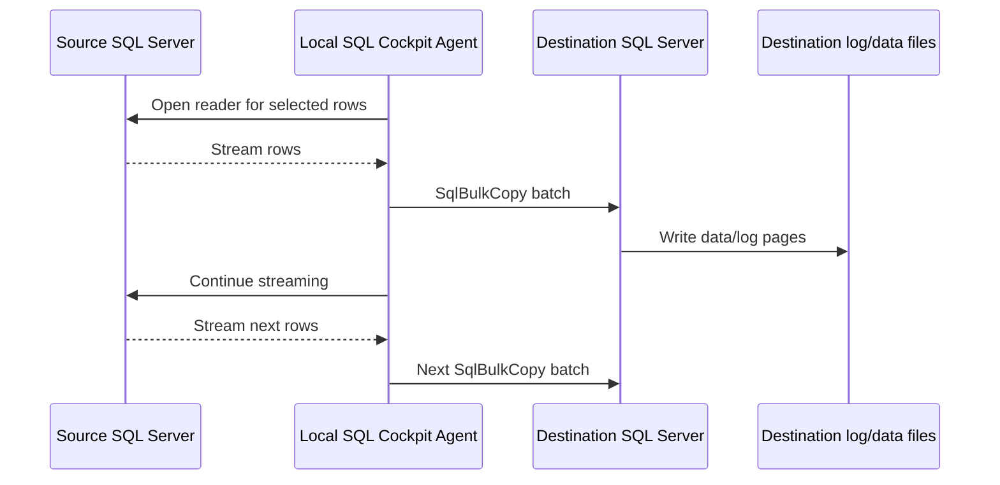

# SQL Bridge Huge Tables Getting Started

Use this guide when copying very large SQL Server tables through SQL Bridge, especially tables with tens or hundreds of millions of rows.

The goal is not to make every copy run as fast as possible on the first attempt. The goal is to make the first run safe, observable, repeatable, and easy to tune.

## First Decision: Full Refresh Or Incremental

Before choosing `@BatchSize`, decide whether a full-table refresh is appropriate.

Use `Cockpit.FetchRemote` full refresh when:

- this is a first bootstrap copy
- the table is small enough to recopy within the maintenance window
- the destination can be safely truncated/replaced
- source data does not have a reliable key/watermark for incremental loading
- the copy is a one-off validation or migration step

Prefer `Cockpit.FetchRemoteIncremental` when:

- the table has tens or hundreds of millions of rows
- only a small percentage changes between runs
- the source has a stable key column or watermark column
- the destination must stay available during repeated refreshes
- full refresh puts too much pressure on the network, SQL Server log, memory, or destination locks

For a table like `ib_inventory_total` with more than 100 million rows, a full refresh can be valid for a controlled bootstrap, but steady-state production should usually move toward an incremental pattern if a safe key/watermark exists.

## Lane Safety

Always keep the bridge control database and destination database in the same lane unless you are deliberately crossing environments.

| Lane | Bridge database | Typical destination for lane-local tests |
| --- | --- | --- |
| `prod` | `SqlCockpit` | `SqlCockpit` |
| `test` | `SqlCockpit_Test` | `SqlCockpit_Test` |
| `dev` | `SqlCockpit_Dev` | `SqlCockpit_Dev` |

For test lane SQL, use:

```sql
USE [SqlCockpit_Test];
```

and:

```sql
@DestinationDatabase = N'SqlCockpit_Test'
```

Do not run from `SqlCockpit_Test` while writing to `SqlCockpit` unless the intention is to write into the production bridge database. That mixes lanes and makes validation confusing.

## What BatchSize Actually Does

For SQL Bridge `Cockpit.FetchRemote`, `@BatchSize` becomes `options.batchSize`, and the PowerShell executor applies it to `SqlBulkCopy.BatchSize`.

That means `@BatchSize` controls the destination bulk-copy commit rhythm. It does not set the TCP packet size.

In practice, changing `@BatchSize` changes:

- how many rows are pushed in each bulk-copy burst
- how much memory the bridge process can need while streaming rows
- how long one write burst can run
- how often the destination receives bulk-copy batches
- how spiky the network and transaction log activity can look

A saw-tooth or spike pattern in Task Manager network throughput is normal for large bridge copies. The bridge reads from the source and writes to the destination in bursts. Larger batches usually mean fewer, larger bursts. Smaller batches usually mean more, smaller bursts.

## Starting Values

Use these as starting points, not fixed rules.

| Table shape / environment | Suggested starting `@BatchSize` |
| --- | --- |
| Unknown table shape, first safe test | `5000` or `10000` |
| Large narrow table, healthy memory/log/disk | `25000` |
| Very large narrow table after successful testing | `50000` |
| Wide table or table with LOB columns | `5000` to `10000` |
| Fragile source, slow WAN, or busy destination | `5000` |
| Proven stable high-throughput maintenance window | test `50000`, then consider `100000` only with evidence |

Avoid starting at `100000` or higher for a huge table unless you have already measured row width, destination log behavior, and memory pressure.

`Cockpit.FetchRemote` validates `batchSize` between `1` and `1000000000`, but valid does not mean safe.

## Why A Huge Table Can Look Bursty

During a large copy, a typical pattern is:



Task Manager often renders this as repeated network spikes rather than a flat line. That is not automatically bad. It becomes a concern when spikes are paired with:

- memory near exhaustion
- destination transaction log growth or autogrowth
- long periods with no row progress
- blocking on the destination table
- CPU saturation on the Agent host
- repeated SQL-side timeouts

## Preflight Checklist

Before running a huge-table copy:

1. Confirm you are in the intended lane.
2. Confirm the Agent for that lane is running and bound.
3. Confirm the source profile resolves through the Agent.
4. Confirm the destination database is correct for the lane.
5. Run `Cockpit.ListDatabases` or a small `@Top` copy first.
6. Decide whether this is full refresh or incremental.
7. Check whether the destination table can be truncated or replaced.
8. Check free disk and transaction log headroom on the destination.
9. Start with a conservative `@BatchSize`.
10. Monitor memory, network, destination log growth, and bridge history.

## Safe First Test

Run a small test before a full copy:

```sql
USE [SqlCockpit_Test];
GO

SET NOCOUNT ON;

IF SCHEMA_ID(N'Tests') IS NULL
BEGIN
    EXEC(N'CREATE SCHEMA [Tests]');
END;
GO

DECLARE
    @InvocationId uniqueidentifier,
    @RowsAffected bigint;

EXEC Cockpit.FetchRemote
    @DefaultName = N'test_aptos_cloud_ib_inventory_total_top1000',
    @SourceProfileKind = N'connection',
    @SourceProfileName = N'Aptos_Cloud / me_pc_01',
    @SourceDatabase = N'me_pc_01',
    @SourceSchema = N'dbo',
    @SourceTable = N'ib_inventory_total',
    @Top = 1000,
    @DestinationMode = N'LocalTable',
    @DestinationDatabase = N'SqlCockpit_Test',
    @DestinationSchema = N'Tests',
    @DestinationTable = N'ib_inventory_total_probe',
    @TruncateDestination = 1,
    @BatchSize = 5000,
    @BridgeLockMode = N'Wait',
    @BridgeLockTimeoutSeconds = 60,
    @InvocationId = @InvocationId OUTPUT,
    @RowsAffected = @RowsAffected OUTPUT;

SELECT @InvocationId AS InvocationId, @RowsAffected AS RowsCopied;

SELECT COUNT_BIG(*) AS DestinationRows
FROM [SqlCockpit_Test].[Tests].[ib_inventory_total_probe];
```

Only move to the full copy after the small test proves:

- the profile name is correct
- the password/secret is available to the Agent
- the destination table can be created/truncated
- the row count is plausible
- SQL Bridge history shows a clean success

## Full Refresh Template

After the probe succeeds, run the full copy with a conservative batch size:

```sql
USE [SqlCockpit_Test];
GO

SET NOCOUNT ON;

IF SCHEMA_ID(N'Tests') IS NULL
BEGIN
    EXEC(N'CREATE SCHEMA [Tests]');
END;
GO

DECLARE
    @InvocationId uniqueidentifier,
    @RowsAffected bigint;

EXEC Cockpit.FetchRemote
    @DefaultName = N'test_aptos_cloud_ib_inventory_total_full',
    @SourceProfileKind = N'connection',
    @SourceProfileName = N'Aptos_Cloud / me_pc_01',
    @SourceDatabase = N'me_pc_01',
    @SourceSchema = N'dbo',
    @SourceTable = N'ib_inventory_total',
    @DestinationMode = N'LocalTable',
    @DestinationDatabase = N'SqlCockpit_Test',
    @DestinationSchema = N'Tests',
    @DestinationTable = N'ib_inventory_total',
    @TruncateDestination = 1,
    @BatchSize = 25000,
    @BridgeLockMode = N'Wait',
    @BridgeLockTimeoutSeconds = 60,
    @InvocationId = @InvocationId OUTPUT,
    @RowsAffected = @RowsAffected OUTPUT;

SELECT @InvocationId AS InvocationId, @RowsAffected AS RowsCopied;

SELECT COUNT_BIG(*) AS DestinationRows
FROM [SqlCockpit_Test].[Tests].[ib_inventory_total];
```

If the run is stable and the machine has headroom, test `@BatchSize = 50000` on the next run. If memory or log pressure is high, test `@BatchSize = 10000`.

## Truncate Behavior And Staging

When `@TruncateDestination = 1`, SQL Bridge clears the destination table before loading the replacement rows.

For example, this destination:

```sql
@DestinationDatabase = N'SqlCockpit_test',
@DestinationSchema = N'Tests',
@DestinationTable = N'ib_inventory_total',
@TruncateDestination = 1
```

means the bridge will truncate:

```sql
[SqlCockpit_test].[Tests].[ib_inventory_total]
```

before loading the new rows.

For an Agent-backed `Cockpit.FetchRemote` call, the sequence is:

1. SQL Server enqueues the bridge invocation.
2. The lane Agent picks up the queue item.
3. The Agent connects to the source and destination.
4. The Agent creates or validates the destination table.
5. The Agent runs `TRUNCATE TABLE [Tests].[ib_inventory_total]` against the destination table.
6. The Agent starts `SqlBulkCopy` and writes rows in batches.

The truncate does not happen at the exact instant the T-SQL wrapper is called, but it happens early in the Agent worker phase. If the source read, destination write, network, credential lookup, timeout, or Agent process fails after that point, the destination table can be left empty or partially loaded.

That behavior is acceptable for disposable test tables and controlled bootstrap loads. It is risky for tables that users, reports, jobs, or downstream systems read while the copy is running.

### Use Direct Truncate Only When The Table Is Replaceable

Direct truncate is reasonable when:

- the destination table is a scratch, test, or staging table
- the table is not being read by production users
- an empty or partial destination is acceptable after a failed run
- the run is part of a maintenance window
- the source can be recopied safely

Avoid direct truncate when:

- the destination is used by production reports or jobs
- readers must always see a complete previous copy
- the source table is huge and the copy can run for many minutes or hours
- the table has downstream dependencies that react badly to empty data
- rollback/retry needs to be predictable

### Safer Pattern: Load Into A Staging Table

For important large tables, copy into a staging table first:

```sql
EXEC Cockpit.FetchRemote
    @DefaultName = N'test_aptos_cloud_ib_inventory_total_stage',
    @SourceProfileKind = N'connection',
    @SourceProfileName = N'Aptos_Cloud / me_pc_01',
    @SourceDatabase = N'me_pc_01',
    @SourceSchema = N'dbo',
    @SourceTable = N'ib_inventory_total',
    @DestinationMode = N'LocalTable',
    @DestinationDatabase = N'SqlCockpit_Test',
    @DestinationSchema = N'Tests_Staging',
    @DestinationTable = N'ib_inventory_total',
    @TruncateDestination = 1,
    @BatchSize = 50000,
    @TimeoutSeconds = 3600,
    @BridgeLockMode = N'Wait',
    @BridgeLockTimeoutSeconds = 60,
    @InvocationId = @InvocationId OUTPUT,
    @RowsAffected = @RowsAffected OUTPUT;
```

After the staging copy succeeds, validate it before replacing the active table:

```sql
SELECT COUNT_BIG(*) AS StagingRows
FROM [SqlCockpit_Test].[Tests_Staging].[ib_inventory_total];
```

Then promote the staged data during a short controlled change window. The exact promotion pattern depends on indexes, constraints, permissions, and readers. Common options are:

- rename/swap tables
- truncate the active table and insert from staging
- rebuild the active table from staging
- switch partitions when the table design supports it

The key principle is that the long remote fetch should not be the same operation that destroys the last good active copy.

### Timeout Is Separate From Truncate Safety

`@TimeoutSeconds` controls how long the SQL caller waits for the Agent-backed bridge invocation to complete. The default for `Cockpit.FetchRemote` is `900` seconds, or 15 minutes.

Increasing `@TimeoutSeconds` can prevent the SQL-side wait from timing out during a legitimate long copy, but it does not make direct truncate safer. If the destination is important, use a staging table even when the timeout is long enough.

## Incremental Direction

For repeated production use, prefer incremental loading when the source has a stable key or watermark.

Use `Cockpit.FetchRemoteIncremental` when you can define:

- a key column that orders rows consistently
- optionally a watermark column such as an update timestamp, sequence, or rowversion-like value
- a destination table strategy that can accept appended or chunked rows safely

Start with:

- `@ChunkSize = 5000` or `10000`
- `@MaxChunks = 1`
- a dedicated `@StateName`
- a non-production destination

Then increase chunk count or chunk size only after you verify checkpoint movement and destination row counts.

## Monitoring During The Run

Watch these signals while the bridge is running:

| Signal | Healthy | Warning |
| --- | --- | --- |
| Agent host memory | Stable with headroom | Memory above 90-95 percent for long periods |
| Network graph | Repeated bursts with progress | Bursts stop and no rows complete |
| Destination log | Predictable growth | Frequent autogrowth or disk pressure |
| Destination CPU/disk | Busy but responsive | Sustained saturation |
| SQL Bridge history | Running row updates then succeeds | Long-running row with expired lease or timeout |
| Locks page | Expected destination lock only | Stale locks after failure/cancel |

For very large runs, keep SQL Bridge history open with a moderate refresh interval, for example 30 or 60 seconds. Avoid very short dashboard polling while the database is already under pressure.

## Live Progress

Agent-backed `FetchRemote` copies write live progress while `SqlBulkCopy` is running. The progress is emitted at least every smaller batch, and for very large batches the executor still reports approximately every 100,000 copied rows so the dashboard is not silent for long stretches.

```sql
EXEC Cockpit.ListBridgeInvocations
    @Status = N'Running',
    @SinceMinutes = 240;
```

Key columns include `RowsCopiedSoFar`, `RowsCopiedSoFarWords`, `SourceRowCount`, `SourceRowCountWords`, `PercentComplete`, `BatchesCopied`, `ApproxRowsPerSecond`, `EstimatedCompletionAt`, and `LastProgressAt`.

The word columns are not a replacement for exact numeric values. They reduce operator mistakes when reading very large counts during live support.

## Tuning Pattern

Change only one thing at a time.

1. Run with `@BatchSize = 10000` or `25000`.
2. Record duration, rows copied, memory peak, log growth, and any errors.
3. Increase to `50000` only if the first run is healthy.
4. Decrease to `5000` or `10000` if memory/log/network behavior is unstable.
5. Move to incremental if full refresh remains too heavy.

Good tuning evidence is:

- total runtime improves
- memory remains stable
- destination log growth is manageable
- no lock timeouts occur
- the final row count is correct

Bad tuning evidence is:

- larger batches do not improve runtime
- the Agent host reaches memory pressure
- destination log autogrowth dominates the run
- operators cannot tell whether the run is making progress
- the source or destination becomes unreliable for other workloads

## Common Mistakes

| Mistake | Why it hurts | Safer alternative |
| --- | --- | --- |
| Writing test lane output into `SqlCockpit` | Mixes test and prod state | Use `SqlCockpit_Test` for test |
| Starting huge full refresh at `@BatchSize = 100000` | Large first blast radius | Start at `10000` or `25000` |
| Treating `BatchSize` as network packet size | Misreads the graph | Treat it as bulk-copy batch rhythm |
| Using direct truncate on an active table | Failed copy can leave readers with empty or partial data | Load into staging, validate, then promote |
| Raising `@TimeoutSeconds` as the only safety measure | Prevents caller timeout but does not protect the active table | Combine realistic timeout with staging for important data |
| Ignoring memory pressure | Can destabilize the Agent host | Lower batch size or move to incremental |
| Re-running full refresh for regular changes | Expensive and slow | Use incremental when possible |
| Cancelling from SSMS without checking locks | May leave work unwinding | Inspect SQL Bridge history and locks |

## Troubleshooting Quick Reference

| Symptom | Likely cause | First action |
| --- | --- | --- |
| Spiky Ethernet graph | Normal bulk-copy burst rhythm | Check rows and memory before changing anything |
| High memory during copy | Batch too large, rows wide, or LOB columns | Lower `@BatchSize` |
| SQL-side timeout but Agent still running | SQL wait timed out before child work ended | Check `Cockpit.AgentBridgeQueue` and Agent child process |
| SSMS cancel but Agent still running | SSMS stopped waiting but did not cancel leased Agent work | Use `Cockpit.ListBridgeInvocations`, then `Cockpit.CancelBridgeInvocation` |
| `profile secret missing` | Password not in Agent credential store | Re-save the profile password through Service Control or web portal |
| `Login failed` | Wrong secret, user, or source profile | Test `Cockpit.ListDatabases` for that profile |
| `Cannot find the object ... because it does not exist or you do not have permissions` | Agent service account can connect to the destination database but cannot see/write/truncate the destination schema/table | Run the first `FetchRemote` as a DBA-capable login so automatic destination grants can be applied, or pre-grant the Agent service login manually |
| `attempt to write a readonly database` | Agent account cannot write local profile SQLite or destination | Check Agent service identity and ACLs |
| Destination row count differs | Filter, source changes during copy, or failed run | Compare invocation output and rerun controlled test |

## Configuration Reference

| Item | Storage location | Valid values | Default / observed default | Runtime usage | Operational risk | Safe change procedure | Confidence |
| --- | --- | --- | --- | --- | --- | --- | --- |
| `Cockpit.FetchRemote @BatchSize` | T-SQL wrapper parameter, converted to `JsonPayload $.options.batchSize` | Integer `1` to `1000000000` | `5000` when omitted in the PowerShell executor | Sets `SqlBulkCopy.BatchSize` for LocalTable copies | High on huge tables: larger values can increase memory pressure, destination log bursts, and long write windows | Start conservatively, test one lane-local run, compare duration/memory/log growth, then adjust gradually | Confirmed |
| `Cockpit.FetchRemote @TruncateDestination` | T-SQL wrapper parameter, converted to `JsonPayload $.options.truncateDestination` | `0`, `1`, or omitted | Omitted means do not force truncate unless supplied by defaults | Runs `TRUNCATE TABLE` before bulk-copying rows into the destination LocalTable | High for active tables: a failed run after truncate can leave an empty or partial destination | Use only for replaceable test/staging tables, or load into staging first and promote after validation | Confirmed |
| `Cockpit.FetchRemote @TimeoutSeconds` | T-SQL wrapper parameter and Agent queue wait deadline | Integer `1` to `86400` | `900` seconds on `Cockpit.FetchRemote` | Controls how long SQL waits for the Agent-backed bridge invocation to complete | Medium: too low can report timeout during valid long copies; too high can keep callers waiting for failed work | Use realistic values such as `3600` for huge full copies, then inspect bridge history on timeout before rerunning | Confirmed |
| `Cockpit.FetchRemote @Top` | T-SQL wrapper parameter, converted to `JsonPayload $.options.top` | Positive integer or omitted | Omitted means full selected source table | Limits source rows for probe runs | Low when used for testing; high if mistaken for a production filter | Use for first validation only, remove intentionally for full copy | Confirmed |
| `Cockpit.FetchRemote @DestinationDatabase` | T-SQL wrapper parameter, converted to `JsonPayload $.options.destinationDatabase` | SQL Server database name | Required for LocalTable mode unless destination profile supplies a database | Controls where copied rows land | High if it points to the wrong lane or production database | Match `USE` lane and destination lane before running | Confirmed |
| Automatic destination permission grants | `Cockpit.FetchRemote`; `Cockpit.BridgeConfig.AutoGrantDestinationPermissions`; `Cockpit.BridgeConfig.AgentServiceLogin` | Auto-grant true/false; Agent service login as a Windows login name | Auto-grant true; Agent login must be configured by the lane installer/setup script | Prepares destination database user, `CREATE TABLE`, and schema grants for Agent `LocalTable` writes before queuing work | Medium to high: grants allow the Agent identity to create/write destination data, and `ALTER` permits truncate/table-shape operations on the schema | Configure the lane Agent login, run first in test as a DBA-capable login, then validate with a small `FetchRemote` | Confirmed |
| `Cockpit.FetchRemote @BridgeLockMode` | T-SQL wrapper parameter, logged in bridge metadata and used by destination lock logic | `Wait`, `SkipIfRunning`, `FailIfRunning`, `SkipIfFresh` | `Wait` | Serializes overlapping copies to the same destination | Medium to high depending on mode; wrong setting can skip data or block longer than expected | Use `Wait` for first tests; change only after defining overlap policy | Confirmed |
| `Cockpit.FetchRemote @BridgeLockTimeoutSeconds` | T-SQL wrapper parameter and lock wait setting | Integer `>= 0` or omitted | Bridge config default, commonly `60` | Bounds wait time for destination refresh lock | Medium: too low can fail normal overlap; too high can tie up callers | Start at `60`, inspect locks on timeout, then tune per workload | Confirmed |

## Related Docs

- [SQL Cockpit Invocation Framework](sql-cockpit-invocation-framework.md)
- [Analyze Tables And Batch Sizing](analyze-table-batch-sizing.md)
- [Batch Size Caveats](batch-size-caveats.md)
