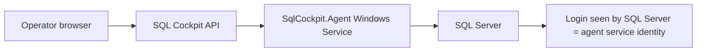

# SQL Cockpit Agent Identity And Windows Authentication

SQL Cockpit executes live SQL Server work through the paired SQL Cockpit Agent. Windows authentication uses the Windows identity running the `SqlCockpit.Agent` service, not the interactive browser, SSMS, or Service Control user.



## Common Identities

| Agent service account | SQL Server sees | Typical use |
| --- | --- | --- |
| `LocalSystem` | Domain machine account, for example `PEACOCKS\NASCAR$` | Lab or explicit machine-account grants. |
| Domain user | That domain user | Recommended default. |
| gMSA | The gMSA account | Recommended when managed service accounts are standard. |
| SQL authentication | SQL login, password resolved by the agent | Use when Windows service identity should not be granted SQL access. |

If SSMS works as `PEACOCKS\administrator` but SQL Cockpit fails as `PEACOCKS\NASCAR$`, the agent is probably running as `LocalSystem` and SQL Server is rejecting the machine account.

SSMS connection history can be misleading during troubleshooting. A successful SSMS connection such as `server, <default> (DOMAIN\administrator)` proves that the interactive administrator can connect from that workstation. It does not prove that the `SqlCockpit.Agent` Windows service account can connect from the agent host. SQL Server evaluates the Windows identity that opened the connection, and for SQL Cockpit that identity is the service account running `SqlCockpit.Agent`.

For the recommended least-privilege permission tiers, risks of running as a domain administrator, and copyable PowerShell/SQL setup examples, see [SQL Cockpit Agent Permissions And Risk Model](sql-cockpit-agent-permissions.md).

## Check Identity

```powershell
Get-CimInstance Win32_Service -Filter "Name='SqlCockpit.Agent'" |
  Select-Object Name, State, StartName, PathName

whoami
hostname
```

## Check SQL Server Service Accounts

Keep these identities separate:

- `SqlCockpit.Agent`: the Windows service identity SQL Cockpit uses for Integrated-auth database checks.
- SQL Server Database Engine service, usually `MSSQLSERVER` or `MSSQL$InstanceName`.
- SQL Server Agent service, usually `SQLSERVERAGENT` or `SQLAgent$InstanceName`.

For SQL Cockpit Integrated-auth failures, grant SQL access to the `SqlCockpit.Agent` identity. SQL Server's own service accounts matter when SQL Server executes work itself, such as Agent jobs, bridge execution, file access, backups, extended events, and `xp_cmdshell`.

Preferred SQL-side check:

```sql
SELECT
    servicename,
    startup_type_desc,
    status_desc,
    service_account
FROM sys.dm_server_services;
```

Registry fallback for the default SQL Server Agent service:

```sql
DECLARE @sn NVARCHAR(128);

EXEC master.dbo.xp_regread
    'HKEY_LOCAL_MACHINE',
    'SYSTEM\CurrentControlSet\services\SQLSERVERAGENT',
    'ObjectName',
    @sn OUTPUT;

SELECT @sn AS SqlServerAgentServiceAccount;
```

For the default Database Engine service:

```sql
DECLARE @sn NVARCHAR(128);

EXEC master.dbo.xp_regread
    'HKEY_LOCAL_MACHINE',
    'SYSTEM\CurrentControlSet\services\MSSQLSERVER',
    'ObjectName',
    @sn OUTPUT;

SELECT @sn AS DatabaseEngineServiceAccount;
```

For named instances, use `MSSQL$InstanceName` for the Database Engine and `SQLAgent$InstanceName` for SQL Server Agent. If in doubt, use `sys.dm_server_services` first or check Windows Services on the SQL Server host.

## Change To Domain Service Account

```powershell
$account = "PEACOCKS\sqlcockpit-agent"
$password = Read-Host "Service account password" -AsSecureString

$cred = New-Object System.Management.Automation.PSCredential($account, $password)
$plain = $cred.GetNetworkCredential().Password

sc.exe config SqlCockpit.Agent obj= $account password= $plain
Restart-Service SqlCockpit.Agent
```

SQL grant:

```sql
CREATE LOGIN [PEACOCKS\sqlcockpit-agent] FROM WINDOWS;
```

## Change To gMSA

```powershell
Test-ADServiceAccount sqlcockpit-agent

sc.exe config SqlCockpit.Agent obj= "PEACOCKS\sqlcockpit-agent$" password= ""
Restart-Service SqlCockpit.Agent
```

SQL grant:

```sql
CREATE LOGIN [PEACOCKS\sqlcockpit-agent$] FROM WINDOWS;
```

## Grant Access On Target SQL Servers

Run this on each target SQL Server instance that SQL Cockpit should inspect. Replace placeholders first:

- `<DOMAIN\SqlCockpitAgentAccount>`: the account shown by `Get-CimInstance Win32_Service -Filter "Name='SqlCockpit.Agent'"`.
- `<DatabaseName>`: each user database SQL Cockpit should inspect in detail.
- `<AgentHostMachineAccount>`: only for `LocalSystem` installs, for example `DOMAIN\HOSTNAME$`.

The important distinction is:

- A SQL Server login is required before Windows authentication can connect at all.
- Server-level metadata grants are optional and depend on the SQL Cockpit features enabled.
- `msdb` SQL Agent grants are optional and only needed for SQL Agent inventory.
- Per-database grants are optional and only needed for database object metadata or data-reading features.

Do not grant permissions to every database by default. Start with the smallest tier that matches the customer's enabled features, test, then add only what is missing.

### Tier 0: Connect Only

This tier lets the agent authenticate to the SQL Server instance. It does not intentionally grant database data access.

Create the server login for a domain service account or gMSA:

```sql
CREATE LOGIN [<DOMAIN\SqlCockpitAgentAccount>] FROM WINDOWS;
```

For a `LocalSystem` agent, create the login for the machine account instead:

```sql
CREATE LOGIN [<AgentHostMachineAccount>] FROM WINDOWS;
```

If the login already exists, skip `CREATE LOGIN`.

If SQL Cockpit reports `Login failed for user '<DOMAIN\SqlCockpitAgentAccount>'`, this tier is missing, the login is disabled, the saved profile points to a different instance, or the agent is running under a different identity than expected.

### Tier 1: Estate Overview And Server Inventory

Use this tier when SQL Cockpit should list databases, collect server-level catalog state, and show server health/capacity metadata. These are server-level permissions, not per-database grants:

```sql
GRANT VIEW ANY DATABASE TO [<DOMAIN\SqlCockpitAgentAccount>];
GRANT VIEW SERVER STATE TO [<DOMAIN\SqlCockpitAgentAccount>];
```

For SQL Server 2022 or later environments with stricter metadata separation, the customer DBA may prefer or additionally require `VIEW SERVER PERFORMANCE STATE`. On mixed estates, use the prerequisite bootstrap script because older SQL Server versions cannot parse the 2022-only permission directly:

```sql
GRANT VIEW SERVER PERFORMANCE STATE TO [<DOMAIN\SqlCockpitAgentAccount>];
GRANT VIEW ANY DEFINITION TO [<DOMAIN\SqlCockpitAgentAccount>];
```

Use the minimum set that makes the enabled SQL Cockpit features work in the customer environment.

### Tier 2: SQL Agent Job Inventory

Use this tier only when SQL Cockpit should show SQL Agent jobs, schedules, history, and step metadata. It does not require sysadmin, but it does expose operational job details from `msdb`:

```sql
USE [msdb];

IF NOT EXISTS (
    SELECT 1
    FROM sys.database_principals
    WHERE name = N'<DOMAIN\SqlCockpitAgentAccount>'
)
BEGIN
    CREATE USER [<DOMAIN\SqlCockpitAgentAccount>] FOR LOGIN [<DOMAIN\SqlCockpitAgentAccount>];
END;

EXEC sp_addrolemember @rolename = N'SQLAgentReaderRole', @membername = N'<DOMAIN\SqlCockpitAgentAccount>';
```

### Tier 3: Per-Database Object Metadata

Use this tier only for databases where SQL Cockpit should inspect object metadata such as tables, views, procedures, columns, indexes, object search, or detailed database explorer pages. This is not required just to prove the agent can connect to the server.

```sql
USE [<DatabaseName>];

IF NOT EXISTS (
    SELECT 1
    FROM sys.database_principals
    WHERE name = N'<DOMAIN\SqlCockpitAgentAccount>'
)
BEGIN
    CREATE USER [<DOMAIN\SqlCockpitAgentAccount>] FOR LOGIN [<DOMAIN\SqlCockpitAgentAccount>];
END;

GRANT VIEW DEFINITION TO [<DOMAIN\SqlCockpitAgentAccount>];
```

If a customer wants SQL Cockpit to read row data for a feature, grant that separately and narrowly through a customer-managed database role. Do not grant broad data access just to make metadata pages work.

Validation query:

```sql
SELECT
    name,
    type_desc,
    is_disabled
FROM sys.server_principals
WHERE name = N'<DOMAIN\SqlCockpitAgentAccount>';
```

If SQL Cockpit still reports `Login failed for user '<DOMAIN\SqlCockpitAgentAccount>'`, verify the login exists on the reached SQL Server instance, the login is enabled, the agent is using the expected Windows service identity, and the saved profile points to the same SQL Server instance the DBA granted.

## Credential Manager Impact

SQL-auth passwords are stored in Windows Credential Manager under the account running `SqlCockpit.Agent`. After changing the service identity, re-save SQL-auth profile passwords so the new service identity can read them.

Integrated-auth profiles do not store SQL passwords, but SQL Server must grant access to the agent service identity.

## Troubleshooting

| Symptom | Cause | Fix |
| --- | --- | --- |
| `Login failed for user 'DOMAIN\MACHINE$'` | Agent runs as `LocalSystem`. | Grant the machine account or change the service account. |
| SSMS works but SQL Cockpit fails | Different Windows identities. | Grant SQL access to the agent identity. |
| SQL-auth secret missing after service account change | Password was stored under the old identity. | Re-save the SQL-auth password. |
| Agent online but SQL cannot connect | Firewall, DNS, `Agent:AllowedSqlServers`, or SQL grants. | Test from the agent host using the agent identity. |
