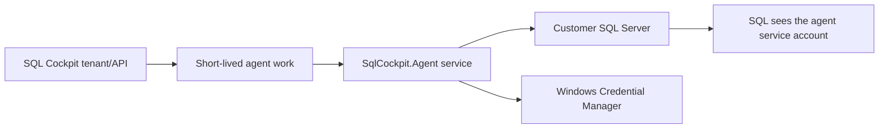

# SQL Cockpit Agent Permissions And Risk Model

SQL Cockpit routes live customer database work through the paired `SqlCockpit.Agent` service. Hosted/cloud SQL Cockpit does not need inbound network access to customer SQL Server instances, and it does not need customer SQL passwords in the tenant database.

For the customer onboarding walkthrough, start with [SQL Cockpit Prerequisite Setup](sql-cockpit-prerequisite-setup.md). This page is the deeper permission and risk reference.

The customer controls access by choosing where the agent is installed, which SQL Server names it can reach, which Windows identity runs `SqlCockpit.Agent`, which SQL permissions that identity has, and whether SQL-auth passwords are stored locally in the agent host's Windows Credential Manager.



## Why Not Run As A Domain Administrator

Running `SqlCockpit.Agent` as a domain administrator or personal admin account can make development appear to work because that account already has broad SQL and network access. It also hides which permissions SQL Cockpit actually needs.

Avoid admin accounts for normal installs because:

- the agent is a long-running service
- the agent receives work from SQL Cockpit
- the agent can reach customer network resources allowed by firewall and policy
- SQL-auth secrets are stored under the service account's Windows Credential Manager context
- audit trails become ambiguous when human admin activity and SQL Cockpit activity share the same identity
- password rotation, account lockout, or MFA policy changes can break the service
- compromise or misconfiguration has the blast radius of the admin account

Using an admin account is acceptable only as a short diagnostic test. After the test, switch back to a dedicated service account or gMSA and grant only the required tiers below.

## Recommended Service Account Pattern

| Pattern | Recommended when | Notes |
| --- | --- | --- |
| Domain service account | Most customers | Easy to audit and grant directly or through AD groups. Password rotation must be managed. |
| gMSA | Customers with managed service-account practice | Preferred where available because no service password is stored. |
| LocalSystem machine account | Lab or tightly scoped on-prem installs | SQL Server sees `DOMAIN\MACHINENAME$`; less explicit than a named service account. |
| Human/domain admin | Temporary diagnostic only | Do not use as the steady-state identity. |

Suggested names:

```text
DOMAIN\sqlcockpit-agent
DOMAIN\gmsa-sqlcockpit$
```

## PowerShell Setup Examples

Run PowerShell as Administrator on the agent host.

Check the current service identity:

```powershell
Get-CimInstance Win32_Service -Filter "Name='SqlCockpit.Agent'" |
  Select-Object Name, State, StartName, PathName
```

Change to a domain service account:

```powershell
$account = "DOMAIN\sqlcockpit-agent"
$password = Read-Host "Service account password" -AsSecureString

$cred = [System.Management.Automation.PSCredential]::new($account, $password)
$plain = $cred.GetNetworkCredential().Password

sc.exe config SqlCockpit.Agent obj= $account password= $plain
Restart-Service SqlCockpit.Agent

Get-CimInstance Win32_Service -Filter "Name='SqlCockpit.Agent'" |
  Select-Object Name, State, StartName, PathName
```

Change to a gMSA:

```powershell
Test-ADServiceAccount gmsa-sqlcockpit

sc.exe config SqlCockpit.Agent obj= "DOMAIN\gmsa-sqlcockpit$" password= ""
Restart-Service SqlCockpit.Agent

Get-CimInstance Win32_Service -Filter "Name='SqlCockpit.Agent'" |
  Select-Object Name, State, StartName, PathName
```

Check network reachability:

```powershell
Test-NetConnection -ComputerName "sqlserver01.domain.local" -Port 1433
```

If `Agent:AllowedSqlServers` is configured, the target server name in the saved profile must also be present in the agent allow-list.

## Permission Bootstrap Script

The reusable SQL bootstrap script is available at `scripts/security/Grant-SqlCockpitAgentPermissions.sql` in the SQL Cockpit repository.

Run it once on each SQL Server instance the agent should inspect. Edit the variables at the top before execution:

- `@AgentLogin`: Windows service identity, for example `DOMAIN\sqlcockpit-agent`
- `@GrantAllUserDatabases`: defaults to `1`, granting metadata and metrics permissions to all current online user databases
- `@GrantFutureUserDatabasesViaModel`: defaults to `1`, adding the same metadata role to `model` so newly created databases inherit it
- `@TargetDatabases`: comma-separated allow-list used only when `@GrantAllUserDatabases = 0`
- `@GrantSqlAgentOperator`: default `1` for SQL Cockpit Agent Manager start/stop job operations; set to `0` only for read-only estates
- `@GrantSsrsCatalogReader`, `@GrantSsisCatalogReader`, `@GrantSyncConfigWriter`, and `@GrantDbDataReaderToTargetDatabases`: keep `0` unless the customer explicitly enables those higher-risk capabilities

The script creates SQL Server login/user mappings and roles. It does not create the Windows, domain, or gMSA account itself.

Future database caveat: `model` applies to newly created databases on the instance. Databases restored from backup, attached, seeded by availability groups, or created by tooling that later overwrites users/roles may not inherit the `model` grants. Rerun the script after those provisioning events.

## SQL Permission Tiers

Start with the smallest tier that matches the features enabled for the customer. For SQL Cockpit's default estate-management account, granting metadata visibility to all current and future user databases is usually the cleanest model. Use an explicit database allow-list only for customers that need strict database-by-database onboarding.

Replace placeholders before running:

- `<AgentLogin>`: the service identity, for example `DOMAIN\sqlcockpit-agent` or `DOMAIN\gmsa-sqlcockpit$`
- `<DatabaseName>`: a specific database SQL Cockpit should inspect

### Tier 0: Connect Only

Required for Integrated-auth connections to succeed at all:

```sql
CREATE LOGIN [<AgentLogin>] FROM WINDOWS;
```

Validate:

```sql
SELECT
    name,
    type_desc,
    is_disabled
FROM sys.server_principals
WHERE name = N'<AgentLogin>';
```

This tier proves the agent identity can authenticate. It does not intentionally grant database object visibility or data access.

### Tier 1: Estate Overview And Server Inventory

Use when SQL Cockpit should list databases and collect server-level health/capacity metadata:

```sql
GRANT VIEW ANY DATABASE TO [<AgentLogin>];
GRANT VIEW SERVER STATE TO [<AgentLogin>];
```

For SQL Server 2022 or later, depending on local security policy and feature usage, grant `VIEW SERVER PERFORMANCE STATE`. On mixed estates, use the prerequisite bootstrap script instead of pasting this statement directly, because older SQL Server versions cannot parse the 2022-only permission:

```sql
GRANT VIEW SERVER PERFORMANCE STATE TO [<AgentLogin>];
GRANT VIEW ANY DEFINITION TO [<AgentLogin>];
```

Operational risk: server-level metadata can expose database names, status, size, and operational state.

### Tier 2: SQL Agent Inventory

Use only when SQL Cockpit should show SQL Agent jobs, schedules, history, and step metadata:

```sql
USE [msdb];

IF NOT EXISTS (
    SELECT 1
    FROM sys.database_principals
    WHERE name = N'<AgentLogin>'
)
BEGIN
    CREATE USER [<AgentLogin>] FOR LOGIN [<AgentLogin>];
END;

EXEC sp_addrolemember @rolename = N'SQLAgentReaderRole', @membername = N'<AgentLogin>';
```

Operational risk: job names, schedules, history, step commands, and failure messages can expose sensitive operational details.

### Tier 3: Per-Database Object Metadata

Use only for databases where SQL Cockpit should inspect object metadata such as schemas, tables, views, procedures, indexes, columns, and object search:

```sql
USE [<DatabaseName>];

IF NOT EXISTS (
    SELECT 1
    FROM sys.database_principals
    WHERE name = N'<AgentLogin>'
)
BEGIN
    CREATE USER [<AgentLogin>] FOR LOGIN [<AgentLogin>];
END;

GRANT VIEW DEFINITION TO [<AgentLogin>];
```

Operational risk: object metadata can reveal schema design, object names, column names, procedure names, and business vocabulary. Grant per database, not globally, unless the customer explicitly accepts that scope.

### Tier 4: Data-Reading Features

Only grant row-data access for features that truly need it, and prefer customer-managed roles:

```sql
USE [<DatabaseName>];

CREATE ROLE [SqlCockpitMetadataReaders];
EXEC sp_addrolemember @rolename = N'SqlCockpitMetadataReaders', @membername = N'<AgentLogin>';

-- Example only. Scope SELECT narrowly to approved schemas/tables.
GRANT SELECT ON SCHEMA::[dbo] TO [SqlCockpitMetadataReaders];
```

Operational risk: row-data access can expose customer data. Do not use `db_datareader` as a default grant for SQL Cockpit metadata pages.

## PowerShell Runtime Permission Audit

The exported PowerShell runtime in `scripts/runtime/SqlTablesSync.Tools.psm1` was scanned on 2026-06-22 for SQL catalog reads, DMV reads, stored procedure execution, and generated write scripts. This table is the concrete permission model to use when onboarding a customer.

| SQL Cockpit feature | Runtime functions | SQL surfaces used | Minimum recommended grant | Risk notes |
| --- | --- | --- | --- | --- |
| Connection test | `Open-StsSqlConnection`, `Test-StsIntegratedSecurity` | Login/connect only | Tier 0 | SQL Server sees the Windows identity running `SqlCockpit.Agent`, not the browser user. |
| Estate Overview and volume checks | `Get-StsSqlEstateOverview`, `Get-StsSqlInstanceEstateItem` | `sys.databases`, `sys.master_files`, `sys.dm_os_sys_info`, `sys.dm_exec_connections`, `sys.dm_os_volume_stats`, fallback `master.dbo.xp_fixeddrives` | Tier 1 | Volume details require server-level DMV visibility. `xp_fixeddrives` is a fallback only and should not be treated as the primary path. |
| Database metadata and object explorer | `Get-StsDatabaseMetadata`, `Get-StsServerObjectExplorer` | `sys.databases`, `sys.master_files`, per-database `sys.schemas`, `sys.objects`, `sys.tables`, `sys.partitions`, `sys.columns`, `sys.types`, constraints, indexes | Tier 1 plus Tier 3 per inspected database | Do not grant every database by default. Grant only databases SQL Cockpit is expected to inventory. |
| Table schema and table profiling | `Get-StsTableSchema`, `Get-StsTableProfile`, `Get-StsTableBatchSizeAnalysis`, `Get-StsLargestTables` | `sys.tables`, `sys.schemas`, `sys.columns`, `sys.types`, `sys.dm_db_partition_stats`, `sys.dm_db_index_physical_stats` | Tier 3 plus `VIEW DATABASE STATE` in the database | DMV access is needed for size, row count, and physical index estimates. |
| Index Inspector | `Get-StsIndexInspector` | `sys.indexes`, `sys.index_columns`, `sys.columns`, `sys.data_spaces`, `sys.dm_db_partition_stats`, `sys.dm_db_index_usage_stats` | Tier 3 plus `VIEW DATABASE STATE` in the database | Usage counters can reveal operational behavior and reset after SQL Server restart. |
| View Mapper and View Repointer | `Get-StsViewMapper`, `Get-StsViewRepointer` | `sys.views`, `sys.procedures`, `sys.schemas`, `sys.sql_modules` | Tier 3 | Repointer generates scripts only; it does not execute `CREATE OR ALTER` from the module. Definitions can expose business logic. |
| Database object backup archive | `Get-StsDatabaseObjectBackupArchive` | `sys.schemas`, `sys.tables`, `sys.views`, `sys.procedures`, `sys.objects`, `sys.sql_modules`, `sys.database_permissions`, `sys.extended_properties`, constraints, indexes | Tier 1 plus Tier 3 per archived database | Generates restore scripts containing definitions, permissions, and extended properties. It does not back up table data and does not execute generated scripts. |
| SQL Agent inventory and runtime analysis | `Get-StsSqlAgentInventory`, `Get-StsSqlAgentRuntimeAnalysis`, `Get-StsSqlAgentRuntimeComparison` | `msdb.dbo.sysjobs`, `sysjobsteps`, `sysjobhistory`, `sysjobactivity`, `sysjobschedules`, `sysschedules`, `syscategories` | Tier 2 plus direct `SELECT` on those `msdb.dbo` objects | Job steps may contain command text, connection names, paths, and failure details. Some SQL Server environments do not expose these direct table reads through SQL Agent fixed roles alone. |
| Start/stop SQL Agent job | `Start-StsSqlAgentJob`, `Stop-StsSqlAgentJob` | `EXEC msdb.dbo.sp_start_job`, `EXEC msdb.dbo.sp_stop_job` | `SQLAgentOperatorRole` for broad existing-job start/stop operations | This is an operational action, not inventory. Disable `@GrantSqlAgentOperator` only when the customer wants a read-only SQL Cockpit deployment. |
| Incident diagnostics | `Get-StsSqlIncidentSessionCandidates`, `Get-StsSqlIncidentDiagnosis` | `sys.dm_exec_requests`, `sys.dm_exec_sessions`, `sys.dm_os_waiting_tasks`, `sys.dm_exec_sql_text`, `tempdb.sys.database_files`, `sys.dm_db_session_space_usage`, `sys.dm_os_volume_stats`, optional `SqlCockpit.Cockpit.InvocationLog` | Tier 1, SQL Server 2022+ performance DMV grant where required, plus `SELECT` on `SqlCockpit.Cockpit.InvocationLog` only if bridge diagnostics are enabled | Can expose live session context, host/program/login names, waits, blockers, and SQL text previews. Treat as high-sensitivity read access. |
| SSRS report search | `Get-StsSsrsReportSearch` | `ReportServer.dbo.Catalog` by default | Dedicated ReportServer database user with `SELECT` on `dbo.Catalog` | RDL XML can expose report queries, data source references, parameters, and business terms. |
| SSIS package inventory and inspection | `Get-StsSsisServerPackageInventory`, `Get-StsSsisServerPackageInspection` | `SSISDB.catalog.packages`, `catalog.projects`, `catalog.folders`, `SSISDB.catalog.get_project`, legacy `msdb.dbo.sysssispackages` | Customer-approved SSIS catalog reader permissions; legacy MSDB package inspection needs `SELECT` on `msdb.dbo.sysssispackages` and folders | Package XML and project streams can contain connection strings or embedded command text. The runtime redacts common secret shapes, but access is still sensitive. |
| Sync config read | `Get-StsSyncConfigRow`, `Get-StsSyncConfigRows`, `Get-StsSyncRunHistory` | `[ConfigSchema].TableConfig`, `TableState`, `RunLog`, `RunActionLog` | `SELECT` on the configured sync schema/tables | Exposes configured source/destination table names, schedule metadata, and run outcomes. |
| Sync config create/import | `New-StsSyncConfigRow`, `Import-StsSyncConfigRows` | `INSERT INTO [ConfigSchema].TableConfig` | Separate config-writer profile with `INSERT` on `TableConfig` plus supporting `SELECT` | This changes the sync estate. Do not grant to the default read-only inventory profile. |
| Migration and object scripts | `New-StsMigrationScript`, `Get-StsCreateTableScript`, `Get-StsViewRepointer`, `Get-StsDatabaseObjectBackupArchive` | Generated `CREATE`, `ALTER`, and `DROP` script text | No execution grant required for generation | Generated scripts become dangerous only if a user executes them with another privileged tool or profile. |
| Arbitrary SQL/data query paths | `Invoke-StsDataSetQuery` and callers that pass user SQL | Whatever SQL text is supplied | Separate analyst/operator profile scoped by customer policy | The module helper can execute any supplied statement. Product routes must keep safe-query enforcement and RBAC around this path. |

### Recommended Enterprise Role Split

Use separate SQL identities or separate saved profiles when a customer enables higher-risk capabilities:

| Role/profile | Purpose | Suggested grants |
| --- | --- | --- |
| `sqlcockpit-estate-reader` | Default agent identity for discovery, health, capacity, metadata, object search, and read-only troubleshooting | Tier 0, Tier 1, Tier 3 only on approved databases, database `VIEW DATABASE STATE` only where table/index metrics are enabled, Tier 2 only where SQL Agent inventory is required |
| `sqlcockpit-agent-operator` | Explicit operational actions such as starting and stopping SQL Agent jobs | `msdb` `SQLAgentOperatorRole` when broad existing-job control is required |
| `sqlcockpit-config-writer` | Sync configuration creation/import | `SELECT` on sync config tables and `INSERT` on `[ConfigSchema].TableConfig` |
| `sqlcockpit-data-reader` | Query/data preview features that intentionally read table rows | Narrow `SELECT` on approved schemas/tables or customer-defined database roles |
| `sqlcockpit-ssis-ssrs-reader` | Package/report inspection | Explicit SSISDB/MSDB/ReportServer read grants approved by the customer |

Do not make the steady-state agent identity `sysadmin`, `db_owner`, `db_datareader` on every database, or a domain administrator. Those grants make SQL Cockpit easy to test but impossible to describe cleanly in an enterprise risk review.

### Grant Examples For Metadata Metrics

For a database where table sizing and index inspection are enabled:

```sql
USE [<DatabaseName>];

IF NOT EXISTS (
    SELECT 1
    FROM sys.database_principals
    WHERE name = N'<AgentLogin>'
)
BEGIN
    CREATE USER [<AgentLogin>] FOR LOGIN [<AgentLogin>];
END;

CREATE ROLE [SqlCockpitMetadataReader];
EXEC sp_addrolemember @rolename = N'SqlCockpitMetadataReader', @membername = N'<AgentLogin>';

GRANT VIEW DEFINITION TO [SqlCockpitMetadataReader];
GRANT VIEW DATABASE STATE TO [SqlCockpitMetadataReader];
```

For read-only SQL Agent inventory:

```sql
USE [msdb];

IF NOT EXISTS (
    SELECT 1
    FROM sys.database_principals
    WHERE name = N'<AgentLogin>'
)
BEGIN
    CREATE USER [<AgentLogin>] FOR LOGIN [<AgentLogin>];
END;

EXEC sp_addrolemember @rolename = N'SQLAgentReaderRole', @membername = N'<AgentLogin>';

GRANT SELECT ON OBJECT::[dbo].[sysjobs] TO [<AgentLogin>];
GRANT SELECT ON OBJECT::[dbo].[sysjobactivity] TO [<AgentLogin>];
GRANT SELECT ON OBJECT::[dbo].[sysjobhistory] TO [<AgentLogin>];
GRANT SELECT ON OBJECT::[dbo].[sysjobsteps] TO [<AgentLogin>];
GRANT SELECT ON OBJECT::[dbo].[syscategories] TO [<AgentLogin>];
GRANT SELECT ON OBJECT::[dbo].[sysjobschedules] TO [<AgentLogin>];
GRANT SELECT ON OBJECT::[dbo].[sysschedules] TO [<AgentLogin>];
```

For controlled job starts/stops, grant SQL Agent operator rights:

```sql
USE [msdb];

EXEC sp_addrolemember @rolename = N'SQLAgentOperatorRole', @membername = N'<AgentLogin>';
GRANT EXECUTE ON OBJECT::[dbo].[sp_start_job] TO [<AgentLogin>];
GRANT EXECUTE ON OBJECT::[dbo].[sp_stop_job] TO [<AgentLogin>];
```

## SQL Authentication Profiles

SQL-auth profiles use a SQL login and password instead of Integrated auth. SQL Cockpit stores the password on the agent host in Windows Credential Manager under the Windows identity running `SqlCockpit.Agent`.

After changing the service account:

1. Restart `SqlCockpit.Agent`.
2. Re-save SQL-auth passwords in Instance Manager, Connection Manager, or Remote Sources.
3. Re-test the profile.

If this step is missed, SQL Cockpit may report:

```text
AGENT_PROFILE_SECRET_MISSING
```

## Safe Customer Rollout

1. Create or select a dedicated service account or gMSA.
2. Install or reconfigure `SqlCockpit.Agent` to run as that identity.
3. Restart the agent and verify `StartName`.
4. Add Tier 0 login on one low-risk SQL Server.
5. Test Instance Manager connection.
6. Add Tier 1 server inventory grants only if Estate Overview/server inventory is enabled.
7. Add Tier 2 `msdb` role only if SQL Agent inventory is enabled.
8. Add Tier 3 metadata grants only for databases that should appear in object-level tooling.
9. Re-save SQL-auth passwords after any service-account change.
10. Review live agent logs during validation.

## Troubleshooting Map

| Symptom | Likely cause | Action |
| --- | --- | --- |
| `Login failed for user 'DOMAIN\account'` | Tier 0 missing, login disabled, wrong SQL Server target, or agent running as a different account | Verify `StartName`, create/enable login, confirm profile server name. |
| SSMS works but SQL Cockpit fails | SSMS uses the interactive user; SQL Cockpit uses the service identity | Grant the service identity, not the human admin account. |
| Databases show as zero/not visible | Tier 1 server metadata visibility is missing or restricted | Grant `VIEW ANY DATABASE` and required server-state permissions. |
| SQL Agent detail unavailable | Tier 2 `msdb` role missing | Add `SQLAgentReaderRole` only where job inventory is needed. |
| Object search or database object detail is empty | Tier 3 database metadata visibility missing | Grant `VIEW DEFINITION` only on approved databases. |
| SQL-auth secret missing | Service account changed; Credential Manager entry belongs to old identity | Re-save the SQL-auth password with the new agent identity running. |

## Confidence

Confirmed from code and runtime behavior:

- SQL Cockpit live SQL work is leased to `SqlCockpit.Agent`.
- Integrated auth uses the Windows identity running the agent service.
- SQL-auth profile passwords are resolved from the agent-side Windows Credential Manager.
- Changing the service account changes the Credential Manager context.

Inferred least-privilege guidance:

- The exact minimum permissions can vary by SQL Server version, feature usage, and customer metadata visibility policy.
- Customers should start with Tier 0 and add tiers only for enabled features.
