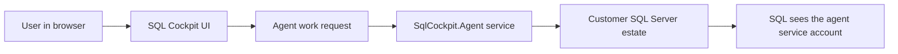

# SQL Cockpit Prerequisite Setup

This guide is for customers preparing a SQL Server estate for SQL Cockpit.

Follow these steps before onboarding instances in SQL Cockpit. The goal is to create one clean service identity, grant the SQL Server permissions SQL Cockpit needs, configure the local agent to use that identity, and verify that cloud or local SQL Cockpit can begin operating without avoidable permission failures.

## What You Are Setting Up

SQL Cockpit uses a local agent to perform live SQL Server work. The cloud or local web app coordinates work, but the paired `SqlCockpit.Agent` service connects to the SQL Servers from inside your network.



For Windows Integrated authentication, SQL Server sees the Windows account running `SqlCockpit.Agent`. It does not see the browser user's Windows account.

Recommended identity:

```text
DOMAIN\sqlcockpit-agent
```

## Roles Needed

You may need more than one person to complete setup:

| Role | Needed for |
| --- | --- |
| Windows or platform administrator | Install SQL Cockpit Agent and configure the Windows service identity. |
| Active Directory administrator | Create a domain service account or gMSA if one does not already exist. |
| SQL Server DBA | Run the SQL prerequisite script on each SQL Server instance. |
| SQL Cockpit administrator | Pair the agent, create instance profiles, and test the setup. |

## Setup Summary

1. Choose the agent host.
2. Create or choose the agent service identity.
3. Install and pair `SqlCockpit.Agent`.
4. Configure `SqlCockpit.Agent` to run as the service identity.
5. Run the SQL Cockpit prerequisite SQL script on every SQL Server instance.
6. Restart the agent.
7. Test SQL Cockpit connection and Estate Overview.
8. Enable optional higher-risk capabilities only when required.

## Step 1: Choose The Agent Host

Install the agent on a Windows machine that can reach the SQL Server instances SQL Cockpit should manage.

Check network reachability from the agent host:

```powershell
Test-NetConnection -ComputerName "sqlserver01.domain.local" -Port 1433
```

If SQL Server uses a named instance or non-standard port, confirm that the agent host can reach the listener used by the saved SQL Cockpit instance profile.

For cloud tenants, the agent host must also be able to make outbound connections to SQL Cockpit. The cloud tenant does not need inbound firewall access to the SQL Servers.

## Step 2: Create Or Choose The Service Identity

Use a dedicated identity. Do not use a personal admin account or domain administrator account for steady-state operation.

Recommended options:

| Option | Recommended when | Example |
| --- | --- | --- |
| Domain service account | Most customers | `DOMAIN\sqlcockpit-agent` |
| gMSA | Customers with managed service-account practice | `DOMAIN\gmsa-sqlcockpit$` |
| LocalSystem machine account | Lab or tightly scoped local installs | `DOMAIN\AGENTHOST$` |

If using a domain service account, your AD team can create it through normal identity-management tooling. Example using the Active Directory PowerShell module:

```powershell
$password = Read-Host "Temporary service account password" -AsSecureString

New-ADUser `
  -Name "sqlcockpit-agent" `
  -SamAccountName "sqlcockpit-agent" `
  -UserPrincipalName "sqlcockpit-agent@domain.local" `
  -AccountPassword $password `
  -Enabled $true
```

Set password rotation and service-account policy according to your organization standards.

## Step 3: Install And Pair The Agent

Install SQL Cockpit Agent from the SQL Cockpit Service Control app or from your approved deployment package.

Pair the agent with the intended SQL Cockpit tenant or local stack. The pairing flow links the local service to SQL Cockpit so the agent can receive work.

After installation, check that the service exists:

```powershell
Get-CimInstance Win32_Service -Filter "Name='SqlCockpit.Agent'" |
  Select-Object Name, State, StartName, PathName
```

## Step 4: Configure The Agent Service Identity

Run PowerShell as Administrator on the agent host.

For a domain service account:

```powershell
$account = "DOMAIN\sqlcockpit-agent"
$password = Read-Host "Service account password" -AsSecureString

$cred = [System.Management.Automation.PSCredential]::new($account, $password)
$plain = $cred.GetNetworkCredential().Password

sc.exe config SqlCockpit.Agent obj= $account password= $plain
Restart-Service SqlCockpit.Agent

Get-CimInstance Win32_Service -Filter "Name='SqlCockpit.Agent'" |
  Select-Object Name, State, StartName, PathName
```

For a gMSA:

```powershell
Test-ADServiceAccount gmsa-sqlcockpit

sc.exe config SqlCockpit.Agent obj= "DOMAIN\gmsa-sqlcockpit$" password= ""
Restart-Service SqlCockpit.Agent

Get-CimInstance Win32_Service -Filter "Name='SqlCockpit.Agent'" |
  Select-Object Name, State, StartName, PathName
```

If Windows reports that the account cannot log on as a service, grant the account the `Log on as a service` right through local security policy or domain Group Policy, then retry the service configuration.

To grant `Log on as a service` locally with PowerShell, run PowerShell as Administrator on the agent host:

```powershell
$account = "DOMAIN\sqlcockpit-agent"

$source = @'
using System;
using System.Runtime.InteropServices;
using System.Text;

public static class LsaRights
{
    [StructLayout(LayoutKind.Sequential)]
    public struct LSA_UNICODE_STRING
    {
        public UInt16 Length;
        public UInt16 MaximumLength;
        public IntPtr Buffer;
    }

    [StructLayout(LayoutKind.Sequential)]
    public struct LSA_OBJECT_ATTRIBUTES
    {
        public int Length;
        public IntPtr RootDirectory;
        public IntPtr ObjectName;
        public UInt32 Attributes;
        public IntPtr SecurityDescriptor;
        public IntPtr SecurityQualityOfService;
    }

    [DllImport("advapi32.dll", SetLastError = true)]
    private static extern UInt32 LsaOpenPolicy(IntPtr systemName, ref LSA_OBJECT_ATTRIBUTES objectAttributes, UInt32 desiredAccess, out IntPtr policyHandle);

    [DllImport("advapi32.dll", SetLastError = true)]
    private static extern UInt32 LsaAddAccountRights(IntPtr policyHandle, byte[] accountSid, LSA_UNICODE_STRING[] userRights, UInt32 countOfRights);

    [DllImport("advapi32.dll")]
    private static extern UInt32 LsaClose(IntPtr objectHandle);

    [DllImport("advapi32.dll")]
    private static extern UInt32 LsaNtStatusToWinError(UInt32 status);

    private const UInt32 POLICY_CREATE_ACCOUNT = 0x00000010;
    private const UInt32 POLICY_LOOKUP_NAMES = 0x00000800;

    private static LSA_UNICODE_STRING InitLsaString(string value)
    {
        if (value.Length > 0x7ffe) throw new ArgumentException("String too long");
        var lus = new LSA_UNICODE_STRING();
        lus.Buffer = Marshal.StringToHGlobalUni(value);
        lus.Length = (UInt16)(value.Length * UnicodeEncoding.CharSize);
        lus.MaximumLength = (UInt16)((value.Length + 1) * UnicodeEncoding.CharSize);
        return lus;
    }

    public static void AddRight(byte[] sid, string right)
    {
        var attributes = new LSA_OBJECT_ATTRIBUTES();
        attributes.Length = Marshal.SizeOf(typeof(LSA_OBJECT_ATTRIBUTES));
        IntPtr policy;
        UInt32 result = LsaOpenPolicy(IntPtr.Zero, ref attributes, POLICY_CREATE_ACCOUNT | POLICY_LOOKUP_NAMES, out policy);
        if (result != 0) throw new System.ComponentModel.Win32Exception((int)LsaNtStatusToWinError(result));

        var rights = new LSA_UNICODE_STRING[1];
        rights[0] = InitLsaString(right);
        try
        {
            result = LsaAddAccountRights(policy, sid, rights, 1);
            if (result != 0) throw new System.ComponentModel.Win32Exception((int)LsaNtStatusToWinError(result));
        }
        finally
        {
            Marshal.FreeHGlobal(rights[0].Buffer);
            LsaClose(policy);
        }
    }
}
'@

Add-Type -TypeDefinition $source

$sid = (New-Object System.Security.Principal.NTAccount($account)).
  Translate([System.Security.Principal.SecurityIdentifier])
$bytes = New-Object byte[] ($sid.BinaryLength)
$sid.GetBinaryForm($bytes, 0)

[LsaRights]::AddRight($bytes, "SeServiceLogonRight")
```

Then retry:

```powershell
Restart-Service SqlCockpit.Agent
```

Enterprise note: if a domain Group Policy controls `Log on as a service` on the agent host, a local grant may be removed at the next policy refresh. In that environment, assign the right through the relevant GPO instead of relying on a local-only grant.

## Step 5: Run The SQL Permission Script

Run the SQL prerequisite script once on every SQL Server instance that SQL Cockpit should inspect.

Use the maintained bootstrap script from the repository:

```text
scripts/security/Grant-SqlCockpitAgentPermissions.sql
```

Before running it, change this value at the top of the script:

```sql
SET @AgentLogin = N'DOMAIN\sqlcockpit-agent';
```

For the local PEACOCKS test domain, that value is usually:

```sql
SET @AgentLogin = N'PEACOCKS\sqlcockpit-agent';
```

Run the script in SSMS or your approved deployment tool as a SQL Server sysadmin or DBA account that can create logins, users, roles, and grants.

The script is intentionally version-tolerant:

- It uses a SQL Server 2005+ syntax baseline.
- It does not use `THROW`, `STRING_SPLIT`, `CREATE SERVER ROLE`, `ALTER SERVER ROLE`, or `ALTER ROLE ... ADD MEMBER`.
- It grants SQL Server 2022-only `VIEW SERVER PERFORMANCE STATE` through dynamic SQL so older SQL Server versions do not fail while parsing the script.
- It grants current online user databases by default.
- It stamps the metadata-reader role into `model` so future newly-created databases inherit the role.
- Restored or attached databases should still be handled by rerunning the script after the restore/attach.

The default setup grants SQL Cockpit metadata visibility, database state visibility for size/health checks, server inventory visibility, and read-only SQL Agent inventory. It does not grant row-data access by default.

To limit SQL Cockpit to specific databases, edit these values before running the script:

```sql
SET @TargetDatabases = N'AppDb,ReportingDb,Warehouse';
SET @GrantAllUserDatabases = 0;
SET @GrantFutureUserDatabasesViaModel = 0;
```

To allow table row reads for specific troubleshooting workflows, explicitly enable this toggle only after security approval:

```sql
SET @GrantDbDataReaderToTargetDatabases = 1;
```

Operational risk: the agent identity becomes the network identity used by SQL Cockpit for estate inspection. Keep this account dedicated to SQL Cockpit, do not reuse a human administrator account, and only enable optional writer or row-data toggles when the customer has approved that access.

## Step 6: Choose Optional Capabilities

Leave optional toggles disabled unless the customer has explicitly approved the capability.

| Capability | Script toggle | Use when | Risk |
| --- | --- | --- | --- |
| Start/stop SQL Agent jobs | `@GrantSqlAgentOperator = 1` | SQL Cockpit users must start or stop existing jobs from Agent Manager | Operational action, not just inventory. Enabled by default in the prerequisite script. |
| SSRS report inspection | `@GrantSsrsCatalogReader = 1` | SQL Cockpit should inspect report definitions | RDL XML can expose report queries and data source references. |
| SSIS package inspection | `@GrantSsisCatalogReader = 1` and/or `@GrantLegacyMsdbSsisPackageReader = 1` | SQL Cockpit should inspect SSIS packages | Package XML can expose command text and connection details. |
| Sync config writes | `@GrantSyncConfigWriter = 1` | SQL Cockpit should create/import sync configuration rows | Changes operational sync behavior. |
| Row-data reading | `@GrantDbDataReaderToTargetDatabases = 1` | SQL Cockpit should intentionally read table rows | Can expose customer data; avoid as a default. |

For a standard estate overview, metadata inventory, object explorer, object search, index inspection, and SQL Agent inventory rollout, the defaults are usually sufficient.

## Step 7: Restart And Verify The Agent

Restart the agent after service-account and permission changes:

```powershell
Restart-Service SqlCockpit.Agent

Get-CimInstance Win32_Service -Filter "Name='SqlCockpit.Agent'" |
  Select-Object Name, State, StartName
```

Confirm the `StartName` is the intended service account.

## Step 8: Verify In SQL Server

Run this on each SQL Server instance:

```sql
DECLARE @AgentLogin sysname = N'DOMAIN\sqlcockpit-agent';

SELECT
    name,
    type_desc,
    is_disabled
FROM sys.server_principals
WHERE name = @AgentLogin;

SELECT
    role_name = role_principal.name,
    member_name = member_principal.name
FROM sys.server_role_members AS srm
INNER JOIN sys.server_principals AS role_principal
    ON role_principal.principal_id = srm.role_principal_id
INNER JOIN sys.server_principals AS member_principal
    ON member_principal.principal_id = srm.member_principal_id
WHERE member_principal.name = @AgentLogin
ORDER BY role_principal.name;
```

Expected:

- the login exists and is enabled
- the login is a member of `SqlCockpitEstateReader`
- `msdb` contains a user for the login when SQL Agent inventory is enabled
- approved user databases contain `SqlCockpitMetadataReader`

## Step 9: Verify In SQL Cockpit

In SQL Cockpit:

1. Open Service Control and confirm `SQL Cockpit Agent` is running.
2. Open Instance Manager.
3. Create or edit an instance profile for the target SQL Server.
4. Use Integrated authentication if the service account should be used.
5. Test the connection.
6. Open Estate Overview and refresh.
7. Confirm databases, size, volume, and SQL Agent detail load as expected.

If using SQL authentication profiles, save the SQL password through SQL Cockpit after the agent is running as the final service identity. SQL-auth passwords are stored in Windows Credential Manager under the agent service identity.

## Troubleshooting

| Symptom | Likely cause | Fix |
| --- | --- | --- |
| `Login failed for user 'DOMAIN\account'` | The agent service identity is not granted on the SQL Server, or the service is running as a different identity | Check `StartName`, update `@AgentLogin`, rerun the script on that SQL Server. |
| SSMS works but SQL Cockpit fails | SSMS uses the human user's Windows token; SQL Cockpit uses the agent service identity | Grant the agent service identity, not the human account. |
| Databases are missing or show zero metadata | Database metadata grants are missing | Rerun the script with `@GrantAllUserDatabases = 1`, or include the database in `@TargetDatabases`. |
| Newly restored database is missing | Restored/attached databases do not reliably inherit `model` grants | Rerun the script after restore/attach/AG seed. |
| SQL Agent detail unavailable | `msdb` SQL Agent reader role was not granted or SQL Agent is not installed | Keep `@GrantSqlAgentInventory = 1`, rerun the script, confirm SQL Agent exists. |
| SQL-auth secret missing | The agent service account changed after the password was saved | Re-save the SQL-auth password in SQL Cockpit. |
| Agent is not polling or pairing | Agent is stopped, unpaired, or blocked from outbound tenant access | Start the service, repair pairing, and check outbound network policy. |

## Completion Checklist

- [ ] Agent host can reach every target SQL Server.
- [ ] Dedicated service identity exists.
- [ ] `SqlCockpit.Agent` runs as the service identity.
- [ ] SQL permission script has run on every target SQL Server instance.
- [ ] Defaults were used, or optional toggles were approved and documented.
- [ ] Agent was restarted after identity and SQL permission changes.
- [ ] Instance Manager connection test succeeds.
- [ ] Estate Overview refresh succeeds.
- [ ] SQL-auth passwords, if used, were saved after the final service identity was configured.

For the underlying security model and permission detail, see [SQL Cockpit Agent Permissions And Risk Model](sql-cockpit-agent-permissions.md).

