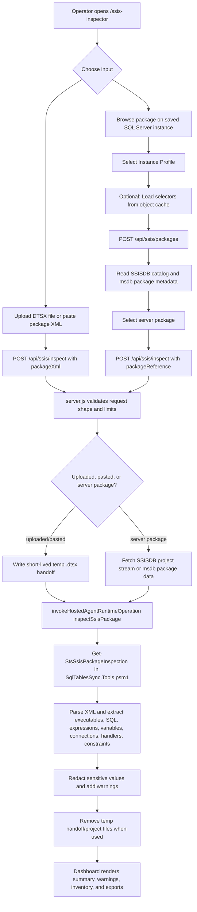

# SSIS Package Inspector

## Purpose
SSIS Package Inspector is a read-only SQL Cockpit page at `/ssis-inspector`.
It inspects SSIS `.dtsx` package XML without opening Visual Studio or SSDT, extracts operationally useful package content, and highlights common review risks.

The inspector does not execute SSIS packages, run extracted SQL, connect to SQL Server, or write analysis output to disk unless the operator uses a browser export button.

## Runtime Flow

## Storage And Config Impact
- Storage location: uploaded/pasted package XML is written to one short-lived `.dtsx`/`.xml` handoff file under the OS temp directory during the request, then removed on a best-effort basis. SSISDB server package inspection may also write one short-lived `.ispac` project stream under the OS temp directory while extracting the selected `.dtsx`. Inspection output is not stored.
- Config location: none.
- Database config tables: none added or changed.
- New flags/settings: none.
- Defaults:
  - browser upload limit: 12 MB.
  - API request body limit for this route: 15 MB.
  - server-local file limit: 15 MB by default, capped by the route at 25 MB.
  - server package browse limit: 1,000 rows from the dashboard request, capped by the route/runtime at 2,000.
  - extracted text field limit: 40,000 characters from the dashboard request.
  - `Load selectors from object cache`: enabled by default in the UI. It reads object-search status to hint SSISDB/msdb store availability for the selected saved instance; package metadata and package XML are still read live from the saved SQL Server instance.

## What Is Extracted
- Executable tasks and containers, excluding the package root.
- Execute SQL Task statements via `SqlStatementSource` and related property names.
- OLE DB/source command-like fields such as `SqlCommand`, `CommandText`, `OpenRowset`, and command variables.
- Expressions, derived-column/condition fields, variables used in expressions and SQL, package variables, and parameters.
- Connection managers and connection strings with password/secret-like values redacted.
- Script task/component metadata, with a note when full VSTA source extraction is likely limited.
- Event handlers, precedence constraints, and package configurations when present.

## Static Warnings
The inspector reports warnings for disabled tasks, password/secret-like values, production-like references, hardcoded paths, risky SQL DDL, unfiltered DML, dynamic/pass-through SQL, and script metadata that may need SSIS tooling for full source extraction.

These warnings are static heuristics. Treat them as review prompts, not proof that a package is unsafe or safe.

## API Contract
- Route: `POST /api/ssis/packages`
  - Authentication/RBAC:
    - Requires an authenticated same-origin SQL Cockpit session.
    - Requires a saved Instance Manager profile in the active workspace.
    - SQL permissions depend on the selected package store: SSISDB catalog metadata and project export require appropriate SSISDB READ/ssis_admin/sysadmin access; msdb package metadata requires read access to legacy package tables.
  - Request shape:
    - `instanceProfileId` (string, required): saved Instance Manager profile.
    - `packageStore` (string, optional): `ALL`, `SSISDB`, or `MSDB`.
    - `maxPackages` (number, optional): browse cap, capped by the route/runtime.
  - Response shape:
    - `ServerName`, `Store`, `RetrievedAtUtc`, `Summary`, `Packages[]`, and `Notes[]`
- Route: `POST /api/ssis/inspect`
- Authentication/RBAC:
  - Requires an authenticated same-origin SQL Cockpit session.
  - Upload/paste inspection does not connect to SQL Server.
  - Server package inspection requires a saved Instance Manager profile and SQL permissions to read the selected package store.
- Request shape:
  - `packageXml` (string, optional): DTSX XML content from upload or paste.
  - `packagePath` (string, optional): server-local `.dtsx` or `.xml` file path.
  - `instanceProfileId` (string, optional): saved Instance Manager profile for server package inspection.
  - `packageReference` (object, optional): selected server package with `store`, `folderName`, `projectName`, `packageName`, and optional `packageId`.
  - `packageName` (string, optional): display name used in the result and exports.
  - `maxExtractChars` (number, optional): per-field extraction cap, 1,000 to 100,000.
  - `maxFileBytes` (number, optional): server-local file cap, capped by the route.
  - Provide `packageXml`, `packagePath`, or `instanceProfileId` plus `packageReference`. When `packageXml` is present, it is handed to PowerShell through a short-lived temp file to avoid operating-system command-line length limits.
- Response shape:
  - `Package`, `PackageObjectName`, `PackagePath`, `Source`, `InspectedAtUtc`, `PackageFormatVersion`, `CreatorName`
  - `Summary` with counts for tasks, disabled tasks, SQL extracts, expressions, script metadata, variables, connections, handlers, constraints, and warnings
  - `Tasks[]` with task metadata, extracted SQL, expressions, connections, variables used, scripts, and warnings
  - `SqlStatements[]`, `Expressions[]`, `Scripts[]`, `Variables[]`, `Connections[]`, `EventHandlers[]`, `PrecedenceConstraints[]`, `Configurations[]`, `Parameters[]`, `Warnings[]`, and `Notes[]`

## Code Paths Affected
- `sql-cockpit-api/app/ssis-inspector/page.js`
- `sql-cockpit-api/components/dashboard/dashboard-route-metadata.js`
- `sql-cockpit-api/components/dashboard/page-dependency-loader.js`
- `sql-cockpit-api/components/dashboard/pages/ssis-inspector-page.js`
- `sql-cockpit-api/components/dashboard-client.js`
- `sql-cockpit-api/components/dashboard/dashboard-welcome-page.js`
- `sql-cockpit-api/server.js`
- `scripts/runtime/Invoke-SqlTablesSyncRestOperation.ps1`
- `scripts/runtime/SqlTablesSync.Tools.psm1`
- `GET /openapi.json` includes `/api/ssis/packages` and `/api/ssis/inspect`, so both routes are visible from `/api-docs`.

## Operational Risk
- Low for uploaded/pasted XML: the package is parsed through a short-lived temp handoff file and not executed. The handoff contains the full package XML while the request is running, so protect OS temp access on shared hosts.
- Medium for `packagePath`: the SQL Cockpit server process reads a local file path supplied by an authenticated user. Keep dashboard access restricted to trusted operators and prefer upload/paste for ad hoc review.
- Medium for server package browse/inspection: SQL Cockpit connects to the selected saved instance, reads package metadata from SSISDB/msdb, and may export an SSISDB project stream to a short-lived temp `.ispac` file to extract the selected `.dtsx`. It does not execute packages or extracted SQL.
- Data sensitivity:
  - Results include package names, task names, SQL text, server/database names, variables, connection metadata, paths, and redacted connection strings.
  - The response redacts password/secret-like values, but extracted SQL and object names can still reveal operational logic.
- Performance:
  - Very large packages can increase memory and CPU while XML is parsed. Use the configured size caps and inspect large packages from a controlled local environment.

## Safe Test Procedure
1. Use a small non-production `.dtsx` file with one known Execute SQL Task.
2. Open `/ssis-inspector`.
3. Upload the file or paste the DTSX XML and run Inspect Package.
4. Confirm the page scrolls to the summary stats area when inspection completes.
5. Confirm the task count, SQL extract, variables, connections, and warnings match the package.
6. Verify sensitive connection values are redacted.
7. Export JSON, Markdown, and HTML and confirm the exports contain redacted values only.
8. For server package browse, select an Instance Profile, leave `Load selectors from object cache` enabled, browse packages, then click the row-level `Inspect package` button for a known non-production package. The top `Inspect Package` action should still work after selecting a row.
9. Verify `/health` and `/ssis-inspector` through the running dev server when `.sql-cockpit-dev-lock.json` exists.
10. Verify `GET /openapi.json` includes `/api/ssis/packages` and `/api/ssis/inspect` from an authenticated browser session or by running the OpenAPI PowerShell operation locally.

## Troubleshooting
- `Provide packageXml from an uploaded DTSX file or packagePath for a server-local .dtsx/.xml file.`
  - The request did not include package XML or a package path.
- `Package path must end in .dtsx or .xml.`
  - Use a DTSX/XML file extension for server-local path inspection.
- `PackagePath was not found.`
  - The path is not visible to the SQL Cockpit server process.
- `Select a saved Instance Manager profile.`
  - Server package browse requires a saved profile in the active workspace.
- `SSISDB did not return a project stream`
  - The profile may not have READ, ssis_admin, or sysadmin access to the selected SSISDB project, or the folder/project no longer exists.
- `Package [...] was not found inside the SSISDB project stream`
  - SQL Cockpit found the package in `SSISDB.catalog.packages` and exported the project stream, but could not match the selected catalog package to an archive entry in the `.ispac`. The loader normalizes case, extension-only differences, and URI-encoded filenames such as `%20` for spaces. If it still fails, the API error lists the expected package names and the `.dtsx` entries actually found in the project stream; compare those names with the selected folder/project/package and redeploy the SSIS project if the catalog and stream are out of sync.
- `Package data ... did not decode to DTSX XML`
  - A legacy msdb package may be encrypted or compressed in a way that requires export through SSIS tooling before static XML inspection.
- `Package XML could not be parsed`
  - The uploaded/pasted file is not well-formed XML or was truncated before submission.
- `The property 'Value' cannot be found on this object`
  - Older SSIS Inspector builds could throw this when a package contained sparse optional metadata, such as a precedence constraint without an expression or a connection manager without a `ConnectionString`. Current builds treat those fields as blank and continue parsing the rest of the package.
- `spawn ENAMETOOLONG`
  - The running server is using an older SSIS inspector route that passed uploaded XML as a process argument. Restart the SQL Cockpit dev server so the temp-file handoff route is active.
- Empty SQL extracts:
  - Some package logic may be stored in encoded script projects, expressions, variables, package parameters, or provider-specific component metadata. Review the full JSON export and open the package with SSIS tooling when static XML extraction is incomplete.

