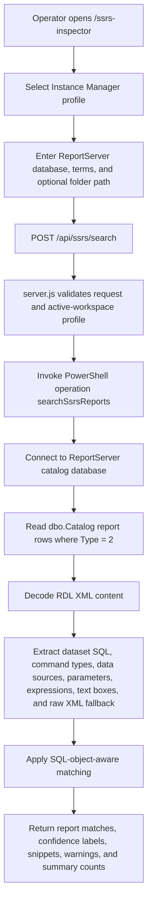

# SSRS Report Inspector

## Purpose
SSRS Report Inspector is a read-only SQL Cockpit page at `/ssrs-inspector`.
It searches SSRS report definitions stored in a saved SQL Server instance's ReportServer catalog so operators can find reports that reference a specific view, procedure, function, table, or term.

The inspector does not execute reports, run extracted SQL, call SSRS web services, inspect subscriptions, inspect execution logs, or write output files.

## Runtime Flow

## Storage And Config Impact
- Storage location: none. Search results are returned to the browser response and can be downloaded by the operator as CSV or JSON.
- Config location: none.
- Database config tables: none added or changed.
- New flags/settings: none.
- Defaults:
  - ReportServer database: `ReportServer`.
  - `maxReports`: `500`, capped by the API/runtime at `5,000`.
  - `maxMatchesPerReport`: `25`, capped by the API/runtime at `200`.

## Search Behaviour
- Searches SSRS catalog report items only: `dbo.Catalog` rows where `Type = 2`.
- Extracts dataset commands, command types, data source names, data source XML, report parameters, expression-like values, text box values, and raw RDL XML fallback.
- SQL-object-aware matching normalizes bracketed and unbracketed names.
- Confidence labels are `qualified`, `schema-object`, `leaf-only`, and `literal`.
- `leaf-only` matches are useful discovery hints but should be reviewed manually for false positives.

This is static text/XML analysis, not a full T-SQL dependency parser.

## API Contract
- Route: `POST /api/ssrs/search`
- Authentication/RBAC:
  - Requires an authenticated same-origin SQL Cockpit session.
  - Requires a saved Instance Manager profile in the active workspace.
  - SQL permissions must allow reading the selected ReportServer database `dbo.Catalog` rows and `Content` column.
- Request shape:
  - `instanceProfileId` (string, required)
  - `reportServerDatabase` (string, optional, default `ReportServer`)
  - `terms` (array or newline/comma-delimited string, required)
  - `folderPath` (string, optional)
  - `maxReports` (number, optional)
  - `maxMatchesPerReport` (number, optional)
- Response shape:
  - `ServerName`, `ReportServerDatabase`, `FolderPath`, `SearchedAtUtc`
  - `Terms[]`
  - `Summary`
  - `Reports[]`
  - per-report `Matches[]`
  - `Warnings[]`
  - `Notes[]`

## Code Paths Affected
- `sql-cockpit-api/app/ssrs-inspector/page.js`
- `sql-cockpit-api/components/dashboard/dashboard-route-metadata.js`
- `sql-cockpit-api/components/dashboard/page-dependency-loader.js`
- `sql-cockpit-api/components/dashboard/pages/ssrs-inspector-page.js`
- `sql-cockpit-api/components/dashboard-client.js`
- `sql-cockpit-api/components/dashboard/dashboard-welcome-page.js`
- `sql-cockpit-api/server.js`
- `scripts/runtime/Invoke-SqlTablesSyncRestOperation.ps1`
- `scripts/runtime/SqlTablesSync.Tools.psm1`
- `GET /openapi.json` includes `/api/ssrs/search`, so the route is visible from `/api-docs`.

## Operational Risk
- Low to medium: the route is read-only, but report definitions can contain SQL text, server names, database names, business logic, and parameter names.
- ReportServer catalog reads may be sensitive. Restrict SQL Cockpit access and SQL permissions to trusted operators.
- Large catalogs or very large RDL payloads can increase API CPU and memory while XML is decoded and searched.
- Leaf-only matches can be false positives.

## Safe Test Procedure
1. Use a non-production ReportServer catalog with a known report referencing a test view or procedure.
2. Open `/ssrs-inspector`.
3. Select a saved Instance Manager profile with read access to the ReportServer catalog.
4. Confirm the database name is `ReportServer` or enter the instance-specific database, such as `ReportServer$DEV`.
5. Search for a schema-qualified object such as `dbo.vwKnownReportSource`.
6. Confirm matching reports, confidence labels, locations, and snippets are expected.
7. Search for the leaf name only and confirm the result is labelled `leaf-only`.
8. Export CSV and JSON and store them only in approved operational locations.
9. Verify `/health`, `/ssrs-inspector`, and `/openapi.json` through the running dev server when `.sql-cockpit-dev-lock.json` exists.

## Troubleshooting
- `Select a saved Instance Manager profile.`
  - The request did not include a profile visible in the active workspace.
- `Enter at least one SSRS search term or SQL object name.`
  - Add one term per line or comma-separated terms.
- `Invalid object name 'dbo.Catalog'`
  - The selected database is not an SSRS ReportServer catalog database or the profile connected to the wrong database.
- `The SELECT permission was denied on the object 'Catalog'`
  - Grant read access to the ReportServer catalog or use a profile with appropriate reporting-admin read permissions.
- `report-rdl-parse-failed`
  - One catalog row could not be decoded or parsed as RDL XML. The search continues for other reports.
- Unexpected leaf-only matches:
  - Search again with a schema-qualified or database-qualified object name to reduce false positives.
