# View Usages

View Usages is a read-only dashboard page at `/view-usages` for finding cached SQL code definitions where a selected view appears. It is intended as a quick refactor impact search: choose a cached view, click **Find Code Usages**, then review the Objects To Change summary and detailed cached occurrences for views, procedures, functions, triggers, SQL Agent jobs, and query-like documents that contain that view name.

Use Command Palette for broad object-cache discovery across objects, columns, and metadata. Use View Usages when you need the smaller code-only list of places that may need editing before a view is removed or renamed.

## Runtime Surface

| Surface | Value |
| --- | --- |
| Dashboard route | `/view-usages` |
| Legacy dashboard route | `/view-dependencies` redirects to `/view-usages` |
| API route | `GET /api/view-usages` |
| Legacy API route | `GET /api/view-dependencies` |
| OpenAPI tag | `SQL Metadata` |
| Cache source | Active workspace object-search Lucene index |
| SQL writes | None |
| SQL Server connections | None |
| Local file writes | None |

## Authentication and RBAC

The endpoint requires an authenticated same-origin SQL Cockpit session. Workspace scope is derived from the signed-in user's active workspace; callers cannot supply `workspaceKey`.

Treat access to this page and API as access to cached SQL object names, module definitions, and refactor evidence for the active workspace.

## Request Shape

Selected-view usage search:

```http
GET /api/view-usages?mode=usage&viewId=<object-search-document-id>
```

API token usage search, retained for compatibility with non-dashboard callers:

```http
GET /api/view-usages?mode=usage&q=vw_orders&server=sql01&database=Reporting&includeInstanceDatabases=1
```

The dashboard default path is:

- select server instance, database, schema, and cached view from object-search cache selectors.
- optionally enable **Include comments** when comment-only references should be retained.
- click **Find Code Usages**.

The dashboard does not expose a manual token input. API callers can still use `q` without `viewId` for compatibility or scripted checks with tokens such as `vw_Orders`, `dbo.vw_Orders`, or `DeSL.dbo.vw_Orders`.

Optional query parameters:

| Parameter | Valid values | Default | Notes |
| --- | --- | --- | --- |
| `mode` | `usage` | `usage` from the dashboard | Searches cached SQL-bearing definitions for code occurrences. |
| `viewId` | Cached object-search document id for a view | Empty | Preferred selected-view path. The API resolves the object name and qualified variants from cache. |
| `q` | Text query | Empty | API compatibility token search when `viewId` is omitted. The dashboard uses `viewId`. |
| `server` / `sourceServer` | Cached source server name | View server or empty | Scope for code occurrence search. |
| `database` / `databaseName` | Cached database name | View database or empty | Selected view context; not a consumer database filter when instance scan is enabled. |
| `schema` / `schemaName` | Cached schema name | View schema or empty | Selected view context. |
| `includeInstanceDatabases` | `true`, `1`, `yes`; or `false`, `0`, `no` | `true` | When a server is supplied, scans code objects across all cached databases on that server. |
| `includeComments` | `true`, `1`, `yes`, `include`; or `false`, `0`, `no` | `false` from the dashboard | Includes matches where the selected view token appears only inside SQL line or block comments. |
| `limit` | Integer, capped by API settings | `5000` from the dashboard | Per-object-type candidate limit. |

## Response Shape

In usage mode the response contains:

- `target`: selected cached view metadata, including `searchText`, server, database, and schema. API `q` calls return token metadata for compatibility.
- `summary`: `consumerCount`, `referenceCount`, `procedureCount`, `queryCount`, `candidateCount`, and `databaseCount`.
- `consumers`: code objects with exact identifier matches in their cached definition. Each consumer includes `definitionText` so the dashboard can open the cached object source in SQL Editor.
- `consumers[].references`: line number, matched token, match scope, offset, snippet evidence, and the full containing SQL statement for the occurrence.
- `nodes`: one node per result object for compatibility with older clients.
- `edges`: empty in usage mode.
- `options`: scan scope, object types searched, `includeComments`, and `searchedAtUtc`.

The selected view's own `CREATE VIEW` definition is excluded from the main result list by default because it is the object being removed or renamed, not a consumer to update.

The dashboard derives an **Objects To Change** summary from `consumers`, `target`, and `references`. This is a client-side action table; it does not require a separate API shape. Each row shows the object type, source server, database, schema, object name, reason, first matched token, first line, and occurrence count. Object type is communicated with an icon and label rather than row color; colors do not imply severity. Operators can click any column header to sort the table, and click a row to jump to that object's raw SQL evidence in **Code Occurrences**.

The Objects To Change table can be exported as CSV or JSON. Exports use the current sorted row order and include the visible table fields plus the full containing SQL statement and statement line range for each row.

The **Code Occurrences** panel shows the full SQL statement containing the match, not only a short snippet. SQL statements are syntax-highlighted, and the matched token is highlighted in the statement. Each occurrence card includes **Open in editor**, which opens the cached object definition in SQL Editor as a new read-mode tab with server and database context. Very large statements are bounded for dashboard display and marked as truncated.

## Behaviour

```mermaid
flowchart LR
    Page["/view-usages"] --> Status["GET /api/object-search/status?compact=1"]
    Status --> Scope["Populate server and database selectors"]
    Scope --> Search["GET /api/object-search/search?objectType=View"]
    Search --> Select["Select cached schema and view"]
    Select --> Usage["GET /api/view-usages?mode=usage&viewId=..."]
    Usage --> Cache["Object-search sidecar"]
    Cache --> Code["Cached SQL-bearing definitions"]
    Code --> Match["Identifier matching"]
    Match --> Summary["Objects To Change"]
    Summary --> Results["Code Occurrences"]
    Results --> Page
```



For a selected view, the API resolves the cached view and matches bracketed and unbracketed forms such as:

- `vw_Orders`
- `dbo.vw_Orders`
- `[dbo].[vw_Orders]`
- `DeSL.dbo.vw_Orders`
- `[DeSL].[dbo].[vw_Orders]`

When a server is supplied, usage mode scans cached code objects across all cached databases on that server instance. It intentionally excludes table, column, index, and general metadata hits; those remain part of Command Palette object search.

Comment-only matches are excluded by default. Enable **Include comments** when comments should be treated as refactor evidence because they may reveal historical code paths or operator notes that need review.

The Objects To Change table explains why each code object needs review:

- `Selected view reference` for cached views that reference the selected view.
- `Procedure contains selected view token` for stored procedures.
- `SQL code contains selected view token` for functions, triggers, SQL Agent jobs, and query-like documents.
- `Cross-database` is prefixed when the result database differs from the selected view database.

Rows default to refactor triage order: procedures first, then cross-database objects, then same-database views, then other SQL-bearing objects. Clicking a column header switches to ascending/descending sorting for that column. The Code Occurrences section remains the evidence view with full statements, highlighted tokens, and line numbers.

## Operational Risk

Risk is medium.

- Results can expose cached SQL module definitions and object names.
- Results can be stale until object-search sync refreshes the source database.
- Exact identifier matching can miss dynamic SQL that constructs object names at runtime, synonyms, encrypted modules, or generated SQL not present in cache.
- Instance-wide scans can read many cached definitions on large servers.

## Safe Test Procedure

1. Confirm a recent object-search sync for the target server instance.
2. Open `/view-usages`.
3. Select the intended server, database, schema, and cached view.
4. Click **Find Code Usages**.
5. Confirm results include expected code objects from other cached databases on the same server instance.
6. Confirm results are code definitions only, not the broader object, column, and metadata matches shown by Command Palette.
7. Review the Objects To Change summary for the actionable list of code objects and reasons. Click a row to jump to its raw SQL evidence in Code Occurrences.
8. Review the syntax-highlighted full statement, highlighted token, and line numbers before changing or removing the view.
9. Use **Open in editor** on a Code Occurrences card when the full cached object definition needs to be reviewed or edited in SQL Editor.
10. Optionally sort the Objects To Change table and export the current order as CSV or JSON for review outside SQL Cockpit.

## Configuration Items

No database config table flags or runtime settings were added.

Operational inputs are per-request only:

| Input | Storage location | Valid values | Default | Code paths affected | Operational risk | Safe change procedure |
| --- | --- | --- | --- | --- | --- | --- |
| `viewId` | Request query only | Cached view document id | Empty | `server.js`, `/view-usages` page | Incorrect id returns an error or searches the wrong selected view. | Use the dashboard selectors so the id comes from object cache. |
| `q` | Request query only | Text token | Empty | `server.js`, API callers | Broad or ambiguous tokens may produce noisy code matches. | Prefer selected-view search; use `q` only for compatibility scripts or qualified API checks. |
| `includeInstanceDatabases` | Request query only | Boolean query value | `true` in usage mode | `server.js`, `/view-usages` page | Scans more cached definitions on large instances. | Leave enabled for refactor impact checks; disable only for a narrow selected-database check. |
| `includeComments` | Request query only | Boolean query value | `false` from the dashboard | `server.js`, `/view-usages` page | Including comments can add historical or note-only references that may not require code edits. | Leave off for code-only refactor impact; enable when operator notes and commented-out code should be reviewed. |
| `limit` | Request query only | Integer | `5000` from the dashboard | `server.js` | Low values can miss candidates; high values can slow searches. | Raise only when a large instance needs deeper cached candidate reads. |

## Confidence

- confirmed: the endpoint is read-only and uses object-search cache APIs only.
- confirmed: View Usages intentionally differs from Command Palette because it searches SQL-bearing cached definitions, not every cached object or column.
- inferred: query-like cached docs are represented by object-cache types such as functions, triggers, SQL Agent jobs, and `Query` documents where present.
