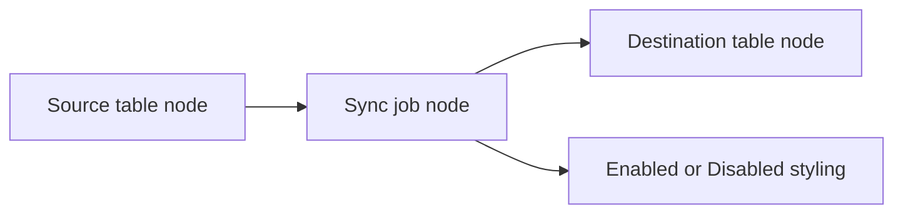

# Visualize TableConfig

Use `Export-TableConfigDiagram.ps1` to generate a live diagram from `Sync.TableConfig`.

The script reads the current config rows, emits a Graphviz DOT file, and optionally renders it with `dot` into `svg`, `png`, or `pdf`. The diagram groups source and destination tables by database and places one job node between them for each sync row.

Table nodes are labeled explicitly so they can be understood outside cluster context, for example:

- `Source:`
- `Server: 10.240.103.40`
- `Database: 30001`
- `Schema: dbo`
- `Table: SomeTable`

## What the diagram shows

- source server and database
- source schema and table
- destination server and database
- destination schema and table
- `SyncName`
- `SyncId`
- `SyncMode`
- whether the job is enabled
- key and watermark summary

Enabled jobs are rendered in green-tinted boxes. Disabled jobs are rendered in grey-tinted boxes.



## Run the script

From the repo root:

```powershell
powershell -NoProfile -ExecutionPolicy Bypass -File .\Export-TableConfigDiagram.ps1 `
  -ConfigServer "NASCAR" `
  -ConfigDatabase "EPC_Imports_PCK" `
  -ConfigSchema "Sync" `
  -ConfigIntegratedSecurity `
  -TrustServerCertificate
```

Default outputs:

- DOT file: `.\Logs\TableConfigDiagram.dot`
- Rendered file: `.\Logs\TableConfigDiagram.svg`

If `dot` is not installed or not on `PATH`, the script still writes the DOT file and warns instead of failing after the SQL read.

## Useful options

- `-EnabledOnly`
  - reads only `IsEnabled = 1` rows
  - useful for the currently active runtime footprint
- `-SkipRender`
  - writes only the DOT file
  - useful if another tool or pipeline will render the graph later
- `-RenderFormat svg|png|pdf`
  - chooses the Graphviz output format
- `-OutputPath`
  - changes the DOT file location
- `-DotPath`
  - lets you point at a specific Graphviz executable if `dot` is not on `PATH`

Example:

```powershell
powershell -NoProfile -ExecutionPolicy Bypass -File .\Export-TableConfigDiagram.ps1 `
  -ConfigServer "NASCAR" `
  -ConfigDatabase "EPC_Imports_PCK" `
  -ConfigSchema "Sync" `
  -ConfigIntegratedSecurity `
  -EnabledOnly `
  -OutputPath ".\Logs\ActiveSyncMap.dot" `
  -RenderFormat "png"
```

## Storage location and runtime impact

- Reads from: `Sync.TableConfig`
- Writes to: local filesystem only
- Database writes: none
- Code paths affected:
  - `Export-TableConfigDiagram.ps1`
  - `Sync.TableConfig` as the live control-plane source
- Operational risk:
  - low for database safety because the script is read-only
  - medium for data exposure if the rendered output is shared carelessly across teams or environments

## Safe procedure

1. Run the exporter against the intended config database.
2. Review whether disabled jobs should be included for the audience.
3. Treat the diagram as environment-sensitive because it exposes server, database, schema, table, and job names.
4. Regenerate the diagram whenever `Sync.TableConfig` rows are added, removed, enabled, disabled, or redirected.

## Confirmed vs uncertain

- Confirmed from code:
  - the script reads `Sync.TableConfig`
  - the diagram styles enabled and disabled jobs differently
  - source and destination mappings are drawn from the live row values
  - the script can emit DOT without Graphviz being installed
- Uncertain from this repo alone:
  - whether operators want disabled jobs included in every shared diagram
  - whether any external tooling already consumes DOT or rendered outputs from this repo
