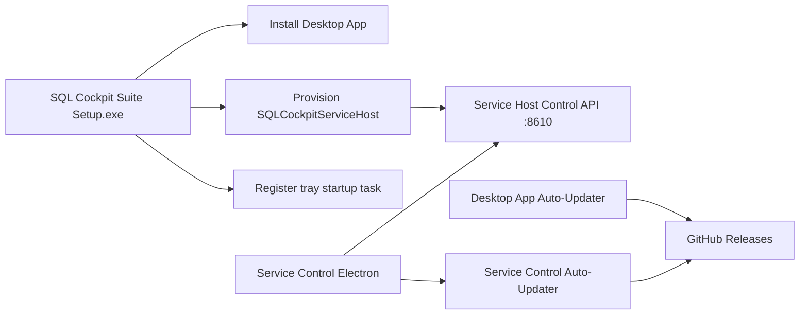

# Windows Service Control (Electron)

This app is a separate Windows desktop companion for controlling the SQL Cockpit SCM host.

It provides:

- tray icon access
- dedicated service-control UI with a desktop control-centre layout
- in-app update checks and install prompts using `electron-updater`
- suite repair entrypoint (`Repair`) for desktop/service/task reconciliation



## Capabilities

The Electron app supports:

- header environment badge (`Environment: Development Build` or `Environment: Production Build`)
- runtime profile suffix in the badge when available (for example `Runtime: prod`)
- Windows service status (`SQLCockpitServiceHost`)
- service start/stop actions
- native confirmation prompts before stop-all, stop-component, stop-service, and force-kill actions
- status overview cards for running/stopped/warning component counts
- diagnostics panel that keeps settings, service, and runtime errors visible instead of hiding failed status calls
- component snapshot list (`id`, `display`, status, health, PID, restart count, last start, last error)
- per-component `Start`, `Restart`, `Stop`
- bulk `Start All`, `Restart All`, `Stop All`
- auto-refresh every 15 seconds
- quick action button to open Docs in the default browser (uses docs component URL from service settings, falls back to `http://127.0.0.1:8000/`)
- health-first component adoption: if a configured `healthUrl` or `alternateHealthUrls` endpoint answers successfully, Service Control shows the component as running even when the process was started by the local-dev stack instead of `SQLCockpitServiceHost`
- automatic managed API bootstrap on app start:
  - reconciles `web-api` service settings contract (`--listenPrefix http://127.0.0.1:8000/`, `autoStart=true`, `workingDirectory={ApiRepoRoot}`)
  - ensures split-era repo root keys exist in settings (`desktopRepoRoot`, `apiRepoRoot`, `serviceRepoRoot`, `objectSearchRepoRoot`)
  - enforces `--serviceHostControlUrl` for `web-api` in prod mode so API startup contract is valid
  - attempts to start `SQLCockpitServiceHost` and `web-api` if they are not running
- in suite-managed prod mode, desktop launch is client-only (`-ExternalApiOnly true`) and connects to SCM-managed `web-api` on `http://127.0.0.1:8000/`
- desktop launch preflight that checks the configured desktop listen-prefix port before launch and shows an immediate warning if the port is already in use (warning-only; launch continues)
- `Run Repair (UAC)` action that re-runs suite provisioning with path migration and health validation
- update actions:
  - `Check For Updates`
  - `Install Downloaded Update`
- the legacy `desktop-app` managed component is no longer provisioned; Service Control manages the Windows service host, runtime services, updates, and SQL Cockpit Agent only
- SQL Cockpit Agent live output viewer:
  - connects to the agent's local named pipe, `\\.\pipe\SqlCockpit.Agent.LogStream` by default
  - shows recent in-memory agent log events and follows new events
  - does not write files unless an operator clicks `Log To File` and chooses a capture path

## SQL Cockpit Agent live output

Use the `Live Logs` button on the `sql-cockpit-agent` managed component when you need to see what the agent is doing without enabling persistent disk logging.

Default behaviour:

- agent-side setting: `Agent:LiveLogEnabled=true`
- agent-side pipe: `Agent:LiveLogPipeName=SqlCockpit.Agent.LogStream`
- agent-side memory replay: `Agent:LiveLogBufferSize=500`
- Service Control reads the installed agent `appsettings.json` under `agentInstallDirectory` when it needs a non-default pipe name
- no log files are created by the agent or Service Control by default

File capture is operator-driven:

1. Click `Live Logs` on the `sql-cockpit-agent` row.
2. Confirm live output appears in the modal.
3. Click `Log To File`.
4. Choose a temporary `.ndjson` or `.log` file.
5. Reproduce the issue or wait for the next heartbeat/job event.
6. Click `Stop File Log` before sharing or deleting the capture.

Operational risk: captured files can contain exception text, server names, profile identifiers, and local path details. Do not store long-running captures by default, and delete temporary captures after diagnosis unless your incident process requires retention.

## Agent LDAP settings

Service Control owns the local agent LDAP connection settings for each environment lane. The hosted dashboard should enable LDAP provider policy and **Route LDAP through paired Agent**, but the LDAP server, search base, bind DN, and bind password stay on the machine running the agent.

Use **Managed components > environment lane > LDAP Settings** to update the selected lane's installed agent `appsettings.json`.

Stored settings:

| Setting | Storage | Valid values | Default | Operational notes |
| --- | --- | --- | --- | --- |
| `Agent:Ldap:Server` | Lane agent `appsettings.json` | Hostname or IP reachable from the agent host | Empty | Required before agent-backed LDAP can work. |
| `Agent:Ldap:Port` | Lane agent `appsettings.json` | `1` to `65535` | `389` | Use `636` with LDAPS. |
| `Agent:Ldap:UseSsl` | Lane agent `appsettings.json` | `true`, `false` | `false` | Prefer LDAPS in production. |
| `Agent:Ldap:IgnoreCertificateErrors` | Lane agent `appsettings.json` | `true`, `false` | `false` | Temporary diagnosis only; weakens TLS validation. |
| `Agent:Ldap:BaseDn` | Lane agent `appsettings.json` | LDAP distinguished name | Empty | Required search root, for example `DC=example,DC=local`. |
| `Agent:Ldap:BindDn` | Lane agent `appsettings.json` | DN or UPN | Empty | Use a least-privileged directory-read service account when searches need one. |
| `Agent:Ldap:BindPassword` | Lane agent `appsettings.json` | Secret string | Empty | Service Control never displays this value; leaving the password field blank preserves the existing secret. |
| `Agent:Ldap:UserFilter` | Lane agent `appsettings.json` | LDAP filter containing `{0}` | `(|(sAMAccountName={0})(userPrincipalName={0})(mail={0})(cn={0}))` | The agent escapes the username before substitution. |
| `Agent:Ldap:TimeoutSeconds` | Lane agent `appsettings.json` | `1` to `120` | `10` | Local LDAP connection/search timeout. |
| `Agent:Ldap:GroupAttribute` | Lane agent `appsettings.json` | LDAP attribute name | `memberOf` | Returned group claims are bounded. |
| `Agent:Ldap:MaxGroups` | Lane agent `appsettings.json` | `0` to `500` | `50` | Prevents oversized login results. |

Safe test procedure:

1. Configure the non-production lane Agent first.
2. Keep **Restart this lane's Agent after save** selected so the new settings are loaded.
3. Confirm the hosted or local dashboard shows the agent online with `identity.ldap.*` capabilities.
4. In the dashboard, enable LDAP and **Route LDAP through paired Agent**.
5. Run the LDAP test or search for one exact username before asking users to log in.

## UI behavior

The Service Control renderer is a static Electron surface using local HTML, CSS, and JavaScript. It does not load remote UI code and continues to use the preload IPC bridge for privileged operations.

The current layout is designed as a native desktop control centre:

- left compact navigation rail for overview, components, and logs
- top command bar for refresh, desktop launch, and repair actions
- service overview panel with current status, last checked time, and primary service actions
- component health summary derived from the live runtime component snapshot
- managed-components table with keyboard-selectable rows
- selected-component detail/log viewer with copy/open-log actions
- maintenance panel for update checks and downloaded update installation

Theme behavior:

- CSS uses semantic design tokens for color, spacing, radius, shadow, typography, and status states.
- Light and dark themes follow the operating system through `prefers-color-scheme`.
- Native fonts are preferred through the system font stack (`Segoe UI` on Windows, platform system fonts elsewhere).
- Focus rings remain visible, status badges include text as well as color, and reduced-motion preferences are respected.

No service settings or database-backed flags were added for the redesign. The UI remains driven by the existing app metadata and service-host status responses.

## Files

- app directory: `service/windows/SqlCockpit.ServiceControl.Electron`
- launcher: `service/windows/Start-SqlCockpitServiceControlElectron.ps1`
- packager: `service/windows/Publish-SqlCockpitServiceControlElectron.ps1`
- logon startup installer (canonical): `service/windows/Install-SqlCockpitServiceTrayStartup.ps1`
- compatibility installer alias: `service/windows/Install-SqlCockpitServiceControlElectronStartup.ps1`

## Development run

```powershell
powershell -ExecutionPolicy Bypass -File ".\service\windows\Start-SqlCockpitServiceControlElectron.ps1"
```

With explicit settings path:

```powershell
powershell -ExecutionPolicy Bypass -File ".\service\windows\Start-SqlCockpitServiceControlElectron.ps1" `
  -SettingsPath "E:\ProgramData\SqlCockpit\sql-cockpit-service.settings.json"
```

Disable startup API auto-bootstrap for troubleshooting:

```powershell
powershell -ExecutionPolicy Bypass -File ".\service\windows\Start-SqlCockpitServiceControlElectron.ps1" `
  -AdditionalArgs "--autoStartApi=false"
```

Run launcher with elevation:

```powershell
powershell -ExecutionPolicy Bypass -File ".\service\windows\Start-SqlCockpitServiceControlElectron.ps1" `
  -SettingsPath "E:\ProgramData\SqlCockpit\sql-cockpit-service.settings.json" `
  -RunAsAdministrator
```

For clean installer retest cycles during development:

```powershell
powershell -ExecutionPolicy Bypass -File ".\service\windows\Reset-SqlCockpitServiceControlDevEnvironment.ps1"
```

## Build packages (Suite Installer)

Build NSIS installer + portable:

```powershell
powershell -ExecutionPolicy Bypass -File ".\service\windows\Publish-SqlCockpitServiceControlElectron.ps1"
```

Build portable only:

```powershell
powershell -ExecutionPolicy Bypass -File ".\service\windows\Publish-SqlCockpitServiceControlElectron.ps1" -PortableOnly
```

Output path:

- timestamped folder per build, for example `service/windows/publish/electron-control-20260414-203000/`

This avoids stale file-lock failures in `win-unpacked` when prior build artifacts are still in use.

Before building, the publisher now stages the desktop installer into `service/windows/DesktopBundle/SQL Cockpit setup.exe`.

If auto-discovery fails, pass an explicit desktop setup path:

```powershell
powershell -ExecutionPolicy Bypass -File ".\service\windows\Publish-SqlCockpitServiceControlElectron.ps1" `
  -DesktopSetupPath "C:\path\to\SQL Cockpit setup.exe"
```

## Installer provisioning behavior (Single Suite Flow)

The NSIS installer is now the canonical SQL Cockpit Suite installer and performs post-install provisioning automatically:

1. installs SQL Cockpit Desktop app from bundled setup payload
2. installs or updates `SQLCockpitServiceHost` (Windows SCM)
3. migrates settings and removes the legacy `desktop-app` managed component if it exists
4. starts service host and validates `http://127.0.0.1:8610/health`
5. registers/starts `SQLCockpitServiceTrayAtLogon`

Current implementation details:

- installer hook file: `service/windows/SqlCockpit.ServiceControl.Electron/build/installer.nsh`
- post-install script: `service/windows/SqlCockpit.ServiceControl.Electron/build/setup-scripts/post-install.ps1`
- post-uninstall script: `service/windows/SqlCockpit.ServiceControl.Electron/build/setup-scripts/post-uninstall.ps1`
- suite repair script: `service/windows/Repair-SqlCockpitSuite.ps1`
- suite install wrapper: `service/windows/Install-SqlCockpitSuite.ps1`

Prerequisites:

- run installer elevated (Administrator)
- `dotnet` SDK must be available on the machine, because suite provisioning runs `dotnet publish` from bundled service-host source

Uninstall policy:

- service host and tray task are removed by suite uninstall.
- desktop app is preserved by default and can be removed via its own uninstaller.

## In-app updates (GitHub releases)

The app uses `electron-updater` with GitHub provider configured in:

- `service/windows/SqlCockpit.ServiceControl.Electron/package.json`

Current publish target:

- owner: `jjmpsp`
- repo: `sql-cockpit-servicemanager`
- release type: `release`

### How updates work

1. publish a newer app version to GitHub releases
2. installed app checks for updates on startup (packaged mode)
3. app downloads update in background
4. UI enables `Install Downloaded Update`
5. app restarts and applies update

### Release checklist

1. increment app version in `service/windows/SqlCockpit.ServiceControl.Electron/package.json`
2. commit and push version change
3. create and push a semver tag (example: `v1.0.1`)
4. GitHub Actions workflow `service/.github/workflows/release-electron.yml` builds and publishes installer assets to GitHub Releases
5. verify client receives update prompt

Release runbook:

- [Windows Service Control Repo Release Runbook](windows-service-control-release.md)

## Auto-start at user logon

After building the app:

```powershell
powershell -ExecutionPolicy Bypass -File ".\service\windows\Install-SqlCockpitServiceTrayStartup.ps1" `
  -RunImmediately
```

Optional:

- `-TaskName "<custom-name>"`
- `-ExecutablePath "<full path to SQL Cockpit Service Control.exe>"`
- `-UseHighestPrivileges`

## Run as Administrator by default

Recommended approach:

- keep normal app startup, and let `Start Service`/`Stop Service` trigger UAC on demand (current behavior)
- this minimizes always-elevated app runtime while still allowing service control actions

Alternative approaches:

1. Start from a scheduled task with highest privileges:
- register task with `-UseHighestPrivileges`
- launch app via that task (or at logon)

2. Force app elevation at process startup (packaged build):
- set `build.win.requestedExecutionLevel` in `service/windows/SqlCockpit.ServiceControl.Electron/package.json` to `highestAvailable` or `requireAdministrator`
- caveat: app will request elevation every launch; this can increase friction and can complicate updater/install behavior in some environments

Operator instruction for manual elevated launch:

1. close the app
2. right-click `SQL Cockpit Service Control`
3. select `Run as administrator`

## Settings and API auth

The app reads `E:\ProgramData\SqlCockpit\sql-cockpit-service.settings.json` by default. Operators can override this with `--settings` or the `SQL_COCKPIT_SERVICE_SETTINGS_PATH` environment variable.

When the app is installed on a non-system drive, it first checks the installed app drive for `\ProgramData\SqlCockpit\sql-cockpit-service.settings.json`. For example, an app installed under `E:\Program Files\SQL Cockpit Service Control` will prefer `E:\ProgramData\SqlCockpit\sql-cockpit-service.settings.json` when that file exists. An explicit `--settings` path still takes precedence.

Used fields:

- `serviceName`
- `agentServiceName`
- `agentRepoRoot`
- `agentInstallDirectory`
- `listenPrefix`
- `apiKey`
- per-component `healthUrl` and optional `alternateHealthUrls`; `alternateHealthUrls` is used for local-dev/prodlike overlap, for example recognizing `http://127.0.0.1:8080/health` while the service-host command remains configured for `http://127.0.0.1:8000/`

If `apiKey` is present, requests include header:

- `X-SqlCockpit-Service-Key`

## Troubleshooting

| Symptom | Likely cause | Action |
| --- | --- | --- |
| UI cannot load runtime components | service host not running or bad control URL | validate `Get-Service SQLCockpitServiceHost` and `Invoke-WebRequest http://127.0.0.1:8610/health` |
| local-dev stack is healthy but components show `Stopped` | service host is using stale owned-process state instead of adopting externally started health endpoints | verify `alternateHealthUrls` includes the local-dev endpoint, for example `http://127.0.0.1:8080/health` for `web-api`, then restart `SQLCockpitServiceHost` |
| actions return `401` | API key mismatch | align `apiKey` between service settings and client |
| update checks fail in dev | app not packaged | expected; auto-updates are for packaged builds/releases |
| service start/stop fails | UAC was canceled or elevation failed | retry action and accept the UAC prompt; if it still fails, run the app elevated and verify local policy allows service control |
| Agent shows `Not Installed` | `SqlCockpit.Agent` has not been created on this machine | click `Install` on the `sql-cockpit-agent` managed row, choose local/on-prem/cloud, enter the SQL Cockpit URL, open `/admin/agent-binding` from the wizard, create/copy the binding code, approve UAC, then refresh |
| Agent install fails with missing installer | `agentRepoRoot` does not point at the `sql-cockpit-agent` repository | update `E:\ProgramData\SqlCockpit\sql-cockpit-service.settings.json`, then verify `agentRepoRoot\windows\Install-SqlCockpitAgent.ps1` exists |
| Agent install succeeds but pairing fails | invite code is expired/claimed or SQL Cockpit URL is wrong | create a fresh invite, confirm the URL reaches the tenant from the local machine, rerun Install/Repair Agent |
| Integrated-auth SQL profile fails as `DOMAIN\MACHINE$` | `SqlCockpit.Agent` is running as `LocalSystem`, so SQL Server sees the machine account | grant SQL access to the machine account or change the agent to a domain service account/gMSA; see [SQL Cockpit Agent Identity And Windows Authentication](sql-cockpit-agent-identity.md) |
| start/stop shows `...canceled at UAC prompt` | user dismissed UAC prompt | click action again and approve UAC, or start/stop service from elevated PowerShell |
| legacy `desktop-app` row appears in Managed Components | old service settings still include the retired desktop component | remove the `desktop-app` entry from `E:\ProgramData\SqlCockpit\sql-cockpit-service.settings.json`, restart `SQLCockpitServiceHost`, then refresh Service Control |
| suite install fails with missing desktop setup | desktop setup artifact was not bundled before build | run `Prepare-SqlCockpitSuiteDesktopBundle.ps1` (or pass `-DesktopSetupPath`) then rebuild suite installer |
| installer says app cannot be closed | tray/app process still running and locking install files | stop `SQL Cockpit Service Control`/`electron` processes, stop `SQLCockpitServiceTrayAtLogon` task, then click `Retry` |
| suite repair fails with `MSB3027/MSB3021` file lock on `SqlCockpit.ServiceHost.Windows.dll` | service host process still holds publish output | stop/kill `SQLCockpitServiceHost`, then rerun `Repair-SqlCockpitSuite.ps1` (optionally with `-SkipDesktopInstall` for faster retries) |

For dev cycles, use the wrapper script that pre-stops lock holders before launching installer:

```powershell
powershell -NoProfile -ExecutionPolicy Bypass -File ".\service\windows\Run-SqlCockpitSuiteInstaller.ps1"
```

UI diagnostics behavior (current implementation):

- `Version`, `Settings`, and `Control API` now render from metadata even when runtime status calls fail.
- if settings cannot be read, the status bar now includes a `settings:` warning with the exact error.
- if the control API is unreachable, the managed-components table now shows `No managed components available` with the runtime error text.
- if the Windows service query fails, the status bar now includes a `service:` warning while keeping the rest of the UI responsive.
